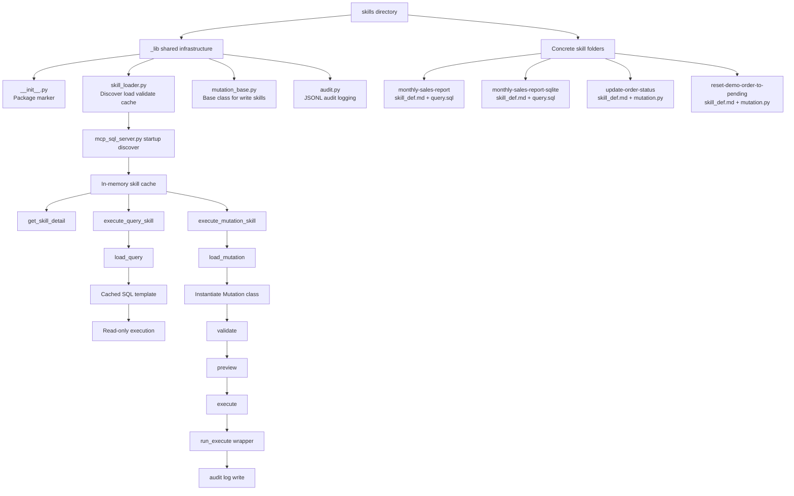
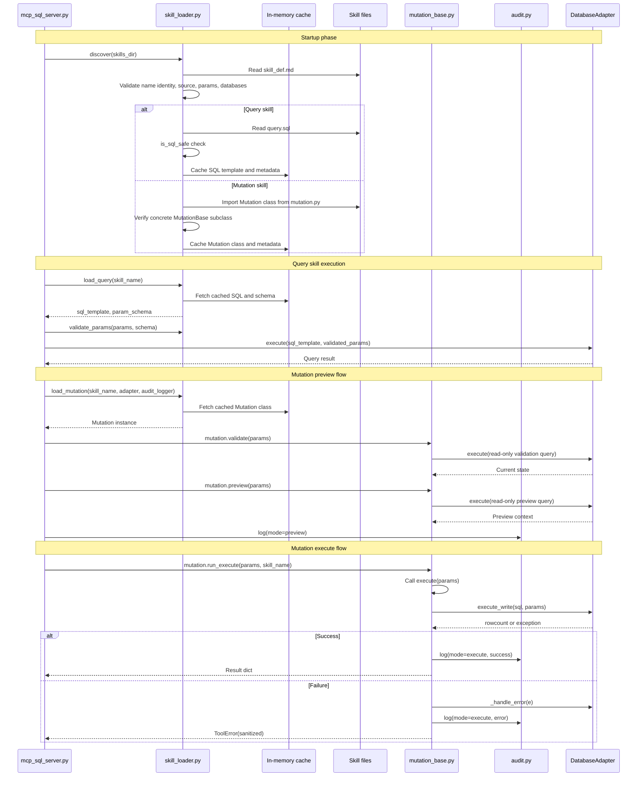
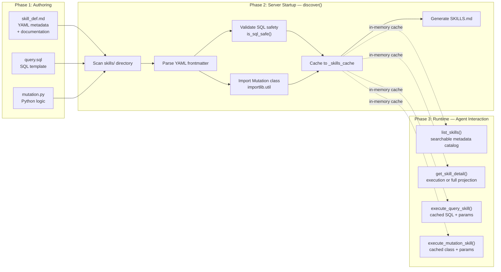
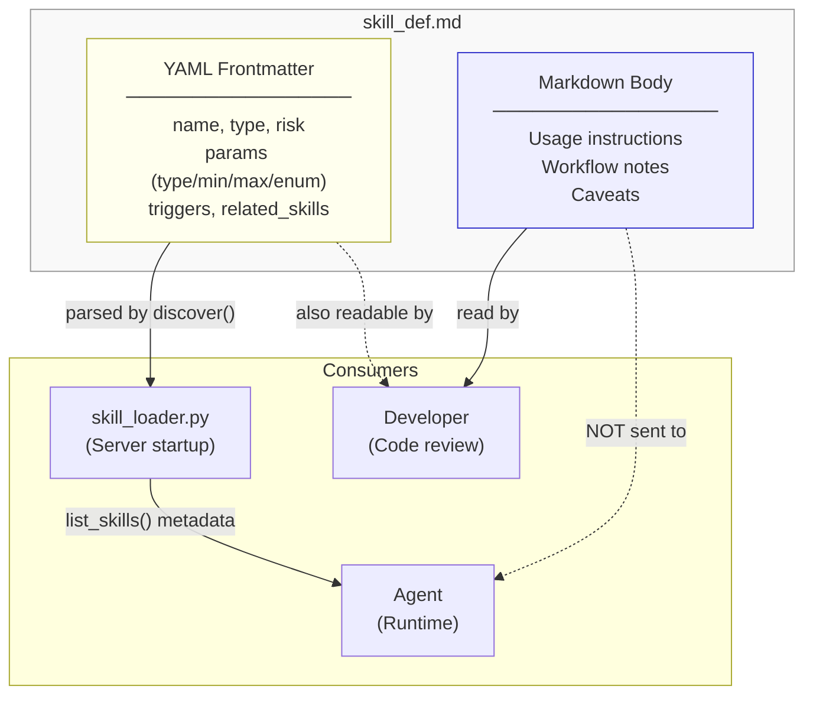
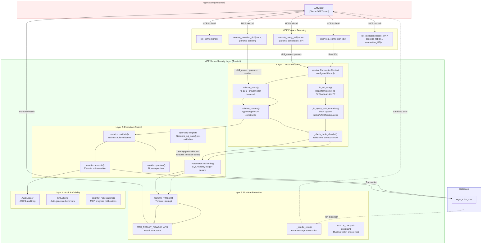
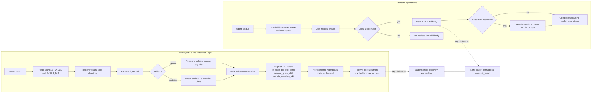
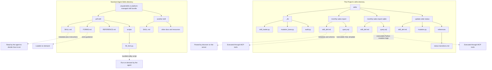

# MCP Agents Skills Design Document

> **Version**: 3.7.1
> **Status**: Implemented
> **Date**: 2026-08-28
> **References**: [Skills safety policy](skills/SAFETY.md), [design risk register](DESIGN_RISK_REGISTER.md), [v3.6 release-family notes](RELEASE_NOTES/RELEASE_NOTES_v3_6.md), and [v3.7 release notes](RELEASE_NOTES/RELEASE_NOTES_v3_7.md)

## 1. Overview

The Skills extension layer adds pre-defined, parameterized SQL operations
(queries and mutations) to the LLM Database Safety Gateway MCP server.
Skills are discoverable, auditable, and controlled by environment variables.

### Goals

- **Structured database operations** — Replace free-form SQL with reviewed templates
- **Progressive disclosure** — MCP-level catalog/detail/execute workflow for token efficiency
- **Write operation safety** — Plan-validate-execute pattern with mandatory preview-token binding
- **Connection-scoped discovery/execution** — Read tools, query Skills, and explicitly authorized mutation Skills resolve a configured target `connection_id` before policy, schema readiness, and execution
- **Optional Skill target scope** — v3.7 `connection_ids` metadata can only narrow configured targets and is rechecked before adapter construction
- **Approval-ready host flow** — A stdio reference host can display exact previews and collect explicit approval without claiming server-verifiable human identity
- **Disabled-mode compatibility** — Zero runtime impact when disabled (`ENABLE_SKILLS=0`)
- **Minimal dependency footprint** — Only adds `pyyaml` to requirements

### Non-Goals

- Per-skill dynamic tool registration (avoided for tool count control)
- Built-in pipeline/DAG execution engine (Agent handles orchestration)
- Runtime SQL sandboxing (security via code review + template whitelist)
- Arbitrary DSN routing from tools or models; all database endpoints must be configured server-side
- Dynamic or model-provided connection endpoints; mutation targets must use configured aliases and explicit server-side write policy.
- Multi-user authenticated HTTP approval, server-side approver identity, or compliance-grade approval audit.

## 2. Architecture

### Component Diagram

```
┌─────────────────────────────────────────────────────────────┐
│                    mcp_sql_server.py                        │
│  ┌─────────────┐  ┌──────────────────┐  ┌───────────────┐  │
│  │ list_skills │  │ get_skill_detail │  │ execute_*     │  │
│  │  read-only  │  │    read-only     │  │ _skill tools  │  │
│  └──────┬──────┘  └────────┬─────────┘  └───────┬───────┘  │
│         │                  │                    │          │
│  ┌──────┴──────────────────┴────────────────────┴────────┐  │
│  │                   skills/_lib/                          │  │
│  │  ┌──────────────┐ ┌──────────────┐ ┌────────────────┐  │  │
│  │  │ skill_loader  │ │mutation_base │ │    audit       │  │  │
│  │  │  discover()   │ │ MutationBase │ │ AuditLogger    │  │  │
│  │  │  load_query() │ │ validate()   │ │ log()          │  │  │
│  │  │  load_mutation│ │ preview()    │ │ JSONL output   │  │  │
│  │  │  validate_*() │ │ execute()    │ │                │  │  │
│  │  └──────┬────────┘ └──────┬───────┘ └───────┬────────┘  │  │
│  └─────────┼─────────────────┼─────────────────┼───────────┘  │
│            │                 │                 │              │
│  ┌─────────┴─────────────────┴─────────────────┘              │
│  │              db_adapter.py                                 │
│  │  execute(sql, params=...)  ←  query skills (read-only)     │
│  │  execute_write(sql, params) ←  mutation skills (write)     │
│  └────────────────────────────────────────────────────────────┘
└─────────────────────────────────────────────────────────────┘
```

### Information Flow

```
Agent → list_skills(search/category/detail_level/available_only, connection_id?)
                               → Searchable skill catalog (compact/summary/full)
Agent → get_skill_detail(name, connection_id?, detail_level?)
                              → Execution projection or full cached metadata/readiness
Agent → execute_query_skill(connection_id?)
                              → resolve connection → skill_loader → adapter.execute(sql, params)
Agent → execute_mutation_skill(confirm=false, connection_id?)
                               → resolve authorized target → mutation.validate() + preview() + preview_token
Agent → execute_mutation_skill(confirm=true, preview_token, connection_id?)
                               → same authorized target → match and consume Store record → mutation.validate() + run_execute() → adapter.execute_write()
                                                                     → audit.log()
```

v3.5 adds a strict connection invariant: the server resolves `ConnectionContext`
from the optional `connection_id` before running SQL policy, schema-readiness
checks, dialect-specific helper SQL, adapter execution, result metadata, audit,
or telemetry. Unknown connection ids fail closed and never fall back to the
default connection.

v3.7 adds an optional `SkillMetadata.connection_ids` restriction. The ordinary
explicit/default target is resolved first, then checked against this list and
`databases` before adapter construction. The list has no default/failover order
and never grants access; every existing policy still applies.

### Shared Infrastructure and Skill Structure

The following diagram shows the relationship between the shared
infrastructure under `skills/_lib/`, the concrete skill folders, and the
MCP tool entry points. The key idea is that `_lib` is not a skill by itself
— it is the common execution framework used by all skills.



This diagram emphasizes two architectural boundaries:

- `_lib` contains reusable infrastructure, not business-specific skills.
- Concrete skills provide only metadata plus executable artifacts; the server
  handles loading, validation, execution, and audit centrally.

### Runtime Call Flow

The following diagram focuses on the actual runtime interactions after the
server has already completed startup discovery and cached all valid skills.



This runtime view shows an important distinction from standard Agent Skills:

- Skill files are loaded eagerly at startup, not lazily at first use.
- Runtime tool calls operate on cached SQL templates and cached Mutation
  classes.
- Progressive disclosure exists at the MCP interaction layer
  (`list_skills()` → `get_skill_detail()` → `execute_*_skill()`), not as
  runtime filesystem reads by the Agent.

### Skill Lifecycle

The following diagram illustrates the complete lifecycle of a skill, from
authoring to runtime execution. The key architectural decision is the
**separation of startup-time artifact validation from runtime target-connection
policy enforcement**. Startup rejects malformed or structurally unsafe skill
artifacts early, while runtime still resolves the target connection and enforces
DB compatibility, schema readiness, per-connection allowlists, parameter
validation, execution controls, metadata, audit, and telemetry.



> **Design reference**: The eager startup validation follows the "fail-fast"
> principle — if a skill has unsafe SQL or a malformed source module, the server
> refuses to register it at startup, not at the first runtime invocation. This
> eliminates an entire class of runtime errors and is consistent with
> [MCP Specification §7 — Security](https://modelcontextprotocol.io/specification/2025-03-26/basic/security):
> *"Validate all inputs"* and *"Implement proper access controls."*

### Query Skill Execution Flow

```mermaid
sequenceDiagram
    participant Agent
    participant MCP as MCP Server
    participant Loader as skill_loader
    participant Adapter as db_adapter
    participant DB as Database

    Agent->>MCP: execute_query_skill(name, params, connection_id?)
    MCP->>Loader: validate_name(name)
    Loader-->>MCP: ✓ name valid
    MCP->>Loader: read cached metadata
    MCP->>MCP: resolve config; enforce connection_ids + databases
    MCP->>Adapter: construct ConnectionContext(connection_id or default)
    MCP->>Loader: load_query(name)
    Loader-->>MCP: cached {sql_template, metadata}
    MCP->>Loader: validate_params(params, metadata)
    Loader-->>MCP: ✓ params coerced & validated
    MCP->>MCP: enforce profile/schema/table/query policy
    MCP->>Adapter: execute(sql_template, params=params)
    Adapter->>DB: Parameterized query (SQLAlchemy text())
    DB-->>Adapter: result rows
    Adapter-->>MCP: formatted result
    MCP-->>Agent: {success, data, row_count, meta.connection_id}
```

  `SkillMetadata.databases` remains a DB type compatibility field (`mysql`,
  `sqlite`, or omitted for all supported DB types). Optional v3.7
  `SkillMetadata.connection_ids` is the separate restrictive alias scope.
  Per-connection table allowlists are still enforced at runtime against the
  resolved target connection; neither metadata field grants permission.

> **Design reference**: Parameters are bound via SQLAlchemy `text()` +
> parameter dict, never via string concatenation. This follows the
> industry-standard parameterized query pattern recommended by
> [OWASP — SQL Injection Prevention Cheat Sheet](https://cheatsheetseries.owasp.org/cheatsheets/SQL_Injection_Prevention_Cheat_Sheet.html).

### Mutation Skill Two-Phase Execution Flow

The two-phase execution pattern provides a verifiable intermediate result, in
the spirit of Anthropic's
["verifiable intermediate outputs"](https://docs.anthropic.com/en/docs/build-with-claude/agentic-systems#practices-for-effective-agentic-systems)
principle. The Agent can inspect the preview; a user reviews it only when a
client/host actually renders it and collects a decision, as in the v3.7 example.

```mermaid
sequenceDiagram
    participant Agent
    participant MCP as MCP Server
    participant Loader as skill_loader
    participant Mutation as MutationBase
    participant Adapter as db_adapter
    participant Audit as AuditLogger
    participant DB as Database

    Note over Agent,DB: Phase 1: Preview (confirm=false)
    Agent->>MCP: execute_mutation_skill(name, params, confirm=false)
    MCP->>Loader: validate_name(name) + read cached metadata
    MCP->>MCP: resolve config; enforce connection_ids + databases
    MCP->>Adapter: construct authorized ConnectionContext
    MCP->>MCP: enforce profile/schema/table/mutation policy before write
    MCP->>Loader: validate_params(params)
    MCP->>Loader: load_mutation(name, adapter, audit_logger)
    Loader-->>MCP: Mutation instance (from cached class)
    MCP->>Mutation: validate(params)
    Mutation->>Adapter: execute(SELECT ... WHERE id=:id)
    Adapter->>DB: query current state
    DB-->>Adapter: current record
    Adapter-->>Mutation: current data
    Mutation-->>MCP: validation result (state check passed)
    MCP->>Mutation: preview(params)
    Mutation-->>MCP: {preview_sql, current_status, new_status}
    MCP-->>Agent: {preview, preview_token, preview_token_expires_at}

    Note over Agent,DB: Phase 2: Execute (confirm=true)
    Agent->>MCP: execute_mutation_skill(name, params, confirm=true, preview_token)
    MCP->>Loader: validate_name + cached metadata + validate_params
    MCP->>MCP: resolve target; re-enforce scope/schema/mutation policy
    MCP->>Loader: load_mutation(name, adapter, audit_logger)
    MCP->>MCP: lookup digest; compare request binding; atomically consume handle
    MCP->>Mutation: run_execute(params)
    Mutation->>Mutation: validate(params) — re-verify (TOCTOU defense)
    Mutation->>Adapter: execute_write(UPDATE ... WHERE status=:expected)
    Adapter->>DB: BEGIN → UPDATE → COMMIT
    DB-->>Adapter: rowcount
    Adapter-->>Mutation: {success: true, rowcount: N}
    Mutation->>Audit: log(skill, params, result, agent_id)
    Mutation-->>MCP: {success, rowcount, message}
    MCP-->>Agent: execution result

    Note over Agent,DB: Error path
    Adapter--xMutation: SQLAlchemyError
    Mutation->>Adapter: _handle_error(e) → sanitized message
    Mutation--xMCP: raise ToolError(sanitized)
    MCP--xAgent: error (no sensitive details leaked)
```

The base protocol flow above does not prove a human approved it: an Agent can
copy the token into the execute call. v3.7 therefore includes a separate
reference host flow without changing the MCP server API:

```mermaid
sequenceDiagram
    participant User
    participant Host as Manual Approval Host
    participant MCP as Same stdio MCP process
    participant DB

    Host->>MCP: preview(skill, snapshotted params, optional connection)
    MCP-->>Host: exact preview + resolved connection + private bearer token
    Host-->>User: display operation/preview/expiry (never display token)
    alt exact APPROVE before expiry
        User->>Host: APPROVE
        Host->>MCP: execute(same params, resolved connection, private token)
        MCP->>DB: validate + one transactional write
        DB-->>MCP: result
        MCP-->>Host: execute result
    else deny / timeout / EOF / cancel
        Host-->>Host: stop; do not call execute
    end
```

The host does not authenticate the approver to the server, cannot prevent
another client from bypassing it, and does not revoke unused tokens on denial.
It explicitly inherits the trusted operator process environment so stdio does
not silently switch to a different `.env`, and the workflow itself enforces a
monotonic approval deadline. Parameters and preview data are canonical finite
JSON snapshots; the workflow rejects a provider that changes the displayed
view before returning approval. Complete environment inheritance also forwards
all exported secrets and Python control variables into the child/Skill trust
boundary; a productized host should use a maintained project allowlist. Custom
approval providers must cooperate with
async cancellation; hostile-provider hard termination needs process isolation.
It never retries an execute exception because consumption/commit may be
ambiguous. Product deployments needing approver identity, separation of duties,
or durable approval/denial audit need a separate approval service.

> **Design references**:
> - *"Give models less freedom for higher-stakes operations."* — Anthropic,
>   ["Building effective agents" (2024)](https://docs.anthropic.com/en/docs/build-with-claude/agentic-systems#practices-for-effective-agentic-systems).
>   Mutation operations use constrained code paths, not free-form agent code.
> - *"Verifiable intermediate outputs"* — ibid.
>   The preview phase lets the Agent verify planned changes and lets a client
>   present them to a user; the server alone cannot prove that this happened.
> - The `validate()` call in Phase 2 is **intentionally duplicated** to defend
>   against TOCTOU: the data state may have changed between preview and confirm.

## 3. Directory Structure

```
skills/
├── SAFETY.md                          # Security governance
├── SKILLS.md                          # Auto-generated overview (by discover())
├── _lib/                              # Shared infrastructure
│   ├── __init__.py
│   ├── skill_loader.py                # Discovery, loading, validation
│   ├── mutation_base.py               # ABC for write operations
│   └── audit.py                       # JSONL audit logger
├── monthly-sales-report/              # Example MySQL query skill
│   ├── skill_def.md                   # YAML frontmatter + documentation
│   └── query.sql                      # Parameterized SQL template
├── monthly-sales-report-sqlite/       # Example SQLite query skill
│   ├── skill_def.md                   # YAML frontmatter + documentation
│   └── query.sql                      # Parameterized SQL template
├── update-order-status/               # General example mutation skill
    ├── skill_def.md                   # YAML frontmatter + documentation
    ├── mutation.py                    # validate/preview/execute logic
    └── references/
        └── status-transitions.md      # State machine documentation
└── reset-demo-order-to-pending/       # Portable demo/test reset mutation
    ├── skill_def.md                   # Explicit source state, fixed pending target
    └── mutation.py                    # Preview binding + optimistic lock
```

## 4. skill_def.md Format

Each skill is defined by a `skill_def.md` file with YAML frontmatter:

```yaml
---
name: skill-name              # Required; must match directory; ^[a-z0-9][a-z0-9-]*$ (max 64 chars)
version: "1.0"                # Optional, for audit/versioning
description: >                # What the skill does
  Human-readable description.
triggers:                     # Optional, keyword hints for agent matching
  - keyword1
  - keyword2
type: query                   # query | mutation
source: query.sql             # Required: execution file (validated filename)
risk: low                     # low | medium | high
databases: [mysql, sqlite]    # Optional: supported DB types (default: all)
connection_ids:              # Optional v3.7 valid-alias restriction
  - orders_primary           # One binds directly; multiple allow reuse
  - analytics_demo_sqlite
enabled: true                 # Optional, default true
idempotent: false             # Optional, default false
requires_confirmation: true   # Optional, for mutations
params:
  param_name:
    type: int                 # int | float | str | bool
    required: true
    min: 1                    # Optional range constraint
    max: 100
    enum: [a, b, c]           # Optional enum constraint
    description: "..."        # Optional
category: reporting           # Optional
related_skills:               # Optional, discovery hints
  - other-skill-name
---

Markdown body with usage instructions (< 500 lines recommended).
```

Unknown top-level frontmatter fields and duplicate YAML mapping keys fail
discovery. This strictness prevents a typo in a restrictive field such as
`connection_ids` from silently changing policy; future custom metadata requires
an explicitly supported extension field or namespace.
Known values are strict too: declared boolean fields must be YAML booleans,
`triggers`/`related_skills` must be string lists, and category must be a
non-empty string. Each parameter accepts only the documented
`type`/`required`/`min`/`max`/`enum`/`description` keys; constraints must match
the declared type, enum must be a non-empty list, and bounds must be ordered.
This is one small custom schema, not a parallel JSON Schema implementation.

### Design Rationale

The `skill_def.md` format is designed around four principles:

**1. Self-contained definition** — Each skill carries its own metadata,
parameter schema, and documentation in a single file. This follows Google's
["use clear and descriptive function/parameter names and descriptions"](https://ai.google.dev/gemini-api/docs/function-calling#best_practices)
principle for function calling: define parameters with precise types,
constraints, and descriptions to reduce ambiguity and hallucination.

**2. Declarative parameter validation** — Parameter constraints (`type`,
`min`, `max`, `enum`) are declared in YAML rather than implemented in code.
The server's `validate_params()` enforces these constraints uniformly for
all skills. This follows
[MCP Specification §7](https://modelcontextprotocol.io/specification/2025-03-26/basic/security):
*"Validate all inputs"* — validation is defined once in the schema and
enforced automatically by the infrastructure, not by each individual skill.

**3. Information layering** — `skill_def.md` serves two audiences:

| Audience | Reads | Purpose |
|----------|-------|---------|
| **Server** (`skill_loader.py`) | YAML frontmatter | Registration, validation, parameter schema |
| **Developers** | Markdown body | Context, workflow, maintenance notes |
| **Agent** | Neither directly | Receives structured metadata via `list_skills()` and `get_skill_detail()` |

This separation means the Agent never sees the markdown body or the raw SQL
template — it only receives structured metadata via `list_skills()` and
`get_skill_detail()`.
In contrast, standard Agent Skills expect the Agent to read the full SKILL.md
content as executable instructions.

**4. Anthropic-compatible naming** — The choice of YAML frontmatter and the
`name` field regex (`^[a-z0-9][a-z0-9-]*$`) deliberately align with the
[Anthropic Agent Skills spec](https://platform.claude.com/docs/en/agents-and-tools/agent-skills/best-practices).
Developers familiar with the standard format will find `skill_def.md`
immediately readable, even though the execution model is fundamentally
different (see Section 11).

**5. Explicit source declaration** — The `source` field is **mandatory** and
explicitly declares the execution file associated with the skill (e.g.
`source: query.sql`, `source: mutation.py`). This follows the
**Explicit Configuration** principle used by industry-standard tools:

| Tool | Manifest | Field | Purpose |
|------|----------|-------|---------|
| GitHub Actions | `action.yml` | `main` | Entry point JS file |
| npm | `package.json` | `main` | Package entry point |
| Python | `pyproject.toml` | `[project.scripts]` | Console entry points |
| Google Gemini | Function declarations | `name`, `parameters` | Explicit schema |
| MCP Specification | Tool registration | `inputSchema` | Explicit schema |

The `source` filename is validated by `_validate_source_filename()` for:
- **Path traversal prevention**: no `/` or `\`, no leading `.`
- **Suffix enforcement**: `query` → `.sql`, `mutation` → `.py`
- **Safe character set**: `^[a-zA-Z0-9][a-zA-Z0-9._-]*$`
- **Length limit**: max 128 characters

This replaces the previous convention-based approach (hardcoded `query.sql`
and `mutation.py`) with explicit declaration, enabling custom filenames
like `daily-revenue.sql` while maintaining security through validation.



## 5. Security Model

See [skills/SAFETY.md](skills/SAFETY.md) for the full 16-item security policy.

### Security Model Overview

The following diagram shows the four security layers that every request passes through, from the untrusted Agent to the database:



### Key Principles

| # | Principle | Implementation |
|---|-----------|----------------|
| 1 | Template as whitelist | Only pre-defined SQL/Python executed |
| 2 | Parameterized queries | SQLAlchemy `text()` + params binding |
| 3 | Dry-run default | `confirm=False` returns preview only |
| 4 | Dual-layer switches | `ENABLE_SKILLS` + `SKILLS_ALLOW_MUTATIONS` |
| 5 | Connection binding first | Resolve configured `connection_id` before SQL policy, readiness, and execution |
| 6 | Restrictive Skill alias scope | Optional `connection_ids` and `databases` are checked before adapter construction; every existing policy remains an independent pre-query/pre-write gate; omission preserves prior behavior |

**Three-Level Permission Progression:**

| Level | Configuration | `ENABLE_SKILLS` | `SKILLS_ALLOW_MUTATIONS` | Available Tools | Permission |
|:---:|------|:---:|:---:|------|------|
| L0 | Default | `0` | — | Base tools (query, list_tables, etc.) | Read-only queries |
| L1 | Skills enabled | `1` | `0` | + list_skills, get_skill_detail, execute_query_skill | + Pre-defined read-only skills |
| L2 | Mutations enabled | `1` | `1` | + execute_mutation_skill | + Controlled writes (two-phase preview/execute gate) |

| 7 | Trust boundary | skills/ = source code, changes via code review |
| 12 | Error sanitization | `_handle_error()` → `ToolError` (no leaks) |
| 14 | Target-connection table allowlist | Query Skills are startup pre-validated and runtime-checked against the resolved connection policy; quoted and schema-qualified table references are normalized before allowlist comparison |
| 15 | Path constraint | SKILLS_DIR must be within project root |
| 16 | Skill identity/type integrity | `name` must match directory; mutation `Mutation` must be a concrete `MutationBase` subclass |
| 17 | v3.6 mutation scope | Mutation Skills may target configured connections only when the global target allowlist, per-connection write switch, per-connection Skill allowlist, and preview-token checks all pass; omitting the global allowlist preserves default-connection-only compatibility |
| 18 | v3.7 approval ownership | Preview tokens prove a matching server preview, not human identity; explicit approval belongs to the client/host, and the example remains stdio-only |

### Error Handling Chain

```
adapter.execute_write() failure
  → SQLAlchemyError propagates
    → MutationBase.run_execute() catches
      → adapter._handle_error(e) sanitizes
        → raise ToolError(sanitized)
          → FastMCP passes through to Client (no double-masking)
```

## 6. MCP Tool Registration

### Conditional Registration Pattern

```python
if SKILLS_ENABLED:
    # resolve + validate SKILLS_DIR
    # import skills infrastructure
    # discover() at module load time
    # register: list_skills(), get_skill_detail(), execute_query_skill()
    
    if SKILLS_ALLOW_MUTATIONS:
        # register: execute_mutation_skill()
```

### Tool Annotations

| Tool | readOnlyHint | destructiveHint | idempotentHint | openWorldHint |
|------|-------------|-----------------|----------------|---------------|
| `list_skills` | true | false | true | false |
| `get_skill_detail` | true | false | true | false |
| `execute_query_skill` | true | false | true | false |
| `execute_mutation_skill` | false | true | false | false |

`idempotentHint=false` for mutations is a conservative default. Per-skill
idempotency info is conveyed via `list_skills()` and execution result dicts.
`openWorldHint=false` is used consistently because these tools operate inside
configured database/server boundaries rather than interacting with arbitrary
external entities. Named connections do not change this hint: the model can only
select preconfigured `connection_id` aliases, not arbitrary DSNs. This is an
advisory MCP client hint; authorization still comes from environment switches,
table allowlists, schema readiness checks, and execution-time validation.

### Runtime Tool Metadata

All registered MCP tools return `ToolResult` (uniform since v3.4.2; up to 12 in
the v3.5 full profile) so FastMCP clients
receive per-invocation `meta` alongside the existing structured payload. The
payload remains the same JSON object that clients read from
`structuredContent` / `.data`; metadata is reserved for diagnostics and
observability.

Runtime metadata always includes `tool_name`, `db_type`, `connection_id`,
`execution_ms`, and `success` once a database target is involved. For base tools,
`success` is passed directly by each tool's result wrapper. For Skills execution
tools, `success` is derived from the stable
`structuredContent["success"]` payload so business-level validation failures
(for example a mutation preview rejected by the state machine) are visible to
telemetry even when the tool returns normally rather than raising `ToolError`.
Data-returning tools add `row_count`, `total_rows`, `truncated`. Skills
execution tools additionally expose `skill_name`, `skill_type`, `skill_version`,
current `mode` (`query`, `preview`, or `execute`), and `idempotent`. Metadata
intentionally does **not** include raw SQL templates, returned data rows,
parameter values, DSNs, credentials, hosts, or SQLite file paths.
Query-parameter logging remains governed only by the explicit
`SKILLS_AUDIT_QUERIES` audit switch. Audit and telemetry may include the safe
`connection_id` alias plus actual `db_type` so operators can distinguish target
connections without exposing connection internals.
For SQLite targets, public tool payloads that need a database display name use
`sqlite:<connection_id>` rather than the configured file path.

Operational telemetry (`ENABLE_TOOL_TELEMETRY=1`) writes a separate JSONL record
per `tools/call` with sanitized fields only: `timestamp`, `tool_name`,
`execution_ms`, `call_completed`, `success`, `error_class`, `db_type`, and
`connection_id` when the tool result carries one.
`call_completed` records transport/control-flow completion, while `success`
records the tool's own business outcome. This split avoids the common ambiguity
where a safety or validation rejection returns a normal MCP response but should
still count as an unsuccessful business operation. Sampling is intentionally
simple (`TOOL_TELEMETRY_SAMPLE_RATE`, finite float clamped to 0.0-1.0) and does
not provide p50/p95 aggregation inside the MCP server; richer analytics should
run outside the server over the JSONL stream to avoid extra state and sensitive
usage-pattern disclosure.

### Tool Count Impact

| Configuration | Tool Count |
|--------------|------------|
| ENABLE_SKILLS=0 | 6-8 (adds `list_connections`) |
| ENABLE_SKILLS=1, MUTATIONS=0 | 9-11 |
| ENABLE_SKILLS=1, MUTATIONS=1 | 10-12 |

The full Skills profile remains within Google Gemini's recommended 10-20 tools range. The base read-only profile intentionally stays below that range to keep simple deployments compact.

## 7. Database Adapter Extensions

### execute() — Optional params (Step 3a)

```python
def execute(self, sql, timeout=None, params=None) -> list | str:
    if params:
        result = connection.execute(text(sql), params)
    else:
        result = connection.execute(text(sql))
```

Fully backward compatible — `params` defaults to `None`.

### execute_write() — New method (Step 3b)

```python
def execute_write(self, sql, params, timeout=None) -> dict:
    with self._engine.begin() as connection:
        result = connection.execute(text(sql), params)
    return {"success": True, "rowcount": result.rowcount}
```

- Uses `engine.begin()` for explicit transaction (auto-commit on success, auto-rollback on exception)
- Avoids `engine.connect()` + `connection.begin()` pattern which conflicts with SQLAlchemy 2.0 autobegin
- Returns dict (not str on error — exceptions propagate)
- Read/write separation by convention (SAFETY.md #16)

## 8. Progressive Disclosure

MCP-level metadata disclosure is separated from executable artifact loading.
The Agent sees only the amount of skill metadata needed for the current step;
the server still validates and caches SQL templates and mutation classes at
startup.

| Level | Source | Content | Runtime disk I/O |
|-------|--------|---------|------------------|
| Catalog | `list_skills(detail_level="compact")` | name, type, description, risk, category, executability, schema readiness | No |
| Summary | `list_skills()` or `detail_level="summary"` | compact fields plus triggers, databases, profiles, source filename, idempotency, related skills | No |
| Execution detail | `get_skill_detail(name, detail_level="execution")` | invocation fields, params schema, executability/disabled reason, confirmation requirement, resolved connection/DB type, next action | No |
| Full detail | `get_skill_detail(name)` (backward-compatible default) or `list_skills(detail_level="full")` | full cached frontmatter metadata plus params schema, version, readiness and policy diagnostics | No |
| Source review | Developer reads files in `skills/` | raw SQL/Python source for code review | Outside MCP runtime |

The recommended path is conditional rather than a fixed three-call chain:

- unknown Skill: targeted `list_skills(detail_level="compact", search=...)`,
  followed by execution detail only if params remain unknown;
- known Skill with unknown params: execution detail directly;
- params already returned by `list_skills(detail_level="full")`: execute directly;
- known Skill and params: execute directly (mutation calls still preview first).

`list_skills()` also supports deterministic substring search and exact category
filtering. Skills without a category are grouped under `uncategorized`. Regex
search is intentionally not supported in the first implementation to avoid ReDoS
risks and brittle model-generated regular expressions.

`available_only` filters the catalog to skills that can execute for the target
connection and current server state. By default it follows
`SKILLS_LIST_AVAILABLE_ONLY_DEFAULT=1`, so Agent-facing discovery hides
database-incompatible skills, mutation skills when `SKILLS_ALLOW_MUTATIONS=0`,
mutation skills rejected by global or per-connection write policy,
connection-allowlist failures, and schema-unready skills when
`SKILLS_CHECK_SCHEMA_ON_LIST=1`.
Developers can pass `available_only=false` to inspect the full discovered
catalog. This filter is a discovery optimization, not an authorization
boundary; execution-time checks remain mandatory.

Schema readiness is intentionally table-level in this implementation. Query
skills derive `tables` from the reviewed SQL template, and mutation skills can
declare `tables` in frontmatter. The server checks whether those tables exist in
the target connection and exposes `schema_ready` plus `missing_tables`. It does
not validate every column shape during discovery, because that would increase
metadata complexity and risk false negatives for reviewed templates.

Bundled example skills use `profiles: [demo]` because they target the demo
`orders` schema. Profiles remain descriptive metadata by default, but deployments
can set `SKILLS_EXCLUDE_PROFILES=demo` to mark matching skills non-executable,
hide them from default Agent discovery, and reject direct execution attempts.
This keeps examples in the repository while giving production deployments a
clear policy switch.

## 9. Configuration

| Variable | Default | Description |
|----------|---------|-------------|
| `ENABLE_SKILLS` | `0` | Master switch for skills extension |
| `SKILLS_ALLOW_MUTATIONS` | `0` | Enable mutation skills (second switch) |
| `SKILLS_ALLOW_MUTATION_CONNECTIONS` | empty | Optional mutation target allowlist. Empty keeps default-connection-only compatibility; non-empty enables strict named-write policy |
| `DB_<ID>_ALLOW_MUTATIONS` | `0` | Strict-mode per-connection mutation switch |
| `DB_<ID>_MUTATION_SKILLS` | empty | Strict-mode per-connection skill allowlist; empty denies all and `*` explicitly allows all |
| `MUTATION_PREVIEW_TOKEN_TTL_SECONDS` | `300` | Preview-token lifetime in seconds; valid range `1-86400`, invalid values fall back to `300` |
| `MUTATION_PREVIEW_TOKEN_STORE_MAX_ENTRIES` | `10000` | Per-process bound on outstanding tokens; valid range `1-100000`; exhaustion fails closed without evicting valid entries |
| `SKILLS_LIST_DEFAULT_DETAIL` | `summary` | Default `list_skills()` metadata projection: `compact`, `summary`, or `full` |
| `SKILLS_LIST_AVAILABLE_ONLY_DEFAULT` | `1` | Default `list_skills()` availability filter; `1` hides currently non-executable skills from Agent discovery, while `available_only=false` exposes the full developer catalog |
| `SKILLS_CHECK_SCHEMA_ON_LIST` | `1` | Include live table-existence checks in Skills readiness metadata; missing tables set `schema_ready=false` and are hidden by `available_only=true` |
| `SKILLS_EXCLUDE_PROFILES` | empty | Comma-separated profile policy; matching skills are non-executable, hidden by default discovery, and rejected at execution time |
| `SKILLS_DIR` | `skills/` | Skills directory path |
| `SKILLS_AUDIT_LOG` | `skills/_audit.jsonl` | Audit log file path; contains business audit params, so protect and rotate it as sensitive operational data |
| `SKILLS_AUDIT_QUERIES` | `0` | Optional query skill audit; records metadata, params, and row counts, never returned data |
| `MAX_SQL_LENGTH` | `20000` | Maximum raw `query(sql)` input length exposed in the MCP schema and enforced before execution; `0` disables the length cap |
| `MCP_TOOL_TIMEOUT_SECONDS` | `120` | FastMCP foreground tool timeout for registered tools; `0` disables the FastMCP timeout |
| `ENABLE_TOOL_TELEMETRY` | `0` | Enable sanitized per-tool-call JSONL telemetry middleware |
| `TOOL_TELEMETRY_LOG_PATH` | `logs/tool_calls.jsonl` | Local JSONL destination for telemetry records |
| `TOOL_TELEMETRY_SAMPLE_RATE` | `1.0` | Telemetry write sampling probability (finite float clamped to 0.0-1.0; invalid values fall back to 1.0) |

`MUTATION_PREVIEW_TOKEN_SECRET` is an obsolete compatibility input. The server
ignores it and emits a value-free warning when it is still configured.

Named connections are configured outside the Skills layer with `DB_CONNECTIONS`
and per-connection `DB_<ID>_*` variables. Query Skills consume only the resolved
`ConnectionContext`; they never accept or construct DSNs. `SkillMetadata.databases`
continues to describe supported DB types, `SkillMetadata.connection_ids` is an
optional restrictive list of valid alias identifiers, and singular
`connection_id` remains the runtime selection. Only members configured in the
current deployment can execute; portable unconfigured members are unavailable
metadata. Omitted runtime selection still uses the global
default and never auto-selects a metadata-list member.
When `DB_CONNECTIONS` is unset or empty, legacy single-connection mode ignores
both `DB_<ID>_*` variables and `DEFAULT_DB_CONNECTION` so local named-connection
configuration cannot silently override legacy `DB_TYPE` / `SQLITE_DATABASE_PATH`
settings.

Configuration activation order is intentionally explicit:

1. `DB_CONNECTIONS` unset or empty means legacy mode; only legacy `DB_TYPE`,
  MySQL variables, `SQLITE_DATABASE_PATH`, and global policy variables are
  authoritative.
2. `DB_CONNECTIONS` set means named mode; `DEFAULT_DB_CONNECTION` must name one
  configured id, or the first listed id is used when it is omitted.
3. Per-connection variables use `DB_<ID>_<SETTING>` and win for that id. The
  actual default connection may fall back to legacy variables for compatibility.
4. Non-default connections should be configured explicitly because omitted
  fields may still receive process defaults loaded at startup.

Examples should prefer semantic aliases such as `trade_analysis_mysql`,
`analytics_demo_sqlite`, and `orders_primary`. `mysql` and `sqlite` are legal aliases but can be confused
with `databases` type values. Using `default` as a connection id is legal but
discouraged because the default role is already expressed by
`DEFAULT_DB_CONNECTION`.

**v3.7 Skill connection scope:** `connection_ids` must be a non-empty list of
unique normalized aliases. Singular `connection_id`, scalars, wildcards, DSNs,
paths, unknown frontmatter fields, and duplicate YAML keys fail discovery.
Unconfigured aliases remain unavailable rather than
creating targets. A configured DB-type conflict fails only that target so other
valid members remain reusable. Discovery exposes scope state, but query and
mutation execution authoritatively recheck it before adapter construction.

**v3.7.1 preview-token core:** mutation execute requires the `preview_token`
returned by preview, including the default connection. The value is a random
256-bit opaque bearer handle. Its digest indexes a bounded process-local Store
record containing expiry, canonical request binding (skill, version, params,
`connection_id`, and `db_type`), and the preview-time execution binding.
Execute atomically consumes the record only when the request binding matches,
before dynamic validation and database writes. A mismatch preserves the valid
record. Consumption remains final after validation, database, audit, timeout,
or process failure. If the write outcome is uncertain, inspect current business
state before deciding whether another preview or mutation is appropriate; do
not blindly retry.

Multi-connection mutation routing additionally enforces the global target
allowlist, per-connection write switch, and per-connection skill allowlist.

**v3.6.1 hardening and deployment boundary:** state-sensitive Skills explicitly
implement `build_execution_binding()` and `execute_with_binding()`; the bundled
order mutation binds the state read and displayed by preview, and its unbound
`execute()` rejects direct calls. A preview containing `error` or reporting
`success=false` receives no token. The recommended deployment is client-owned
stdio. Conditional HTTP mutation is limited to a trusted private boundary and
one mutation-enabled process; multi-user authenticated HTTP mutation is outside
this release. Worker/replica counts are deployment responsibilities, not runtime
enforcement. Restart or cross-process lookup failures fail closed without
stateless token fallback. Read-only capacity may scale only through a separate
read-only endpoint, profile, or pool.

The handle is API-opaque and contains no client-readable authorization state. It
remains a bearer secret until consumption or expiry. Clients must not depend on
its format and should minimize durable context/log retention. Applicable
ToolResult metadata includes a short correlation hint; audit and telemetry
persist neither the full token nor that short identifier in the current design.

## 10. Design Decisions

| Decision | Choice | Alternative | Rationale |
|----------|--------|-------------|-----------|
| Architecture | Unified registration (2-3 tools) | Per-skill tools / FastMCP mount() | Prevents tool explosion; Google Gemini 10-20 rule |
| On-demand metadata disclosure | `list_skills()` projections + `get_skill_detail()` | Runtime source-file lazy loading | Reduces Agent-facing metadata while preserving startup validation and TOCTOU protection |
| Skill search | Case-insensitive substring + exact category filter | Regex/BM25 search | Deterministic, dependency-free, and avoids ReDoS from model-generated regex |
| v3.5 Named connections | Resolve `ConnectionContext` before policy, readiness, execution, metadata, audit, and telemetry | Let each tool independently read global adapter/config state | Prevents cross-connection mismatches and keeps tool display/execution bound to the same target connection |
| v3.5 Query Skills scope | `list_skills`, `get_skill_detail`, and `execute_query_skill` accept optional `connection_id` | Keep Skills bound to startup `DB_TYPE` only | Preserves legacy default behavior while allowing configured read-only multi-db workflows |
| v3.5 Mutation scope | Mutation Skills remained default-connection only in v3.5 | Allow `connection_id` for writes immediately | Avoided preview/execute target drift until v3.6 introduced explicit named-write policy and token binding |
| v3.6 Mutation preview-token core | Require preview token for every mutation execute, including the default connection | Keep default-connection no-token compatibility | Gives higher-stakes writes one consistent protocol and makes preview/execute target binding explicit before enabling non-default writes |
| v3.6 Mutation multi-connection policy | Require global target allowlist plus per-connection write switch and skill allowlist | Reuse read allowlists for writes | Keeps read policy and write authorization separate, deny-by-default, and auditable |
| v3.7.1 preview-token core | Preserve the `preview_token` API field as a 256-bit opaque handle and keep binding state in the bounded process-local Store | Retain the self-describing HMAC envelope, add shared external state, or use stateless validation | Removes redundant client payload while preserving exact request/state binding, one-time consumption, and the stdio-first same-process deployment boundary |
| v3.7.1 Skill detail projection | Add opt-in `execution`; keep omitted `detail_level` as `full` | Change the default immediately or remove readiness/catalog diagnostics | Cuts repeated Agent context while preserving existing callers and a developer diagnostic view |
| Connection-specific UNION guidance | Keep the no-argument prompt target-neutral; disclose per-alias policy through `list_connections()` and enforce it in MCP raw/query-Skill paths | Describe the default alias policy globally or make prompt selection authorize a target | Prevents misleading multi-connection guidance without turning a user-controlled prompt into an authorization boundary; the standalone compatibility helper remains a shape gate only |
| v3.7 Skill connection scope | Optional strict `connection_ids` list intersected with DB type and all existing policies; omitted means no new restriction | Singular auto-routing field or dynamic DSN binding | Supports direct business binding and reuse without changing default routing or turning metadata into authorization |
| v3.7 approval example | One-shot stdio host, exact `APPROVE`, token-free view/output, no execute retry | Treat `confirm=true` as human proof or add server Elicitation/auth in the same release | Demonstrates a real client-owned approval loop while keeping identity, remote auth, and compliance claims outside the server's implemented boundary |
| v3.7 demo reset mutation | MySQL/SQLite compensation with required non-pending `expected_status`, fixed `pending` target, preview binding, optimistic lock, and a database-enforced unique `orders.id` contract | Add reverse transitions to the production-like status machine or build a framework-wide schema DSL | Exercises and cleans up live mutation fixtures without redefining business transitions; documents non-atomic cleanup and the deliberate ABA cycle |
| v3.7 SQL grammar boundary | One full-policy statement; reject raw SHOW/cross-session EXPLAIN, executable/optimizer/MariaDB comments, and ambiguous restrictive-allowlist targets; preserve qualified identity and validate explained DML targets/read sources/CTE aliases plus multi-table `DELETE ... USING` sources | Trust generic parser classification or claim a complete cross-dialect AST policy | Closes demonstrated scope bypasses while retaining useful non-ANALYZE DML plan inspection in a conservative, testable Oracle MySQL/SQLite grammar |
| Database authorization boundary | Treat SQL shape/table checks as application guards; require least-privilege read accounts without unnecessary EXECUTE/FILE/PROCESS/admin/cross-schema grants | Maintain an unbounded function denylist for SELECT-shaped stored functions and locks | Database grants remain authoritative for effects the outer SQL form cannot prove absent |
| v3.5 Runtime allowlist | Query Skill startup validation checks structural/read-only safety; per-connection allowlists are enforced at runtime | Validate every skill against every configured connection at startup | Runtime enforcement is the authoritative policy because allowlists are connection-scoped and connections may differ by deployment |
| v3.5 Metadata privacy | Expose safe `connection_id` alias and `db_type`; never expose DSNs/hosts/credentials/paths | Include full connection details for debugging | Operators can correlate calls without leaking database internals to clients or logs |
| Availability filtering | `available_only` filters by optional Skill `connection_ids`, target `connection_id`, DB type compatibility, mutation switch/default-only scope, connection policy, and schema readiness | Always return full discovered catalog | Aligns with conditional tool enabling and reduces Agent selection errors; developers retain full catalog access with `available_only=false`; execution still rechecks authorization |
| Schema readiness scope | Table existence only | Full column/type compatibility check | Catches the common wrong-schema case with low overhead; reviewed SQL/mutation code still provides the precise execution-time validation |
| Demo skills | `profiles: [demo]` plus optional `SKILLS_EXCLUDE_PROFILES=demo` | Delete or disable bundled examples by default | Keeps examples usable for local demos while allowing production deployments to hide and block them explicitly |
| Query skill audit | Optional `SKILLS_AUDIT_QUERIES=1`; params are logged as business audit data and must not contain secrets | Audit every read skill by default, or build a redaction policy engine now | Avoids surprising sensitive parameter logs while providing an opt-in compliance trail; returned data is never logged. Runtime redaction is deferred until real skills require sensitive params |
| Raw SQL length | `MAX_SQL_LENGTH` for `query(sql)` | Apply the same cap to reviewed skill templates | Free-form SQL is agent-provided input and needs schema/runtime bounds; reviewed skill SQL is startup-validated code and should not be constrained by the user-input cap |
| Tool timeout | FastMCP `timeout=MCP_TOOL_TIMEOUT_SECONDS` | Rely only on DB read-query and mutation lock-wait controls | Protects the MCP foreground request from non-DB stalls while keeping database timeout controls as lower-level guards |
| v3.4.1.B1 ToolResult metadata | Implemented for Skills execution tools | Keep plain dict returns everywhere | Adds runtime diagnostics (`execution_ms`, row counts, truncation, skill version) without changing the structured payload; metadata excludes SQL, params, and returned rows |
| v3.4.1.B2 Closed-world annotations | `openWorldHint=false` on all MCP tools | Leave FastMCP default `openWorldHint=true` | The server operates inside a configured database boundary, so closed-world hints better represent client-facing safety semantics; hints remain advisory, not authorization |
| v3.4.1.B3 Direct-call API asymmetry | Skills execution tools return `ToolResult`; all other tools still return `dict` | Refactor every tool to return `ToolResult` for uniform return shape | Limits the v3.4.1 change surface to where rich runtime diagnostics matter; Python callers must read `result.structured_content` / `result.meta` on the two skill tools while continuing to use plain `dict` on the rest. Tracked as a follow-up for v3.4.2 if uniform return shape becomes valuable. Per MCP spec the `_meta` field is OPTIONAL and clients MAY ignore it (e.g. VS Code's MCP UI does not currently surface it), so `ToolResult.meta` is primarily a server-side observability hook |
| v3.4.2.A1 Uniform ToolResult | All registered tools in the full profile converted to `ToolResult` | Keep mixed return shape from v3.4.1 | Removes the B3 asymmetry; every tool now carries `tool_name`/`execution_ms`/`db_type`/`connection_id`/`success` plus tool-specific counters (`row_count`, `total_rows`, `truncated`) in `meta`; `structuredContent` remains the business payload so MCP clients see no behavior change |
| v3.4.2.A2 Skill outputSchema | Declared on `execute_query_skill` and `execute_mutation_skill` | No schema (clients infer shape) | MCP `outputSchema` lets compliant clients validate `structuredContent`; the schemas use `additionalProperties: true` to tolerate preview/execute payload variation in mutations |
| v3.4.2.A3 Tool telemetry | Opt-in middleware (`ENABLE_TOOL_TELEMETRY=1`) writes sanitized JSONL to `TOOL_TELEMETRY_LOG_PATH`, with optional `TOOL_TELEMETRY_SAMPLE_RATE` | Always-on telemetry, in-process p95 aggregation, or external sink | Default behavior unchanged; the middleware records only `timestamp`/`tool_name`/`execution_ms`/`call_completed`/`success`/`error_class`/`db_type`/`connection_id`, never SQL/params/rows/credentials/connection strings. `success` follows `ToolResult.meta.success`; `call_completed` captures exception-free return. Sampling is deliberately simple and finite-clamped. Percentile aggregation remains external to avoid server state, extra dependencies, and usage-pattern disclosure through a stats tool |
| V343-006 Raw SQL echo | Document current behavior; no runtime echo switch yet | Add `ECHO_SQL_IN_RESULTS` / context-log controls immediately | Preserves existing payload compatibility and debugging transparency. Deployments must not put secrets or sensitive personal data in raw SQL literals; revisit opt-out controls only when privacy-sensitive deployments need them |
| V343-008 Log lifecycle | External rotation/retention and disk monitoring | In-process retention or rotation manager | Keeps the MCP server stateless and simple. Audit/telemetry reopen files per write, which works with external rename/create rotation; service logs can be managed by glob rules or platform logging |
| v3.4.2.A4 Annotation drift lint | `tests/test_annotations_consistency.py` | Fail-fast at server startup | Pytest captures drift during local/default test runs without making the server brittle to in-progress local edits; add a repository CI workflow before describing this as CI enforcement |
| v3.4.B4 Schema state cache | Deferred decision | Cache schema table names in FastMCP session state | Reduces repeated metadata calls but risks stale readiness after DDL; current table checks are simple and execution guards remain authoritative |
| v3.4.C1 Schema resource | Deferred decision | Add `db://schema` MCP resource now | Existing `get_full_schema` tool is explicit and already supported by clients; resource support varies and would add a second schema access path |
| Metadata | skill_def.md YAML frontmatter | JSON manifest | Anthropic Agent Skills spec alignment |
| Params validation | Inline in frontmatter | JSON Schema file | Single-file self-description |
| Write safety | 3-stage (validate/preview/execute) | Simple confirm flag | Anthropic "verifiable intermediate outputs" |
| Audit storage | JSONL file | Database table | Minimal dependency for MVP |
| Source declaration | Mandatory `source` field | Convention-based (hardcoded filenames) | Explicit Configuration principle: GitHub Actions, npm, Python all use explicit entry points; enables custom filenames while `_validate_source_filename()` enforces path safety and suffix matching |
| Write interface | Separate `execute_write()` | Reuse `execute()` | Read/write separation, clear responsibilities |
| SQL caching | discover() caches at startup | Runtime disk reads | Eliminates TOCTOU risk |
| Mutation caching | discover() pre-loads mutation classes | Per-call `exec_module()` | Eliminates runtime disk I/O + module compilation |
| Error handling | Exceptions propagate + ToolError | Error dict returns | FastMCP ToolError bypasses mask_error_details |
| ALLOWED_TABLES | Skills bypass at runtime | Runtime table check | Template = whitelist (code review trust) |
| SQLAlchemy version | `>=2.0` explicit | No constraint | 2.0 implicit transactions prevent accidental writes |
| Example skill SQL | Separate MySQL and SQLite examples | One cross-DB SQL template with runtime branching | Keeps templates clear, keeps startup validation deterministic, and lets availability filtering hide incompatible dialects before execution planning |
| Table name extraction | `_extract_table_names()` ignores `schema.table` | Full `schema.table` regex | Function only used for `SKILLS.md` generation (non-security); core path `_extract_tables_from_sql()` handles `schema.table` correctly |
| Mutation duplicate SELECT | `execute()` re-runs `validate()` SELECT | Single SELECT in `validate()` only | Intentional TOCTOU prevention — user review gap between preview and confirm requires re-verification of data state |
| Mutation error contract | `execute()` raises `ToolError` on failure | Return `{"success": False}` dict | Exceptions follow `run_execute()` error handling chain; return-dict failures bypass audit logging and cause semantic contradiction in MCP tool response |
| Mutation read-write gap | Separate `execute()` + `execute_write()` calls | Single SQL merging SELECT+UPDATE | Optimistic locking `WHERE status = :expected` + `rowcount == 0` is the effective safety net; merging adds complexity with minimal gain |
| `_coerce_type()` bool | `bool(value)` (Python built-in) | Explicit `"true"/"false"` mapping | No bool params in current skills; acceptable for MVP, should be revisited when bool params are added |
| Annotation evaluation | `from __future__ import annotations` (PEP 563) in `skill_loader.py` | Runtime annotation evaluation (default) | Python 3.12 `type` soft keyword conflicts with `SkillMetadata.type` field annotation; PEP 563 deferred evaluation resolves Pylance parsing ambiguity |
| Database compatibility | Optional `databases` field | No DB type declaration | Follows npm `engines`, Python `requires-python`, Terraform `required_providers` pattern; runtime target connection `db_type` check prevents incompatible skill execution; `None` = all databases (zero overhead for cross-DB skills) |

## 11. Relationship to Standard Agent Skills (Anthropic Agent Skills)

This section documents **why this project does not adopt the standard
[Anthropic Agent Skills](https://platform.claude.com/docs/en/agents-and-tools/agent-skills/overview)
format**, and what elements were selectively borrowed. For user-facing

### 11.1 Architectural Divergence

Standard Agent Skills assume the agent operates inside a **VM / sandbox with
filesystem access and code execution capabilities**. The agent reads `SKILL.md`
via `bash`, writes its own code, and executes it locally. This enables the
three-level progressive disclosure model:

| Level | Standard Agent Skills | This Project |
|-------|----------------------|--------------|
| **L1: Metadata** | YAML frontmatter loaded into system prompt at startup (~100 tokens/skill) | `list_skills()` returns projected metadata from in-memory cache |
| **L2: Instructions** | Agent reads SKILL.md body via `bash: cat SKILL.md` when triggered | N/A — skill_def.md body is for human developers, not consumed by agent at runtime |
| **L3: Resources** | Agent reads bundled files (scripts, references) on demand via bash | `get_skill_detail(execution|full)` returns cached metadata; SQL templates and mutation classes are **pre-loaded at startup** into `_skills_cache`, never read from disk at runtime |

In MCP architecture, the agent communicates with the server via JSON-RPC
over stdio/SSE ([MCP Spec — Transports](https://modelcontextprotocol.io/specification/2025-03-26/basic/transports)).
The agent **cannot access the server's filesystem** — `bash: cat skill_def.md` is
not possible. Standard Skills' filesystem-based progressive disclosure is
therefore architecturally incompatible with MCP.

This project implements **MCP-level progressive disclosure** instead. Unknown
Skills use a compact/searchable catalog and, when necessary, one Skill's
execution projection before invocation. A caller that already knows the Skill
and params—or obtained them from `list_skills(detail_level="full")`—executes
directly. This conditional path provides staged disclosure without requiring
filesystem access or forcing redundant tool calls.

#### Visual Comparison: Loading Flow



### 11.2 Trust Model and Threat Boundary

Standard Agent Skills operate under a **"sandbox isolation + trust the agent"**
security model:

```
User request → Agent reads SKILL.md → Agent writes code → Agent executes in VM
```

The agent is **both decision-maker and executor**. Safety relies on VM sandbox
restrictions (limited network/filesystem) and the assumption that the agent
will faithfully follow instructions. This is appropriate for document
processing tasks (PDF/Excel) where the worst case is generating an incorrect
file inside a sandbox.

This project operates under a fundamentally different threat model — **"do not
trust the agent; server enforces all constraints"**:

```
User request → Agent calls MCP tool → MCP Server executes pre-built SQL → Production database
```

Attack surfaces specific to this architecture:

| Threat | Description | Mitigation |
|--------|-------------|------------|
| **Prompt injection** | Malicious user input induces agent to pass dangerous parameters | `validate_params()` enforces type/min/max/enum constraints at server side |
| **Agent hallucination** | Agent invents non-existent skills or passes out-of-range parameters | `validate_name()` + cache lookup + schema-level rejection of unexpected params |
| **TOCTOU** | If SQL were read from disk at runtime, file tampering = arbitrary SQL injection | `discover()` pre-loads and caches at startup; zero disk I/O at runtime (see [CWE-367](https://cwe.mitre.org/data/definitions/367.html)) |
| **SQL injection via params** | Agent-supplied parameters could be concatenated unsafely | SQLAlchemy `text()` + parameterized binding; no string concatenation |

Adopting the standard Agent Skills model would mean letting the agent read SQL
templates, assemble parameters, and decide when to execute — **every security
checkpoint listed above would be bypassed**.

### 11.3 "Teaching the Agent" vs "Acting for the Agent"

This is the most fundamental conceptual difference:

- **Standard Agent Skills**: SKILL.md is an **instruction document** (knowledge
  pack). It tells the agent *how* to accomplish a task — "use pdfplumber to
  extract text", "run this script to fill forms". The agent then writes and
  executes its own code.

- **This project's Skills**: `query.sql` and `mutation.py` are **executable
  artifacts** (action templates). They are not instructions for the agent to
  interpret — they are pre-built operations that the server executes on behalf
  of the agent. The agent only provides parameters.

Converting to the standard format would mean turning SQL templates into
"instruction documents" that tell the agent to write its own SQL — which is
precisely **the scenario this project exists to prevent**.

### 11.4 Borrowed Elements

The following elements from the standard Agent Skills spec are applicable to
MCP and have been adopted:

**Directory structure**: Each skill is a folder with an entry file
(`skill_def.md`) plus optional bundled resources (e.g., `references/`).
This mirrors the standard `SKILL.md` + bundled files pattern.

**YAML frontmatter**: The `name` field follows the same regex constraint as
the standard spec (`^[a-z0-9][a-z0-9-]*$`, max 64 characters). The
`description` field serves the same purpose — providing discovery metadata
for the agent.

**Progressive interaction**: While the *mechanism* differs (MCP tool calls
vs bash file reads), the *pattern* is the same — the agent first discovers
what skills are available (low token cost), then selects and executes
specific skills (higher token cost only when needed).

**Composability via `related_skills`**: The `related_skills` field in
`skill_def.md` allows skills to declare associations with other skills.
For example, `update-order-status` declares:

```yaml
related_skills:
  - monthly-sales-report
  - monthly-sales-report-sqlite
```

This indicates a business-level association — after updating order status,
the agent may want to generate a sales report. When the agent calls
`list_skills()`, returned metadata includes `related_skills`, enabling
the agent to **discover workflow chains organically** rather than following a
hardcoded pipeline. This is analogous to "customers who bought X also
bought Y" — loose coupling between independently defined skills, with the
agent deciding whether and when to compose them. At startup, `discover()`
validates that all `related_skills` references point to existing skills
(warning-only, does not block registration).

#### Visual Comparison: Directory Structure



**Elements NOT adopted** (inapplicable to MCP):

| Standard Element | Why Not Adopted |
|-----------------|-----------------|
| SKILL.md body as agent instructions | Agent has no filesystem access via MCP; skill_def.md body is for human developers |
| Agent reads files via bash | MCP protocol boundary prevents server filesystem access |
| Agent executes bundled scripts | Server-side execution model — agent only passes parameters |
| On-demand lazy loading | Conflicts with TOCTOU security requirement (Section 11.2) |

### 11.5 Security Depth Comparison

| Security Mechanism | This Project | Under Standard Agent Skills |
|----|----|----|
| **SQL whitelist** | `is_sql_safe()` validates at startup; unsafe skills rejected before registration | Agent reads SQL file at runtime and executes — bypasses validation |
| **Parameter validation** | `validate_params()` enforces type/min/max/enum constraints at server side; rejects parameters not defined in schema | Agent interprets parameters from natural language — no hard constraints; agent decides what values to pass |
| **Skill identity validation** | `skill_def.md` `name` must match the directory and naming regex before discovery caches the skill | Agent discovers files dynamically; manifest identity does not create an execution boundary by itself |
| **TOCTOU prevention** | `discover()` reads all files into memory at startup; runtime = zero disk I/O | Agent reads files via bash on every invocation; files may have been tampered with between reads |
| **Mutation type/transaction safety** | Loader accepts only concrete `MutationBase` subclasses; `MutationBase` enforces BEGIN → UPDATE → verify rowcount → COMMIT/ROLLBACK | Agent writes its own transaction code; may omit rollback or error handling |
| **Audit logging** | Mutation preview/execute paths attempt best-effort writes to `_audit.jsonl`; normal tool results report `audit_logged` | Depends on agent voluntarily calling logging — unreliable |
| **Confirmation mechanism** | Server enforces preview → one-time bound token → execute; optional v3.7 host displays the preview and collects exact `APPROVE`. The server still cannot prove human identity | Agent decides whether to confirm, with no hard server-side preview/replay boundary |

### 11.6 Summary

| Dimension | Standard Agent Skills | This Project's Skills |
|-----------|----------------------|----------------------|
| **Purpose** | Give a general-purpose agent domain expertise | Give an untrusted agent safe, pre-built database operations |
| **Skill content** | Instructions + scripts + references (knowledge) | SQL templates + Python mutation classes (executable artifacts) |
| **Executor** | Agent itself (in VM/sandbox) | MCP Server (on behalf of agent) |
| **Trust model** | Sandbox isolation + trust the agent | Do not trust the agent; server enforces all constraints |
| **Loading** | Lazy, on-demand via bash | Eager, all-at-startup via `discover()` |
| **Security responsibility** | Agent + sandbox | Server infrastructure |

The standard Agent Skills format solves: *"How to give a general-purpose agent
domain expertise."* This project solves: *"How to let an untrusted agent safely
operate on a database."* The threat models, trust boundaries, and execution
architectures are fundamentally different. Forcing the standard format would
sacrifice core security properties (startup validation, typed parameters,
server-side enforcement) without gaining any benefit — since the agent cannot
access the server filesystem through MCP anyway.

## 12. Testing

64 new tests across 4 files:

| File | Tests | Coverage |
|------|-------|---------|
| `test_skill_loader.py` | 35 | Discovery, parsing, validation, name checks, mutation class caching, extra params rejection |
| `test_query_skills.py` | 8 | Parameterized read, write, injection safety |
| `test_mutation_skills.py` | 9 | Dry-run, confirm, idempotent, error sanitization, ToolError audit logging |
| `test_audit.py` | 8 | JSONL logging, sanitization, directory creation, mkdir error handling |

All tests use SQLite in-memory databases for speed and isolation.

## 13. Future Extensions

- **Per-operation independent tools**: High-frequency skills as dedicated MCP tools
- **Confirmation tokens**: Server-side anti-replay for untrusted callers
- **Write connection isolation**: `DB_WRITE_*` env vars for separate write accounts
- **Audit to database**: Optional `_audit_log` table for structured querying
- **mutation.sql**: SQL-only mutations for simple INSERT/UPDATE operations
- **`adapter.transaction()`**: Multi-statement atomic transactions
- **Output schemas**: Optional explicit `output_schema` declarations for selected stable tool responses

## 14. Industry Best Practices Alignment

This section documents how the Skills extension aligns with industry best
practices from major AI platform providers and security standards.

### Tool Design Principles

| Principle | Source | How Applied |
|-----------|--------|-------------|
| *"Offload the burden from the model and use code where possible."* | [OpenAI — Function Calling Best Practices (2025)](https://platform.openai.com/docs/guides/function-calling#best-practices-for-defining-functions) | Skills pre-build SQL/Python logic; Agent only passes parameters |
| *"Don't make the model fill arguments you already know."* | OpenAI, ibid. | Skill metadata and SQL templates encode business knowledge |
| *"Keep the number of tools small for higher accuracy."* | [OpenAI — Function Calling](https://platform.openai.com/docs/guides/function-calling) | Unified `execute_*_skill()` tools instead of per-skill tool registration |
| *"Use clear and descriptive function/parameter names and descriptions."* | [Google Gemini — Function Calling Best Practices](https://ai.google.dev/gemini-api/docs/function-calling#best_practices) | `skill_def.md` YAML frontmatter provides structured name, description, and parameter schemas |
| *"Use strong schema: specify types, limits, enums, and valid patterns."* | Google Gemini, ibid. | `validate_params()` enforces `type`, `min`, `max`, `enum` constraints declared in YAML |
| 10-20 tools recommended range | [Google Gemini — Function Calling Limits](https://ai.google.dev/gemini-api/docs/function-calling) | Maximum 12 tools in v3.5 when all optional schema/table-summary and mutation skills are enabled (within range) |

### Agent Architecture Principles

| Principle | Source | How Applied |
|-----------|--------|-------------|
| *"Give models less freedom for higher-stakes operations."* | [Anthropic — Building Effective Agents (2024)](https://docs.anthropic.com/en/docs/build-with-claude/agentic-systems) | Mutation skills use constrained `MutationBase` ABC; no free-form code execution |
| *"Verifiable intermediate outputs"* | Anthropic, ibid. | Two-phase execution: `confirm=false` returns preview for verification |
| *"Plan-validate-execute"* pattern | Anthropic, ibid. | `MutationBase` enforces `validate()` → `preview()` → `execute()` stages |
| Progressive disclosure | [Anthropic — Agent Skills Overview](https://platform.claude.com/docs/en/agents-and-tools/agent-skills/overview) | `list_skills()` returns compact/summary/full projected metadata; `get_skill_detail()` retrieves one cached params schema on demand |
| Conditional tool discovery | [OpenAI — Tool Search](https://developers.openai.com/api/docs/guides/tools-tool-search) | `available_only` filters skills according to current project/server state, including DB type, mutation switch, and schema readiness, before the Agent plans execution |
| Dynamic relevant tool set | [Google Gemini — Function Calling Best Practices](https://ai.google.dev/gemini-api/docs/function-calling) | Default Agent-facing skill discovery hides incompatible skills to reduce tool-selection errors |
| Metadata naming convention | [Anthropic — Agent Skills Best Practices](https://platform.claude.com/docs/en/agents-and-tools/agent-skills/best-practices) | `name` regex `^[a-z0-9][a-z0-9-]*$` (max 64 chars), aligned with standard |

### Security Standards

| Principle | Source | How Applied |
|-----------|--------|-------------|
| *"Validate all inputs"* | [MCP Specification §7 — Security](https://modelcontextprotocol.io/specification/2025-03-26/basic/security) | Skills execution validates skill names and params; base tools use SQL/table-specific validators |
| *"Implement proper access controls"* | MCP Spec §7, ibid. | Dual-layer switches + per-connection ALLOWED_TABLES + configured connection ids + path constraints |
| Parameterized queries | [OWASP — SQL Injection Prevention](https://cheatsheetseries.owasp.org/cheatsheets/SQL_Injection_Prevention_Cheat_Sheet.html) | SQLAlchemy `text()` + parameter binding; zero string concatenation |
| TOCTOU prevention | [MITRE CWE-367](https://cwe.mitre.org/data/definitions/367.html) | Startup-time caching eliminates runtime file reads |
| Least privilege | OWASP, general | `ENABLE_SKILLS=0` by default; `SKILLS_ALLOW_MUTATIONS=0` by default |
| Tool filtering is not authorization | [Microsoft — Function Calling Responsibly](https://learn.microsoft.com/en-us/azure/foundry/openai/how-to/function-calling) | `available_only` is only a discovery filter; execution still validates connection id, skill name, params, mutation switch/default-only scope, target `db_type`, policy allowlist, and required-table readiness |
| Error sanitization | [FastMCP — ToolError](https://gofastmcp.com/servers/tools#errors) | `_handle_error()` strips sensitive details; `ToolError` bypasses `mask_error_details` |

### Framework Integration

| Pattern | Source | How Applied |
|---------|--------|-------------|
| `ToolError` for expected failures | [FastMCP — Error Handling](https://gofastmcp.com/servers/tools#errors) | Mutation failures raise `ToolError` (passed to client) vs generic exceptions (masked) |
| `ToolAnnotations` metadata | [FastMCP — Tool Annotations](https://gofastmcp.com/servers/tools#tool-annotations) | `readOnlyHint`, `destructiveHint`, `idempotentHint`, and `openWorldHint=false` for MCP tools |
| Runtime tool metadata | [FastMCP — ToolResult and Metadata](https://gofastmcp.com/servers/tools#toolresult-and-metadata) | All registered tools return `ToolResult` with unchanged structured payload plus non-sensitive runtime `meta`, including safe `connection_id` aliases in v3.5 |
| Explicit transaction via `engine.begin()` | [SQLAlchemy 2.0 — Transactions](https://docs.sqlalchemy.org/en/20/core/connections.html#using-transactions) | `execute_write()` uses `engine.begin()` context manager (auto-commit/auto-rollback) |
| Identifier quoting | [SQLAlchemy — `quoted_name()`](https://docs.sqlalchemy.org/en/20/core/sqlelement.html#sqlalchemy.sql.expression.quoted_name) | Table names quoted to prevent SQL injection in dynamic identifiers |
