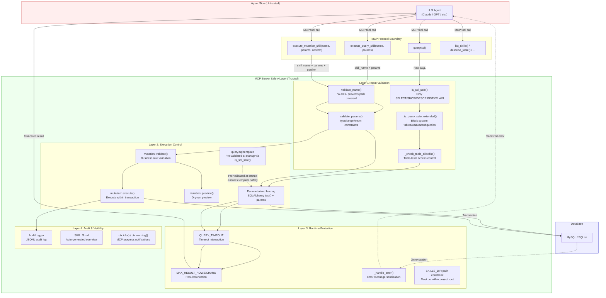
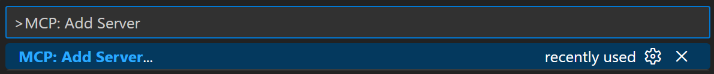
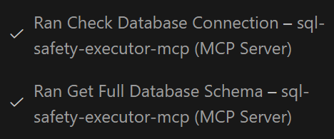
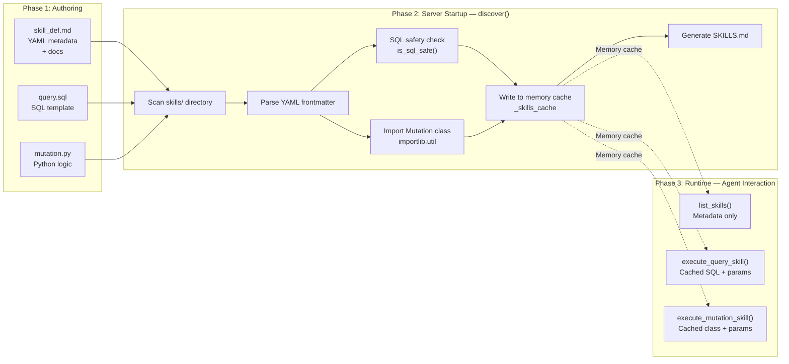
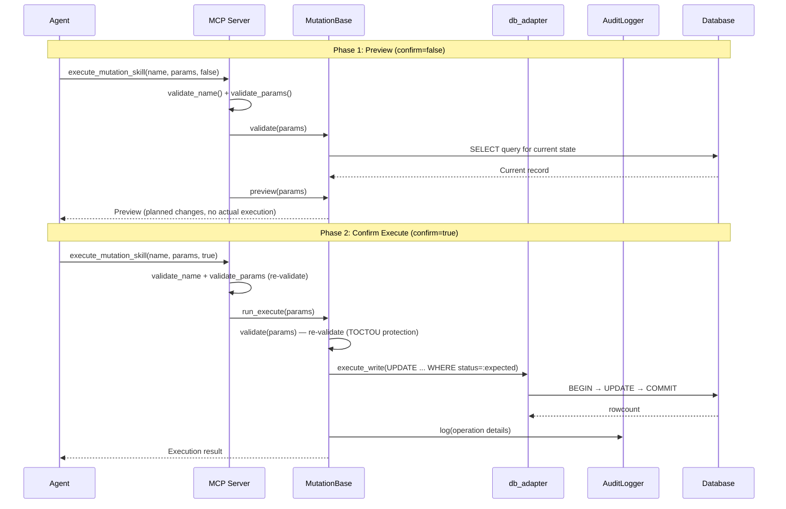

# LLM Database Safety Gateway - MCP Service


English | [中文](README_ZH.md)
> [Introduction](#introduction) | 
> [Quick Start](#quick-start) | 
> [Best Practices](#best-practices) | 
> [Changelog](#changelog) | 
> [Exposed MCP Tools](#exposed-mcp-tools) | 
> [AutoGen Multi Agent Example](#autogen-multi-agent-example) | 
> [Other Documentation](#other-documentation)  
> [Roadmap](#roadmap) · **v3.0 New Feature:** Skills Extension Layer Support  

## introduction

**A secure database access gateway for AI Agents: Empowering LLM (Agents) with database access capabilities.**  
- Enables Large Language Models (LLMs) to query databases safely through standardized MCP interfaces with security-validated SQL.Provides protections such as allowlists, timeouts, and result truncation. Mitigates operational risks while preventing token cost overruns.  
- In addition to MySQL and SQLite, support for NoSQL is also planned. (work in progress for a future release)  
- Furthermore, this project supports server-side, plugin-style operation extensions inspired by Agent Skills. Users or developers can write reusable pre-defined parameterized operations (queries and controlled writes) to extend capabilities, managed uniformly through `skill_def.md`. Agents can discover and invoke them on demand to handle complex queries, sensitive mutations, and specific business workflows.  

This project resolves the LLM database accessibility bottleneck. By coordinating with AI Agents, it expands the capability boundaries of LLMs and extends the application scope of large models in real-world business scenarios.

## Problem Statement

### Original Challenges
Traditional LLM-database integration faces the following limitations:
- **Security Risks**: LLM-generated SQL may contain dangerous operations (DELETE/UPDATE/DROP).
- **Token Explosion**: Large table queries returning massive amounts of data, leading to context overflow and uncontrolled costs.
- **Tight Coupling**: Database logic intertwined with LLM prompts and orchestration code, making maintenance and reuse difficult.
- **Query Quality**: Without table structure information, LLMs are prone to generating invalid or inefficient SQL.
- **Scalability**: Inability to guarantee personalized database connections and security configurations needed for each LLM instance.

### Design Goals
- Enable safe SQL query execution for AI models (SELECT/SHOW/DESCRIBE/EXPLAIN only).
- Prevent Token Explosion: Result truncation (`MAX_RESULT_ROWS`) + Table count limits (`MAX_OVERVIEW_TABLES`).
- Provide a standardized MCP interface across different AI platforms.
- Support ReAct Pattern: Provide table structure information for LLM decision-making.
- Configurable Security Policies: Allowlists, timeouts, UNION control.
- Extensible Operation Capabilities: Support for complex and sensitive change scenarios through skills-based operation extensions.

## Solution

### Service Architecture

This project implements a standard MCP (Model Context Protocol) service to provide secure database access for LLMs:

```
┌─────────────────────────────────────────────────────────────────┐
│                        MCP Client                               │
│         (VS Code Copilot / Claude Desktop / Gemini CLI)         │
└─────────────────────────┬───────────────────────────────────────┘
                          │ MCP Protocol (stdio)
                          ▼
┌──────────────────────────────────────────────────────────────────────────────┐
│                   sql-safety-executor (MCP Server)                           │
│  ┌─────────────────────────────────────────────────────────────────────────┐ │
│  │ Tool Layer:   query | list_tables | describe_table | ...                │ │
│  ├─────────────────────────────────────────────────────────────────────────┤ │
│  │ Skills Layer (Optional): list_skills | execute_query_skill              │ │
│  │                         | execute_mutation_skill                        │ │
│  │    skill_def.md → Param Validation → Pre-built SQL/Mutation → Audit Log │ │
│  ├─────────────────────────────────────────────────────────────────────────┤ │
│  │ Safety Layer: SQL Validation | Allowlist | Truncation | Timeout         │ │
│  └─────────────────────────────────────────────────────────────────────────┘ │
└─────────────────────────┬────────────────────────────────────────────────────┘
                          │ SQLAlchemy (Connection Pool)
                          ▼
┌─────────────────────────────────────────────────────────────────┐
│                           Database                              │
└─────────────────────────────────────────────────────────────────┘
```

### Core Design

**1. Security Validation**: Only allows SELECT/SHOW/DESCRIBE/EXPLAIN, automatically intercepting dangerous statements.

**2. Token Protection**: Result truncation (`MAX_RESULT_ROWS`) + Table count limits (`MAX_OVERVIEW_TABLES`).

**3. Tool Design**:
- Adopts a Model-driven pattern, prioritizing decision rules over fixed workflows.
- Tools return context like `is_large`/`row_count` to enable LLM autonomy.
- Supports configuration-based policy/prompt injection (e.g., ALLOW_UNION, ALLOWED_TABLES, truncation thresholds), using shorter, more relevant guidance to reduce invalid tool calls.
- Error feedback optimized for LLMs: Clearly identifies failure reasons (security blocking/table not allowed/syntax/timeout/truncation, etc.) and offers correction suggestions, reducing trial-and-error and invalid calls while avoiding leakage of sensitive information (credentials, system table details, etc.).
- Adapted for ReAct Pattern: Thought → Action → Observation → Rethink.

**4. Skills Extension Layer** (Optional, enabled with `ENABLE_SKILLS=1`):
- Pre-defined parameterized operations: Encapsulate complex queries and sensitive writes as reusable skills — Agents only need to pass parameters, no need to write SQL
- Server-side enforcement: SQL safety checks at startup + strong parameter type validation (type/min/max/enum) + audit logging for write operations
- Two-phase write operations: Mutation skills require preview (`confirm=false`) → confirmation (`confirm=true`) to prevent accidental operations
- Progressive disclosure: Agents discover metadata via `list_skills()` and invoke skills on demand

**5. Typical Workflow**:
```
Structure Unknown: list_tables() → describe_table(target) → query(sql)
Structure Known: query(sql) directly
Large Table Scenario: Observe is_large=true → Use LIMIT or Aggregation
Skills Scenario: list_skills() → execute_query_skill(name, params)
                 or execute_mutation_skill(name, params, confirm=false) → preview → confirm=true
```

### Safety Features
- **Query Restrictions**: Only SELECT / SHOW / DESCRIBE / EXPLAIN allowed.
- **SQL Parsing Validation**: Comprehensive query analysis using `sqlparse`.
- **Connection Security**: Environment-based credential management.
- **Error Isolation**: Comprehensive exception handling and reporting tailored for LLMs.
- **Access Isolation**: Access boundaries controlled by the host/runtime environment.
- **Table Allowlist**: Configurable restrictions on accessible tables.
- **Result Truncation**: `MAX_RESULT_ROWS` / `MAX_RESULT_CHARS` to prevent Token overflow.
- **Query Timeout**: `QUERY_TIMEOUT_SECONDS` to prevent slow queries.
- **UNION Control**: Disabled by default, requires allowlist to enable.

#### Skills-Related
- **Skills Template-as-Allowlist**: SQL templates are validated via `is_sql_safe()` at startup and cached in memory — zero disk I/O at runtime (prevents TOCTOU)
- **Skills Strong Parameter Validation**: type/min/max/enum constraints + rejection of parameters outside schema (prevents injection/hallucination)
- **Skills Dual-Layer Switches**: `ENABLE_SKILLS` + `SKILLS_ALLOW_MUTATIONS` for least-privilege control
- **Skills Two-Phase Confirmation**: Write operations require preview → confirm to prevent accidental operations
- **Skills Audit Logging**: Every mutation operation is automatically logged to JSONL (not dependent on Agent compliance)

### Key Components

| File | Responsibility |
|------|----------------|
| `mcp_sql_server.py` | MCP tool definition, security validation, result processing |
| `sql_safety_checker.py` | SQL statement parsing and security checking |
| `db_adapter.py` | Database adapter abstraction (MySQL/SQLite support) |
| `start_server.py` | Service startup, environment verification |
| `skills/_lib/skill_loader.py` | Skill discovery, YAML parsing, parameter validation (v3.0) |
| `skills/_lib/mutation_base.py` | ABC for write operation skills (v3.0) |
| `skills/_lib/audit.py` | JSONL audit logger for mutations (v3.0) |

## Design Philosophy
### Motivation: LLM/Agent-Based User Interface
The philosophy of this project originated in early 2025, partially influenced by GraphQL. Initially, the plan was for LLMs or Agents to serve as a frontend entry point, fetching information from the backend through explicit semantics.
In reality, SQL itself is an excellent carrier for query information. Rather than passing GraphQL, it is better to pass SQL directly. Especially since current mainstream LLMs (as of late 2025) can generate common SQL quite stably without additional fine-tuning.
However, three key issues need to be considered:
1. Potential SQL Injection.
2. The uncertainty of LLMs themselves: The safety of generated SQL.
3. The accuracy, quality, and efficiency of the generated SQL queries.

**Regarding Issue 1:**
This is not a case of a frontend directly sending SQL to a backend for execution. Here, LLMs (Agents) behave more like server-side programs. All SQL is generated in a controllable server environment and communicates with other backend services over stdio (or over HTTP inside a secure intranet). In this setup, Agents are programs with constrained inputs and outputs that interface with external users only through prompts. As of late 2025, defending against prompt injection is already a widespread and mature practice, and Agent authors can use multiple techniques to reduce that risk.

**Regarding Issue 2:**
LLM generation is uncertain. Even with a very low probability, this can lead to generated SQL safety not being guaranteed. A SQL safety check tool is needed to inspect and filter generated SQL.

**Regarding Issue 3:**
LLMs (Agents) cannot generate SQL out of thin air; they need a certain context foundation. This context can be natural language prompts or database documentation, but more importantly, database structure, query examples, and the data itself. For high-quality queries, as things stand (end of 2025), a ReAct approach should be adopted: a cycle of Thought --> Action --> Observation --> Rethink to decide the next action.

**In summary, this project is the solution to Issue 2 and Issue 3.**

### Project Evolution
Early on, the goal was to build a simple SQL safety checker that could inspect and filter SQL statements before execution, to be invoked by LLMs (Agents) through function calling.

- Later, [in version (v1.0)](LLM_TO_MCP_FEASIBILITY_ANALYSIS.md), the solution was refactored to add support for the standardized MCP service architecture. Decoupling was also performed to simplify maintenance while enhancing security and scalability.

- [In version (v2.0)](REFACTORING_LOG.md), optimizations for query efficiency and call risks were made for actual MCP usage scenarios.
  1. Optimized tool call efficiency by merging tools and adding new commonly used tools to reduce the number of tool calls.
  2. Focused on specific optimizations for Token Explosion risks in real-world usage (which can lead to massive LLM API costs).
  3. Added [examples of multi-Agent calls to this MCP service](README.md#autogen-multi-agent-example), based on the AutoGen framework, to demonstrate the combination of Agents and this service.

- [In version (v2.1)](REFACTORING_LOG.md#latest-update-january-4-2026---tool-optimization--field-naming), the focus was on improving tool design and output consistency. Many tools were optimized and refactored to adhere as closely as possible to industry best practices. The overall design adopts the ReAct paradigm (Thought --> Action --> Observation --> Rethink) loop. This improves query accuracy and multi-step query quality while ensuring query efficiency. The AutoGen-based multi-agent example was also updated synchronously.

Through these iterations, this project evolved from an initial concept of an LLM/Agent-based user interface to an MCP-supported comprehensive SQL query service. It is worth acknowledging that although the starting point was different, the current project actually shares similarities with current Text2SQL solutions.  
In the early conception of this project (March-April 2025), such systems were relatively rare. At that time, similar Text2SQL practices were mainly stuck in the context of receiving prompts from relevant personnel and the LLM generating SQL statements once to assist their queries. The core motivation of this project is **to enable LLMs (Agents) to replace traditional frontends and become the new "frontend", capable of dynamic interaction with users regarding both the data in the interface and the interface itself.** Making the entire system fully flexible and dynamic.  
For now, **the core idea of this project is to empower LLMs (Agents) with the ability to enter the database.** Combined with different Agents, different work scenarios can be developed and extended.

### Roadmap
**Agent Skills and Extensibility**
**Skills extension layer added in v3.0** (March 2026). See [MCP_AGENTS_SKILLS_DESIGN.md](MCP_AGENTS_SKILLS_DESIGN.md) for details.
In existing practices, we realize the significance of providing (encapsulated) specific semantic tools. The industry also has corresponding best practice discussions:
> "Offload the burden from the model and use code where possible."  
> "Don't make the model fill arguments you already know."  
> "Combine functions that are always called in sequence."
> [— OpenAI, "Best practices for defining functions" (December 2025)](https://platform.openai.com/docs/guides/function-calling#best-practices-for-defining-functions)

This indicates that in reasonable cases, a practical system should include and support adding extra tools tailored for specific scenarios. However, too many tools consume more context, reduce accuracy, and increase costs[1]. Progressive disclosure[2] of Agent Skills can avoid these issues.
Therefore, we can envision a scheme where users or developers can write a large number of "plugins" (code snippets/tools) dependent on this MCP service, managed via skill_def.md, allowing for dynamic addition and configuration of tools. Agents can then load these "plugins" to flexibly extend their capabilities.
Of course, unlike standard Agent Skills, this project's Skills provide pre-built, safety-constrained operations that the server executes on the Agent's behalf. This difference is intentional, primarily for [security considerations](README.md#skills-design-considerations).

> [1]: ["Keep the number of functions small for higher accuracy."](https://platform.openai.com/docs/guides/function-calling)  
> [2]: ["This filesystem-based architecture enables progressive disclosure: Claude loads information in stages as needed, rather than consuming context upfront."](https://platform.claude.com/docs/en/agents-and-tools/agent-skills/overview#how-skills-work)

**Support for Multiple Database Types (SQLite, NoSQL, etc.)**  
- **SQLite support added in v2.2** (January 2026)
- NoSQL support planned for future releases

**Manually Defined Methods for Database Write Processes**  

**Refined Permission Management Based on MCP Protocol**  

### Skills Design Considerations

This project's Skills layer borrows some design elements from [Anthropic Agent Skills](https://platform.claude.com/docs/en/agents-and-tools/agent-skills/overview) (directory structure, YAML frontmatter, name conventions), but **does not adopt the standard Agent Skills format. This is an intentional design decision for the following reasons:**

**1. Fundamentally Different Execution Model**

Standard Agent Skills assume the Agent has a code execution environment and file system access (VM / sandbox) — the Agent reads SKILL.md instructions and writes/executes code itself [1], [2]. This project is an MCP Server: the Agent calls remote tools via JSON-RPC and cannot `bash: cat skill_def.md` [5]. The standard Skills' three-level progressive disclosure (Agent reads files on demand via bash) is neither feasible nor meaningful in an MCP architecture [1].

**2. Different Trust Boundaries**

Standard Agent Skills trust the Agent to correctly follow instructions [1] — e.g., SKILL.md says "use pdfplumber to open file", and the Agent writes Python code to do so [2]. This project deals with database write operations and cannot trust the Agent to act freely:
- SQL must pass `is_sql_safe()` validation
- Parameters must be validated by strong typing (type/min/max/enum), not natural language understanding
- Mutations (INSERT/UPDATE/DELETE) must go through pre-built `MutationBase` subclasses (transactions, optimistic locking, rollback)
- Every operation must write to the audit log

Standard Agent Skills lack these mechanisms because their design assumption is "Agent operates freely in a controlled VM", while this project's assumption is "**Agent is untrusted, Server enforces all security constraints**".

**3. TOCTOU Security Requirements Conflict with Lazy Loading**

Standard Agent Skills use on-demand loading (Agent reads files at runtime via bash) [1], [2], meaning files can be tampered with at any time. For document-processing Skills this is irrelevant, but for SQL templates and mutation code, reading from disk at runtime introduces TOCTOU (Time-of-Check-Time-of-Use) risk [4]. This project's full pre-loading (`discover()` validates at startup + caches to memory, zero disk I/O at runtime) is an intentional security design that directly conflicts with the standard Skills' lazy model.

**4. Standard Skills "Teach Agent How to Do" vs. This Project "Does It for Agent"**

| Standard Agent Skills | This Project's Skills |
|---|---|
| SKILL.md tells Agent "use this library, follow these steps to process PDF" | `query.sql` / `mutation.py` are **executable artifacts**, not instructions |
| Agent generates and executes code itself | Server executes pre-built SQL/Python, Agent only passes parameters |
| Skill is a knowledge package | Skill is an action template |

Converting to the standard format would mean turning SQL templates into "instruction documents" for the Agent to write SQL itself — which is exactly what this project aims to prevent.

**5. Valuable Elements Borrowed from Standard Skills**

This project has already incorporated design elements from standard Agent Skills that are applicable to MCP scenarios:
- Directory structure: one folder per skill + entry file;
- YAML frontmatter: `name` (with regex constraint `^[a-z0-9][a-z0-9-]*$`) and `description` [3];
- Progressive interaction: MCP-level progressive interaction (`list_skills()` → select → `execute_*_skill()`);
- Composability: `related_skills` field for composability.
Elements that don't apply (SKILL.md body as Agent instructions, bash file system access, Agent self-executing scripts) were not adopted.

> **References**  
> [1] [Anthropic, "Agent Skills — Overview", 2025. Describes standard Agent Skills' three-level progressive disclosure, VM execution environment, and file system architecture.](https://platform.claude.com/docs/en/agents-and-tools/agent-skills/overview)  
> [2] [Anthropic, "Equipping agents for the real world with Agent Skills", 2025. Details the SKILL.md format, Agent's file loading mechanism via bash, and Skills' positioning as "knowledge packages".](https://claude.com/blog/equipping-agents-for-the-real-world-with-agent-skills)  
> [3] [Anthropic, "Agent Skills — Best Practices", 2025. Contains name field constraints (≤64 chars, `^[a-z0-9-]+$`) and description specifications.](https://platform.claude.com/docs/en/agents-and-tools/agent-skills/best-practices)  
> [4] [MITRE CWE-367: "Time-of-check Time-of-use (TOCTOU) Race Condition". Standard definition of the TOCTOU security risk referenced in point 3.](https://cwe.mitre.org/data/definitions/367.html)  
> [5] [Model Context Protocol Specification, "Architecture — Transports". MCP uses JSON-RPC 2.0 over stdio/SSE, Agent interacts with Server via tool calls, no file system access.](https://modelcontextprotocol.io/specification/2025-03-26/basic/transports)

#### Skills Security Considerations

**Security Model Overview**

The following diagram shows the four security layers a request passes through from Agent to database:



**1. The Implicit Trust Model of Standard Agent Skills**

The execution flow of standard Agent Skills is:

```
User request → Agent reads SKILL.md → Agent writes code → Agent executes in VM
```

The Agent **is both the decision-maker and the executor**, and security relies on:
- VM sandbox isolation (network, file system restricted)
- Agent will "follow instructions" and operate as directed
- Skills sources are trusted (officially recommended to use trusted sources only)

This is sufficient for document processing (PDF/Excel) — worst case is generating an incorrect file in the sandbox.

**2. This Project's Threat Model Is Completely Different**

This project's execution flow is:

```
User request → Agent calls MCP tool → MCP Server executes pre-built SQL → Production database
```

**Attack surface includes:**
- **Prompt injection**: Malicious user input may induce Agent to pass dangerous parameters
- **Agent hallucination**: Agent may "creatively" call non-existent skills or pass out-of-bounds parameters
- **TOCTOU**: If SQL is read from disk at runtime, an attacker modifying the file can inject arbitrary SQL
- **SQL injection**: Improper Agent parameter concatenation directly threatens production data

If the standard Agent Skills model were adopted, it would mean letting the Agent read SQL templates, concatenate parameters, and decide execution itself — **every one of the above security checkpoints would disappear**.

**3. This Project's Defense in Depth Is Incompatible with Standard Skills**

| Security Mechanism | This Project's Implementation | Under Standard Skills |
|---|---|---|
| **SQL Allowlist Validation** | `is_sql_safe()` validates at startup; unsafe skills are rejected from registration | Agent reads SQL files at runtime and executes them, bypassing validation |
| **Strong Parameter Validation** | `validate_params()` enforces type/min/max/enum | Agent understands parameters from natural language, no hard constraints |
| **Anti-Parameter Injection** | Rejects parameters outside schema (`unexpected` check) | Agent decides what parameters to pass |
| **TOCTOU Protection** | Loaded into memory at startup, zero disk I/O at runtime | Agent reads files via bash each time, files may have been tampered with |
| **Mutation Transaction Safety** | `MutationBase` enforces BEGIN→UPDATE→verify→COMMIT/ROLLBACK | Agent writes transaction code itself, may miss rollback |
| **Audit Logging** | Every operation automatically recorded to `_audit.jsonl` | Depends on Agent voluntarily calling logging (unreliable) |
| **Confirmation Mechanism** | `requires_confirmation: true` + two-phase execution | Agent decides whether to confirm (can be bypassed by prompt injection) |

The standard Agent Skills security model is **"sandbox isolation + trust Agent"**. This project's security model is **"do not trust Agent, Server enforces all security constraints"**. Converting to standard Agent Skills would mean handing security control from the Server back to the Agent — in a production database scenario, this is a downgrade, not an upgrade.

### Experience with AI-Assisted Development (Copilot, Vibe-Coding)
This project was originally created by Gemini CLI and primarily developed using GitHub Copilot after v1.0.
When using AI to assist in developing this project, the following experiences were generally followed:
1. Follow best practices on the web and GitHub as much as possible, such as those from Anthropic, Google, FastMCP, and Microsoft. Avoid hallucinations and local optima.
2. Make the AI reflect on its own output as much as possible.
3. Under the premise of satisfying 1 and 2, minimize constraints on the AI. Use the simplest prompts and steps to complete tasks, and let the AI complete the full workflow.
> Keep context as full and complete as possible; keep prompts and constraints to a minimum.

This is why although the original GEMINI.md is retained, it is only for record-keeping, and AGENTS.md was not added. However, skill_def.md or similar "progressive" documentation is good practice. The project's related documents [REFACTORING_LOG.md](REFACTORING_LOG.md) and [PROMPT_ENGINEERING_BEST_PRACTICES.md](PROMPT_ENGINEERING_BEST_PRACTICES.md) reflect this practice.

### Risks and Limitations
In the practice of writing this project, a large amount of AI-assisted development was used. Although code reviews and tests have been conducted as much as possible, and a series of security settings have been added, with limited resources, it cannot cover all situations, especially considering the involvement of LLMs.
**Therefore, do not directly connect to a production environment or pair with an Agent without testing. This may lead to unexpected consequences!**
Rashly connecting an untested Agent may lead to **instability, infinite loops, Token explosion, massive queries**, or other unverified negative effects.
In recent updates, multiple efficiency optimizations have been carried out for this project, mainly focusing on reducing unnecessary tool call counts and increasing speed. Certain tests have been performed. However, due to the randomness of LLMs (Agents), unnecessary tool calls may still occur in actual use, although the probability is small.

### Known Issues and Limitations
- **Row count fields may be imprecise**: `list_tables()` / `describe_table()` / `get_full_schema()` return `row_count` as estimates:
  - **MySQL**: from `INFORMATION_SCHEMA.TABLES.TABLE_ROWS` (InnoDB may have significant deviation or lag)
  - **SQLite**: from `sqlite_stat1` (if ANALYZE has been run) or sampling strategy
  - Only recommended for "order of magnitude judgment/whether to add LIMIT/whether it is a large table" strategies.
  - If an exact count is needed, please use `SELECT COUNT(*) ...`, or enable `ENABLE_TABLE_SUMMARY=1` and use `get_table_summary(exact_count=True)` (note that large tables may be slow).

- **Result truncation to avoid Token explosion**: `query()`, `list_tables()`, `get_full_schema()` will truncate output based on `MAX_RESULT_ROWS` / `MAX_RESULT_CHARS` / `MAX_OVERVIEW_TABLES` / `MAX_SCHEMA_TABLES`; therefore, "returned data/tables/columns" may not be the full set. When the full set is needed, please explicitly use smaller scope queries (add `LIMIT`, pagination by condition), or adjust relevant environment variables (at your own risk).

- **Some "Total" fields have "Visible Range" semantics**: For example, `total_tables` in tool output represents "the number of visible tables after allowlist parameter filtering (and considering truncation)", which is not necessarily equal to the actual total number of tables in the database; please avoid misinterpreting it as "whole database statistics".

### Best Practices
- **We recommend starting with GitHub Copilot in VS Code.** GitHub Copilot in VS Code is a mature AI agent tool. You can choose a free model (for example, GPT-5 mini) and use it against a test database, which improves safety and avoids extra AI request costs.
- **Another benefit of using GitHub Copilot is that it empowers this coding-assistant AI with database access capabilities,** allowing it to understand the target database's structure and data distribution. This leads to better development assistance and suggestions when writing code.
- **When using GitHub Copilot, you can add a prompt reminder such as "To make the data and reasoning accurate and sufficient, query step by step and refine the answer over multiple queries."** This nudges the AI toward a multi-step refinement process similar to a ReAct workflow, which is especially useful for complex tasks.
- **When using GitHub Copilot, explicitly attach the "#sql-safety-executor-mcp" tool so the model is reminded to prioritize it.** 

    

- **When using GitHub Copilot, make good use of the Agent's "todo" tool**, which helps the AI plan query steps and improve efficiency. 

    

- In recent modifications (as of Jan 7, 2026), multiple security optimizations have been made, such as truncation for large data volumes, use of special keywords (like union), table allowlist settings, and dynamic prompts for different configurations. However, **higher security means lower performance/efficiency and higher consumption (e.g., more request parameters and Token consumption), so please configure security settings as appropriate.**
- In practice, AI clients such as Claude Code, Codex, and Gemini CLI are similar to GitHub Copilot, but **be aware that AI calls may generate substantial token costs.** Current testing, including capability testing, has mainly been completed on GitHub Copilot.

## Quick Start

### Quickly Call MCP Service using VS Code

By configuring `mcp.json` in VS Code for quick integration, you can directly call the SQL tools of this project in GitHub Copilot Chat. This empowers GitHub Copilot Chat with database-oriented capabilities. [Of course, it can also be used in other MCP-supported AI assistants.](README.md#configuring-mcp-client)

#### 1. Preparation
*   Ensure VS Code is the latest version.
*   Install the **GitHub Copilot Chat** extension.
*   Ensure project dependencies are installed (run `pip install -r requirements.txt` in the project path).
*   Configure the environment `cp .env.example .env` and edit .env with your database credentials [Configure environment variables in .env](README.md#configuration).

#### 2. Create Configuration File
Create a new folder `.vscode` in the project root directory (create if it doesn't exist), and create a file `mcp.json` inside it.

#### 3. Fill in Configuration (Critical Step)
Copy the following content into `mcp.json` (if `mcp.json` already exists, append the configuration to it; VS Code respects `mcp.json` for MCP Server recognition). **Be sure to modify it to your actual absolute path**:

```json
{
  "mcpServers": {
    "sql-safety-executor-mcp": {
      "type": "stdio",
      "command": "/absolute/path/to/python", 
      "args": ["/absolute/path/to/start_server.py"],
      "cwd": "/absolute/path/to/project_root"
    }
  }
}
```

**Configuration Details:**
*   `command`: **Must** point to the absolute path of the Python interpreter in the virtual environment (e.g., `.venv/bin/python`), do not use system `python` directly.
*   `args`: Point to the absolute path of `start_server.py`.
*   `cwd`: The absolute path of the project root directory, ensuring `.env` file can be read.

**You can also configure via VS Code GUI: (Recommended)**

1. Complete "1. Preparation".
2. Open VS Code Command Palette (`Ctrl+Shift+P` / `Cmd+Shift+P`).
3. Type and select `MCP: Add Server`. 

    
4. Add the above content step by step following the guide (please modify according to actual path).

Basically, both methods achieve the same goal; they generate the `mcp.json` file in the same location. In any case, you just need to ensure `.vscode/mcp.json` has the above configuration.

#### 4. Verification and Usage
1.  Restart VS Code, or use the Command Palette to reload the window.
2.  Open GitHub Copilot Chat, ensure it is in Plan or Agent mode.
3.  Click the **Tool Icon** next to the model selection box below the input field.
4.  You should be able to see `sql-safety-executor` and its provided tools (e.g., `query`, `list_tables`). Ensure they are all checked. 

    
5.  Send a question directly in the conversation: "List all tables" or "Query the first 5 rows of the users table".

    
6.  Then you can see the MCP tool being called.  

    

Note: Although tool usage has been optimized, it is still recommended to use free models (e.g., GPT-5 mini) in GitHub Copilot Chat to avoid extra request consumption.

#### Common Issues
*   **Cannot find tools?** Check the `Output` panel, switch to "GitHub Copilot" to see if there are errors.
*   **Path Error**: Windows users please note backslash escaping in JSON (e.g., `C:\\Users\\...`).

### MCP Service Usage
```bash
# Install dependencies including MCP support
pip install -r requirements.txt

# Configure environment
cp .env.example .env
# Edit .env with your database credentials

# Start MCP Server
python start_server.py

# Test MCP capabilities (internal functions)
python test_mcp_functions.py

# Test MCP Server via client (simulates a real MCP client)
python test_mcp_client.py
```

### AutoGen Multi-Agent Example
```bash
# Run AutoGen Multi-Agent SQL Query System
# Requires: GEMINI_API_KEY, OPENAI_API_KEY, or USE_OLLAMA=true
python autogen_sql_agent.py

# Or run with a specific task
python autogen_sql_agent.py "List all tables and describe their structure"
```

`autogen_sql_agent.py` demonstrates how to use a multi-Agent team (PlanningAgent, SQLExecutorAgent, AnalystAgent) from the Microsoft AutoGen framework to interact with the MCP server.

### Configuring MCP Client
Add the server to your MCP-compatible client configuration (e.g., VS Code, Claude Desktop, or other MCP clients):

```json
{
  "mcpServers": {
    "sql-safety-executor-mcp": {
      "type": "stdio",
      "command": "python",
      "args": ["start_server.py"],
      "cwd": "/path/to/llm-sql-safety-executor-mcp"
    }
  }
}
```

- Replace `/path/to/` with your actual project path.
- The server loads credentials from the `.env` file in the working directory.
- For virtual environments, use the full path to the Python interpreter.

## Configuration 
Located in .env file. Copy .env.example to .env to configure

### Database Type Selection
```bash
# Database Type: 'mysql' (default) or 'sqlite'
DB_TYPE=mysql
```

### MySQL Configuration (used when DB_TYPE=mysql)
```bash
DB_USER=your_database_user
DB_PASSWORD=your_database_password
DB_HOST=your_database_host
DB_NAME=your_database_name
```

### SQLite Configuration (used when DB_TYPE=sqlite)
```bash
# Path to SQLite database file, or ':memory:' for in-memory database
SQLITE_DATABASE_PATH=./sample_data/demo.db
# SQLITE_DATABASE_PATH=:memory:
```

> **Note 1:** `./sample_data/demo.db` is a sample database provided for testing purposes.  
> **Note 2:** `SQLITE_DATABASE_PATH=:memory:` creates a temporary in-memory database (which is empty on initialization). Data is lost when the server restarts. It is suitable for testing and other specialized use cases.

```bash
# Optional: Query timeout progress handler interval (default: 100)
# Lower value = more responsive timeout, higher CPU overhead
# SQLITE_PROGRESS_HANDLER_INTERVAL=100
```

### Optional Environment Variables
```bash
# Feature Switches (1=Enabled, 0=Disabled)
ENABLE_SCHEMA_TOOLS=1    # Controls sample() tool
ENABLE_TABLE_SUMMARY=0   # Controls get_table_summary() tool (Default: Disabled)
                         # describe_table() already provides estimated row counts

# Large Table Threshold, used for is_large flag and query suggestions
# Tables exceeding this row count will trigger LIMIT/Aggregation hints
LARGE_TABLE_THRESHOLD=1000

# Security Configuration (Recommended for Production)
QUERY_TIMEOUT_SECONDS=30   # Query timeout in seconds (P0 Safety)
CONNECT_TIMEOUT_SECONDS=10 # Connection timeout in seconds

# Table Allowlist (Comma separated, case insensitive)
# Only allow access to specific tables - Leave empty to allow all
# Use "*" to explicitly allow all tables (UNION requires this setting)
ALLOWED_TABLES=products,orders,customers

# UNION Query Policy
# Important: UNION requires double configuration to enable:
#   1. ALLOW_UNION=1
#   2. ALLOWED_TABLES=table1,table2 OR ALLOWED_TABLES=*
# If ALLOW_UNION=1 but ALLOWED_TABLES is empty, UNION will still be blocked.
ALLOW_UNION=0

# Token Optimization: Limit result size to prevent context overflow
# Set to 0 to disable truncation (for data export scenarios)
MAX_RESULT_ROWS=100      # Max rows returned per query (0=unlimited)
MAX_RESULT_CHARS=16000   # Max characters in response (0=unlimited)
MAX_SCHEMA_TABLES=50     # Max tables returned by get_full_schema (0=unlimited)
MAX_OVERVIEW_TABLES=100  # Max tables returned by list_tables (0=unlimited)

# Skills Extension (v3.0)
ENABLE_SKILLS=0          # Master switch: enable Skills layer (1=enabled, 0=disabled)
SKILLS_ALLOW_MUTATIONS=0 # Allow mutation (write) skills (requires ENABLE_SKILLS=1)
# SKILLS_DIR=skills/     # Skills directory path (relative or absolute)
# SKILLS_AUDIT_LOG=skills/_audit.jsonl  # Audit log for mutations (JSONL)
# AGENT_ID=my-agent      # Agent identifier for audit logging
```

**Skills Configuration Details**:

The Skills layer lets you package common SQL queries and data mutations as reusable "skills". Disabled by default — zero impact on existing functionality.

| Variable | Default | Description |
|----------|---------|-------------|
| `ENABLE_SKILLS` | `0` | Master switch. When `1`, registers `list_skills` and `execute_query_skill` tools |
| `SKILLS_ALLOW_MUTATIONS` | `0` | Write switch. When `1`, additionally registers `execute_mutation_skill` (requires `ENABLE_SKILLS=1`) |
| `SKILLS_DIR` | `skills/` | Skills directory path. Must be within the project root (security constraint) |
| `SKILLS_AUDIT_LOG` | `skills/_audit.jsonl` | Audit log path. Every mutation operation is automatically recorded |
| `AGENT_ID` | `unknown` | Identifies the calling agent in audit logs |

**Typical configuration scenarios**:

```bash
# Scenario 1: Read-only query skills only (e.g. monthly-sales-report)
ENABLE_SKILLS=1
SKILLS_ALLOW_MUTATIONS=0

# Scenario 2: Both query and mutation skills (e.g. update-order-status)
ENABLE_SKILLS=1
SKILLS_ALLOW_MUTATIONS=1

# Scenario 3: Custom skills directory and audit log path
ENABLE_SKILLS=1
SKILLS_ALLOW_MUTATIONS=1
SKILLS_DIR=my_custom_skills/
SKILLS_AUDIT_LOG=logs/skills_audit.jsonl
AGENT_ID=copilot-agent-1
```

> **Security note**: `SKILLS_ALLOW_MUTATIONS` is a second-layer switch independent of `ENABLE_SKILLS`. Even with `ENABLE_SKILLS=1`, write operations remain disabled by default and must be explicitly enabled. This follows the principle of least privilege.

### MCP Client Integration
For a complete client configuration example, please refer to `mcp_config.json`.

## Changelog

### v3.0 Skills Extension (March 2026)

Added the Skills extension layer — pre-defined, parameterized SQL operations for structured agent interactions:

- **Skills Infrastructure** (`skills/_lib/`):
  - `skill_loader.py`: Skill discovery, YAML frontmatter parsing, parameter validation, SQL safety checks at startup
  - `mutation_base.py`: Abstract base class implementing validate/preview/execute pattern for write operations
  - `audit.py`: JSONL audit trail for all mutation operations with thread-safe logging
- **New MCP Tools** (conditionally registered via `ENABLE_SKILLS`):
  - `list_skills()`: Progressive disclosure — returns skill metadata (name, type, risk, triggers)
  - `execute_query_skill(name, params)`: Execute pre-audited SQL templates with parameterized binding
  - `execute_mutation_skill(name, params, confirm)`: Two-phase write operations (preview → confirm)
- **Security Model** (16 items in `skills/SAFETY.md`): Template-as-whitelist, parameterized queries, dual-layer switches, error sanitization
- **Database Adapter Extensions**: `execute()` now accepts optional `params`, new `execute_write()` method
- **Example Skills**: `monthly-sales-report` (query) and `update-order-status` (mutation with optimistic locking)
- **58 New Tests**: Covering skill loader, query skills, mutation skills, and audit logging
- **New Dependencies**: `pyyaml` for skill_def.md frontmatter parsing; `SQLAlchemy>=2.0` version constraint added
- **Full Backward Compatibility**: `ENABLE_SKILLS=0` (default) — zero overhead, no tools registered

For design details, see [MCP_AGENTS_SKILLS_DESIGN.md](MCP_AGENTS_SKILLS_DESIGN.md).

### v2.2 SQLite Support (January 2026)

Added support for SQLite databases while maintaining full backward compatibility with MySQL:

- **New Database Adapter Architecture**: Introduced `db_adapter.py` with Abstract Base Class pattern
  - `DatabaseAdapter` ABC defines unified interface for all database backends
  - `MySQLAdapter`: Preserves all existing MySQL functionality
  - `SQLiteAdapter`: New SQLite support with native timeout mechanism
  - `create_adapter()` factory function for automatic adapter selection
- **SQLite-Specific Features**:
  - Query timeout via `set_progress_handler()` (native SQLite callback)
  - `StaticPool` connection pooling (single connection, avoids file lock issues)
  - `sqlite_master` and `PRAGMA table_info()` for metadata queries
  - Row count estimation using `sqlite_stat1` or sampling strategy
- **New Environment Variables**:
  - `DB_TYPE=mysql|sqlite` - Database type selection (default: mysql)
  - `SQLITE_DATABASE_PATH` - Path to SQLite file or `:memory:`
  - `SQLITE_PROGRESS_HANDLER_INTERVAL` - Timeout check frequency
- **Backward Compatibility**: All existing MySQL configurations continue to work unchanged
- **New `db_type` Field**: Tool responses now include `db_type` field indicating active database
- **Comprehensive Test Suite**: 53 tests covering both MySQL and SQLite adapters

For detailed design decisions, compromises, and implementation details, see [SQLITE_ADAPTER_DESIGN.md](SQLITE_ADAPTER_DESIGN.md). For change log details, see [REFACTORING_LOG.md](REFACTORING_LOG.md).

### v2.1 Tool Optimization (January 2026)

Focused on improvements in tool design and output consistency:

- **`get_table_summary` is now optional**: Disabled by default (`ENABLE_TABLE_SUMMARY=0`) as `describe_table()` already provides estimated row counts. Enable only when precise COUNT(*) is needed.
- **Enhanced `describe_table`**: Now returns `row_count`, `row_count_approximate`, `is_large` flag, and `recommendation` query suggestions.
- **Refactored `list_tables` output**:
  - `data` → `tables`, clearer.
  - Added `database_name`, `returned_table_count`, `total_tables`, `truncated`, `truncation_note`.
- **Consistent Field Naming**: `returned_table_count` vs `total_tables` standard applied to both `list_tables` and `get_full_schema`.
- **New Environment Variables**:
  - `ENABLE_TABLE_SUMMARY=0` - Controls `get_table_summary()` tool.
  - `LARGE_TABLE_THRESHOLD=1000` - Threshold for `is_large` flag.
  - `MAX_OVERVIEW_TABLES=100` - Max tables for `list_tables()`.
- **AutoGen Agent Prompt Update**: Removed `get_table_summary()` reference, updated workflow to `list_tables() → describe_table()` pattern.

For detailed changes, please refer to [REFACTORING_LOG.md](REFACTORING_LOG.md).

### v2.0 Refactoring (December 2025) - Current Branch: `feature/v2.0-mcp-server-refactoring`

Major improvements following FastMCP best practices:

- **Expanded SQL Support**: Now supports multiple read-only statement types
  - `SELECT`: Standard data retrieval
  - `SHOW`: Database metadata (SHOW TABLES, SHOW COLUMNS, etc.)
  - `DESCRIBE`: Table structure information
  - `EXPLAIN`: Query execution plan analysis
- **Tool Consolidation**: Reduced from 6 tools to 5, then expanded to 7 via new optimized tools
  - `validate_sql_query` + `execute_safe_sql` → Consolidated into `query` (Automatic Validation)
  - Added `list_tables` tool for database discovery
  - Renamed tools for clarity: `check_connection`, `describe_table`, `sample`
  - **New (Dec 23)**: Added `get_full_schema` and `get_table_summary` for Token optimization
- **Optimized Server Instructions**: Reduced "exploratory behavior" (unnecessary tool calls) from LLMs
  - Explicit tool priority: `query` first, others only on error
  - Expected reduction: From 4-5 tool calls per query to 1-2 calls
- **Security Enhancements (Dec 23, 2025)**:
  - Query timeout protection (P0 Safety)
  - Table Allowlist support (`ALLOWED_TABLES`)
  - Configurable UNION policy (`ALLOW_UNION`)
  - Result truncation to prevent Token overflow
- **Code Quality**: Reduced code by ~40% (approx 460 → 280 rows) while maintaining functionality
- **Enhanced Metadata**: Added `ToolAnnotations` to improve LLM tool selection
- **Lifecycle Management**: Correct asynchronous resource lifecycle (FastMCP Best Practice)
- **SQL Injection Protection**: Identifier validation for dynamic table names

For detailed changes, please refer to [REFACTORING_LOG.md](REFACTORING_LOG.md).

### v1.0 - MCP Service Architecture

This project has transitioned from direct function calls to a standardized MCP service architecture, providing:

- Service-Oriented Architecture: Converted direct LLM function calls into an independent MCP server.
- Standardized Protocol: Implemented MCP tools for consistent AI model integration.
- Enhanced Separation of Concerns: Separated server startup logic into dedicated `start_server.py`.
- Improved Scalability: Single server instance supports multiple concurrent LLM clients.
- Better Security: Service isolation and controlled access via MCP protocol.

## Exposed MCP Tools

The service exposes 5-10 standardized MCP tools (depending on configuration):

### 1. `query` (Primary Tool)
Usage: Execute read-only SQL queries with automatic security validation.

This is the main tool for all database operations. Security validation is automatic, and only approved statement types (SELECT, SHOW, DESCRIBE, EXPLAIN) are permitted.

Input:
```json
{
  "sql": "SELECT COUNT(*) as total FROM products"
}
```

Output:
```json
{
  "success": true,
  "query": "SELECT COUNT(*) as total FROM products",
  "data": [
    {"total": 150}
  ],
  "row_count": 1
}
```

### 2. `check_connection`
Usage: Test database connection and configuration.

Output:
```json
{
  "connected": true,
  "message": "Database connection successful"
}
```

### 3. `list_tables`
Usage: Database Overview - List all tables and their estimated row counts.

Lightweight initial exploration tool. Row counts are INFORMATION_SCHEMA estimates (InnoDB may have ±40% error).

Output:
```json
{
  "success": true,
  "database_name": "mydb",
  "returned_table_count": 2,
  "total_tables": 2,
  "tables": [
    {"table_name": "users", "row_count": 150},
    {"table_name": "products", "row_count": 500}
  ],
  "row_count_approximate": true,
  "truncated": false,
  "truncation_note": null,
  "hint": "Row counts are estimates (InnoDB ±40%). total_tables = visible after allowlist."
}
```

### 4. `describe_table`
Usage: Get Table Structure - Column info, estimated row count, and query suggestions.

Returns column details and estimated row counts from INFORMATION_SCHEMA (avoids COUNT(*) full table scans). Includes `is_large` flag for query planning.

Input:
```json
{
  "table_name": "users"
}
```

Output:
```json
{
  "success": true,
  "table_name": "users",
  "row_count": 1500,
  "row_count_approximate": true,
  "column_count": 5,
  "columns": [
    {"column_name": "id", "data_type": "int", "nullable": "NO", "key_type": "PRI"},
    {"column_name": "name", "data_type": "varchar", "nullable": "YES", "key_type": ""}
  ],
  "is_large": true,
  "recommendation": "Large table (~1500 rows). Use LIMIT or aggregation (COUNT/GROUP BY)."
}
```

### 5. `sample` (Optional)
Usage: Retrieve sample data from a specified table.

**Note**: This tool is controlled by `ENABLE_SCHEMA_TOOLS` environment variable (Default: Enabled)

Input:
```json
{
  "table_name": "users",
  "limit": 5
}
```

Output:
```json
{
  "success": true,
  "table_name": "users",
  "data": [
    {"id": 1, "name": "Alice"},
    {"id": 2, "name": "Bob"}
  ],
  "row_count": 2,
  "query": "SELECT * FROM `users` LIMIT 5"
}
```

### 6. `get_full_schema`
Usage: Fetch complete database schema (all tables and columns) in a single call.

Suitable for multi-table JOIN or scenarios requiring all table structures at once. For single table queries, `describe_table()` is recommended.

Output:
```json
{
  "success": true,
  "schema": {
    "users": {
      "row_count": 150,
      "columns": [
        {"name": "id", "type": "int", "nullable": "NO", "key": "PRI"},
        {"name": "name", "type": "varchar", "nullable": "YES", "key": ""}
      ]
    }
  },
  "returned_table_count": 1,
  "total_tables": 1,
  "total_columns": 2,
  "row_count_approximate": true,
  "truncated": false,
  "truncation_note": null,
  "hint": "Row counts are estimates (InnoDB ±40%). Use LIMIT for large tables (row_count > 1000). total_tables = visible after allowlist."
}
```

### 7. `get_table_summary` (Optional)
Usage: Get table statistics, supports optional exact row count calculation.

**Note**: This tool is controlled by `ENABLE_TABLE_SUMMARY` environment variable (Default: **Disabled**). `describe_table()` tool already provides estimated row counts, so this tool is needed only when precise counting is required.

**Warning**: `exact_count=True` will run COUNT(*), which may be slow on large InnoDB tables (full table scan).

Input:
```json
{
  "table_name": "users",
  "exact_count": false
}
```

Output:
```json
{
  "success": true,
  "table_name": "users",
  "row_count": 150,
  "row_count_approximate": true,
  "column_count": 5,
  "columns": [...],
  "is_large": true,
  "recommendation": "Large table (~150 rows). Use LIMIT or aggregation (COUNT/GROUP BY)."
}
```

### 8. `list_skills` (Skills Extension, Optional)
Usage: List all available pre-defined skills (query and mutation).

**Note**: Requires `ENABLE_SKILLS=1`. Returns skill metadata for progressive disclosure.

Output:
```json
{
  "success": true,
  "skills": [
    {
      "name": "monthly-sales-report",
      "type": "query",
      "risk": "low",
      "description": "Generate a monthly sales summary report...",
      "triggers": ["monthly sales", "revenue report"]
    }
  ],
  "count": 1
}
```

### 9. `execute_query_skill` (Skills Extension, Optional)
Usage: Execute a pre-defined query skill with parameterized SQL.

**Note**: Requires `ENABLE_SKILLS=1`. Skills are pre-audited SQL templates — bypasses runtime `is_sql_safe()` checks.

Input:
```json
{
  "skill_name": "monthly-sales-report",
  "params": {"year": 2026, "month": 1}
}
```

### 10. `execute_mutation_skill` (Skills Extension, Optional)
Usage: Execute a pre-defined mutation (write) skill with two-phase confirmation.

**Note**: Requires `ENABLE_SKILLS=1` and `SKILLS_ALLOW_MUTATIONS=1`. Follows validate → preview → execute pattern.

Input:
```json
{
  "skill_name": "update-order-status",
  "params": {"order_id": 42, "new_status": "shipped"},
  "confirm": false
}
```

`confirm=false` (default) returns a preview. `confirm=true` executes the mutation.

### Skills Extension Details (v3.0)

Skills are pre-defined, parameterized SQL operations that encapsulate common business queries and data mutations. Unlike the core `query()` tool where the Agent writes free-form SQL, Skills provide code-reviewed SQL templates — the Agent only needs to pass parameters.

**Why Skills?**
- **Fewer errors**: Complex multi-table JOINs and aggregations are error-prone; pre-defined templates ensure SQL correctness
- **Safe writes**: Core tools only support read-only queries (SELECT); Skills enable write operations with strict audit and confirmation
- **Efficiency**: Agent skips multi-round schema exploration and SQL authoring — one call does the job
- **Extensible**: Developers can add custom Skills for their specific business needs

#### Example 1: `monthly-sales-report` (Query Skill)

**Goal**: Generate a daily sales summary for a specified month, including revenue, order count, and average order value.

**Directory structure**:
```
skills/monthly-sales-report/
├── skill_def.md    # Skill definition (YAML metadata + usage docs)
└── query.sql       # SQL template
```

**Metadata** (YAML frontmatter in `skill_def.md`):
```yaml
name: monthly-sales-report
type: query              # Read-only, no data modification
source: query.sql        # Explicit execution file declaration (required)
risk: low
params:
  year: {type: int, required: true, description: "Year (e.g. 2026)"}
  month: {type: int, required: true, min: 1, max: 12, description: "Month (1-12)"}
triggers:                # Keyword hints to help agents match this skill
  - monthly sales
  - revenue report
  - sales summary
```

**`query.sql`**:
```sql
SELECT
    DATE(order_date) AS date,
    COUNT(*) AS order_count,
    SUM(amount) AS revenue,
    ROUND(AVG(amount), 2) AS avg_order_value
FROM orders
WHERE YEAR(order_date) = :year
  AND MONTH(order_date) = :month
GROUP BY DATE(order_date)
ORDER BY date ASC
```

**Invocation**: Agent calls via `execute_query_skill`:
```json
{"skill_name": "monthly-sales-report", "params": "{\"year\": 2026, \"month\": 1}"}
```

**How it works**: On server startup, `skill_loader.py` scans the `skills/` directory, parses the YAML frontmatter from `skill_def.md`, reads the source file declared by the `source` field, and validates it via `is_sql_safe()`. At runtime, the Agent passes `year` and `month` parameters, and the server executes the query safely using SQLAlchemy's parameterized binding (`:year`, `:month`), preventing SQL injection.

#### Example 2: `update-order-status` (Mutation Skill)

**Goal**: Safely update an order's status using state machine constraints to prevent illegal transitions (e.g., cannot jump from "pending" to "delivered").

**Directory structure**:
```
skills/update-order-status/
├── skill_def.md                  # Skill definition
├── mutation.py                   # Python logic (validate + preview + execute)
└── references/
    └── status-transitions.md     # State machine documentation
```

**Metadata**:
```yaml
name: update-order-status
type: mutation                     # Write operation
risk: medium
requires_confirmation: true        # Two-phase confirmation required
params:
  order_id: {type: int, required: true, description: "Order ID"}
  new_status: {type: str, required: true, 
    enum: [pending, confirmed, shipped, delivered, cancelled, returned],
    description: "Target status"}
```

**State transition rules** (built into `mutation.py`):
```
pending    → confirmed, cancelled
confirmed  → shipped, cancelled
shipped    → delivered, returned
delivered  → returned
cancelled  → (terminal state)
returned   → (terminal state)
```

**Two-phase invocation**:

1. **Preview** (`confirm=false`, default) — look before you leap:
```json
{"skill_name": "update-order-status", 
 "params": "{\"order_id\": 42, \"new_status\": \"shipped\"}",
 "confirm": false}
```
Returns the SQL that would be executed and its expected impact, without modifying data.

2. **Execute** (`confirm=true`) — write after confirmation:
```json
{"skill_name": "update-order-status",
 "params": "{\"order_id\": 42, \"new_status\": \"shipped\"}",
 "confirm": true}
```

**Safety mechanisms**:
- **State machine validation**: `validate()` checks if current status allows transition to target status
- **Optimistic locking**: Uses `WHERE status = :expected_status` at execution time; if the status was modified between preview and execute, the update fails (rowcount=0)
- **Transaction protection**: Write operations run inside a database transaction; automatic rollback on failure
- **Audit logging**: Every operation (success or failure) is automatically logged to the JSONL audit file

#### Adding Custom Skills

**Query skills** (read-only):
1. Create a directory under `skills/`, e.g. `skills/my-report/`
2. Write `skill_def.md` (YAML frontmatter + documentation), must include `source` field pointing to the SQL file (e.g. `source: my-report.sql`)
3. Write the corresponding `.sql` file (use `:param_name` as parameter placeholders), filename must match the `source` field
4. Restart the server — the skill is auto-discovered and registered

**Mutation skills** (write):
1. Create the directory and `skill_def.md` as above (`type: mutation`), must include `source` field pointing to the Python file (e.g. `source: mutation.py`)
2. Write the corresponding `.py` file defining a `Mutation` class (inheriting from `MutationBase`), filename must match the `source` field
3. Implement `validate()`, `preview()`, and `execute()` methods
4. Set `SKILLS_ALLOW_MUTATIONS=1` and restart the server

> **About the `source` field**: `source` is a mandatory field that explicitly declares the association
> between the skill definition file (`skill_def.md`) and its execution file. This follows the
> **Explicit Configuration** principle, consistent with industry standards like GitHub Actions
> (`action.yml`'s `main` field) and npm (`package.json`'s `main` field).
> The `source` filename is validated for security: no path traversal allowed, suffix must match
> `type` (query→`.sql`, mutation→`.py`).

For full specifications, see [MCP_AGENTS_SKILLS_DESIGN.md](MCP_AGENTS_SKILLS_DESIGN.md) and [skills/SAFETY.md](skills/SAFETY.md).

#### Skills Design Architecture

**Skill Lifecycle**

Each Skill goes through three phases from authoring to runtime. The core design decision is to **separate startup-time security validation from runtime execution** — all safety checks complete before the server accepts requests.



> Startup validation follows the **fail-fast principle** — if a Skill's SQL is unsafe or its source module is malformed,
> the server rejects registration at startup rather than failing on first invocation.
> This aligns with [MCP Specification §7 — Security](https://modelcontextprotocol.io/specification/2025-03-26/basic/security):
> *"Validate all inputs"* and *"Implement proper access controls."*

**Mutation Two-Phase Execution Flow**

Mutation Skills implement Anthropic's ["verifiable intermediate outputs"](https://docs.anthropic.com/en/docs/build-with-claude/agentic-systems#practices-for-effective-agentic-systems) pattern — Agents (and users) can review planned changes before committing.



> **Design references**:
> - *"Give models less freedom for higher-stakes operations."* — [Anthropic, "Building effective agents" (2024)](https://docs.anthropic.com/en/docs/build-with-claude/agentic-systems)
> - The repeated `validate()` call in Phase 2 is **intentional** TOCTOU protection: data state may have changed between preview and confirmation
> - Parameter binding uses SQLAlchemy `text()` + parameter dicts, following [OWASP SQL Injection Prevention](https://cheatsheetseries.owasp.org/cheatsheets/SQL_Injection_Prevention_Cheat_Sheet.html) standards

**skill_def.md Format Design**

`skill_def.md` uses a layered design of YAML frontmatter + Markdown body, serving different audiences:

- **YAML frontmatter** (top section): Machine-parsed by `skill_loader.py` at server startup, extracting structured fields like `name`, `type`, `params` for registration and validation. Agents access this metadata (formatted) via `list_skills()`, not by reading the file directly.
- **Markdown body** (bottom section): Natural language documentation for developers (usage instructions, workflow hints, notes, etc.). **Not sent to the Agent** — this is a key difference from standard Agent Skills: the standard SKILL.md body contains instructions for the Agent to read, while this project's body is documentation for humans.
- **Parameter constraint declarations**: `type`/`min`/`max`/`enum` declared in YAML, enforced uniformly by `validate_params()`. Skill authors don't need to duplicate validation logic in code.

**Example** — using `monthly-sales-report`'s `skill_def.md`:

```yaml
---
name: monthly-sales-report          # Name constraint: ^[a-z0-9][a-z0-9-]*$
type: query                         # query | mutation
source: query.sql                   # Explicit execution file (required, suffix must match type)
risk: low                           # low | medium | high
params:                             # Parameter schema (Server-side enforced)
  year: {type: int, required: true} #   → validate_params() checks type
  month: {type: int, required: true,
          min: 1, max: 12}          #   → Range constraint, blocks out-of-bounds
triggers:                           # Keyword hints (for Agent matching)
  - monthly sales
  - revenue report
---
## Usage                            ← Markdown body: developer-visible only
execute_query_skill("monthly-sales-report", {"year": 2026, "month": 1})

## Notes
- Uses MySQL YEAR()/MONTH() functions, SQLite requires replacement
```

In the example above, after the Server extracts the parameter schema from YAML:
1. Agent passes `{"year": 2026, "month": 13}` → Server rejects (`month` exceeds `max: 12`)
2. Agent passes undefined parameter `{"year": 2026, "month": 1, "limit": 10}` → Server rejects (`unexpected` parameter)
3. Agent passes `{"year": "2026", "month": "1"}` → Server auto-coerces types (`_coerce_type()` → `int`)

This follows Google's [Function Calling Best Practices](https://ai.google.dev/gemini-api/docs/function-calling#best_practices): *"Use strong schema: specify types, limits, enums, and valid patterns"* — constraining parameters at the schema level rather than relying on the Agent's natural language understanding.

**Industry Best Practices Alignment**:
| Best Practice | Source | This Project's Implementation |
|----------|------|-------------|
| *"Offload the burden from the model and use code where possible."* | [OpenAI — Function Calling (2025)](https://platform.openai.com/docs/guides/function-calling#best-practices-for-defining-functions) | Skills pre-build SQL/Python logic, Agent only passes parameters |
| *"Use clear and descriptive function/parameter names and descriptions."* | [Google Gemini — Function Calling](https://ai.google.dev/gemini-api/docs/function-calling#best_practices) | YAML frontmatter provides structured names, descriptions, and parameter constraints |
| *"Give models less freedom for higher-stakes operations."* | [Anthropic — Building Effective Agents](https://docs.anthropic.com/en/docs/build-with-claude/agentic-systems) | Mutation operations go through constrained `MutationBase`, not free-form code |
| *"Validate all inputs"* | [MCP Specification §7 — Security](https://modelcontextprotocol.io/specification/2025-03-26/basic/security) | Every call goes through `validate_name()` + `validate_params()` |
| Parameterized queries | [OWASP — SQL Injection Prevention](https://cheatsheetseries.owasp.org/cheatsheets/SQL_Injection_Prevention_Cheat_Sheet.html) | SQLAlchemy `text()` + parameter binding, zero string concatenation |

For complete design details, execution flow diagrams, and industry best practices alignment analysis, see [MCP_AGENTS_SKILLS_DESIGN.md](MCP_AGENTS_SKILLS_DESIGN.md).


## Requirements

- Python 3.12+
- MySQL or SQLite Database
- Dependencies: `sqlparse`, `SQLAlchemy>=2.0`, `PyMySQL`, `fastMCP`, `python-dotenv`, `pyyaml`

## Testing

### Test Scripts

The project includes two complementary test scripts:

#### 1. `test_mcp_functions.py` - Internal Function Test
Tests underlying functions directly, without passing through the MCP protocol:
```bash
python test_mcp_functions.py
```

This script verifies:
- SQL validation logic (safe and unsafe queries)
- Database connection
- Query execution
- Schema introspection (if enabled)
- Sample data retrieval (if enabled)

#### 2. `test_mcp_client.py` - MCP Protocol Test
Tests the server via MCP protocol using FastMCP Client:
```bash
python test_mcp_client.py
```

This script:
- Connects to MCP Server using FastMCP `Client` API
- Tests server info and database connection
- Executes multiple SQL queries (list tables, SELECT, COUNT)
- Tests optional schema tools (if enabled)
- Verifies data serialization format

## Other Documentation

- [Skills Design](MCP_AGENTS_SKILLS_DESIGN.md): v3.0 Skills extension layer architecture and design decisions
- [Skills Security Policy](skills/SAFETY.md): 16-item security governance for skill authors
- [Feasibility Analysis](LLM_TO_MCP_FEASIBILITY_ANALYSIS.md): Detailed analysis of LLM to MCP conversion
- [Original Context](GEMINI.md): Project background and development guide
- [Refactoring Log](REFACTORING_LOG.md): Refactoring change documentation (v2.0 — v3.0)
- [MCP Client Test Guide](TEST_MCP_CLIENT_GUIDE.md): Guide for testing MCP Server via client
- [Prompt Engineering Best Practices](PROMPT_ENGINEERING_BEST_PRACTICES.md): Guide for MCP tool descriptions and prompts

## Contribution

1. Fork the repository
2. Create a feature branch (`git checkout -b feature/amazing-feature`)
3. Make changes and conduct appropriate testing
4. Add tests for new features
5. Update documentation as needed
6. Submit a Pull Request

## Support

For technical issues, feature requests, or questions:
- Create an issue in the GitHub repository
- Include relevant error messages and configuration details
- Provide steps to reproduce the issue

---
