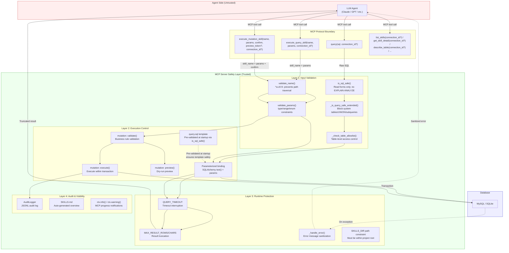
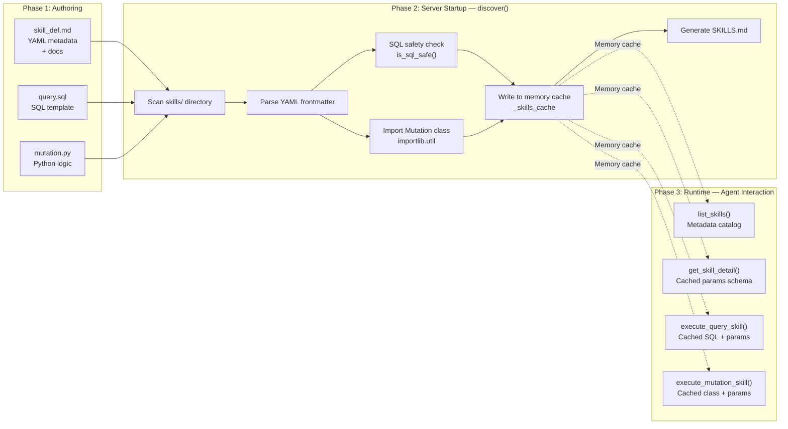

# LLM Database Safety Gateway - MCP Service


English | [中文](README_ZH.md)
> [Introduction](#introduction) | 
> [Quick Start](#quick-start) | 
> [Best Practices](#best-practices) | 
> [Changelog](#changelog) | 
> [Exposed MCP Tools](#exposed-mcp-tools) | 
> [AutoGen Multi Agent Example](#autogen-multi-agent-example) | 
> [Other Documentation](#other-documentation)  
> [Roadmap](#roadmap) · **v3.0 New Feature:** Skills Extension Layer Support  

## introduction

**A secure database access gateway for AI Agents: Empowering LLM (Agents) with database access capabilities.**  
- Enables Large Language Models (LLMs) to query databases safely through standardized MCP interfaces with security-validated SQL.Provides protections such as allowlists, timeouts, and result truncation. Mitigates operational risks while preventing token cost overruns.  
- In addition to MySQL and SQLite, support for NoSQL is also planned. (work in progress for a future release)  
- Furthermore, this project supports server-side, plugin-style operation extensions inspired by Agent Skills. Users or developers can write reusable pre-defined parameterized operations (queries and controlled writes) to extend capabilities, managed uniformly through `skill_def.md`. Agents can discover and invoke them on demand to handle complex queries, sensitive mutations, and specific business workflows.  

This project resolves the LLM database accessibility bottleneck. By coordinating with AI Agents, it expands the capability boundaries of LLMs and extends the application scope of large models in real-world business scenarios.

## Problem Statement

### Original Challenges
Traditional LLM-database integration faces the following limitations:
- **Security Risks**: LLM-generated SQL may contain dangerous operations (DELETE/UPDATE/DROP).
- **Token Explosion**: Large table queries returning massive amounts of data, leading to context overflow and uncontrolled costs.
- **Tight Coupling**: Database logic intertwined with LLM prompts and orchestration code, making maintenance and reuse difficult.
- **Query Quality**: Without table structure information, LLMs are prone to generating invalid or inefficient SQL.
- **Scalability**: Inability to guarantee personalized database connections and security configurations needed for each LLM instance.

### Design Goals
- Enable conservatively filtered SQL query execution for AI models (the MCP
  policy accepts one `SELECT`, `DESCRIBE`, or non-ANALYZE `EXPLAIN`; use schema
  tools instead of raw `SHOW`).
- Prevent Token Explosion: Result truncation (`MAX_RESULT_ROWS`) + Table count limits (`MAX_OVERVIEW_TABLES`).
- Provide a standardized MCP interface across different AI platforms.
- Support ReAct Pattern: Provide table structure information for LLM decision-making.
- Configurable Security Policies: Allowlists, timeouts, UNION control.
- Extensible Operation Capabilities: Support for complex and sensitive change scenarios through skills-based operation extensions.

## Solution

### Service Architecture

This project implements a standard MCP (Model Context Protocol) service to provide secure database access for LLMs:

```
┌─────────────────────────────────────────────────────────────────┐
│                        MCP Client                               │
│         (VS Code Copilot / Claude Desktop / Gemini CLI)         │
└─────────────────────────┬───────────────────────────────────────┘
                          │ MCP Protocol (stdio)
                          ▼
┌──────────────────────────────────────────────────────────────────────────────┐
│                   sql-safety-executor (MCP Server)                           │
│  ┌─────────────────────────────────────────────────────────────────────────┐ │
│  │ Tool Layer:   list_connections | query | list_tables | describe_table  │ │
│  ├─────────────────────────────────────────────────────────────────────────┤ │
│  │ Skills Layer (Optional): list_skills | get_skill_detail                 │ │
│  │                         | execute_query_skill | execute_mutation_skill  │ │
│  │    skill_def.md → Param Validation → Pre-built SQL/Mutation → Audit Log │ │
│  ├─────────────────────────────────────────────────────────────────────────┤ │
│  │ Safety Layer: SQL Validation | Allowlist | Truncation | Timeout         │ │
│  └─────────────────────────────────────────────────────────────────────────┘ │
└─────────────────────────┬────────────────────────────────────────────────────┘
                          │ SQLAlchemy (Connection Pool)
                          ▼
┌─────────────────────────────────────────────────────────────────┐
│                           Database                              │
└─────────────────────────────────────────────────────────────────┘
```

### Core Design

**1. Security Validation**: The MCP policy allows one SELECT/DESCRIBE or
non-ANALYZE EXPLAIN form on the supported MySQL/SQLite adapters, while rejecting
raw SHOW, write DML,
nested write-DML CTE text, executing `EXPLAIN ANALYZE` forms, and MySQL comment
forms whose server semantics differ from generic comment stripping. This is a
conservative gate, not comprehensive SQL semantic analysis for arbitrary dialects.

**2. Token Protection**: Result truncation (`MAX_RESULT_ROWS`) + Table count limits (`MAX_OVERVIEW_TABLES`).

**3. Tool Design**:
- Adopts a Model-driven pattern, prioritizing decision rules over fixed workflows.
- Tools return context like `is_large`/`row_count` to enable LLM autonomy.
- MCP `ToolAnnotations` include read-only/destructive/idempotent hints plus `openWorldHint=false`, reflecting that tools operate inside the configured database boundary rather than arbitrary external systems.
- Skills execution tools return structured business payloads and attach
  `ToolResult.meta` runtime metadata (for example elapsed time, row counts,
  truncation state, and Skill version) for debugging and observability.
- Supports configuration-based policy/prompt injection (e.g., ALLOW_UNION, ALLOWED_TABLES, truncation thresholds), using shorter, more relevant guidance to reduce invalid tool calls.
- Error feedback optimized for LLMs: Clearly identifies failure reasons (security blocking/table not allowed/syntax/timeout/truncation, etc.) and offers correction suggestions, reducing trial-and-error and invalid calls while avoiding leakage of sensitive information (credentials, system table details, etc.).
- Adapted for ReAct Pattern: Thought → Action → Observation → Rethink.

**4. Skills Extension Layer** (Optional, enabled with `ENABLE_SKILLS=1`):
- Pre-defined parameterized operations: Encapsulate complex queries and sensitive writes as reusable skills — Agents only need to pass parameters, no need to write SQL
- Server-side enforcement: SQL safety checks at startup + strong parameter type validation (type/min/max/enum) + best-effort audit state for write operations
- Two-phase write protocol: Mutation skills require preview (`confirm=false`) → execute with the returned `preview_token` (`confirm=true`) to bind the reviewed request/state and reject replay or preview/execute drift. Human approval exists only when a trusted client presents the preview and collects it; see the v3.7 host example.
- Transaction outcomes (v3.7.2): built-in single-statement mutations enforce
  `expected_rowcount=1` before COMMIT. Structured results separate tool
  `success` from `execution_outcome` (`not_executed`, `rolled_back`,
  `committed`, or `unknown`); hosts must never retry an uncertain execute.
  Only preserved adapter COMMIT evidence can produce `committed`. An ordinary
  custom-Skill success is conservatively `success=true, unknown`.
- Progressive disclosure: Agents can search a lightweight catalog with
  `list_skills()`, request `get_skill_detail(detail_level="execution")` only
  when a known Skill's params are still unknown, and execute directly when the
  params are already available (including from `list_skills(..., detail_level="full")`).

**5. Typical Workflow**:
```
Structure Unknown: names/counts only → list_tables()
                   broad columns → get_full_schema(detail_level="compact") directly
                   one target table → describe_table(target) → query(sql)
Structure Known: query(sql) directly
Large Table Scenario: Observe is_large=true → Use LIMIT or Aggregation
Skills Scenario: unknown Skill → list_skills(search=..., detail_level="compact", connection_id=target)
                 → get_skill_detail(skill_name=..., connection_id=target, detail_level="execution") when needed
                 known Skill + unknown params → get_skill_detail(skill_name=..., connection_id=target, detail_level="execution")
                 known params → execute_query_skill(name, params, connection_id=target)
                 or mutation preview → user approval → same params/connection_id + returned preview_token
```

### Safety Features
- **Query Restrictions**: On the supported MySQL/SQLite adapters, the full MCP
  policy accepts exactly one SELECT, DESCRIBE, or non-ANALYZE EXPLAIN. Raw SHOW
  is rejected; use `list_tables()`/`describe_table()` for metadata. Nested write
  DML, `EXPLAIN ANALYZE`, executable comments/hints, and ambiguous
  non-whitespace `--` forms are rejected.
- **SQL Parsing Validation**: Statement-type allowlist via `sqlparse` plus MCP-layer extended checks.
- **Connection Security**: Environment-based credential management. v3.5 adds configured named connections (`connection_id`) without accepting arbitrary DSNs from tools or model output.
- **Error Isolation**: Comprehensive exception handling and reporting tailored for LLMs.
- **Access Isolation**: Access boundaries controlled by the host/runtime environment.
- **Table Allowlist**: Configurable restrictions on accessible tables.
- **Database Authorization Remains Authoritative**: The SQL checker is a
  conservative statement-shape/application-policy gate, not a proof that every
  `SELECT` is side-effect free. MySQL stored functions and functions such as
  `GET_LOCK()` can have effects not visible from the outer statement type.
  Production read aliases should have object-level `SELECT` only and should
  not receive unnecessary `EXECUTE`, `FILE`, `PROCESS`, administrative, or
  cross-schema privileges. Keep mutation credentials separate where practical.
- **Result Truncation**: `MAX_RESULT_ROWS` / `MAX_RESULT_CHARS` to prevent Token overflow.
- **Timeout Controls**: `QUERY_TIMEOUT_SECONDS` limits read queries and MySQL InnoDB mutation row-lock waits; it is not a guarantee for all long-running DML CPU/IO work.
- **UNION Control**: Disabled by default, requires allowlist to enable.

#### Skills-Related
- **Skills Template-as-Allowlist**: SQL templates are validated for read-only shape at startup, cached in memory, and re-checked against target-connection policy at runtime — zero disk I/O at runtime (prevents TOCTOU)
- **Skills Strong Parameter Validation**: type/min/max/enum constraints + rejection of parameters outside schema (prevents injection/hallucination)
- **Skills Dual-Layer Switches**: `ENABLE_SKILLS` + `SKILLS_ALLOW_MUTATIONS` for least-privilege control
- **Closed-World Tool Hints**: MCP tools set `openWorldHint=false` because they interact with the configured database/server boundary, not arbitrary external entities. These hints improve client UX but are advisory, not security controls. **Future-tool checklist**: any newly added tool that reaches outside the configured database (external HTTP APIs, webhooks, third-party services, cross-instance DB calls, etc.) MUST set `openWorldHint=true` and be reviewed against this list; `tests/test_annotations_consistency.py` provides a pytest/local-test guardrail through an explicit allowlist. Add a CI workflow before describing this as CI enforcement.
- **Skills Runtime Metadata**: All registered MCP tools in the full profile (up to 12 as of v3.5) wrap their structured payloads in `ToolResult` and expose runtime `meta` fields (`tool_name`, `db_type`, `connection_id`, `execution_ms`, `success`, plus tool-specific counters such as `row_count`, `total_rows`, `truncated`, `skill_version`, etc.). Mutation results also mirror `execution_outcome` and structured-failure `error_code`. Metadata intentionally excludes raw SQL, returned rows, parameter values, DSNs, credentials, hosts, and SQLite file paths.
  - **Raw SQL visibility policy**: The raw `query(sql)` tool currently echoes the submitted SQL in its structured payload and may log it to the MCP context for transparency and debugging. Do not place secrets, tokens, credentials, or sensitive personal data in SQL literals. Use reviewed Skills, low-sensitivity predicates, or database views for repeatable sensitive workflows.
  - **Scope (v3.5)**: Uniform `ToolResult.meta` across base tools (`list_connections`, `query`, `check_connection`, `list_tables`, `describe_table`, `get_full_schema`, `get_table_summary`, `sample`) **and** Skills tools (`list_skills`, `get_skill_detail`, `execute_query_skill`, `execute_mutation_skill`). Base tools use the shared `_tool_result(...)` helper; Skills tools use `_skill_tool_result(...)`. Direct Python callers can read `result.structured_content` for the payload and `result.meta` for metadata uniformly.
  - **Client visibility**: Per MCP spec, the `_meta` field is OPTIONAL and clients MAY ignore it. Real-world behavior varies: server-side middleware, MCP Inspector, and clients that explicitly surface `_meta` will see runtime metadata; VS Code's MCP UI (as of testing) does not display it. Treat `ToolResult.meta` primarily as a server-side observability hook and an opt-in client signal, not as a guaranteed user-visible diagnostic.
  - **Minimal example** (see [TEST_MCP_CLIENT_GUIDE.md](TEST_MCP_CLIENT_GUIDE.md) for full request/response examples):

    ```jsonc
    // execute_query_skill response
    {
      "structuredContent": { "success": true, "skill_name": "monthly-sales-report",
                              "data": [/* rows */], "row_count": 2, "total_rows": 2,
                              "truncated": false, "truncation_note": null },
      "_meta": { "tool_name": "execute_query_skill", "success": true,
          "skill_name": "monthly-sales-report", "skill_type": "query",
          "mode": "query", "execution_ms": 12.3, "row_count": 2,
                  "total_rows": 2, "truncated": false, "audit_logged": false,
                  "db_type": "mysql", "connection_id": "trade_analysis_mysql", "idempotent": true, "skill_version": "1.0.0" }
    }
    ```

  | Level | Configuration | `ENABLE_SKILLS` | `SKILLS_ALLOW_MUTATIONS` | Available Tools | Permission |
  |:---:|------|:---:|:---:|------|------|
  | L0 | Default | `0` | — | Base tools (query, list_tables, etc.) | Read-only queries |
  | L1 | Skills enabled | `1` | `0` | + list_skills, get_skill_detail, execute_query_skill | + Pre-defined read-only skills |
  | L2 | Mutations enabled | `1` | `1` | + execute_mutation_skill | + Controlled writes (two-phase preview/execute gate) |

- **Skills Two-Phase Preview/Execute Gate**: Write operations require a matching server-issued preview token; this prevents replay and drift but is not proof of human approval without a trusted client workflow
- **Skills Audit Logging**: Mutation preview/execute paths attempt best-effort JSONL audit logging; normal tool results report `audit_logged`

### Key Components

| File | Responsibility |
|------|----------------|
| `mcp_sql_server.py` | MCP tool definition, security validation, result processing |
| `sql_safety_checker.py` | SQL statement parsing and security checking |
| `db_adapter.py` | Database adapter abstraction (MySQL/SQLite support) |
| `start_server.py` | Service startup, environment verification |
| `skills/_lib/skill_loader.py` | Skill discovery, YAML parsing, parameter validation (v3.0) |
| `skills/_lib/mutation_base.py` | ABC for write operation skills (v3.0) |
| `skills/_lib/audit.py` | JSONL audit logger for mutations (v3.0) |

## Design Philosophy
### Motivation: LLM/Agent-Based User Interface
The philosophy of this project originated in early 2025, partially influenced by GraphQL. Initially, the plan was for LLMs or Agents to serve as a frontend entry point, fetching information from the backend through explicit semantics.
In reality, SQL itself is an excellent carrier for query information. Rather than passing GraphQL, it is better to pass SQL directly. Especially since current mainstream LLMs (as of late 2025) can generate common SQL quite stably without additional fine-tuning.
However, three key issues need to be considered:
1. Potential SQL Injection.
2. The uncertainty of LLMs themselves: The safety of generated SQL.
3. The accuracy, quality, and efficiency of the generated SQL queries.

**Regarding Issue 1:**
This is not a case of a frontend directly sending SQL to a backend for execution. Here, LLMs (Agents) behave more like server-side programs. SQL is generated in a controlled server environment, with stdio as the recommended mutation transport. Conditional private HTTP use has the single-process and trust-boundary limits documented below; v3.6.1-v3.7 do not define multi-user authenticated HTTP mutation. Agents remain programs with constrained inputs and outputs, but prompt injection defenses complement rather than replace server-side policy and authorization.

**Regarding Issue 2:**
LLM generation is uncertain. Even with a very low probability, this can lead to generated SQL safety not being guaranteed. A SQL safety check tool is needed to inspect and filter generated SQL.

**Regarding Issue 3:**
LLMs (Agents) cannot generate SQL out of thin air; they need a certain context foundation. This context can be natural language prompts or database documentation, but more importantly, database structure, query examples, and the data itself. For high-quality queries, as things stand (end of 2025), a ReAct approach should be adopted: a cycle of Thought --> Action --> Observation --> Rethink to decide the next action.

**In summary, this project is the solution to Issue 2 and Issue 3.**

### Project Evolution
Early on, the goal was to build a simple SQL safety checker that could inspect and filter SQL statements before execution, to be invoked by LLMs (Agents) through function calling.

- Later, [in version (v1.0)](LLM_TO_MCP_FEASIBILITY_ANALYSIS.md), the solution was refactored to add support for the standardized MCP service architecture. Decoupling was also performed to simplify maintenance while enhancing security and scalability.

- [In version (v2.0)](REFACTORING_LOG.md), optimizations for query efficiency and call risks were made for actual MCP usage scenarios.
  1. Optimized tool call efficiency by merging tools and adding new commonly used tools to reduce the number of tool calls.
  2. Focused on specific optimizations for Token Explosion risks in real-world usage (which can lead to massive LLM API costs).
  3. Added [examples of multi-Agent calls to this MCP service](README.md#autogen-multi-agent-example), based on the AutoGen framework, to demonstrate the combination of Agents and this service.

- [In version (v2.1)](REFACTORING_LOG.md#update-v21-january-4-2026---tool-optimization--field-naming), the focus was on improving tool design and output consistency. Many tools were optimized and refactored to adhere as closely as possible to industry best practices. The overall design adopts the ReAct paradigm (Thought --> Action --> Observation --> Rethink) loop. This improves query accuracy and multi-step query quality while ensuring query efficiency. The AutoGen-based multi-agent example was also updated synchronously.

Through these iterations, this project evolved from an initial concept of an LLM/Agent-based user interface to an MCP-supported comprehensive SQL query service. It is worth acknowledging that although the starting point was different, the current project actually shares similarities with current Text2SQL solutions.  
In the early conception of this project (March-April 2025), such systems were relatively rare. At that time, similar Text2SQL practices were mainly stuck in the context of receiving prompts from relevant personnel and the LLM generating SQL statements once to assist their queries. The core motivation of this project is **to enable LLMs (Agents) to replace traditional frontends and become the new "frontend", capable of dynamic interaction with users regarding both the data in the interface and the interface itself.** Making the entire system fully flexible and dynamic.  
For now, **the core idea of this project is to empower LLMs (Agents) with the ability to enter the database.** Combined with different Agents, different work scenarios can be developed and extended.

### Roadmap
**Agent Skills and Extensibility**
**Skills extension layer added in v3.0** (March 2026). See [MCP_AGENTS_SKILLS_DESIGN.md](MCP_AGENTS_SKILLS_DESIGN.md) for details.
In existing practices, we realize the significance of providing (encapsulated) specific semantic tools. The industry also has corresponding best practice discussions:
> "Offload the burden from the model and use code where possible."  
> "Don't make the model fill arguments you already know."  
> "Combine functions that are always called in sequence."
> [— OpenAI, "Best practices for defining functions" (December 2025)](https://platform.openai.com/docs/guides/function-calling#best-practices-for-defining-functions)

This indicates that in reasonable cases, a practical system should include and support adding extra tools tailored for specific scenarios. However, too many tools consume more context, reduce accuracy, and increase costs[1]. Progressive disclosure[2] of Agent Skills can avoid these issues.
Therefore, we can envision a scheme where users or developers can write a large number of "plugins" (code snippets/tools) dependent on this MCP service, managed via skill_def.md, allowing for dynamic addition and configuration of tools. Agents can then load these "plugins" to flexibly extend their capabilities.
Of course, unlike standard Agent Skills, this project's Skills provide pre-built, safety-constrained operations that the server executes on the Agent's behalf. This difference is intentional, primarily for [security considerations](README.md#skills-design-considerations).

> [1]: ["Keep the number of functions small for higher accuracy."](https://platform.openai.com/docs/guides/function-calling)  
> [2]: ["This filesystem-based architecture enables progressive disclosure: Claude loads information in stages as needed, rather than consuming context upfront."](https://platform.claude.com/docs/en/agents-and-tools/agent-skills/overview#how-skills-work)

**Support for Multiple Database Types (SQLite, NoSQL, etc.)**  
- **SQLite support added in v2.2** (January 2026)
- NoSQL support planned for future releases

**Manually Defined Methods for Database Write Processes**  

**Refined Permission Management Based on MCP Protocol**  

### Skills Design Considerations

This project's Skills layer borrows some design elements from [Anthropic Agent Skills](https://platform.claude.com/docs/en/agents-and-tools/agent-skills/overview) (directory structure, YAML frontmatter, name conventions), but **does not adopt the standard Agent Skills format. This is an intentional design decision for the following reasons:**

**1. Fundamentally Different Execution Model**

Standard Agent Skills assume the Agent has a code execution environment and file system access (VM / sandbox) — the Agent reads SKILL.md instructions and writes/executes code itself [1], [2]. This project is an MCP Server: the Agent calls remote tools via JSON-RPC and cannot `bash: cat skill_def.md` [5]. The standard Skills' three-level progressive disclosure (Agent reads files on demand via bash) is neither feasible nor meaningful in an MCP architecture [1].

**2. Different Trust Boundaries**

Standard Agent Skills trust the Agent to correctly follow instructions [1] — e.g., SKILL.md says "use pdfplumber to open file", and the Agent writes Python code to do so [2]. This project deals with database write operations and cannot trust the Agent to act freely:
- SQL must pass `is_sql_safe()` validation
- Parameters must be validated by strong typing (type/min/max/enum), not natural language understanding
- Mutations (INSERT/UPDATE/DELETE) must go through pre-built `MutationBase` subclasses (transactions, optimistic locking, rollback)
- Mutation preview/execute paths attempt best-effort audit logging on the server side

Standard Agent Skills lack these mechanisms because their design assumption is "Agent operates freely in a controlled VM", while this project's assumption is "**Agent is untrusted, Server enforces all security constraints**".

**3. TOCTOU Security Requirements Conflict with Lazy Loading**

Standard Agent Skills use on-demand loading (Agent reads files at runtime via bash) [1], [2], meaning files can be tampered with at any time. For document-processing Skills this is irrelevant, but for SQL templates and mutation code, reading from disk at runtime introduces TOCTOU (Time-of-Check-Time-of-Use) risk [4]. This project's full pre-loading (`discover()` validates at startup + caches to memory, zero disk I/O at runtime) is an intentional security design that directly conflicts with the standard Skills' lazy model.

**4. Standard Skills "Teach Agent How to Do" vs. This Project "Does It for Agent"**

| Standard Agent Skills | This Project's Skills |
|---|---|
| SKILL.md tells Agent "use this library, follow these steps to process PDF" | `query.sql` / `mutation.py` are **executable artifacts**, not instructions |
| Agent generates and executes code itself | Server executes pre-built SQL/Python, Agent only passes parameters |
| Skill is a knowledge package | Skill is an action template |

Converting to the standard format would mean turning SQL templates into "instruction documents" for the Agent to write SQL itself — which is exactly what this project aims to prevent.

**5. Valuable Elements Borrowed from Standard Skills**

This project has already incorporated design elements from standard Agent Skills that are applicable to MCP scenarios:
- Directory structure: one folder per skill + entry file;
- YAML frontmatter: `name` (with regex constraint `^[a-z0-9][a-z0-9-]*$`) and `description` [3];
- Progressive interaction: MCP-level progressive interaction (`list_skills()` → `get_skill_detail()` → `execute_*_skill()`);
- Composability: `related_skills` field for composability.
Elements that don't apply (SKILL.md body as Agent instructions, bash file system access, Agent self-executing scripts) were not adopted.

> **References**  
> [1] [Anthropic, "Agent Skills — Overview", 2025. Describes standard Agent Skills' three-level progressive disclosure, VM execution environment, and file system architecture.](https://platform.claude.com/docs/en/agents-and-tools/agent-skills/overview)  
> [2] [Anthropic, "Equipping agents for the real world with Agent Skills", 2025. Details the SKILL.md format, Agent's file loading mechanism via bash, and Skills' positioning as "knowledge packages".](https://claude.com/blog/equipping-agents-for-the-real-world-with-agent-skills)  
> [3] [Anthropic, "Agent Skills — Best Practices", 2025. Contains name field constraints (≤64 chars, `^[a-z0-9-]+$`) and description specifications.](https://platform.claude.com/docs/en/agents-and-tools/agent-skills/best-practices)  
> [4] [MITRE CWE-367: "Time-of-check Time-of-use (TOCTOU) Race Condition". Standard definition of the TOCTOU security risk referenced in point 3.](https://cwe.mitre.org/data/definitions/367.html)  
> [5] [Model Context Protocol Specification, "Architecture — Transports". MCP uses JSON-RPC 2.0 over stdio/SSE, Agent interacts with Server via tool calls, no file system access.](https://modelcontextprotocol.io/specification/2025-03-26/basic/transports)

#### Skills Security Considerations

**Security Model Overview**

The following diagram shows the four security layers a request passes through from Agent to database:



**1. The Implicit Trust Model of Standard Agent Skills**

The execution flow of standard Agent Skills is:

```
User request → Agent reads SKILL.md → Agent writes code → Agent executes in VM
```

The Agent **is both the decision-maker and the executor**, and security relies on:
- VM sandbox isolation (network, file system restricted)
- Agent will "follow instructions" and operate as directed
- Skills sources are trusted (officially recommended to use trusted sources only)

This is sufficient for document processing (PDF/Excel) — worst case is generating an incorrect file in the sandbox.

**2. This Project's Threat Model Is Completely Different**

This project's execution flow is:

```
User request → Agent calls MCP tool → MCP Server executes pre-built SQL → Production database
```

**Attack surface includes:**
- **Prompt injection**: Malicious user input may induce Agent to pass dangerous parameters
- **Agent hallucination**: Agent may "creatively" call non-existent skills or pass out-of-bounds parameters
- **TOCTOU**: If SQL is read from disk at runtime, an attacker modifying the file can inject arbitrary SQL
- **SQL injection**: Improper Agent parameter concatenation directly threatens production data

If the standard Agent Skills model were adopted, it would mean letting the Agent read SQL templates, concatenate parameters, and decide execution itself — **every one of the above security checkpoints would disappear**.

**3. This Project's Defense in Depth Is Incompatible with Standard Skills**

| Security Mechanism | This Project's Implementation | Under Standard Skills |
|---|---|---|
| **SQL Allowlist Validation** | `is_sql_safe()` validates at startup; unsafe skills are rejected from registration | Agent reads SQL files at runtime and executes them, bypassing validation |
| **Strong Parameter Validation** | `validate_params()` enforces type/min/max/enum | Agent understands parameters from natural language, no hard constraints |
| **Anti-Parameter Injection** | Rejects parameters outside schema (`unexpected` check) | Agent decides what parameters to pass |
| **TOCTOU Protection** | Loaded into memory at startup, zero disk I/O at runtime | Agent reads files via bash each time, files may have been tampered with |
| **Mutation Transaction Safety** | Adapter enforces BEGIN→UPDATE→pre-COMMIT rowcount check→COMMIT/ROLLBACK and reports uncertainty | Agent writes transaction code itself, may miss rollback or misclassify COMMIT failure |
| **Audit Logging** | Mutation preview/execute paths attempt best-effort writes to `_audit.jsonl`; normal results report `audit_logged` | Depends on Agent voluntarily calling logging (unreliable) |
| **Confirmation Mechanism** | Server enforces preview → one-time bound token → execute; optional v3.7 host collects exact `APPROVE`, without proving human identity to the server | Agent decides whether to confirm, with no hard server-side preview/replay boundary |

The standard Agent Skills security model is **"sandbox isolation + trust Agent"**. This project's security model is **"do not trust Agent, Server enforces all security constraints"**. Converting to standard Agent Skills would mean handing security control from the Server back to the Agent — in a production database scenario, this is a downgrade, not an upgrade.

### Experience with AI-Assisted Development (Copilot, Vibe-Coding)
This project was originally created by Gemini CLI and primarily developed using GitHub Copilot after v1.0.
When using AI to assist in developing this project, the following experiences were generally followed:
1. Follow best practices on the web and GitHub as much as possible, such as those from Anthropic, Google, FastMCP, and Microsoft. Avoid hallucinations and local optima.
2. Make the AI reflect on its own output as much as possible.
3. Under the premise of satisfying 1 and 2, minimize constraints on the AI. Use the simplest prompts and steps to complete tasks, and let the AI complete the full workflow.
> Keep context as full and complete as possible; keep prompts and constraints to a minimum.

This is why although the original GEMINI.md is retained, it is only for record-keeping, and AGENTS.md was not added. However, skill_def.md or similar "progressive" documentation is good practice. The project's related documents [REFACTORING_LOG.md](REFACTORING_LOG.md) and [PROMPT_ENGINEERING_BEST_PRACTICES.md](PROMPT_ENGINEERING_BEST_PRACTICES.md) reflect this practice.

### Risks and Limitations
In the practice of writing this project, a large amount of AI-assisted development was used. Although code reviews and tests have been conducted as much as possible, and a series of security settings have been added, with limited resources, it cannot cover all situations, especially considering the involvement of LLMs.
**Therefore, do not directly connect to a production environment or pair with an Agent without testing. This may lead to unexpected consequences!**
Rashly connecting an untested Agent may lead to **instability, infinite loops, Token explosion, massive queries**, or other unverified negative effects.
In recent updates, multiple efficiency optimizations have been carried out for this project, mainly focusing on reducing unnecessary tool call counts and increasing speed. Certain tests have been performed. However, due to the randomness of LLMs (Agents), unnecessary tool calls may still occur in actual use, although the probability is small.

### Known Issues and Limitations
- **Tool inputs are schema-strict at the MCP boundary**: the server enables FastMCP `strict_input_validation`, so values such as `"false"` for a boolean or `"10"` for an integer are rejected rather than coerced. Omitted optional parameters still use their declared defaults. Direct Python calls do not pass through MCP validation; decision-critical direct-call parameters have matching handler checks where supported.
- **Refresh tools after a contract upgrade**: restarting the MCP server and refreshing an IDE Host's registered `tools/list` are separate steps. Reconnect the server or reload the Host window after tool names, descriptions, schemas, or defaults change, and verify the schema from that same Host before Agent behavior testing.
- **Row count fields may be imprecise**: `list_tables()` / `describe_table()` / `get_full_schema()` and `get_table_summary(exact_count=false)` return `row_count` as estimates:
  - **MySQL**: from `INFORMATION_SCHEMA.TABLES.TABLE_ROWS` (InnoDB may have significant deviation or lag)
  - **SQLite**: from `sqlite_stat1` (if ANALYZE has been run) or bounded 10,000-row sampling; if the sample cap is reached, the value is a lower-bound estimate unless statistics exist
  - An individual `row_count` can be `null` when the adapter cannot safely provide an estimate; `null` means unknown, not an empty table. In that case, single-table tools also return `row_count_approximate=null` and `is_large=null` rather than classifying the table as small. This includes a SQLite name outside the conservative generated-metadata grammar and a table dropped between discovery and bounded sampling.
  - Only recommended for "order of magnitude judgment/whether to add LIMIT/whether it is a large table" strategies.
  - If an exact count is needed, please use `SELECT COUNT(*) ...`, or enable `ENABLE_TABLE_SUMMARY=1` and use `get_table_summary(exact_count=True)` (note that large tables may be slow).

- **Result truncation and projection to avoid Token explosion**: `query()` uses `MAX_RESULT_ROWS` / `MAX_RESULT_CHARS`, `list_tables()` uses `MAX_OVERVIEW_TABLES`, and `get_full_schema()` uses `MAX_SCHEMA_TABLES`; therefore, returned rows or tables may not be complete. `MAX_RESULT_CHARS` does not cap schema-tool payloads. Use `get_full_schema(detail_level="compact")` for broad schema explanations, then `describe_table()` only for requested table details. Query truncation does not reduce database execution work or Python-side fetching; use explicit `WHERE`, `LIMIT`, and `ORDER BY` to limit work and stabilize ordering.

- **Some "Total" fields have "Visible Range" semantics**: For example, `total_tables` represents the number of visible tables after allowlist filtering and **before** response truncation. It is not necessarily the physical database total; `returned_table_count` is the number actually returned after truncation.

### Best Practices
- **We recommend starting with GitHub Copilot in VS Code.** GitHub Copilot in VS Code is a mature AI agent tool. You can choose a free model (for example, GPT-5 mini) and use it against a test database, which improves safety and avoids extra AI request costs.
- **Another benefit of using GitHub Copilot is that it empowers this coding-assistant AI with database access capabilities,** allowing it to understand the target database's structure and data distribution. This leads to better development assistance and suggestions when writing code.
- **When using GitHub Copilot, you can add a prompt reminder such as "To make the data and reasoning accurate and sufficient, query step by step and refine the answer over multiple queries."** This nudges the AI toward a multi-step refinement process similar to a ReAct workflow, which is especially useful for complex tasks.
- **When using GitHub Copilot, explicitly attach the "#sql-safety-executor-mcp" tool so the model is reminded to prioritize it.** 

    

- **When using GitHub Copilot, make good use of the Agent's "todo" tool**, which helps the AI plan query steps and improve efficiency. 

    

- In recent modifications (as of Jan 7, 2026), multiple security optimizations have been made, such as truncation for large data volumes, use of special keywords (like union), table allowlist settings, and dynamic prompts for different configurations. However, **higher security means lower performance/efficiency and higher consumption (e.g., more request parameters and Token consumption), so please configure security settings as appropriate.**
- In practice, AI clients such as Claude Code, Codex, and Gemini CLI are similar to GitHub Copilot, but **be aware that AI calls may generate substantial token costs.** Current testing, including capability testing, has mainly been completed on GitHub Copilot.

## Quick Start

### Quickly Call MCP Service using VS Code

By configuring `mcp.json` in VS Code for quick integration, you can directly call the SQL tools of this project in GitHub Copilot Chat. This empowers GitHub Copilot Chat with database-oriented capabilities. [Of course, it can also be used in other MCP-supported AI assistants.](README.md#configuring-mcp-client)

#### 1. Preparation
*   Ensure VS Code is the latest version.
*   Install the **GitHub Copilot Chat** extension.
*   Ensure project dependencies are installed (run `pip install -r requirements.txt` in the project path).
*   Configure the environment `cp .env.example .env` and edit .env with your database credentials [Configure environment variables in .env](README.md#configuration).

#### 2. Create Configuration File
Create a new folder `.vscode` in the project root directory (create if it doesn't exist), and create a file `mcp.json` inside it.

#### 3. Fill in Configuration (Critical Step)
Copy the following content into `mcp.json` (if `mcp.json` already exists, append the configuration to it; VS Code respects `mcp.json` for MCP Server recognition). **Be sure to modify it to your actual absolute path**:

```json
{
  "mcpServers": {
    "sql-safety-executor-mcp": {
      "type": "stdio",
      "command": "/absolute/path/to/python", 
      "args": ["/absolute/path/to/start_server.py"],
      "cwd": "/absolute/path/to/project_root"
    }
  }
}
```

**Configuration Details:**
*   `command`: **Must** point to the absolute path of the Python interpreter in the virtual environment (e.g., `.venv/bin/python`), do not use system `python` directly.
*   `args`: Point to the absolute path of `start_server.py`.
*   `cwd`: The absolute path of the project root directory, ensuring `.env` file can be read.

**You can also configure via VS Code GUI: (Recommended)**

1. Complete "1. Preparation".
2. Open VS Code Command Palette (`Ctrl+Shift+P` / `Cmd+Shift+P`).
3. Type and select `MCP: Add Server`. 

    
4. Add the above content step by step following the guide (please modify according to actual path).

Basically, both methods achieve the same goal; they generate the `mcp.json` file in the same location. In any case, you just need to ensure `.vscode/mcp.json` has the above configuration.

#### 4. Verification and Usage
1.  Restart VS Code, or use the Command Palette to reload the window.
2.  Open GitHub Copilot Chat, ensure it is in Plan or Agent mode.
3.  Click the **Tool Icon** next to the model selection box below the input field.
4.  You should be able to see `sql-safety-executor` and its provided tools (e.g., `query`, `list_tables`). Ensure they are all checked. 

    
5.  Send a question directly in the conversation: "List all tables" or "Query the first 5 rows of the users table".

    
6.  Then you can see the MCP tool being called.  

    

Note: Although tool usage has been optimized, it is still recommended to use free models (e.g., GPT-5 mini) in GitHub Copilot Chat to avoid extra request consumption.

#### Common Issues
*   **Cannot find tools?** Check the `Output` panel, switch to "GitHub Copilot" to see if there are errors.
*   **Path Error**: Windows users please note backslash escaping in JSON (e.g., `C:\\Users\\...`).

### MCP Service Usage
```bash
# Install dependencies including MCP support
pip install -r requirements.txt

# Configure environment
cp .env.example .env
# Edit .env with your database credentials

# Start MCP Server
python start_server.py

# Run the default hermetic pytest suite
# This collects tests/ only, ignores .env, and uses safe SQLite defaults.
python -m pytest -q

# Optional live/manual smoke check: internal functions against configured DB
python test_mcp_functions.py

# Optional live/manual smoke check: MCP Server via client
python test_mcp_client.py
```

### AutoGen Multi-Agent Example
```bash
# Run AutoGen Multi-Agent SQL Query System
# Requires: GEMINI_API_KEY, OPENAI_API_KEY, or USE_OLLAMA=true
python autogen_sql_agent.py

# Or run with a specific task
python autogen_sql_agent.py "List all tables and describe their structure"
```

`autogen_sql_agent.py` demonstrates how to use a multi-Agent team (PlanningAgent, SQLExecutorAgent, AnalystAgent) from the Microsoft AutoGen framework to interact with the MCP server.

### Configuring MCP Client
Add the server to your MCP-compatible client configuration (e.g., VS Code, Claude Desktop, or other MCP clients):

```json
{
  "mcpServers": {
    "sql-safety-executor-mcp": {
      "type": "stdio",
      "command": "python",
      "args": ["start_server.py"],
      "cwd": "/path/to/llm-sql-safety-executor-mcp"
    }
  }
}
```

- Replace `/path/to/` with your actual project path.
- The server loads credentials from the `.env` file in the working directory.
- For virtual environments, use the full path to the Python interpreter.

## Configuration 
Located in .env file. Copy .env.example to .env to configure

### Database Type Selection
```bash
# Database Type: 'mysql' (default) or 'sqlite'
DB_TYPE=mysql
```

### MySQL Configuration (used when DB_TYPE=mysql)
```bash
DB_USER=your_database_user
DB_PASSWORD=your_database_password
DB_HOST=your_database_host
DB_NAME=your_database_name
```

### SQLite Configuration (used when DB_TYPE=sqlite)
```bash
# Path to SQLite database file, or ':memory:' for in-memory database
SQLITE_DATABASE_PATH=./sample_data/demo.db
# SQLITE_DATABASE_PATH=:memory:
```

> **Note 1:** `./sample_data/demo.db` is a sample database provided for testing purposes.  
> **Note 2:** `SQLITE_DATABASE_PATH=:memory:` creates a temporary in-memory database (which is empty on initialization). Data is lost when the server restarts. It is suitable for testing and other specialized use cases.

```bash
# Optional: Query timeout progress handler interval (default: 100)
# Lower value = more responsive timeout, higher CPU overhead
# SQLITE_PROGRESS_HANDLER_INTERVAL=100
```

### Named Connections (v3.5, Optional)

If `DB_CONNECTIONS` is not set, the server keeps the legacy single active
connection behavior (`DB_TYPE`, `DB_USER`, `SQLITE_DATABASE_PATH`, and related
variables). In that legacy mode, `DB_<CONNECTION_ID>_*` variables are ignored
even if they are present in the environment, and `DEFAULT_DB_CONNECTION` is also
ignored. When `DB_CONNECTIONS` is set, each listed id becomes a configured target
connection. Core read-only tools and query skills accept an optional
`connection_id`; omitting it uses `DEFAULT_DB_CONNECTION` or the first listed id.

Effective configuration logic:

1. `DB_CONNECTIONS` is the named-connection feature gate. Empty or unset means
  legacy mode, even if `DB_TRADE_ANALYSIS_MYSQL_*`,
  `DB_ANALYTICS_DEMO_SQLITE_*`, or
  `DEFAULT_DB_CONNECTION` are present.
2. In named mode, `DEFAULT_DB_CONNECTION` must be one of the ids listed in
  `DB_CONNECTIONS`; unknown tool-provided ids fail closed and never fall back.
3. For each connection, `DB_<ID>_<SETTING>` wins. The actual default connection
  may fall back to legacy variables such as `DB_TYPE`, `DB_USER`, `DB_HOST`,
  `DB_NAME`, `SQLITE_DATABASE_PATH`, `ALLOW_UNION`, and `ALLOWED_TABLES`.
4. Non-default connections should be configured explicitly. If a field is
  omitted, implementation defaults loaded at startup may still apply; relying on
  that implicit layer is harder to audit than writing the `DB_<ID>_*` value.

Prefer semantic connection ids such as `trade_analysis_mysql`,
`analytics_demo_sqlite`, or `orders_primary`. Bare `mysql`/`sqlite` are legal
but easy to confuse with DB-type values. Avoid `default` because the actual
default is already represented by `DEFAULT_DB_CONNECTION`.
Connection ids are opaque routing aliases: never infer `db_type` from an alias
suffix or name. Use the configured `DB_<ID>_TYPE` value or the structured
`db_type` returned by `list_connections()`. Do not infer a business purpose or
role from an alias either; when only a purpose is known, ask for an exact alias.

```bash
# Two configured connections. Ids must match ^[a-z][a-z0-9_]{0,63}$.
DB_CONNECTIONS=trade_analysis_mysql,analytics_demo_sqlite
DEFAULT_DB_CONNECTION=trade_analysis_mysql

# MySQL connection selected as the default target
DB_TRADE_ANALYSIS_MYSQL_TYPE=mysql
DB_TRADE_ANALYSIS_MYSQL_USER=your_database_user
DB_TRADE_ANALYSIS_MYSQL_PASSWORD=your_database_password
DB_TRADE_ANALYSIS_MYSQL_HOST=your_database_host
DB_TRADE_ANALYSIS_MYSQL_NAME=your_database_name
DB_TRADE_ANALYSIS_MYSQL_ALLOWED_TABLES=products,orders,customers
DB_TRADE_ANALYSIS_MYSQL_ALLOW_UNION=0

# SQLite analytics demo target
DB_ANALYTICS_DEMO_SQLITE_TYPE=sqlite
DB_ANALYTICS_DEMO_SQLITE_SQLITE_DATABASE_PATH=./sample_data/demo.db
DB_ANALYTICS_DEMO_SQLITE_ALLOWED_TABLES=orders
DB_ANALYTICS_DEMO_SQLITE_QUERY_TIMEOUT_SECONDS=30
```

v3.5 connection guarantees and compromises:

- The server resolves the target connection before SQL policy, schema readiness,
  execution, result metadata, audit, or telemetry. Unknown `connection_id` values
  fail closed and never fall back to the default connection.
- Tools and Skills do not accept arbitrary DSNs. All database URLs/credentials
  must come from environment configuration.
- Per-connection policy currently covers `ALLOW_UNION`, `ALLOWED_TABLES`, query
  timeout, connect timeout, and SQLite progress interval. Result-size limits
  (`MAX_RESULT_ROWS`, `MAX_RESULT_CHARS`, schema overview caps) remain
  process-wide.
- Because `sql_assistant` has no target argument, its UNION guidance is
  deliberately connection-neutral. Inspect the selected alias's policy in
  `list_connections()`; raw queries and Query Skills enforce that target at
  runtime.
- Empty read and write allowlists intentionally have different meanings: an
  empty `DB_<ID>_ALLOWED_TABLES` permits reads from all visible tables for
  compatibility, while an empty `DB_<ID>_MUTATION_SKILLS` denies all writes.
  Configure an explicit read allowlist for production.
- Query Skills are connection-scoped: `list_skills(connection_id=...)`,
  `get_skill_detail(connection_id=...)`, and `execute_query_skill(...,
  connection_id=...)` use the same target connection for DB compatibility,
  table readiness, allowlist checks, execution, `ToolResult.meta`, optional query
  audit, and telemetry.
- v3.7 Skill frontmatter may optionally add `connection_ids: [...]` to narrow
  one Skill to valid alias identifiers. Only currently configured members can
  execute; portable unconfigured members are disclosed as unavailable. The
  field is intersected with `databases` and all existing query/mutation policy;
  it never creates a connection or grants access. Omission preserves v3.6.1 behavior. An omitted runtime
  `connection_id` still means the global default—there is no automatic
  selection of the only/first Skill-scoped alias.
- Mutation Skills remain default-connection only when
  `SKILLS_ALLOW_MUTATION_CONNECTIONS` is omitted. Setting it enables strict
  v3.6 routing: every target must be listed there, set
  `DB_<ID>_ALLOW_MUTATIONS=1`, and allow the skill through
  `DB_<ID>_MUTATION_SKILLS`. Preview tokens bind preview and execute to the same
  connection, params, skill version, and DB type.
- `list_connections()` returns configured ids, db types, timeout values, and
  policy summaries only. It does not expose DSNs, hosts, usernames, passwords, or
  SQLite file paths.
- SQLite adapters may use the configured file path internally, but public MCP
  payloads such as `check_connection()` and `list_tables()` display SQLite
  databases as `sqlite:<connection_id>` instead of returning file-system paths.

### Optional Environment Variables
```bash
# Feature Switches (1=Enabled, 0=Disabled)
ENABLE_SCHEMA_TOOLS=1    # Controls sample() tool
ENABLE_TABLE_SUMMARY=0   # Controls get_table_summary() tool (Default: Disabled)
                         # describe_table() already provides estimated row counts

# Large Table Threshold, used for is_large flag and query suggestions
# Tables exceeding this row count will trigger LIMIT/Aggregation hints
LARGE_TABLE_THRESHOLD=1000

# Security Configuration (Recommended for Production)
QUERY_TIMEOUT_SECONDS=30   # Read-query timeout; MySQL mutation row-lock wait timeout
CONNECT_TIMEOUT_SECONDS=10 # Connection timeout in seconds
MCP_TOOL_TIMEOUT_SECONDS=120 # FastMCP foreground tool timeout (0=disabled)

# Table Allowlist (Comma separated, case insensitive)
# Only allow access to specific tables - Leave empty to allow all
# Use "*" to explicitly allow all tables (UNION requires this setting)
ALLOWED_TABLES=products,orders,customers

# UNION Query Policy
# Important: UNION requires double configuration to enable:
#   1. ALLOW_UNION=1
#   2. ALLOWED_TABLES=table1,table2 OR ALLOWED_TABLES=*
# If ALLOW_UNION=1 but ALLOWED_TABLES is empty, UNION will still be blocked.
ALLOW_UNION=0

# Token Optimization: Limit result size to prevent context overflow
# Set to 0 to disable truncation (for data export scenarios)
MAX_RESULT_ROWS=100      # Max rows returned per query (0=unlimited)
MAX_RESULT_CHARS=16000   # Truncation threshold for serialized query/Query Skill data (0=disabled)
MAX_SQL_LENGTH=20000     # Max characters accepted by raw query(sql) (0=unlimited)
MAX_SCHEMA_TABLES=50     # Max tables returned by get_full_schema (0=unlimited)
MAX_OVERVIEW_TABLES=100  # Max tables returned by list_tables (0=unlimited)

# Skills Extension (v3.0)
ENABLE_SKILLS=0          # Master switch: enable Skills layer (1=enabled, 0=disabled)
SKILLS_ALLOW_MUTATIONS=0 # Allow mutation (write) skills (requires ENABLE_SKILLS=1)
# SKILLS_ALLOW_MUTATION_CONNECTIONS=trade_analysis_mysql,analytics_demo_sqlite # Enables strict named-write policy
MUTATION_PREVIEW_TOKEN_TTL_SECONDS=300 # Preview token lifetime (1-86400 seconds)
MUTATION_PREVIEW_TOKEN_STORE_MAX_ENTRIES=10000 # Outstanding token capacity
SKILLS_LIST_DEFAULT_DETAIL=summary  # list_skills default: compact, summary, or full
SKILLS_LIST_AVAILABLE_ONLY_DEFAULT=1  # list_skills default availability filter
SKILLS_CHECK_SCHEMA_ON_LIST=1  # hide missing/unverified table-dependent skills
# SKILLS_EXCLUDE_PROFILES=demo  # hide matching profiles from default discovery and execution
# SKILLS_DIR=skills/     # Skills directory path (relative or absolute)
# SKILLS_AUDIT_LOG=skills/_audit.jsonl  # Audit log path (JSONL)
SKILLS_AUDIT_QUERIES=0   # Optional query skill audit; mutation audit is still attempted automatically
# AGENT_ID=my-agent      # Agent identifier for audit logging
```

**Skills Configuration Details**:

The Skills layer lets you package common SQL queries and data mutations as reusable "skills". Disabled by default — zero impact on existing functionality.

| Variable | Default | Description |
|----------|---------|-------------|
| `ENABLE_SKILLS` | `0` | Master switch. When `1`, registers `list_skills`, `get_skill_detail`, and `execute_query_skill` tools |
| `SKILLS_ALLOW_MUTATIONS` | `0` | Write switch. When `1`, additionally registers `execute_mutation_skill` (requires `ENABLE_SKILLS=1`) |
| `SKILLS_ALLOW_MUTATION_CONNECTIONS` | empty | Optional configured connection-id allowlist for mutation routing. Empty keeps compatibility mode (default connection only). Non-empty enables strict mode and requires matching per-connection write policy |
| `DB_<ID>_ALLOW_MUTATIONS` | `0` | Strict-mode per-connection write switch. Must be `1` for each authorized mutation target |
| `DB_<ID>_MUTATION_SKILLS` | empty | Strict-mode per-connection mutation skill allowlist. Empty denies all; `*` explicitly permits all discovered mutation skills allowed by other checks |
| `MUTATION_PREVIEW_TOKEN_TTL_SECONDS` | `300` | Preview-token lifetime in seconds; valid range `1-86400`, invalid values fall back to `300` |
| `MUTATION_PREVIEW_TOKEN_STORE_MAX_ENTRIES` | `10000` | Per-process maximum outstanding unexpired preview tokens (valid range `1-100000`). Full capacity fails closed without eviction |
| `SKILLS_LIST_DEFAULT_DETAIL` | `summary` | Default metadata projection for `list_skills`: `compact`, `summary`, or `full`. Per-call `detail_level` overrides this value |
| `SKILLS_LIST_AVAILABLE_ONLY_DEFAULT` | `1` | Default availability filter for `list_skills`. When `1`, Agent-facing discovery hides skills that cannot execute for the target `connection_id` because of DB type compatibility, mutation switch, default-only compatibility mode when `SKILLS_ALLOW_MUTATION_CONNECTIONS` is omitted, connection allowlist, or schema readiness. Pass `available_only=false` for the full developer catalog |
| `SKILLS_CHECK_SCHEMA_ON_LIST` | `1` | Include live table-existence checks in Skills availability metadata. Missing required tables set `schema_ready=false`. If metadata is unavailable, table-dependent Skills also fail closed with `schema_check_available=false`, `schema_ready=false`, and `executable=false`; both cases are hidden by `available_only=true`. `available_only=false` still returns the developer catalog and its failure reason |
| `SKILLS_EXCLUDE_PROFILES` | empty | Comma-separated profile policy. Matching skills are marked non-executable, hidden by default discovery, and rejected at execution time. Use `demo` in production to hide bundled examples |
| `SKILLS_DIR` | `skills/` | Skills directory path. Must be within the project root (security constraint) |
| `SKILLS_AUDIT_LOG` | `skills/_audit.jsonl` | Audit log path. Mutation preview/execute paths attempt best-effort writes; query skill audit uses the same path when enabled |
| `SKILLS_AUDIT_QUERIES` | `0` | Optional query skill audit. Records skill name, params, row counts, status, errors, `connection_id`, and actual `db_type`, but not returned data or connection strings |
| `AGENT_ID` | `unknown` | Identifies the calling agent in audit logs |

Migration note: `MUTATION_PREVIEW_TOKEN_SECRET` is obsolete and ignored. Remove
it from deployments; when present, the server emits a warning without logging
its value.

**Preview-token deployment boundary**:

- Preview-token state is held in one bounded process-local memory store. For
  stdio, preview and execute must remain in the same client-launched server
  process. This is the recommended mutation deployment.
- If an integrator exposes mutations through an HTTP transport, the current design limits
  that use to a trusted single-operator/private boundary with exactly one
  mutation-enabled process. It does not define a multi-user authenticated HTTP
  mutation service. The application does not detect or enforce worker/replica
  counts; deployment configuration must keep both values at one.
- Process restart invalidates all outstanding handles. This is a deliberate
  fail-closed continuity boundary. If an execute outcome is unknown, inspect
  current business state before deciding whether to preview again.
- Do not place multiple mutation-enabled workers behind ordinary load balancing.
  Read-only capacity may scale only through a separate read-only endpoint,
  profile, or pool. Cross-worker or cross-replica mutation execution is not
  supported in v3.6.1 through v3.7.2.
- There is no stateless token fallback and no SQLite, SQL-table, or external
  shared token backend.

**v3.7 manual approval host example**:

`examples/manual_mutation_approval.py` keeps preview and execute in one stdio
client context/server subprocess, launches the repository's fixed
`start_server.py` with the active venv, and explicitly inherits the operator's
complete environment so exported DB/policy settings are preserved. It shows the
exact finite-JSON snapshot without showing the bearer token, rejects a custom
provider that changes the displayed params/preview, and executes only after the
literal input `APPROVE` within a workflow-enforced deadline. Use a JSON
`--params-file`; params, preview, and printed execute results may contain
sensitive business data. Execute errors/timeouts are never retried because token
consumption and the write outcome may be unknown. This is a reference
client/host workflow, not server-verifiable human identity. A direct MCP client
can bypass it, denial does not revoke the unused token record before TTL expiry,
and payload-level protocol/debug logging may still expose tokens. Multi-user
authenticated HTTP approval and compliance-grade approver audit remain outside
the current design. Custom approval providers must cooperate with async cancellation; a
hostile provider requires process isolation for hard termination. See
[Release Notes v3.7/v3.7.2](RELEASE_NOTES/RELEASE_NOTES_v3_7.md).
This trusted local example forwards the complete process environment so it does
not silently switch to another `.env`; consequently, every exported secret and
Python control variable enters the child/Skill trust boundary. A productized
host should maintain a project-specific environment allowlist.

**Privacy and log operations notes**:

- Skill audit params are truncated for log size, not key/value redacted. Treat skill parameters as business audit data and do not pass secrets, tokens, credentials, or sensitive personal data as skill params.
- Mutation audit is attempted automatically when mutation skills are enabled, but audit write failures do not block the operation. Query skill audit remains opt-in (`SKILLS_AUDIT_QUERIES=0` by default) to avoid surprising read-query parameter logs. v3.5 audit entries may include a safe `connection_id` alias and actual `db_type`; they still do not contain DSNs, hosts, passwords, SQLite file paths, SQL text, or returned rows.
- Pre-token parameter/validation rejection and audit write failures can return a normal tool result with `audit_logged=false`. Once execute has consumed a valid token, later dynamic validation rejection attempts a best-effort execute audit. The JSONL file remains a visibility aid, not a fail-closed transaction control.
- If a write commits but context notification or response construction later fails, the existing success audit is retained without a contradictory failure record. When a fallback response is deliverable it says `success=false, execution_outcome=committed`; complete response loss remains unknown to the client. Either case is terminal and the token remains consumed.
- The process-local preview-token store supports the recommended stdio path and, conditionally, one trusted private HTTP mutation process. Multi-user authenticated HTTP mutation, cross-worker execution, and cross-replica execution are outside the current design; the server never falls back to stateless token acceptance.
- `SKILLS_AUDIT_LOG`, `TOOL_TELEMETRY_LOG_PATH`, and `logs/sql_safety_checker_*.log` are local files. In production, place them on trusted storage with restricted permissions and external rotation/retention, such as `logrotate`, platform logging, cron cleanup, or a managed log sink. A typical starting point is daily or size-based rotation, compression, and 14-90 days retention depending on compliance needs.

**Typical configuration scenarios**:

```bash
# Scenario 1: Read-only query skills only (e.g. monthly-sales-report)
ENABLE_SKILLS=1
SKILLS_ALLOW_MUTATIONS=0

# Scenario 2: Both query and mutation skills (e.g. update-order-status)
ENABLE_SKILLS=1
SKILLS_ALLOW_MUTATIONS=1

# Scenario 2b: Strict named-connection mutation routing
ENABLE_SKILLS=1
SKILLS_ALLOW_MUTATIONS=1
DB_CONNECTIONS=trade_analysis_mysql,analytics_demo_sqlite
DEFAULT_DB_CONNECTION=trade_analysis_mysql
SKILLS_ALLOW_MUTATION_CONNECTIONS=trade_analysis_mysql,analytics_demo_sqlite
DB_TRADE_ANALYSIS_MYSQL_ALLOW_MUTATIONS=1
DB_TRADE_ANALYSIS_MYSQL_MUTATION_SKILLS=update-order-status
DB_ANALYTICS_DEMO_SQLITE_ALLOW_MUTATIONS=1
DB_ANALYTICS_DEMO_SQLITE_MUTATION_SKILLS=update-order-status,reset-demo-order-to-pending

# Scenario 3: Custom skills directory and audit log path
ENABLE_SKILLS=1
SKILLS_ALLOW_MUTATIONS=1
SKILLS_DIR=my_custom_skills/
SKILLS_AUDIT_LOG=logs/skills_audit.jsonl
AGENT_ID=copilot-agent-1

# Scenario 4: Developer catalog review, including currently unavailable skills
ENABLE_SKILLS=1
SKILLS_LIST_AVAILABLE_ONLY_DEFAULT=0

# Scenario 5: Disable live schema-readiness filtering for offline catalog review
ENABLE_SKILLS=1
SKILLS_CHECK_SCHEMA_ON_LIST=0

# Scenario 6: Production Skills catalog without bundled demo examples
ENABLE_SKILLS=1
SKILLS_EXCLUDE_PROFILES=demo

# Scenario 7: Audit read-only query skill executions without logging returned rows
ENABLE_SKILLS=1
SKILLS_AUDIT_QUERIES=1
```

**Demo Skills schema**:

The bundled `monthly-sales-report` and `update-order-status` Skills are demo-profile examples that require an `orders` table. For MySQL demos, create the compatible table and seed rows with:

```bash
.venv/bin/python scripts/setup_demo_db.py
```

The script uses the normal `.env` MySQL settings and refuses to modify an existing `orders` table unless `--drop-existing` or `--seed-existing` is passed explicitly. After changing environment variables such as `SKILLS_LIST_AVAILABLE_ONLY_DEFAULT`, restart the MCP server so the running process uses the new settings.

> **Security note**: `SKILLS_ALLOW_MUTATIONS` is a second-layer switch independent of `ENABLE_SKILLS`. Even with `ENABLE_SKILLS=1`, write operations remain disabled by default and must be explicitly enabled. This follows the principle of least privilege.

Additional server-side protections are enabled by default: FastMCP masks unexpected exception details (`mask_error_details=True`), all MCP tools have a configurable foreground timeout (`MCP_TOOL_TIMEOUT_SECONDS`), and raw `query(sql)` input is constrained by `MAX_SQL_LENGTH`. Explicit `ToolError` messages remain intentionally visible so safe validation failures can still guide the Agent.

### MCP Client Integration
For a complete client configuration example, please refer to `mcp_config.json`.

## Changelog

### v3.7.2 Transaction Outcomes and No-Retry Host (September 2026)

- Added keyword-only `expected_rowcount` to MySQL/SQLite `execute_write()` and
  moved both built-in mutation Skills' exact-one check before COMMIT, so zero or
  multi-row updates are rolled back.
- Added structured `execution_outcome` and stable failure `error_code` fields;
  `success` now describes tool handling independently from database state.
- Treats any COMMIT exception as `unknown`; later rollback/cleanup cannot prove
  that COMMIT failed. A confirmed COMMIT stays `committed` through audit or
  response errors.
- Tightened the approval host to validate response identity first and never
  retry, re-preview, or switch targets after its single execute call.
- Removed an unconditional success-path `committed` claim: the built-ins now
  preserve typed adapter evidence, custom success without whole-operation proof
  remains `unknown`, and malformed/self-reported-failure Skill results become
  structured unknown failures. COMMIT-stage `asyncio.CancelledError` is also
  converted to typed `commit_outcome_unknown` when a response remains possible.
- Full contract, compatibility impact, accepted boundaries, tests, and reviewed
  primary references are in the
  [v3.7.2 release notes](RELEASE_NOTES/RELEASE_NOTES_v3_7.md#v372--write-transactions-and-uncertain-results).

### v3.7.1 Opaque Preview Handles and Agent Workflow Efficiency (August 2026)

- Replaced the self-describing HMAC preview-token envelope with a random
  256-bit opaque bearer handle while retaining exact request/state binding,
  TTL, bounded process-local storage, atomic one-time consumption, and the
  same-process mutation deployment boundary.
- Added `get_skill_detail(detail_level="execution")` as a compact invocation
  projection while keeping `full` as the default. Agent
  guidance now skips redundant detail calls after `list_skills(...,
  detail_level="full")` or when params are already known.
- Made connection routing guidance fail closed for ambiguous database types and
  purpose-only descriptions. The shared prompt no longer presents the default
  connection's UNION policy as global; callers inspect the selected alias's
  policy through `list_connections()` and runtime enforces that exact target.
- Reduced duplicate mutation preview fields and marked
  `MUTATION_PREVIEW_TOKEN_SECRET` obsolete. See the v3.7 release-family notes
  for the response-compatibility details and current validation evidence.

### v3.7.0 Scoped Skills, Approval Host, and SQL Hardening (August 2026)

- Added optional strict `connection_ids` metadata to `skill_def.md`; one alias
  directly scopes a Skill and multiple aliases support reuse. Existing
  documented-schema Skills that omit it keep their routing behavior.
- Reject unknown frontmatter fields and duplicate YAML mapping keys so a typo
  in `connection_ids` cannot silently remove an intended restriction.
- Checked Skill alias scope and DB-type compatibility before adapter creation;
  existing profile/schema/table/query/mutation policy remains an independent
  gate before query execution or database writes. Unknown or conflicting
  targets fail closed per target without disabling other valid members.
- Added a stdio-only, non-AutoGen manual approval host example and deterministic
  state-machine tests. It keeps the token out of its approval view/output and
  never auto-retries an uncertain execute.
- Added the portable `reset-demo-order-to-pending` mutation for disposable
  MySQL/SQLite fixtures. It requires an exact expected source status, fixes the
  target to `pending`, and is a demo/test compensating action—not a rollback or
  a production order-reopening API.
- Tightened known Skill metadata and nested parameter-constraint value types;
  the small custom DSL now rejects malformed booleans, lists, enum, and bounds
  during discovery.
- Narrowed SQL safety claims to supported Oracle MySQL/SQLite behavior. The
  full MCP policy accepts one statement, rejects raw SHOW and executable
  comments/hints, preserves qualified table identity, and conservatively
  extracts comma/nested/CTE/EXPLAIN tables under restrictive allowlists.

### v3.6.1 Preview-Token Hardening (August 2026)

- Retained the v3.6 bounded process-local memory store with atomic issue/consume
  and formalized its same-process deployment boundary.
- Made preview execution bindings come from the state actually displayed by
  preview, stopped issuing tokens for failed previews, and disabled the
  bundled state-sensitive Skill's direct unbound `execute()` path.
- Strengthened secret-rotation, sanitization, database-failure consumption,
  concurrent-consumption, and memory-store regression coverage.

### v3.6 Mutation Preview Tokens and Named Write Policy (May 2026)

Adds mandatory preview-token binding and opt-in strict mutation routing across
configured named connections:

> Historical format note: v3.6 used a self-describing HMAC envelope. Since
> v3.7.1, the implementation preserves the `preview_token` API field but returns a
> 256-bit opaque handle and keeps all binding state in the process-local Store.
> The signing-secret setting and client-visible `jti`/payload format are obsolete.

- In v3.6, `execute_mutation_skill(confirm=false)` returned an API-opaque,
  signed but unencrypted bearer `preview_token`, expiry fields, and token-related
  `_meta` fields.
- The matching v3.6 execute rejected missing, expired, tampered, or
  params/skill/connection-mismatched tokens before writes.
- The v3.6 envelope was HMAC-signed and bound skill name, version, canonical
  params hash, resolved `connection_id`, `db_type`, issue time, and expiry.
- Each v3.6 token carried a random `jti` and was registered in a bounded
  process-local atomic store; execute consumed it before dynamic validation/write.
- Preview-sensitive state was bound separately from params; the bundled order
  mutation used the status shown during preview in its optimistic lock.
- `execute_mutation_skill` accepted optional `connection_id`; strict routing
  required the global target allowlist plus per-connection switch and Skill allowlist.
- TTL/capacity settings bounded outstanding records, and process restart
  invalidated them even when the historical signing key was fixed.
- The v3.6 regression suite covered target isolation, policy rejection, expiry,
  tamper/version binding, secret reload behavior, replay, and token non-exposure.

### v3.5 Named Multi-Connection Read Tools and Query Skills (May 2026)

Adds configured named database connections while preserving the legacy single
default connection path:

- Added a `DatabaseConfig` / `ConnectionPolicy` registry in `db_adapter.py` and one lazy adapter cache per configured `connection_id`; `get_adapter()` with no argument still returns the default connection for backward compatibility
- Added `list_connections()` and optional `connection_id` parameters to read-only core tools (`query`, `check_connection`, `list_tables`, `describe_table`, `get_full_schema`, optional `get_table_summary`, optional `sample`)
- Raw SQL tools now resolve the target connection before read-query policy, table allowlist checks, dialect-specific internal SQL, and execution. This fixes the historical risk where one code path could quote for one adapter but execute through the default adapter.
- Table allowlists now recognize common quoted identifier forms such as backticks, double quotes, square brackets, and schema-qualified references before deciding whether a table is allowed.
- Query Skills are now connection-scoped for listing, detail, execution, runtime metadata, optional query audit, and telemetry. `SkillMetadata.databases` remains a DB type compatibility field, not a connection-id allowlist.
- Query Skill startup validation still checks read-only shape and structural deny rules, but table allowlists are enforced at runtime against the resolved target connection. This compromise is necessary because allowlists are now connection-scoped.
- Mutation Skills remain default-connection only in v3.5. Non-default discovery marks them non-executable with an explicit reason; multi-connection write policy, preview/execute consistency across write targets, and per-connection mutation permissions remain deferred.
- `ToolResult.meta`, optional telemetry JSONL, and Skills audit JSONL can now include safe `connection_id` plus actual `db_type`. They still exclude DSNs, credentials, SQL params, returned rows, and database internals. SQLite database names in public tool payloads use the safe alias `sqlite:<connection_id>`.
- Tests added in `tests/test_multi_connection_v35.py` and expanded registry/meta/audit tests cover same-connection policy/execution, unknown connection fail-closed behavior, and Skills display/execution consistency.

### v3.4.3 Bounded SQLite Estimates and Design Risk Register (May 2026)

Focused on bounded metadata behavior and long-term design-risk tracking:

- `SQLiteAdapter.get_row_estimate()` now uses `sqlite_stat1` when available and otherwise returns the 10,000-row sampling cap as a lower-bound estimate for larger tables instead of running full `COUNT(*)`
- Query truncation warnings now clarify that truncation limits returned payload only; SQL `WHERE`/`LIMIT`/`ORDER BY` is still required to limit database work and stabilize ordering
- `list_tables()` and `get_full_schema()` descriptions now use visible/truncated wording instead of implying all tables or complete schema are always returned
- Security wording now distinguishes sqlparse statement-type allowlisting, MCP-layer checks, Skills parameter validation, and base SQL/table validators
- Added [Design Risk Register](DESIGN_RISK_REGISTER.md) and [中文版本](DESIGN_RISK_REGISTER_ZH.md) as long-term tracking documents for accepted, deferred, rejected, and policy-required design risks
- Final review fixes tightened SQLite timeout classification, MCP client smoke-test assertions/result parsing, full-profile tool-count wording, and SQLite write-lock wording. Direct MCP stdio validation covered base tools, Skills tools, mutation preview, and sanitized telemetry.

### v3.4.2 Unified ToolResult, Output Schemas, and Optional Telemetry (May 2026)

Generalized the v3.4.1 metadata pattern across the full tool surface and added two optional observability features:

- **All registered MCP tools in the full profile** (up to 12 as of v3.5: core SQL tools, optional schema/table-summary tools, connection discovery, skill discovery/detail tools, and skill execution tools) return `ToolResult` with `structuredContent` (previous business payload, unchanged) plus a `meta` block carrying `tool_name`, `execution_ms`, `db_type`, `connection_id`, `success`, and tool-specific counters such as `row_count`, `total_rows`, and `truncated`
- Skills execution tools also carry the same common `meta.tool_name` and `meta.success` fields; `meta.success` is derived from `structuredContent.success`, so the system records "did the tool call crash?" separately from "did the business operation succeed?". A Skill blocked by invalid parameters, a safety rule, or a disallowed state transition may return a normal failure result instead of raising. In telemetry, that appears as `call_completed=true` and `success=false`, which indicates a business-level rejection rather than a transport/runtime crash
- `execute_query_skill` and `execute_mutation_skill` now declare an MCP `outputSchema` so compliant clients can validate `structuredContent` shape without trial and error
- New opt-in `ENABLE_TOOL_TELEMETRY=1` enables a FastMCP middleware that appends a sanitized JSONL record per `tools/call` invocation to `TOOL_TELEMETRY_LOG_PATH` (default `logs/tool_calls.jsonl`); the record contains only `timestamp`, `tool_name`, `execution_ms`, `call_completed`, `success`, `error_class`, `db_type`, and as of v3.5 `connection_id` — never SQL, parameters, returned rows, connection strings, or credentials. `call_completed` reflects whether the tool returned without raising; `success` honors the tool's own `ToolResult.meta.success` when present, so business-level rejections (e.g. a safety-checker veto returning `success=False` without raising) are correctly distinguished from transport-level crashes
- Optional `TOOL_TELEMETRY_SAMPLE_RATE` (a finite float from `0.0` to `1.0`, default `1.0`) controls the probability of writing JSONL telemetry records in high-throughput deployments; out-of-range values are clamped, and invalid or non-finite values (`nan`, `inf`) fall back to `1.0`. Here, "default `1.0`" means that once telemetry is enabled via `ENABLE_TOOL_TELEMETRY=1`, an unset `TOOL_TELEMETRY_SAMPLE_RATE` is treated as `1.0`, so every `tools/call` invocation writes a telemetry record by default. The project does not enable the telemetry middleware or write JSONL logs by default, because `ENABLE_TOOL_TELEMETRY` defaults to `0`. Put simply, `ENABLE_TOOL_TELEMETRY` decides whether anything is logged, while `TOOL_TELEMETRY_SAMPLE_RATE` decides how much gets logged.
- New pytest annotation-consistency test (`tests/test_annotations_consistency.py`) keeps `ToolAnnotations` (`readOnlyHint`/`destructiveHint`/`idempotentHint`/`openWorldHint`) aligned with the documented intent for every registered tool
- Per MCP spec the `_meta` field is OPTIONAL — clients MAY ignore it. The VS Code MCP UI for example only renders `structuredContent`; treat `meta` as server-side observability
- Direct in-process callers should unwrap with `getattr(result, "structured_content", result)` (see `tests/test_skills_disclosure.py::run_tool`)


### v3.4.1 ToolResult Runtime Metadata and Closed-World Annotations (May 2026)

Completed the protocol/observability follow-up from v3.4 without changing the existing structured result payloads:

- `execute_query_skill` and `execute_mutation_skill` now return `ToolResult` with the previous business payload in `structuredContent` and non-sensitive runtime diagnostics in `meta`
- Runtime metadata includes timing, mode, skill version/type, database type, idempotency, row counts, truncation state, and audit logging state where applicable
- Runtime metadata intentionally excludes raw SQL templates, parameter values, returned rows, credentials, and database connection internals
- All MCP tools now set `openWorldHint=false` to reflect the configured database/server boundary; this remains an advisory client hint, not an authorization control
- Tests cover Skills `ToolResult.meta` behavior and verify every listed MCP tool exposes the closed-world annotation

### v3.4 MCP Hardening and Skills Profile Policy (May 2026)

Implemented a conservative hardening pass:

- Enabled FastMCP `mask_error_details=True`; intentional `ToolError` messages still carry sanitized details
- Added `MCP_TOOL_TIMEOUT_SECONDS` to apply a foreground timeout to registered MCP tools
- Added `MAX_SQL_LENGTH` plus MCP schema `minLength`/`maxLength` metadata for raw `query(sql)` input
- Added `SKILLS_EXCLUDE_PROFILES` so deployments can hide and block demo-profile skills without deleting examples
- Added optional `SKILLS_AUDIT_QUERIES=1` query skill audit logging; returned data is never written to the audit log
- Fixed `test_bug_fixes.py` pytest wrappers so tests assert instead of returning booleans
- At v3.4 time, deferred (`ToolResult.meta`), (session-state schema caching), and (`db://schema` resources) as explicit design decisions; `ToolResult.meta` later landed incrementally in v3.4.1/v3.4.2, while schema caching and `db://schema` resources remain deferred

### v3.3 Skills Availability and Metadata Disclosure (May 2026)

Added on-demand metadata disclosure for the Skills layer while preserving startup validation and cache semantics:

- `list_skills(search, category, detail_level, available_only)`: Searchable catalog with `compact`, `summary`, and `full` projections plus optional availability filtering
- `get_skill_detail(skill_name)`: Fetches one skill's cached parameter schema and execution metadata on demand
- `SKILLS_LIST_DEFAULT_DETAIL`: Environment-controlled default projection (`summary` by default)
- `SKILLS_LIST_AVAILABLE_ONLY_DEFAULT`: Agent-facing default hides currently non-executable skills while `available_only=false` preserves the full developer catalog
- `SKILLS_CHECK_SCHEMA_ON_LIST`: Optional live table-existence readiness check; default discovery hides Skills with missing required tables or table readiness that cannot currently be verified
- Security boundary preserved: no runtime SQL/Python source reads and no raw source disclosure to Agents
- Category aggregation added; missing categories are reported as `uncategorized`
- Optional `databases` skill metadata prevents DB-specific skills from executing on incompatible adapters
- Optional `profiles` skill metadata marks bundled sample skills as `demo`
- Added `monthly-sales-report-sqlite` as a SQLite-specific counterpart to the MySQL example skill

### v3.0 Skills Extension (March 2026)

Added the Skills extension layer — pre-defined, parameterized SQL operations for structured agent interactions:

- **Skills Infrastructure** (`skills/_lib/`):
  - `skill_loader.py`: Skill discovery, YAML frontmatter parsing, parameter validation, SQL safety checks at startup
  - `mutation_base.py`: Abstract base class implementing validate/preview/execute pattern for write operations
  - `audit.py`: Best-effort JSONL audit trail for mutation preview/execute paths with thread-safe logging
- **New MCP Tools** (conditionally registered via `ENABLE_SKILLS`):
  - `list_skills()`: Progressive disclosure — returns skill metadata (name, type, risk, triggers)
  - `execute_query_skill(name, params)`: Execute pre-audited SQL templates with parameterized binding
  - `execute_mutation_skill(name, params, confirm)`: Two-phase write operations (preview → confirm)
- **Security Model** (`skills/SAFETY.md`): Template-as-whitelist, parameterized queries, dual-layer switches, error sanitization, audit/privacy boundaries, and v3.5 connection-scope constraints
- **Database Adapter Extensions**: `execute()` now accepts optional `params`, new `execute_write()` method
- **Example Skills**: `monthly-sales-report` (MySQL query), `monthly-sales-report-sqlite` (SQLite query), `update-order-status` (portable business mutation), and `reset-demo-order-to-pending` (portable demo/test compensation)
- **58 New Tests**: Covering skill loader, query skills, mutation skills, and audit logging
- **New Dependencies**: `pyyaml` for skill_def.md frontmatter parsing; `SQLAlchemy>=2.0` version constraint added
- **Full Backward Compatibility**: `ENABLE_SKILLS=0` (default) — zero overhead, no tools registered

For design details, see [MCP_AGENTS_SKILLS_DESIGN.md](MCP_AGENTS_SKILLS_DESIGN.md).

### v2.2 SQLite Support (January 2026)

Added support for SQLite databases while maintaining full backward compatibility with MySQL:

- **New Database Adapter Architecture**: Introduced `db_adapter.py` with Abstract Base Class pattern
  - `DatabaseAdapter` ABC defines unified interface for all database backends
  - `MySQLAdapter`: Preserves all existing MySQL functionality
  - `SQLiteAdapter`: New SQLite support with native timeout mechanism
  - `create_adapter()` factory function for automatic adapter selection
- **SQLite-Specific Features**:
  - Query timeout via `set_progress_handler()` (native SQLite callback)
  - `StaticPool` connection pooling (single process-local connection; SQLite file-level write locks still apply)
  - `sqlite_master` and `PRAGMA table_info()` for metadata queries
  - Row count estimation using `sqlite_stat1` or bounded sampling
- **New Environment Variables**:
  - `DB_TYPE=mysql|sqlite` - Database type selection (default: mysql)
  - `SQLITE_DATABASE_PATH` - Path to SQLite file or `:memory:`
  - `SQLITE_PROGRESS_HANDLER_INTERVAL` - Timeout check frequency
- **Backward Compatibility**: All existing MySQL configurations continue to work unchanged
- **New `db_type` Field**: Tool responses include `db_type` indicating the active database type (v3.5 treats this as the target connection's DB type)
- **Comprehensive Test Suite**: 53 tests covering both MySQL and SQLite adapters

For detailed design decisions, compromises, and implementation details, see [SQLITE_ADAPTER_DESIGN.md](SQLITE_ADAPTER_DESIGN.md). For change log details, see [REFACTORING_LOG.md](REFACTORING_LOG.md).

### v2.1 Tool Optimization (January 2026)

Focused on improvements in tool design and output consistency:

- **`get_table_summary` is now optional**: Disabled by default (`ENABLE_TABLE_SUMMARY=0`) as `describe_table()` already provides estimated row counts. Enable only when precise COUNT(*) is needed.
- **Enhanced `describe_table`**: Now returns `row_count`, `row_count_approximate`, `is_large` flag, and `recommendation` query suggestions.
- **Refactored `list_tables` output**:
  - `data` → `tables`, clearer.
  - Added `database_name`, `returned_table_count`, `total_tables`, `truncated`, `truncation_note`.
- **Consistent Field Naming**: `returned_table_count` vs `total_tables` standard applied to both `list_tables` and `get_full_schema`.
- **New Environment Variables**:
  - `ENABLE_TABLE_SUMMARY=0` - Controls `get_table_summary()` tool.
  - `LARGE_TABLE_THRESHOLD=1000` - Threshold for `is_large` flag.
  - `MAX_OVERVIEW_TABLES=100` - Max tables for `list_tables()`.
- **AutoGen Agent Prompt Update**: Removed `get_table_summary()` reference, updated workflow to `list_tables() → describe_table()` pattern.

For detailed changes, please refer to [REFACTORING_LOG.md](REFACTORING_LOG.md).

### v2.0 Refactoring (December 2025) - Historical Branch: `feature/v2.0-mcp-server-refactoring`

Major improvements following FastMCP best practices:

- **Expanded SQL Support (historical v2 behavior; v3.7 full MCP policy now rejects raw SHOW)**: Added multiple read-only statement types
  - `SELECT`: Standard data retrieval
  - `SHOW`: added historically; v3.7 full MCP policy rejects raw SHOW and uses
    `list_tables()`/`describe_table()` for metadata
  - `DESCRIBE`: Table structure information
  - `EXPLAIN`: Query execution plan analysis
- **Tool Consolidation**: Reduced from 6 tools to 5, then expanded to 7 via new optimized tools
  - `validate_sql_query` + `execute_safe_sql` → Consolidated into `query` (Automatic Validation)
  - Added `list_tables` tool for database discovery
  - Renamed tools for clarity: `check_connection`, `describe_table`, `sample`
  - **New (Dec 23)**: Added `get_full_schema` and `get_table_summary` for Token optimization
- **Optimized Server Instructions**: Reduced "exploratory behavior" (unnecessary tool calls) from LLMs
  - Explicit tool priority: `query` first, others only on error
  - Expected reduction: From 4-5 tool calls per query to 1-2 calls
- **Security Enhancements (Dec 23, 2025)**:
  - Read-query timeout and MySQL mutation row-lock wait protection (P0 Safety)
  - Table Allowlist support (`ALLOWED_TABLES`)
  - Configurable UNION policy (`ALLOW_UNION`)
  - Result truncation to prevent Token overflow
- **Code Quality**: Reduced code by ~40% (approx 460 → 280 rows) while maintaining functionality
- **Enhanced Metadata**: Added `ToolAnnotations` to improve LLM tool selection
- **Lifecycle Management**: Correct asynchronous resource lifecycle (FastMCP Best Practice)
- **SQL Injection Protection**: Identifier validation for dynamic table names

For detailed changes, please refer to [REFACTORING_LOG.md](REFACTORING_LOG.md).

### v1.0 - MCP Service Architecture

This project has transitioned from direct function calls to a standardized MCP service architecture, providing:

- Service-Oriented Architecture: Converted direct LLM function calls into an independent MCP server.
- Standardized Protocol: Implemented MCP tools for consistent AI model integration.
- Enhanced Separation of Concerns: Separated server startup logic into dedicated `start_server.py`.
- Improved Scalability: Single server instance supports multiple concurrent LLM clients.
- Better Security: Service isolation and controlled access via MCP protocol.

## Exposed MCP Tools

The service exposes 6-12 standardized MCP tools (depending on configuration):

### 0. `list_connections`
Usage: List configured database connection ids and non-sensitive policy metadata.

Output:
```json
{
  "success": true,
  "default_connection_id": "trade_analysis_mysql",
  "connection_count": 2,
  "connections": [
    {
      "connection_id": "trade_analysis_mysql",
      "db_type": "mysql",
      "is_default": true,
      "policy": {"allow_union": false, "allowed_tables_mode": "allowlist"}
    },
    {
      "connection_id": "analytics_demo_sqlite",
      "db_type": "sqlite",
      "is_default": false,
      "policy": {"allow_union": false, "allowed_tables_mode": "allowlist"}
    }
  ]
}
```

The tool does not expose DSNs, hosts, users, passwords, or SQLite file paths.
A returned alias may be passed to read-only tools and Query Skills, subject to
their policies and Skill scope. A Mutation Skill may use the default alias in
compatibility mode; a non-default alias requires the strict named-write policy
to authorize that connection and Skill. Discovery does not grant write access.

### 1. `query` (Free-form Read Tool)
Usage: Execute read-only SQL queries with automatic security validation.

This is the primary tool for free-form read-only SQL, not every database task.
Use metadata tools for schema discovery and reviewed Query Skills for defined
workflows. Security validation is automatic; the full MCP policy accepts one
SELECT, DESCRIBE, or non-ANALYZE EXPLAIN on the supported MySQL/SQLite adapters.
Raw SHOW is rejected; use `list_tables()` or `describe_table()` for metadata
discovery.

Input:
```json
{
  "sql": "SELECT COUNT(*) as total FROM products",
  "connection_id": "analytics_demo_sqlite"
}
```

Output:
```json
{
  "success": true,
  "connection_id": "analytics_demo_sqlite",
  "db_type": "sqlite",
  "query": "SELECT COUNT(*) as total FROM products",
  "data": [
    {"total": 150}
  ],
  "row_count": 1
}
```

### 2. `check_connection`
Usage: Test database connection and configuration.

Output:
```json
{
  "connected": true,
  "connection_id": "trade_analysis_mysql",
  "db_type": "mysql",
  "message": "Database connection successful"
}
```

### 3. `list_tables`
Usage: Visible Database Overview - List returned/allowed tables and their estimated row counts.

Lightweight initial exploration tool. The table list may be truncated by `MAX_OVERVIEW_TABLES`. Row counts are INFORMATION_SCHEMA estimates for MySQL (InnoDB estimates may differ significantly from the actual count) or SQLite statistics/sampling.

An individual `row_count` is `null` when no safe estimate is available; it does
not mean that the table is empty. Table discovery remains available in that
case, while tools that must generate metadata SQL can reject an unsupported
identifier explicitly.

If adapter metadata cannot be read, this tool returns `success=false` with
`error_code="metadata_query_failed"` rather than an empty result.

Output:
```json
{
  "success": true,
  "database_name": "mydb",
  "returned_table_count": 2,
  "total_tables": 2,
  "tables": [
    {"table_name": "users", "row_count": 150},
    {"table_name": "products", "row_count": 500}
  ],
  "row_count_approximate": true,
  "truncated": false,
  "truncation_note": null,
  "hint": "Row counts are estimates; null means unavailable, not empty. total_tables = visible after allowlist."
}
```

### 4. `describe_table`
Usage: Get Table Structure - Column info, estimated row count, and query suggestions.

Returns full adapter-visible column metadata and estimated row counts from
adapter metadata/statistics (MySQL INFORMATION_SCHEMA; SQLite sqlite_stat1 or
bounded sampling). This is not complete DDL: indexes, foreign keys, checks, and
other backend-specific properties may be absent. Includes `is_large` for query
planning and avoids automatic COUNT(*) full table scans.

If adapter metadata cannot be read, this tool returns `success=false` with
`error_code="metadata_query_failed"` rather than a missing-table or zero-row
result. If MySQL returns no usable estimate, the successful response uses
`row_count=null`, `row_count_approximate=null`, and `is_large=null`; no
large-table recommendation is inferred from the unknown value.

Input:
```json
{
  "table_name": "users"
}
```

Output:
```json
{
  "success": true,
  "table_name": "users",
  "row_count": 1500,
  "row_count_approximate": true,
  "column_count": 5,
  "columns": [
    {"column_name": "id", "data_type": "int", "nullable": "NO", "key_type": "PRI", "default_value": null},
    {"column_name": "name", "data_type": "varchar", "nullable": "YES", "key_type": "", "default_value": null}
  ],
  "is_large": true,
  "recommendation": "Large table (~1500 rows). Use LIMIT or aggregation (COUNT/GROUP BY)."
}
```

### 5. `sample` (Optional)
Usage: Retrieve sample data from a specified table.

**Note**: This tool is controlled by `ENABLE_SCHEMA_TOOLS` environment variable (Default: Enabled)

`limit` defaults to 5 and its MCP input schema accepts integers from 1 through
20 inclusive. Out-of-range MCP calls are rejected before SQL execution rather
than silently clamped. Direct Python calls receive the same explicit rejection,
so both entry paths share one range contract.

Input:
```json
{
  "table_name": "users",
  "limit": 5
}
```

Output:
```json
{
  "success": true,
  "table_name": "users",
  "data": [
    {"id": 1, "name": "Alice"},
    {"id": 2, "name": "Bob"}
  ],
  "row_count": 2,
  "query": "SELECT * FROM `users` LIMIT 5"
}
```

### 6. `get_full_schema`
Usage: Fetch a compact or full visible database schema overview in one call.

`detail_level="compact"` is the machine-visible default and is intended for broad table explanations and multi-table planning; omitting the parameter is equivalent to passing `compact`. It returns `[name, type]` column pairs, primary keys, column counts, and every table's row estimate. With `group_identical=true` (the default), tables share a group only when all column metadata currently exposed by the adapter and the column order are equal. For MySQL, that comparison covers column name, base data type, nullability, key marker, and default; it does **not** prove equality of complete DDL, indexes, foreign keys, checks, length/precision, unsigned flags, collations, or generated expressions. The response records this boundary in `grouping_basis`. Set `group_identical=false` when every compact table must remain separate; the parameter is ignored in full mode.

Request `detail_level="full"` explicitly for `nullable`, `default`, and key metadata across multiple tables. A database/metadata failure returns `success=false` with `error_code="metadata_query_failed"` instead of being reported as an empty database, empty schema, missing table, or zero-row estimate. A row estimate can be `null` when unavailable; null does not mean empty. If table discovery returns a database identifier outside the schema tools' conservative identifier grammar, projection fails explicitly with `error_code="unsupported_metadata_identifier"` rather than misclassifying it as a query failure or emitting an empty table. The visible table set may be filtered by allowlist and truncated by `MAX_SCHEMA_TABLES`; use `describe_table()` for one-table drill-down.

Compact output:
```json
{
  "success": true,
  "detail_level": "compact",
  "schema_groups": [
    {
      "tables": [{"name": "users", "row_count": 150}],
      "column_count": 2,
      "columns": [["id", "int"], ["name", "varchar"]],
      "primary_key": ["id"]
    }
  ],
  "schema_group_count": 1,
  "grouped_by_schema": true,
  "grouping_basis": "adapter_visible_column_metadata_and_order",
  "returned_table_count": 1,
  "total_tables": 1,
  "total_columns": 2,
  "row_count_approximate": true,
  "truncated": false,
  "truncation_note": null
}
```

Full output keeps the table-keyed `schema` mapping. Each column contains
`name`, `type`, `nullable`, `key`, and `default` from the database adapter.

### 7. `get_table_summary` (Optional)
Usage: Get table statistics, supports optional exact row count calculation.

**Note**: This tool is controlled by `ENABLE_TABLE_SUMMARY` environment variable (Default: **Disabled**). `describe_table()` tool already provides estimated row counts, so this tool is needed only when precise counting is required.

**Warning**: `exact_count=True` will run COUNT(*), which may be slow on large
tables (full table scan; MySQL may also encounter metadata-lock contention).
This cost warning is also part of the machine-visible parameter description.
If adapter row-estimate metadata (`exact_count=false`) or column metadata in
either mode cannot be read, the tool returns `success=false` with
`error_code="metadata_query_failed"` rather than an empty, missing, or zero-row
result. An explicit `COUNT(*)` execution failure uses its existing query-error
response instead. If MySQL returns an unavailable estimate without a query
failure, the approximate response preserves `row_count=null`,
`row_count_approximate=null`, and `is_large=null`; `exact_count=true` retains
integer row counts and boolean classification fields.

Input:
```json
{
  "table_name": "users",
  "exact_count": false
}
```

Output:
```json
{
  "success": true,
  "table_name": "users",
  "row_count": 1500,
  "row_count_approximate": true,
  "column_count": 5,
  "columns": [...],
  "is_large": true,
  "recommendation": "Large table (~1500 rows). Use LIMIT or aggregation (COUNT/GROUP BY)."
}
```

### 8. `list_skills` (Skills Extension, Optional)
Usage: List pre-defined skills (query and mutation), with optional search, category filtering, metadata projection, and availability filtering.

**Note**: Requires `ENABLE_SKILLS=1`. `detail_level` is a non-null `compact|summary|full` enum. Its machine-visible default is the startup-resolved `SKILLS_LIST_DEFAULT_DETAIL` (`summary` by default); `full` already includes parameter schemas, so do not follow it with `get_skill_detail()`. `available_only` is a non-null boolean whose machine-visible default likewise equals the startup-resolved `SKILLS_LIST_AVAILABLE_ONLY_DEFAULT` (`true` by default), so Agent-facing discovery hides skills that cannot execute for the target `connection_id` because of optional Skill `connection_ids` scope, DB type compatibility, mutation switches/write policy, query connection allowlist, missing required tables, or an unavailable enabled schema-readiness check. In the last case `schema_check_available=false` distinguishes “unverified” from a known `missing_tables` result. Pass `available_only=false` to inspect the full developer catalog and failure reasons. This only changes Agent-facing metadata disclosure; execution repeats the authoritative checks and fails closed when enabled readiness cannot be verified. Query Skills accept `connection_id`; mutation Skills also accept it when strict named-write policy authorizes the target.

In summary/full output, `configured_connection_ids` means the subset of that
Skill's declared `connection_ids` present in this deployment; it is not the
server's complete connection registry. `unconfigured_connection_ids` is the
declared portable remainder, and `connection_type_conflicts` reports declared
configured members whose actual DB type does not match `databases`.

Input:
```json
{
  "search": "revenue",
  "category": "reporting",
  "detail_level": "summary",
  "available_only": true
}
```

Output:
```json
{
  "success": true,
  "skills": [
    {
      "name": "monthly-sales-report-sqlite",
      "type": "query",
      "risk": "low",
      "description": "Generate a SQLite monthly sales summary report...",
      "category": "reporting",
      "executable": true,
      "schema_ready": true,
      "source": "query.sql",
      "triggers": ["monthly sales", "revenue report"],
      "idempotent": true,
      "databases": ["sqlite"],
      "connection_ids": null,
      "configured_connection_ids": [],
      "unconfigured_connection_ids": [],
      "connection_type_conflicts": [],
      "connection_scope_allowed": true,
      "profiles": ["demo"]
    }
  ],
  "total_skills": 4,
  "matched_skills": 1,
  "matched_catalog_skills": 2,
  "available_skills": 1,
  "unavailable_skills": 1,
  "filtered_unavailable_skills": 1,
  "schema_unready_skills": 0,
  "connection_scope_blocked_skills": 0,
  "connection_type_conflict_skills": 0,
  "query_skills": 1,
  "mutation_skills": 0,
  "mutations_enabled": false,
  "schema_check_enabled": true,
  "schema_check_available": true,
  "detail_level": "summary",
  "available_only": true,
  "current_database_type": "sqlite",
  "connection_id": "analytics_demo_sqlite",
  "search": "revenue",
  "category": "reporting",
  "categories": [{"category": "reporting", "count": 1}],
  "hint": "If params are not already known, call get_skill_detail(skill_name, connection_id, detail_level='execution') with the same target connection before execution."
}
```

### 9. `get_skill_detail` (Skills Extension, Optional)
Usage: Retrieve cached execution fields or full metadata for a single skill.

**Note**: Requires `ENABLE_SKILLS=1`. `detail_level` is a non-null `execution|full` enum with machine-visible default `full`. Use `execution` when the Skill name is known but params are not; it is the recommended projection for parameter schema and the next action. Reserve `full` for explicit catalog/readiness diagnostics, and do not call this tool when `list_skills(detail_level="full")` already returned params. The execution projection contains only invocation fields, resolved connection/DB type, and the next action. This tool does not read skill files at runtime and does not expose raw SQL or mutation Python source. Only parsed YAML frontmatter values can enter these MCP responses; YAML comments and the Markdown body remain developer documentation and do not consume Agent context.

Input:
```json
{
  "skill_name": "monthly-sales-report",
  "connection_id": "trade_analysis_mysql",
  "detail_level": "execution"
}
```

Output:
```json
{
  "success": true,
  "skill": {
    "name": "monthly-sales-report",
    "type": "query",
    "params": {
      "year": {"type": "int", "required": true},
      "month": {"type": "int", "required": true, "min": 1, "max": 12}
    },
    "executable": true,
    "requires_confirmation": false
  },
  "connection_id": "trade_analysis_mysql",
  "current_database_type": "mysql",
  "usage_hint": "Call execute_query_skill(skill_name, params, connection_id) with this same target connection and params matching the schema."
}
```

### 10. `execute_query_skill` (Skills Extension, Optional)
Usage: Execute a pre-defined query skill with parameterized SQL.

**Note**: Requires `ENABLE_SKILLS=1`. Query Skills are reviewed SQL templates that are validated at startup for read-only/structural safety and re-checked at runtime against the resolved target connection, including per-connection table allowlists. They no longer rely on a pure startup-only trust path.

Input:
```json
{
  "skill_name": "monthly-sales-report",
  "params": {"year": 2026, "month": 1}
}
```

### 11. `execute_mutation_skill` (Skills Extension, Optional)
Usage: Execute a pre-defined mutation (write) skill through the two-phase preview/execute gate.

**Note**: Requires `ENABLE_SKILLS=1` and `SKILLS_ALLOW_MUTATIONS=1`. Follows validate → preview → execute pattern.

Input:
```json
{
  "skill_name": "update-order-status",
  "params": {"order_id": 42, "new_status": "shipped"},
  "confirm": false
}
```

`confirm=false` (default) returns a preview and `preview_token`. `confirm=true`
executes the mutation only when the same call includes the matching
`preview_token`. Every returned payload includes `execution_outcome`; returned
failures also include stable `error_code` and sanitized `error`. Static
parameter/permission/Skill/token rejection still raises `ToolError`. Clients
must inspect both `success` and `execution_outcome`: a committed response-stage
failure can be `success=false, execution_outcome=committed`, while an exception
or missing response remains unknown to the client. `committed` is emitted only
from preserved successful adapter COMMIT evidence for the two exact built-ins;
an ordinary custom-Skill success is `success=true, execution_outcome=unknown`
and is terminal in the reference host. A custom result with missing/false/
malformed `success` becomes a structured unknown failure rather than being
upgraded by the server. For pre-COMMIT cleanup, `rollback_failed` means the
rollback call raised; `rollback_unconfirmed` means it returned locally but the
transaction/connection could not provide sufficient database-side evidence.
Both carry `execution_outcome=unknown` and must not be retried automatically.
This release has no durable operation ID or receipt lookup. A later business
state that matches the request does not prove request-level attribution, and an
absent future receipt would not by itself prove rollback unless that protocol
explicitly defines authoritative consistency, in-progress, retention, and
terminal-not-found semantics. The deferred design trigger is tracked in
DRR-2026-061 rather than a separate speculative plan.

### Skills Extension Details (v3.0)

Skills are pre-defined, parameterized SQL operations that encapsulate common business queries and data mutations. Unlike the core `query()` tool where the Agent writes free-form SQL, Skills provide code-reviewed SQL templates — the Agent only needs to pass parameters.

**Why Skills?**
- **Fewer errors**: Complex multi-table JOINs and aggregations are error-prone; pre-defined templates ensure SQL correctness
- **Safe writes**: Core tools only support read-only queries (SELECT); Skills use a server-enforced preview/token gate and best-effort audit metadata. Optional host-side approval is a separate v3.7 client flow
- **Efficiency**: Agent skips multi-round schema exploration and SQL authoring — one call does the job
- **Extensible**: Developers can add custom Skills for their specific business needs

#### Example 1: `monthly-sales-report` (Query Skill)

**Goal**: Generate a daily sales summary for a specified month, including revenue, order count, and average order value.

**Directory structure**:
```
skills/monthly-sales-report/
├── skill_def.md    # Skill definition (YAML metadata + usage docs)
└── query.sql       # SQL template
```

**Metadata** (YAML frontmatter in `skill_def.md`):
```yaml
name: monthly-sales-report   # Required; must match the skill directory name
type: query              # Read-only, no data modification
source: query.sql        # Explicit execution file declaration (required)
risk: low
databases: [mysql]       # Optional: supported DB types (omit = all)
# connection_ids: [sales_primary, sales_reporting] # Optional deployment-specific v3.7 scope
params:
  year: {type: int, required: true, description: "Year (e.g. 2026)"}
  month: {type: int, required: true, min: 1, max: 12, description: "Month (1-12)"}
triggers:                # Keyword hints to help agents match this skill
  - monthly sales
  - revenue report
  - sales summary
```

**`query.sql`**:
```sql
SELECT
    DATE(order_date) AS date,
    COUNT(*) AS order_count,
    SUM(amount) AS revenue,
    ROUND(AVG(amount), 2) AS avg_order_value
FROM orders
WHERE YEAR(order_date) = :year
  AND MONTH(order_date) = :month
GROUP BY DATE(order_date)
ORDER BY date ASC
```

**Invocation**: Agent calls via `execute_query_skill`:
```json
{"skill_name": "monthly-sales-report", "params": {"year": 2026, "month": 1}}
```

**How it works**: On server startup, `skill_loader.py` scans the `skills/` directory, parses the YAML frontmatter from `skill_def.md`, reads the source file declared by the `source` field, and validates it via `is_sql_safe()`. At runtime, the Agent passes `year` and `month` parameters, and the server executes the query safely using SQLAlchemy's parameterized binding (`:year`, `:month`), preventing SQL injection.

#### SQLite counterpart: `monthly-sales-report-sqlite`

The repository also includes `monthly-sales-report-sqlite` for the sample SQLite database. It is intentionally a separate skill instead of a dialect branch inside the MySQL skill:

```yaml
name: monthly-sales-report-sqlite
type: query
source: query.sql
risk: low
databases: [sqlite]
profiles: [demo]
params:
  year: {type: int, required: true, description: "Year (e.g. 2026)"}
  month: {type: int, required: true, min: 1, max: 12, description: "Month (1-12)"}
category: reporting
related_skills:
  - monthly-sales-report
```

The SQLite query uses the demo schema's `orders.total_amount` column and ISO-8601 text dates:

```sql
SELECT
    date(order_date) AS date,
    COUNT(*) AS order_count,
    COALESCE(SUM(total_amount), 0) AS revenue,
    ROUND(AVG(total_amount), 2) AS avg_order_value
FROM orders
WHERE order_date >= printf('%04d-%02d-01', :year, :month)
  AND order_date < date(printf('%04d-%02d-01', :year, :month), '+1 month')
GROUP BY date(order_date)
ORDER BY date ASC
```

The bundled `monthly-sales-report`, `monthly-sales-report-sqlite`, `update-order-status`, and `reset-demo-order-to-pending` skills are marked with `profiles: [demo]` because they require an `orders` demo schema. With `SKILLS_CHECK_SCHEMA_ON_LIST=1`, `available_only=true` hides them when the target connection does not contain their required tables or when database metadata is unavailable and readiness cannot be verified. Dialect-specific query SQL remains in separate Skills, while portable mutations explicitly declare both supported database types; this keeps startup validation simple and makes `available_only` filtering deterministic for Agents.

#### Example 2: `update-order-status` (Mutation Skill)

**Goal**: Safely update an order's status using state machine constraints to prevent illegal transitions (e.g., cannot jump from "pending" to "delivered").

**Directory structure**:
```
skills/update-order-status/
├── skill_def.md                  # Skill definition
├── mutation.py                   # Python logic (validate + preview + execute)
└── references/
    └── status-transitions.md     # State machine documentation
```

**Metadata**:
```yaml
name: update-order-status
type: mutation                     # Write operation
source: mutation.py                # Validated implementation file
risk: medium
requires_confirmation: true        # Requests preview/execute + client confirmation UX; not human-identity proof
params:
  order_id: {type: int, required: true, description: "Order ID"}
  new_status: {type: str, required: true, 
    enum: [pending, confirmed, shipped, delivered, cancelled, returned],
    description: "Target status"}
```

**State transition rules** (built into `mutation.py`):
```
pending    → confirmed, cancelled
confirmed  → shipped, cancelled
shipped    → delivered, returned
delivered  → returned
cancelled  → (terminal state)
returned   → (terminal state)
```

**Two-phase invocation**:

1. **Preview** (`confirm=false`, default) — look before you leap:
```json
{"skill_name": "update-order-status", 
 "params": {"order_id": 42, "new_status": "shipped"},
 "confirm": false}
```
Returns the SQL that would be executed, its expected impact, and a random
256-bit API-opaque bearer `preview_token` handle, without modifying data.

2. **Execute** (`confirm=true`) — write after confirmation and token validation:
```json
{"skill_name": "update-order-status",
 "params": {"order_id": 42, "new_status": "shipped"},
 "confirm": true,
 "preview_token": "<token returned by preview>"}
```

The server-side Store record is bound to the skill name, skill version,
canonical params, resolved `connection_id`, DB type, expiry, and the minimal
preview-time execution state. The handle is one-time: execute atomically
matches and consumes its record before dynamic validation and the database
write. Any later outcome, including validation, database, timeout, audit, or
response failure, leaves the handle consumed. If the write result is uncertain,
inspect current business state before deciding whether another preview/mutation
is appropriate; do not blindly retry. Static request/policy rejection or a
request-binding mismatch does not consume the valid record. Handles default to
`MUTATION_PREVIEW_TOKEN_TTL_SECONDS=300`, with a valid range of `1-86400`.
The process-local memory store loses all outstanding handles on process restart.
Preview and execute must reach the same process; cross-worker/cross-replica
mutation execution is unsupported and never enables stateless token acceptance.
Clients must not parse the handle or depend on its format. Because it
necessarily passes through the authorized client and may enter model context,
clients should minimize durable retention and logging and protect access to
context and logs. Bearer confidentiality matters until consumption or expiry;
short TTL, exact binding, and one-time use limit but do not eliminate the impact
of disclosure. The short `preview_token_id` in applicable tool metadata is only
a client correlation hint; audit and telemetry persist neither the full token
nor that short identifier.

**Safety mechanisms**:
- **State machine validation**: `validate()` checks if current status allows transition to target status
- **Preview-token binding**: `confirm=true` must include the token returned by the matching preview call
- **One-time consumption**: a token can authorize at most one execute attempt; uncertain outcomes are not automatically retried
- **Preview-state binding**: state-sensitive Skills can implement `build_execution_binding()` / `execute_with_binding()` so execution honors the state the server displayed; human review exists only when a client presents it
- **Failed-preview handling**: a preview result containing `error` or reporting `success=false` receives no token
- **Optimistic locking**: Uses `WHERE status = :expected_status` at execution time and `expected_rowcount=1` before COMMIT; zero or multiple rows roll back
- **Transaction outcome**: pre-COMMIT failures report `rolled_back` only when rollback is confirmed; COMMIT acknowledgement failure reports `unknown`; MySQL guarantees are limited to transactional InnoDB DML
- **Audit logging**: Mutation preview/execute paths attempt best-effort JSONL audit logging; audit write failures do not roll back data changes

#### Example 3: `reset-demo-order-to-pending` (Portable Demo Reset)

This demo/test Skill accepts `order_id` and the exact non-pending state expected
after a preceding live-test mutation. Its target is fixed to `pending` in
reviewed code, and its SQL is compatible with MySQL and SQLite:

```yaml
name: reset-demo-order-to-pending
type: mutation
source: mutation.py
risk: medium
requires_confirmation: true
idempotent: false
databases: [mysql, sqlite]
# connection_ids: [orders_demo_mysql, orders_demo_sqlite]
profiles: [demo]
tables: [orders]
params:
  order_id: {type: int, required: true, min: 1}
  expected_status: {type: str, required: true,
    enum: [confirmed, shipped, delivered, cancelled, returned]}
```

The reset first asserts that the current state equals the caller's
`expected_status`; preview displays and binds that state, and execution repeats
it in `WHERE id=:order_id AND status=:expected_status`. This makes the call both
a test assertion and a compensating cleanup mutation. It is not a transactional
rollback or a production order-reopening API, and cleanup may still fail after
the preceding write committed.

Supported schemas must define `orders.id` as `PRIMARY KEY` or `UNIQUE`. The
commented aliases are not routes or permissions until an operator enables
them. Because the Skill intentionally creates `pending -> X -> pending`, use
dedicated demo/test records, avoid overlapping previews for the same order, and
prefer a fresh stdio server process for each live-test scenario.

#### Adding Custom Skills

**Query skills** (read-only):
1. Create a directory under `skills/`, e.g. `skills/my-report/`
2. Write `skill_def.md` (YAML frontmatter + documentation), must include `source` field pointing to the SQL file (e.g. `source: my-report.sql`)
  - The frontmatter `name` is required, must match the directory name, and must follow `^[a-z0-9][a-z0-9-]*$`
  - Unknown frontmatter fields and duplicate YAML mapping keys are rejected.
    This prevents a misspelled security field from being silently ignored;
    future custom metadata needs an explicitly supported extension field.
  - Optional `connection_ids` must be a non-empty list of valid alias
    identifiers. Only members configured in the current deployment can run;
    portable unconfigured members remain visible as unavailable. The field
    only narrows targets; omission preserves previous behavior, and a call
    without `connection_id` still resolves the global default rather than the
    first list member
3. Write the corresponding `.sql` file (use `:param_name` as parameter placeholders), filename must match the `source` field
4. Restart the server — the skill is auto-discovered and registered

**Mutation skills** (write):
1. Create the directory and `skill_def.md` as above (`type: mutation`), must include `source` field pointing to the Python file (e.g. `source: mutation.py`)
2. Write the corresponding `.py` file defining a concrete `Mutation` class inheriting from `MutationBase`, filename must match the `source` field
3. Implement `validate()`, `preview()`, and `execute()` methods
4. For state-sensitive writes, implement `build_execution_binding()` and `execute_with_binding()` so execution uses the state shown during preview. Non-empty bindings are rejected by the base class if the Skill does not explicitly handle them
5. Set `SKILLS_ALLOW_MUTATIONS=1` and restart the server

> **About the `source` field**: `source` is a mandatory field that explicitly declares the association
> between the skill definition file (`skill_def.md`) and its execution file. This follows the
> **Explicit Configuration** principle, consistent with industry standards like GitHub Actions
> (`action.yml`'s `main` field) and npm (`package.json`'s `main` field).
> The `source` filename is validated for security: no path traversal allowed, suffix must match
> `type` (query→`.sql`, mutation→`.py`).

For full specifications, see [MCP_AGENTS_SKILLS_DESIGN.md](MCP_AGENTS_SKILLS_DESIGN.md) and [skills/SAFETY.md](skills/SAFETY.md).

#### Skills Design Architecture

**Skill Lifecycle**

Each Skill goes through three phases from authoring to runtime. The core design decision is to **separate startup-time artifact validation from runtime target-connection policy enforcement**. Startup rejects malformed or structurally unsafe skill artifacts early; runtime still resolves the target connection and enforces DB compatibility, schema readiness, per-connection allowlists, parameter validation, execution controls, metadata, audit, and telemetry.



> Startup validation follows the **fail-fast principle** — if a Skill's SQL is unsafe or its source module is malformed,
> the server rejects registration at startup rather than failing on first invocation.
> This aligns with [MCP Specification §7 — Security](https://modelcontextprotocol.io/specification/2025-03-26/basic/security):
> *"Validate all inputs"* and *"Implement proper access controls."*

**Mutation Two-Phase Execution Flow**

Mutation Skills provide a verifiable intermediate preview in the spirit of Anthropic's ["verifiable intermediate outputs"](https://docs.anthropic.com/en/docs/build-with-claude/agentic-systems#practices-for-effective-agentic-systems). Agents can inspect it; a user reviews it only when a client/host renders it and collects a decision.

```mermaid
sequenceDiagram
    participant Agent
    participant MCP as MCP Server
    participant Mutation as MutationBase
    participant Adapter as db_adapter
    participant Audit as AuditLogger
    participant DB as Database

    Note over Agent,DB: Phase 1: Preview (confirm=false)
    Agent->>MCP: execute_mutation_skill(name, params, false)
    MCP->>MCP: validate_name() + validate_params()
    MCP->>Mutation: validate(params)
    Mutation->>DB: SELECT query for current state
    DB-->>Mutation: Current record
    MCP->>Mutation: preview(params)
    Mutation-->>Agent: Preview + preview_token (no actual execution)

    Note over Agent,DB: Phase 2: Confirm Execute (confirm=true)
    Agent->>MCP: execute_mutation_skill(name, params, true, preview_token)
    MCP->>MCP: validate_name + validate_params (re-validate)
    MCP->>MCP: look up handle; compare request binding; atomically consume
    MCP->>Mutation: run_execute(params)
    Mutation->>Mutation: validate(params) — re-validate (TOCTOU protection)
    Mutation->>Adapter: execute_write(UPDATE ... WHERE status=:expected)
    Adapter->>DB: BEGIN → UPDATE → COMMIT
    DB-->>Adapter: rowcount
    Mutation->>Audit: log(operation details)
    Mutation-->>Agent: Execution result
```

> **Design references**:
> - *"Give models less freedom for higher-stakes operations."* — [Anthropic, "Building effective agents" (2024)](https://docs.anthropic.com/en/docs/build-with-claude/agentic-systems)
> - The repeated `validate()` call in Phase 2 is **intentional** TOCTOU protection: data state may have changed between preview and confirmation
> - Parameter binding uses SQLAlchemy `text()` + parameter dicts, following [OWASP SQL Injection Prevention](https://cheatsheetseries.owasp.org/cheatsheets/SQL_Injection_Prevention_Cheat_Sheet.html) standards

**skill_def.md Format Design**

`skill_def.md` uses a layered design of YAML frontmatter + Markdown body, serving different audiences:

- **YAML frontmatter** (top section): Machine-parsed by `skill_loader.py` at server startup, extracting structured fields like `name`, `type`, `params` for registration and validation. Agents access this metadata (formatted) via `list_skills()` and `get_skill_detail()`, not by reading the file directly.
- **Markdown body** (bottom section): Natural language documentation for developers (usage instructions, workflow hints, notes, etc.). **Not sent to the Agent** — this is a key difference from standard Agent Skills: the standard SKILL.md body contains instructions for the Agent to read, while this project's body is documentation for humans.
- **Parameter constraint declarations**: `type`/`min`/`max`/`enum` declared in YAML, enforced uniformly by `validate_params()`. Skill authors don't need to duplicate validation logic in code.

**Example** — using `monthly-sales-report`'s `skill_def.md`:

```yaml
---
name: monthly-sales-report          # Name constraint: ^[a-z0-9][a-z0-9-]*$
type: query                         # query | mutation
source: query.sql                   # Explicit execution file (required, suffix must match type)
risk: low                           # low | medium | high
databases: [mysql]                  # Optional: supported DB types (omit = all)
# connection_ids:                   # Optional deployment-specific v3.7 scope
#   - orders_primary
#   - orders_reporting
params:                             # Parameter schema (Server-side enforced)
  year: {type: int, required: true} #   → validate_params() checks type
  month: {type: int, required: true,
          min: 1, max: 12}          #   → Range constraint, blocks out-of-bounds
triggers:                           # Keyword hints (for Agent matching)
  - monthly sales
  - revenue report
---
## Usage                            ← Markdown body: developer-visible only
execute_query_skill("monthly-sales-report", {"year": 2026, "month": 1})

## Notes
- Uses MySQL YEAR()/MONTH() functions, SQLite requires replacement
```

In the example above, after the Server extracts the parameter schema from YAML:
1. Agent passes `{"year": 2026, "month": 13}` → Server rejects (`month` exceeds `max: 12`)
2. Agent passes undefined parameter `{"year": 2026, "month": 1, "limit": 10}` → Server rejects (`unexpected` parameter)
3. Agent passes `{"year": "2026", "month": "1"}` → Server auto-coerces types (`_coerce_type()` → `int`)

This follows Google's [Function Calling Best Practices](https://ai.google.dev/gemini-api/docs/function-calling#best_practices): *"Use strong schema: specify types, limits, enums, and valid patterns"* — constraining parameters at the schema level rather than relying on the Agent's natural language understanding.

**Industry Best Practices Alignment**:
| Best Practice | Source | This Project's Implementation |
|----------|------|-------------|
| *"Offload the burden from the model and use code where possible."* | [OpenAI — Function Calling (2025)](https://platform.openai.com/docs/guides/function-calling#best-practices-for-defining-functions) | Skills pre-build SQL/Python logic, Agent only passes parameters |
| *"Use clear and descriptive function/parameter names and descriptions."* | [Google Gemini — Function Calling](https://ai.google.dev/gemini-api/docs/function-calling#best_practices) | YAML frontmatter provides structured names, descriptions, and parameter constraints |
| *"Give models less freedom for higher-stakes operations."* | [Anthropic — Building Effective Agents](https://docs.anthropic.com/en/docs/build-with-claude/agentic-systems) | Mutation operations go through constrained `MutationBase`, not free-form code |
| *"Validate all inputs"* | [MCP Specification §7 — Security](https://modelcontextprotocol.io/specification/2025-03-26/basic/security) | Skills execution calls validate skill names and params; base tools use SQL/table-specific validators |
| Parameterized queries | [OWASP — SQL Injection Prevention](https://cheatsheetseries.owasp.org/cheatsheets/SQL_Injection_Prevention_Cheat_Sheet.html) | SQLAlchemy `text()` + parameter binding, zero string concatenation |

For complete design details, execution flow diagrams, and industry best practices alignment analysis, see [MCP_AGENTS_SKILLS_DESIGN.md](MCP_AGENTS_SKILLS_DESIGN.md).


## Requirements

- Python 3.12+
- MySQL or SQLite Database
- Dependencies: `sqlparse`, `SQLAlchemy>=2.0`, `PyMySQL`, `fastMCP`, `python-dotenv>=1.2.0`, `pyyaml`

## Testing

The default pytest suite is hermetic and limited to `tests/` by `pytest.ini`.
`tests/conftest.py` disables `python-dotenv` loading and supplies safe SQLite,
policy, Skills, and telemetry defaults before application imports, so a local
`.env` cannot redirect the suite to a live database. The optional MySQL
integration fixture also requires `RUN_MYSQL_INTEGRATION_TESTS=1` plus MySQL
credentials exported in the process environment; `.env` remains ignored:

```bash
python -m pytest -q
```

Root-level smoke scripts are manual/live checks. Run them only against a safe
development or fixture database, because they can connect to the configured
database and print table metadata or sampled rows.

### Test Scripts

The project includes two complementary test scripts:

#### 1. `test_mcp_functions.py` - Internal Function Test
Tests underlying functions directly, without passing through the MCP protocol:
```bash
python test_mcp_functions.py
```

This script verifies:
- SQL validation logic (safe and unsafe queries)
- Database connection
- Query execution
- Schema introspection (if enabled)
- Sample data retrieval (if enabled)

#### 2. `test_mcp_client.py` - MCP Protocol Test
Tests the server via MCP protocol using FastMCP Client:
```bash
python test_mcp_client.py
```

This script:
- Connects to MCP Server using FastMCP `Client` API
- Tests server info and database connection
- Executes multiple SQL queries (list tables, SELECT, COUNT)
- Tests optional schema tools (if enabled)
- Verifies data serialization format

## Other Documentation

- [Skills Design](MCP_AGENTS_SKILLS_DESIGN.md): v3.0 Skills extension layer architecture and design decisions
- [Skills Security Policy](skills/SAFETY.md): security governance for skill authors
- [Release Notes v3.5](RELEASE_NOTES/RELEASE_NOTES_v3_5.md): named multi-connection release summary, compatibility notes, limits, and validation evidence
- [Release Notes v3.6/v3.6.1](RELEASE_NOTES/RELEASE_NOTES_v3_6.md): mutation preview tokens, named-write policy, execution binding fixes, and the formalized same-process deployment boundary
- [Release Notes v3.7/v3.7.2](RELEASE_NOTES/RELEASE_NOTES_v3_7.md): v3.7 capabilities plus opaque preview handles, transaction outcomes, and no-retry host behavior
- [v3.5-v3.7 Skills Guide (Chinese)](RELEASE_NOTES/GUIDE/V3_5-V3_7_SKILLS_GUIDE_ZH.md): connection routing, write policy, preview tokens, Skill scope, and approval boundaries
- [Design Risk Register](DESIGN_RISK_REGISTER.md): Long-term design, security, and operations risk register
- [Feasibility Analysis](LLM_TO_MCP_FEASIBILITY_ANALYSIS.md): Detailed analysis of LLM to MCP conversion
- [Original Context](GEMINI.md): Project background and development guide
- [Refactoring Log](REFACTORING_LOG.md): Refactoring change documentation (v2.0 — v3.7.2)
- [MCP Client Test Guide](TEST_MCP_CLIENT_GUIDE.md): Guide for testing MCP Server via client
- [MCP Agent Behavior Validation Method (Chinese)](RELEASE_NOTES/GUIDE/MCP_AGENT_BEHAVIOR_VALIDATION_ZH.md): Method for validating natural tool selection, redundant calls, connection routing, and progressive disclosure
- [MCP Tool Contract and Evaluation Guide](PROMPT_ENGINEERING_BEST_PRACTICES.md): Project guidance for tool schemas, descriptions, instructions, safety boundaries, and evaluation
- [Agent Examples Development Log (Chinese)](agent_examples/AGENT_DEVELOPMENT_ZH.md): AutoGen multi-agent example design and decisions

## Contribution

1. Fork the repository
2. Create a feature branch (`git checkout -b feature/amazing-feature`)
3. Make changes and conduct appropriate testing
4. Add tests for new features
5. Update documentation as needed
6. Submit a Pull Request

## Support

For technical issues, feature requests, or questions:
- Create an issue in the GitHub repository
- Include relevant error messages and configuration details
- Provide steps to reproduce the issue

---
