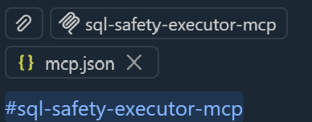
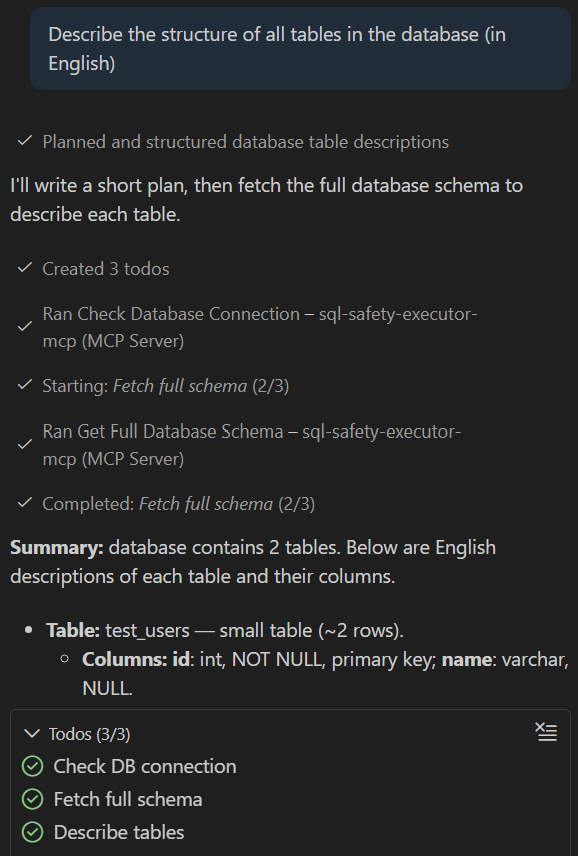
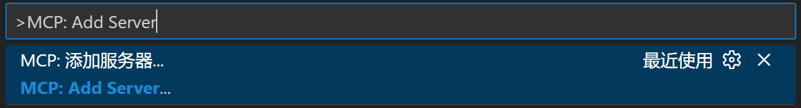
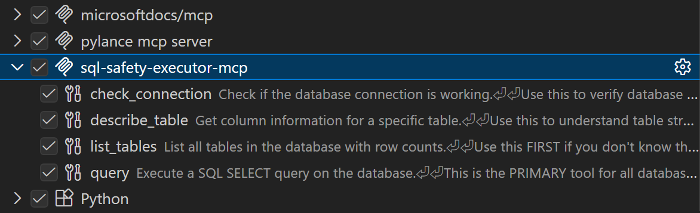
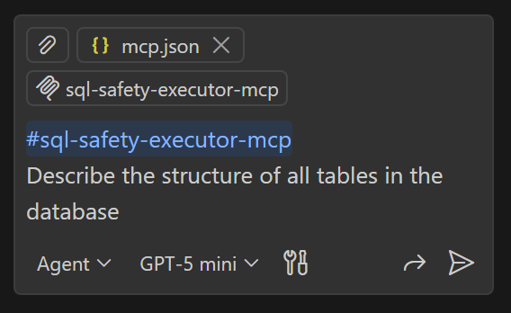
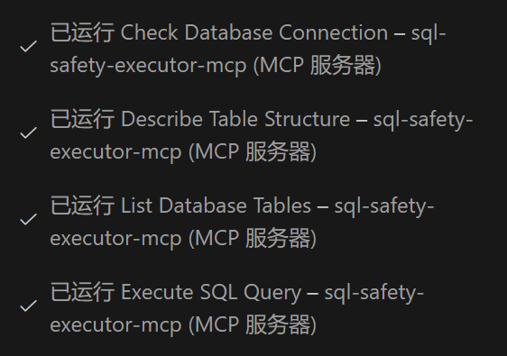

# LLM Database Safety Gateway - MCP Service Implementation

English | [中文](README_ZH.md)
> [Introduction](#introduction) | 
> [Quick Start](#quick-start) | 
> [Best Practices](#best-practices) | 
> [Changelog](#changelog) | 
> [Exposed MCP Tools](#exposed-mcp-tools) | 
> [Other Documentation](#other-documentation)  
> [Roadmap](#roadmap) Next: (2026.1) Planned support for NoSQL and SQLite
> aka: SQL Safety Executor MCP for LLM

**A secure database access gateway for AI Agents: Empowering LLM (Agents) with database access capabilities.**  
Enables Large Language Models (LLMs) to safely execute database queries via standardized MCP interfaces using authenticated SQL.
Provides protections such as allowlists, timeouts, and result truncation. Mitigates operational risks while preventing token cost overruns.
In addition to MySQL and SQLite, it also supports NoSQL.
This project resolves the LLM database accessibility bottleneck. By coordinating with AI Agents, it expands the capability boundaries of LLMs and extends the application scope of large models in real-world business scenarios.


## Problem Statement

### Original Challenges
Traditional LLM-database integration faces the following limitations:
- **Security Risks**: LLM-generated SQL may contain dangerous operations (DELETE/UPDATE/DROP).
- **Token Explosion**: Large table queries returning massive amounts of data, leading to context overflow and uncontrolled costs.
- **Tight Coupling**: Database logic intertwined with LLM prompts and orchestration code, making maintenance and reuse difficult.
- **Query Quality**: Without table structure information, LLMs are prone to generating invalid or inefficient SQL.
- **Scalability**: Inability to guarantee personalized database connections and security configurations needed for each LLM instance.

### Design Goals
- Enable safe SQL query execution for AI models (SELECT/SHOW/DESCRIBE/EXPLAIN only).
- Prevent Token Explosion: Result truncation (`MAX_RESULT_ROWS`) + Table count limits (`MAX_OVERVIEW_TABLES`).
- Provide a standardized MCP interface across different AI platforms.
- Support ReAct Pattern: Provide table structure information for LLM decision-making.
- Configurable Security Policies: Allowlists, timeouts, UNION control.

## Solution

### Service Architecture

This project implements a standard MCP (Model Context Protocol) service to provide secure database access for LLMs:

```
┌─────────────────────────────────────────────────────────────────┐
│                        MCP Client                               │
│         (VS Code Copilot / Claude Desktop / Gemini CLI)         │
└─────────────────────────┬───────────────────────────────────────┘
                          │ MCP Protocol (stdio)
                          ▼
┌─────────────────────────────────────────────────────────────────┐
│                   sql-safety-executor (MCP Server)              │
│  ┌────────────────────────────────────────────────────────────┐ │
│  │ Tool Layer:   query | list_tables | describe_table | ...   │ │
│  ├────────────────────────────────────────────────────────────┤ │
│  │ Safety Layer: SQL Valid. | Allowlist | Truncation | Timeout│ │
│  └────────────────────────────────────────────────────────────┘ │
└─────────────────────────┬───────────────────────────────────────┘
                          │ SQLAlchemy (Connection Pool)
                          ▼
┌─────────────────────────────────────────────────────────────────┐
│                           Database                              │
└─────────────────────────────────────────────────────────────────┘
```

### Core Design

**1. Security Validation**: Only allows SELECT/SHOW/DESCRIBE/EXPLAIN, automatically intercepting dangerous statements.

**2. Token Protection**: Result truncation (`MAX_RESULT_ROWS`) + Table count limits (`MAX_OVERVIEW_TABLES`).

**3. Tool Design**:
- Adopts a Model-driven pattern, prioritizing decision rules over fixed workflows.
- Tools return context like `is_large`/`row_count` to enable LLM autonomy.
- Supports configuration-based policy/prompt injection (e.g., ALLOW_UNION, ALLOWED_TABLES, truncation thresholds), using shorter, more relevant guidance to reduce invalid tool calls.
- Error feedback optimized for LLMs: Clearly identifies failure reasons (security interception/table not allowed/syntax/timeout/truncation, etc.) and offers correction suggestions, reducing trial-and-error and invalid calls, while avoiding leakage of sensitive info (credentials, system table details, etc.).
- Adapted for ReAct Pattern: Thought → Action → Observation → Rethink.

**4. Typical Workflow**:
```
Structure Unknown: list_tables() → describe_table(target) → query(sql)
Structure Known: query(sql) directly
Large Table Scenario: Observe is_large=true → Use LIMIT or Aggregation
```

### Safety Features
- **Query Restrictions**: Only SELECT / SHOW / DESCRIBE / EXPLAIN allowed.
- **SQL Parsing Validation**: Comprehensive query analysis using `sqlparse`.
- **Connection Security**: Environment-based credential management.
- **Error Isolation**: Comprehensive exception handling and reporting tailored for LLMs.
- **Access Isolation**: Access boundaries controlled by the host/runtime environment.
- **Table Allowlist**: Configurable restrictions on accessible tables.
- **Result Truncation**: `MAX_RESULT_ROWS` / `MAX_RESULT_CHARS` to prevent Token overflow.
- **Query Timeout**: `QUERY_TIMEOUT_SECONDS` to prevent slow queries.
- **UNION Control**: Disabled by default, requires allowlist to enable.

### Key Components

| File | Responsibility |
|------|----------------|
| `mcp_sql_server.py` | MCP tool definition, security validation, result processing |
| `sql_safety_checker.py` | SQL statement parsing and security checking |
| `start_server.py` | Service startup, environment verification |

## Design Principles
### Motivation: LLM-Driven Information Retrieval
The philosophy of this project originated in early 2025, partially influenced by GraphQL. Initially, the plan was for LLMs or Agents to serve as a frontend entry point, fetching information from the backend through explicit semantics.
In reality, SQL itself is an excellent carrier for query information. Rather than passing GraphQL, it is better to pass SQL directly. Especially since current mainstream LLMs (as of late 2025) can generate common SQL quite stably without additional fine-tuning.
However, three key issues need to be considered:
1. Potential SQL Injection.
2. The uncertainty of LLMs themselves: The safety of generated SQL.
3. The accuracy, quality, and efficiency of the generated SQL queries.

**Regarding Issue 1:**
This scenario is not actually "frontend directly passing SQL to backend for use". LLMs (Agents) here are more like programs running server-side on the server. All SQL is generated in a controllable server environment, communicating with other backend services via stdio mode (or via HTTP in a secure intranet environment). Agents in this scenario are programs with constrained input/output, interfacing with the frontend (external users) only via Prompts. As of late 2025, preventing Prompt Injection is a widespread and mature practice, and Agent authors can easily use various methods to avoid external Prompt Injection.

**Regarding Issue 2:**
LLM generation is uncertain. Even with a very low probability, this can lead to generated SQL safety not being guaranteed. A SQL safety check tool is needed to inspect and filter generated SQL.

**Regarding Issue 3:**
LLMs (Agents) cannot generate SQL out of thin air; they need a certain context foundation. This context can be natural language prompts or database documentation, but more importantly, database structure, query examples, and the data itself. For high-quality queries, as things stand (end of 2025), a ReAct approach should be adopted: a cycle of Thought --> Action --> Observation --> Rethink to decide the next action.

**In summary, this project is the solution to Issue 2 and Issue 3.**

### Project Trajectory
Early on, the goal was to write a simple SQL safety check tool to inspect and filter SQL statements before execution, to be called (FunctionCall) by LLMs (Agents).

- Later, [in version (v1.0)](LLM_TO_MCP_FEASIBILITY_ANALYSIS.md), the solution was refactored to add support for the standardized MCP service architecture. Decoupling was also performed to simplify maintenance while enhancing security and scalability.

- [In version (v2.0)](REFACTORING_LOG.md), optimizations for query efficiency and call risks were made for actual MCP usage scenarios.
  1. Optimized tool call efficiency by merging tools and adding new commonly used tools to reduce the number of tool calls.
  2. Focused on specific optimizations for Token Explosion risks in real-world usage (which can lead to massive LLM API costs).
  3. Added [examples of multi-Agent calls to this MCP service](README.md#autogen-multi-agent-example), based on the AutoGen framework, to demonstrate the combination of Agents and this service.

- [In version (v2.1)](REFACTORING_LOG.md#latest-update-january-4-2026---tool-optimization--field-naming), the focus was on improving tool design and output consistency. Many tools were optimized and refactored to adhere as closely as possible to industry best practices. The overall design adopts the ReAct paradigm (Thought --> Action --> Observation --> Rethink) loop. This improves query accuracy and multi-step query quality while ensuring query efficiency. The AutoGen-based multi-agent example was also updated synchronously.

Through these iterations, this project evolved from an initial concept of an LLM/Agent-based user interface to an MCP-supported comprehensive SQL query service. It is worth acknowledging that although the starting point was different, the current project actually shares similarities with current Text2SQL solutions.
In the early conception of this project (March-April 2025), such systems were relatively rare. At that time, similar Text2SQL practices were mainly stuck in the context of receiving prompts from relevant personnel and the LLM generating SQL statements once to assist their queries. Ideally, the core motivation of this project is **to enable LLMs (Agents) to replace traditional frontends and become the new "frontend", capable of dynamic interaction with users regarding both the data in the interface and the interface itself.** Making the entire system fully flexible and dynamic.
For now, **the core idea of this project is to empower LLMs (Agents) with the ability to enter the database.** Combined with different Agents, different work scenarios can be developed and extended.

### Roadmap
**Agent Skills and Extensibility**
In the future, we plan to introduce support for Agent Skills.
We also plan to improve the extensibility of this project. In existing practices, we realize the significance of providing (encapsulated) specific semantic tools. The industry also has corresponding best practice discussions:
> "Offload the burden from the model and use code where possible."  
> "Don't make the model fill arguments you already know."  
> "Combine functions that are always called in sequence."
> [— OpenAI, "Best practices for defining functions" (December 2025)](https://platform.openai.com/docs/guides/function-calling#best-practices-for-defining-functions)

This indicates that in reasonable cases, a practical system should include and support adding extra tools tailored for specific scenarios. However, too many tools consume more context, reduce accuracy, and increase costs[1]. Progressive disclosure[2] of Agent Skills can avoid these issues.
Therefore, we can envision a scheme where users or developers can write a large number of "plugins" (code snippets/tools) dependent on this MCP service, managed via SKILL.md, allowing for dynamic addition and configuration of tools. Agents can then load these "plugins" to flexibly extend their capabilities.

> [1]: ["Keep the number of functions small for higher accuracy."](https://platform.openai.com/docs/guides/function-calling)  
> [2]: ["This filesystem-based architecture enables progressive disclosure: Claude loads information in stages as needed, rather than consuming context upfront."](https://platform.claude.com/docs/en/agents-and-tools/agent-skills/overview#how-skills-work)

**Support for Multiple Database Types (SQLite, NoSQL, etc.)**  
**Manually Defined Methods for Database Write Processes**  
**Refined Permission Management Based on MCP Protocol**  

### Experience with AI-Assisted Development (Copilot, Vibe-Coding)
This project was originally created by Gemini CLI and primarily developed using GitHub Copilot after v1.0.
When using AI to assist in developing this project, the following experiences were generally followed:
1. Follow best practices on the web and GitHub as much as possible, such as those from Anthropic, Google, FastMCP, and Microsoft. Avoid hallucinations and local optima.
2. Make the AI reflect on its own output as much as possible.
3. Under the premise of satisfying 1 and 2, minimize constraints on the AI. Use the simplest prompts and steps to complete tasks, and let the AI complete the full workflow.
> Keep context as full and complete as possible; keep prompts and constraints to a minimum.

This is why although the original GEMINI.md is retained, it is only for record-keeping, and AGENTS.md was not added. However, SKILL.md or similar "progressive" documentation is good practice. The project's related documents [REFACTORING_LOG.md](REFACTORING_LOG.md) and [PROMPT_ENGINEERING_BEST_PRACTICES.md](PROMPT_ENGINEERING_BEST_PRACTICES.md) reflect this practice.

### Risks and Limitations
In the practice of writing this project, a large amount of AI-assisted development was used. Although code reviews and tests have been conducted as much as possible, and a series of security settings have been added, due to the scope and experimental nature of the project, it cannot cover all situations, especially considering the involvement of LLMs.
**Therefore, do not directly connect to a production environment or pair with an Agent without testing. This may lead to unexpected consequences!**
Rashly connecting an untested Agent may lead to **instability, infinite loops, Token explosion, massive queries**, or other unverified negative effects.
In recent updates, multiple efficiency optimizations have been carried out for this project, mainly focusing on reducing unnecessary tool call counts and increasing speed. Certain tests have been performed. However, due to the randomness of LLMs (Agents), unnecessary tool calls may still occur in actual use, although the probability is small.
**Currently only supports MySQL** (but plan to provide support for more databases such as SQLite and NoSQL in the future).

### Known Issues and Limitations
- **Row count fields may be imprecise**: `list_tables()` / `describe_table()` / `get_full_schema()` return `row_count` from `INFORMATION_SCHEMA.TABLES.TABLE_ROWS` by default, which is a statistical estimate (especially for InnoDB, which may have significant deviation or lag). It is only recommended for "order of magnitude judgment/whether to add LIMIT/whether it is a large table" strategies and should not be used as an precise count.
  - If an exact count is needed, please use `SELECT COUNT(*) ...`, or enable `ENABLE_TABLE_SUMMARY=1` and use `get_table_summary(exact_count=True)` (note that large tables may be slow).

- **Result truncation to avoid Token explosion**: `query()`, `list_tables()`, `get_full_schema()` will truncate output based on `MAX_RESULT_ROWS` / `MAX_RESULT_CHARS` / `MAX_OVERVIEW_TABLES` / `MAX_SCHEMA_TABLES`; therefore, "returned data/tables/columns" may not be the full set. When the full set is needed, please explicitly use smaller scope queries (add `LIMIT`, pagination by condition), or adjust relevant environment variables (at your own risk).

- **Some "Total" fields have "Visible Range" semantics**: For example, `total_tables` in tool output represents "the number of visible tables after allowlist parameter filtering (and considering truncation)", which is not necessarily equal to the actual total number of tables in the database; please avoid misinterpreting it as "whole database statistics".

### Best Practices
- **Recommend trying with VS Code's GitHub Copilot first.** GitHub Copilot in VS Code is a mature AI Agent tool. You can choose a free model (e.g., GPT-4o mini) to use in a test database, which offers higher security and avoids extra AI request costs.
- **Another benefit of using GitHub Copilot is:** It allows empowering Copilot, this auxiliary coding AI, with the ability to enter the database, making it understand the structure and data distribution of the target database. This provides better development assistance and suggestions when writing programs.
- **(Taking GitHub Copilot as an example) When using it, you can add a reminder in the prompt like "To ensure the data and reasoning are accurate and sufficient, you need to query step by step, multiple times."** This guides the AI to perform multiple steps of refinement, similar to a ReAct pattern query, for better results. This is especially useful when solving complex problems.
- **(Taking GitHub Copilot as an example) Explicitly attach the "#sql-safety-executor-mcp" tool when using it, which reminds the AI to prioritize using this tool.** 
- **(Taking GitHub Copilot as an example) Make good use of the "todo" tool provided by the Agent**, which helps the AI plan query steps, improving performance and efficiency. 
- In recent modifications (as of Jan 7, 2026), multiple security optimizations have been made, such as truncation for large data volumes, use of special keywords (like union), table allowlist settings, and dynamic prompts for different configurations. However, **higher security means lower performance/efficiency and higher consumption (e.g., more request parameters and Token consumption), so please configure security settings as appropriate.**
- Actually, AI clients like Claude Code, Codex, and Gemini CLI are similar to GitHub Copilot, but **be aware that AI calls may generate significant Token costs.** And current tests (including capability tests) are mainly completed on GitHub Copilot.

## Quick Start

### Quickly Call MCP Service using VS Code

By configuring `mcp.json` in VS Code for quick integration, you can directly call the SQL tools of this project in GitHub Copilot Chat. This empowers GitHub Copilot Chat with database-oriented capabilities. [Of course, it can also be used in other MCP-supported AI assistants.](README.md#configuring-mcp-client)

#### 1. Preparation
*   Ensure VS Code is the latest version.
*   Install the **GitHub Copilot Chat** extension.
*   Ensure project dependencies are installed (run `pip install -r requirements.txt` in the project path).
*   Configure the environment `cp .env.example .env` and edit .env with your database credentials [Configure environment variables in .env](README.md#configuration).

#### 2. Create Configuration File
Create a new folder `.vscode` in the project root directory (create if it doesn't exist), and create a file `mcp.json` inside it.

#### 3. Fill in Configuration (Critical Step)
Copy the following content into `mcp.json` (if `mcp.json` already exists, append the configuration to it; VS Code respects `mcp.json` for MCP Server recognition). **Be sure to modify it to your actual absolute path**:

```json
{
  "mcpServers": {
    "sql-safety-executor-mcp": {
      "type": "stdio",
      "command": "/absolute/path/to/python", 
      "args": ["/absolute/path/to/start_server.py"],
      "cwd": "/absolute/path/to/project_root"
    }
  }
}
```

**Configuration Details:**
*   `command`: **Must** point to the absolute path of the Python interpreter in the virtual environment (e.g., `.venv/bin/python`), do not use system `python` directly.
*   `args`: Point to the absolute path of `start_server.py`.
*   `cwd`: The absolute path of the project root directory, ensuring `.env` file can be read.

**You can also configure via VS Code GUI: (Recommended)**

1. Complete "1. Preparation".
2. Open VS Code Command Palette (`Ctrl+Shift+P` / `Cmd+Shift+P`).
3. Type and select `MCP: Add Server`. 
4. Add the above content step by step following the guide (please modify according to actual path):

Basically, both methods achieve the same goal; they generate the `mcp.json` file in the same location. In any case, you just need to ensure `.vscode/mcp.json` has the above configuration.

#### 4. Verification and Usage
1.  Restart VS Code, or use the Command Palette to reload the window.
2.  Open GitHub Copilot Chat, ensure it is in Plan or Agent mode.
3.  Click the **Tool Icon** next to the model selection box below the input field.
4.  You should be able to see `sql-safety-executor` and its provided tools (e.g., `query`, `list_tables`). Ensure they are all checked. 
5.  Send a question directly in the conversation: "List all tables" or "Query the first 5 rows of the users table". 
You can see the MCP tool being called 
Note: Although tool usage has been optimized, it is still recommended to use free models (e.g., GPT-4o mini) in GitHub Copilot Chat to avoid extra request consumption.

#### Common Issues
*   **Cannot find tools?** Check the `Output` panel, switch to "GitHub Copilot" to see if there are errors.
*   **Path Error**: Windows users please note backslash escaping in JSON (e.g., `C:\\Users\\...`).

### MCP Service Usage
```bash
# Install dependencies including MCP support
pip install -r requirements.txt

# Configure environment
cp .env.example .env
# Edit .env with your database credentials

# Start MCP Server
python start_server.py

# Test MCP capabilities (internal functions)
python test_mcp_functions.py

# Test MCP Server via client (simulates a real MCP client)
python test_mcp_client.py
```

### AutoGen Multi-Agent Example
```bash
# Run AutoGen Multi-Agent SQL Query System
# Requires: GEMINI_API_KEY, OPENAI_API_KEY, or USE_OLLAMA=true
python autogen_sql_agent.py

# Or run with a specific task
python autogen_sql_agent.py "List all tables and describe their structure"
```

`autogen_sql_agent.py` demonstrates how to use a multi-Agent team (PlanningAgent, SQLExecutorAgent, AnalystAgent) from the Microsoft AutoGen framework to interact with the MCP server.

### Configuring MCP Client
Add the server to your MCP-compatible client configuration (e.g., VS Code, Claude Desktop, or other MCP clients):

```json
{
  "mcpServers": {
    "sql-safety-executor-mcp": {
      "type": "stdio",
      "command": "python",
      "args": ["start_server.py"],
      "cwd": "/path/to/llm-sql-safety-executor-mcp"
    }
  }
}
```

- Replace `/path/to/` with your actual project path.
- The server loads credentials from the `.env` file in the working directory.
- For virtual environments, use the full path to the Python interpreter.

## Configuration (Located in .env file. Copy .env.example to .env to configure)

### Required Environment Variables
```bash
DB_USER=your_database_user
DB_PASSWORD=your_database_password
DB_HOST=your_database_host
DB_NAME=your_database_name
```

### Optional Environment Variables
```bash
# Feature Switches (1=Enabled, 0=Disabled)
ENABLE_SCHEMA_TOOLS=1    # Controls sample() tool
ENABLE_TABLE_SUMMARY=0   # Controls get_table_summary() tool (Default: Disabled)
                         # describe_table() already provides estimated row counts

# Large Table Threshold, used for is_large flag and query suggestions
# Tables exceeding this row count will trigger LIMIT/Aggregation hints
LARGE_TABLE_THRESHOLD=1000

# Security Configuration (Recommended for Production)
QUERY_TIMEOUT_SECONDS=30   # Query timeout in seconds (P0 Safety)
CONNECT_TIMEOUT_SECONDS=10 # Connection timeout in seconds

# Table Allowlist (Comma separated, case insensitive)
# Only allow access to specific tables - Leave empty to allow all
# Use "*" to explicitly allow all tables (UNION requires this setting)
ALLOWED_TABLES=products,orders,customers

# UNION Query Policy
# Important: UNION requires double configuration to enable:
#   1. ALLOW_UNION=1
#   2. ALLOWED_TABLES=table1,table2 OR ALLOWED_TABLES=*
# If ALLOW_UNION=1 but ALLOWED_TABLES is empty, UNION will still be blocked.
ALLOW_UNION=0

# Token Optimization: Limit result size to prevent context overflow
# Set to 0 to disable truncation (for data export scenarios)
MAX_RESULT_ROWS=100      # Max rows returned per query (0=unlimited)
MAX_RESULT_CHARS=16000   # Max characters in response (0=unlimited)
MAX_SCHEMA_TABLES=50     # Max tables returned by get_full_schema (0=unlimited)
MAX_OVERVIEW_TABLES=100  # Max tables returned by list_tables (0=unlimited)
```

### MCP Client Integration
For a complete client configuration example, please refer to `mcp_config.json`.

## Changelog

### v2.1 Tool Optimization (January 2026)

Focused on improvements in tool design and output consistency:

- **`get_table_summary` is now optional**: Disabled by default (`ENABLE_TABLE_SUMMARY=0`) as `describe_table()` already provides estimated row counts. Enable only when precise COUNT(*) is needed.
- **Enhanced `describe_table`**: Now returns `row_count`, `row_count_approximate`, `is_large` flag, and `recommendation` query suggestions.
- **Refactored `list_tables` output**:
  - `data` → `tables`, clearer.
  - Added `database_name`, `returned_table_count`, `total_tables`, `truncated`, `truncation_note`.
- **Consistent Field Naming**: `returned_table_count` vs `total_tables` standard applied to both `list_tables` and `get_full_schema`.
- **New Environment Variables**:
  - `ENABLE_TABLE_SUMMARY=0` - Controls `get_table_summary()` tool.
  - `LARGE_TABLE_THRESHOLD=1000` - Threshold for `is_large` flag.
  - `MAX_OVERVIEW_TABLES=100` - Max tables for `list_tables()`.
- **AutoGen Agent Prompt Update**: Removed `get_table_summary()` reference, updated workflow to `list_tables() → describe_table()` pattern.

For detailed changes, please refer to [REFACTORING_LOG.md](REFACTORING_LOG.md).

### v2.0 Refactoring (December 2025) - Current Branch: `feature/v2.0-mcp-server-refactoring`

Major improvements following FastMCP best practices:

- **Expanded SQL Support**: Now supports multiple read-only statement types
  - `SELECT`: Standard data retrieval
  - `SHOW`: Database metadata (SHOW TABLES, SHOW COLUMNS, etc.)
  - `DESCRIBE`: Table structure information
  - `EXPLAIN`: Query execution plan analysis
- **Tool Consolidation**: Reduced from 6 tools to 5, then expanded to 7 via new optimized tools
  - `validate_sql_query` + `execute_safe_sql` → Consolidated into `query` (Automatic Validation)
  - Added `list_tables` tool for database discovery
  - Renamed tools for clarity: `check_connection`, `describe_table`, `sample`
  - **New (Dec 23)**: Added `get_full_schema` and `get_table_summary` for Token optimization
- **Optimized Server Instructions**: Reduced "exploratory behavior" (unnecessary tool calls) from LLMs
  - Explicit tool priority: `query` first, others only on error
  - Expected reduction: From 4-5 tool calls per query to 1-2 calls
- **Security Enhancements (Dec 23, 2025)**:
  - Query timeout protection (P0 Safety)
  - Table Allowlist support (`ALLOWED_TABLES`)
  - Configurable UNION policy (`ALLOW_UNION`)
  - Result truncation to prevent Token overflow
- **Code Quality**: Reduced code by ~40% (approx 460 → 280 rows) while maintaining functionality
- **Enhanced Metadata**: Added `ToolAnnotations` to improve LLM tool selection
- **Lifecycle Management**: Correct asynchronous resource lifecycle (FastMCP Best Practice)
- **SQL Injection Protection**: Identifier validation for dynamic table names

For detailed changes, please refer to [REFACTORING_LOG.md](REFACTORING_LOG.md).

### v1.0 - MCP Service Architecture

This project has transitioned from direct function calls to a standardized MCP service architecture, providing:

- Service-Oriented Architecture: Converted direct LLM function calls into an independent MCP server.
- Standardized Protocol: Implemented MCP tools for consistent AI model integration.
- Enhanced Separation of Concerns: Separated server startup logic into dedicated `start_server.py`.
- Improved Scalability: Single server instance supports multiple concurrent LLM clients.
- Better Security: Service isolation and controlled access via MCP protocol.

## Exposed MCP Tools

The service exposes 5-7 standardized MCP tools (depending on configuration):

### 1. `query` (Primary Tool)
Usage: Execute read-only SQL queries with automatic security validation.

This is the main tool for all database operations. Security validation is automatic - only authenticated statements (SELECT, SHOW, DESCRIBE, EXPLAIN) are permitted.

Input:
```json
{
  "sql": "SELECT COUNT(*) as total FROM products"
}
```

Output:
```json
{
  "success": true,
  "query": "SELECT COUNT(*) as total FROM products",
  "data": [
    {"total": 150}
  ],
  "row_count": 1
}
```

### 2. `check_connection`
Usage: Test database connection and configuration.

Output:
```json
{
  "connected": true,
  "message": "Database connection successful"
}
```

### 3. `list_tables`
Usage: Database Overview - List all tables and their estimated row counts.

Lightweight initial exploration tool. Row counts are INFORMATION_SCHEMA estimates (InnoDB may have ±40% error).

Output:
```json
{
  "success": true,
  "database_name": "mydb",
  "returned_table_count": 2,
  "total_tables": 2,
  "tables": [
    {"table_name": "users", "row_count": 150},
    {"table_name": "products", "row_count": 500}
  ],
  "row_count_approximate": true,
  "truncated": false,
  "truncation_note": null,
  "hint": "Row counts are estimates (InnoDB ±40%). total_tables = visible after allowlist."
}
```

### 4. `describe_table`
Usage: Get Table Structure - Column info, estimated row count, and query suggestions.

Returns column details and estimated row counts from INFORMATION_SCHEMA (avoids COUNT(*) full table scans). Includes `is_large` flag for query planning.

Input:
```json
{
  "table_name": "users"
}
```

Output:
```json
{
  "success": true,
  "table_name": "users",
  "row_count": 1500,
  "row_count_approximate": true,
  "column_count": 5,
  "columns": [
    {"column_name": "id", "data_type": "int", "nullable": "NO", "key_type": "PRI"},
    {"column_name": "name", "data_type": "varchar", "nullable": "YES", "key_type": ""}
  ],
  "is_large": true,
  "recommendation": "Large table (~1500 rows). Use LIMIT or aggregation (COUNT/GROUP BY)."
}
```

### 5. `sample` (Optional)
Usage: Retrieve sample data from a specified table.

**Note**: This tool is controlled by `ENABLE_SCHEMA_TOOLS` environment variable (Default: Enabled)

Input:
```json
{
  "table_name": "users",
  "limit": 5
}
```

Output:
```json
{
  "success": true,
  "table_name": "users",
  "data": [
    {"id": 1, "name": "Alice"},
    {"id": 2, "name": "Bob"}
  ],
  "row_count": 2,
  "query": "SELECT * FROM `users` LIMIT 5"
}
```

### 6. `get_full_schema`
Usage: Fetch complete database schema (all tables and columns) in a single call.

Suitable for multi-table JOIN or scenarios requiring all table structures at once. For single table queries, `describe_table()` is recommended.

Output:
```json
{
  "success": true,
  "schema": {
    "users": {
      "row_count": 150,
      "columns": [
        {"name": "id", "type": "int", "nullable": "NO", "key": "PRI"},
        {"name": "name", "type": "varchar", "nullable": "YES", "key": ""}
      ]
    }
  },
  "returned_table_count": 1,
  "total_tables": 1,
  "total_columns": 2,
  "row_count_approximate": true,
  "truncated": false,
  "truncation_note": null,
  "hint": "Row counts are estimates (InnoDB ±40%). Use LIMIT for large tables (row_count > 1000). total_tables = visible after allowlist."
}
```

### 7. `get_table_summary` (Optional)
Usage: Get table statistics, supports optional exact row count calculation.

**Note**: This tool is controlled by `ENABLE_TABLE_SUMMARY` environment variable (Default: **Disabled**). `describe_table()` tool already provides estimated row counts, so this tool is needed only when precise counting is required.

**Warning**: `exact_count=True` will run COUNT(*), which may be slow on large InnoDB tables (full table scan).

Input:
```json
{
  "table_name": "users",
  "exact_count": false
}
```

Output:
```json
{
  "success": true,
  "table_name": "users",
  "row_count": 150,
  "row_count_approximate": true,
  "column_count": 5,
  "columns": [...],
  "is_large": true,
  "recommendation": "Large table (~150 rows). Use LIMIT or aggregation (COUNT/GROUP BY)."
}
```


## Requirements

- Python 3.12+
- MySQL Database
- Dependencies: `sqlparse`, `SQLAlchemy`, `PyMySQL`, `fastMCP`, `python-dotenv`

## Testing

### Test Scripts

The project includes two complementary test scripts:

#### 1. `test_mcp_functions.py` - Internal Function Test
Tests underlying functions directly, without passing through the MCP protocol:
```bash
python test_mcp_functions.py
```

This script verifies:
- SQL validation logic (safe and unsafe queries)
- Database connection
- Query execution
- Schema introspection (if enabled)
- Sample data retrieval (if enabled)

#### 2. `test_mcp_client.py` - MCP Protocol Test
Tests the server via MCP protocol using FastMCP Client:
```bash
python test_mcp_client.py
```

This script:
- Connects to MCP Server using FastMCP `Client` API
- Tests server info and database connection
- Executes multiple SQL queries (list tables, SELECT, COUNT)
- Tests optional schema tools (if enabled)
- Verifies data serialization format

## Other Documentation

- [Feasibility Analysis](LLM_TO_MCP_FEASIBILITY_ANALYSIS.md): Detailed analysis of LLM to MCP conversion
- [Original Context](GEMINI.md): Project background and development guide
- [Refactoring Log](REFACTORING_LOG.md): Dec 2025 Refactoring change documentation
- [MCP Client Test Guide](TEST_MCP_CLIENT_GUIDE.md): Guide for testing MCP Server via client
- [Prompt Engineering Best Practices](PROMPT_ENGINEERING_BEST_PRACTICES.md): Guide for MCP tool descriptions and prompts

## Contribution

1. Fork the repository
2. Create a feature branch (`git checkout -b feature/amazing-feature`)
3. make changes and conduct appropriate testing
4. Add tests for new features
5. Update documentation as needed
6. Submit a Pull Request

## Support

For technical issues, feature requests, or questions:
- Create an issue in the GitHub repository
- Include relevant error messages and configuration details
- Provide steps to reproduce the issue

---
