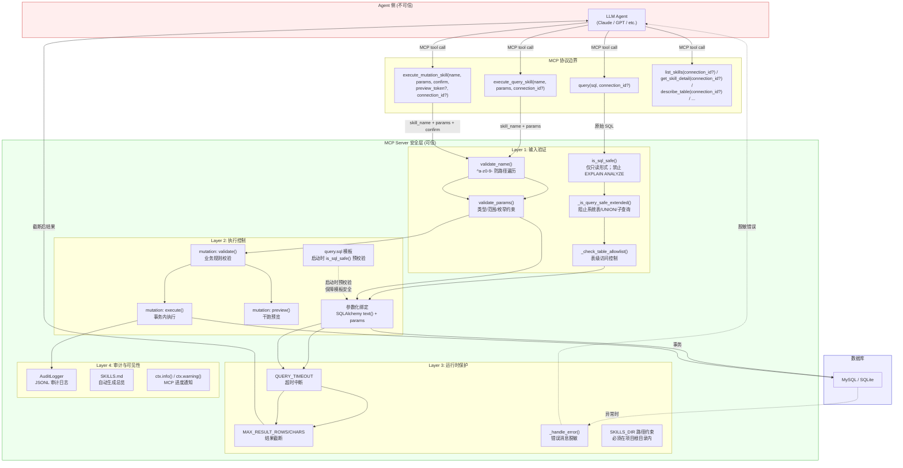
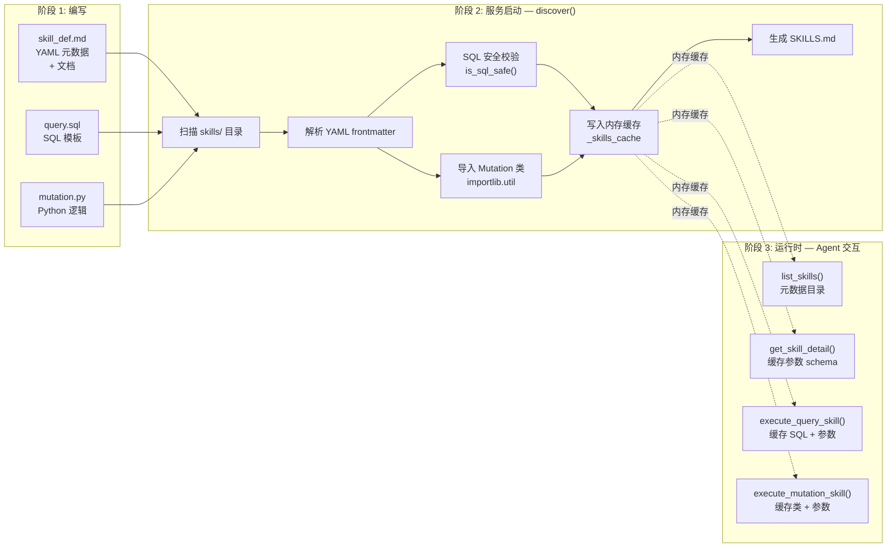
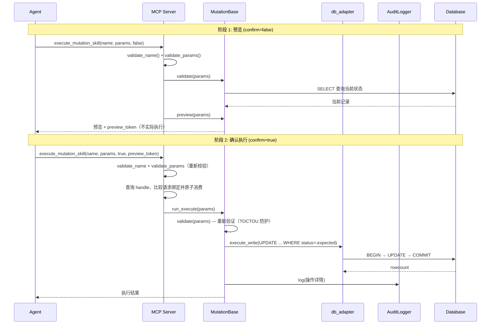

# 面向 AI Agent 的数据库安全访问入口 - MCP 服务


[English](README.md) | 中文  
> [介绍](#介绍) | 
> [快速开始](#快速开始) | 
> [配置](#配置) |
> [使用本项目的最佳实践](#使用本项目的最佳实践) | 
> [更新日志](#更新日志) | 
> [公开的 MCP 工具](#公开的-mcp-工具) | 
> [使用此 MCP 服务的 AutoGen 多智能体示例](#autogen-多-agent-示例) | 
> [本项目的其它文档](#本项目的其它文档)  
> [项目路线图](#项目路线图) · **v3.0 新功能:** 增加 Skills 扩展层支持  

## 介绍

**面向 AI Agent 的数据库安全访问入口：赋予LLM(Agents)进入数据库的能力。**  
- 使大模型 (LLM) 通过标准化的 MCP 接口，以经过认证的 SQL 安全获取数据库查询。并提供白名单、超时与结果截断等防护。降低误操作风险同时避免 Token 成本失控。  
- 除 MySQL、SQLite 外，NoSQL 支持计划在未来版本中提供。(in progress)
- 另外，本项目还支持基于 Agent Skills 的服务侧插件式动作扩展。用户或开发者可以编写可复用的预定义参数化操作（查询与受控写入）扩展能力，并通过 `skill_def.md` 统一管理。Agent 可按需发现并调用，以扩展复杂查询、敏感变更和特定业务流程的处理能力。  

本项目解决了 LLM “进入数据库”的需求。并可通过与 AI Agent 的配合，扩展 LLM 的能力边界，延伸大模型在实际业务中的应用范围。

## 问题陈述

### 原始挑战
传统的 LLM-数据库集成面临以下限制：
- **安全风险**：LLM 生成的 SQL 可能包含危险操作（DELETE/UPDATE/DROP）
- **Token 爆炸**：大表查询返回海量数据，导致上下文溢出和费用失控
- **紧耦合**：数据库逻辑与 LLM 提示词和编排代码交织，难以维护和复用
- **查询质量**：LLM 缺乏表结构信息时，易生成无效或低效 SQL
- **可扩展性**：无法保证每个 LLM 实例所需的个性化数据库连接和安全配置

### 设计目标
- 为 AI 模型提供保守过滤的查询执行（MCP policy 每次只接受一条 `SELECT`、
  `DESCRIBE` 或非 ANALYZE `EXPLAIN`；schema discovery 使用专用工具，不接受
  raw `SHOW`）
- 防止 Token 爆炸：结果截断、表数限制
- 提供跨不同 AI 平台的标准化 MCP 接口
- 支持 ReAct 模式：提供表结构信息供 LLM 决策
- 可配置的安全策略：白名单、超时、UNION 控制
- 可扩展的动作能力：通过 skills 支持复杂/敏感变更场景的操作扩展

## 解决方案

### 服务架构

本项目实现标准化的 MCP（Model Context Protocol）服务，为 LLM 提供安全的数据库访问：

```
┌─────────────────────────────────────────────────────────────────┐
│                        MCP 客户端                                │
│         (VS Code Copilot / Claude Desktop / Gemini CLI)         │
└─────────────────────────┬───────────────────────────────────────┘
                          │ MCP Protocol (stdio)
                          ▼
┌─────────────────────────────────────────────────────────────────┐
│                   sql-safety-executor (MCP Server)              │
│  ┌────────────────────────────────────────────────────────────┐ │
│  │ 工具层:   query | list_tables | describe_table | ...       │ │
│  ├────────────────────────────────────────────────────────────┤ │
│  │ Skills 层 (可选):  list_skills | get_skill_detail          │ │
│  │                   | execute_query/mutation                 │ │
│  │    skill_def.md → 参数校验 → 预制 SQL/Mutation → 审计日志   │ │
│  ├────────────────────────────────────────────────────────────┤ │
│  │ 安全层:     SQL 验证 | 表白名单 | 结果截断 | 查询超时         │ │
│  └────────────────────────────────────────────────────────────┘ │
└─────────────────────────┬───────────────────────────────────────┘
                          │ SQLAlchemy (连接池)
                          ▼
┌─────────────────────────────────────────────────────────────────┐
│                           Database                              │
└─────────────────────────────────────────────────────────────────┘
```

### 核心设计

**1. 安全性检验**：当前 MySQL/SQLite adapter 的 MCP policy 每次只接受一条
SELECT/DESCRIBE 或非 ANALYZE EXPLAIN，拒绝 raw SHOW、写 DML、嵌套写 DML 的
CTE 文本、会执行底层语句的 `EXPLAIN ANALYZE`，以及服务端语义不同于通用注释
剥离的 MySQL comment 形式。这是保守 gate，不是面向任意
SQL 方言的全面语义分析。

**2. Token 保护**：结果截断（`MAX_RESULT_ROWS`）+ 表数限制（`MAX_OVERVIEW_TABLES`）

**3. 工具设计**：
- 采用 Model-driven 模式，优先提供决策规则而非固定流程
- 工具返回 `is_large`/`row_count` 等上下文，供 LLM 自主决策
- MCP `ToolAnnotations` 包含只读/破坏性/幂等提示，并统一设置 `openWorldHint=false`，表示工具工作在当前配置的数据库边界内，而不是任意外部系统
- Skills 执行工具返回结构化业务 payload，并通过 `ToolResult.meta` 附加运行时
  元数据（如耗时、行数、截断状态、Skill 版本），用于调试和可观测性
- 支持基于配置的策略/提示注入（如 ALLOW_UNION、ALLOWED_TABLES、截断阈值），用更短、更相关的指导减少无效工具调用
- 错误反馈面向 LLM 优化：明确失败原因（安全拦截/表未允许/语法/超时/截断等）并给出修正建议，减少反复试错与无效调用，同时避免泄露敏感信息（凭据、系统表细节等）
- 适配 ReAct 模式：推理 → 行动 → 观察 → 再思考

**4. Skills 扩展层**（可选，`ENABLE_SKILLS=1` 启用）：
- 预定义参数化操作：将复杂查询和敏感写入封装为可复用的 skill，Agent 只需传参数，无需自行编写 SQL
- 服务端强制约束：启动时 SQL 安全校验 + 参数强类型验证（type/min/max/enum）+ 写操作 best-effort 审计状态
- 两阶段写协议：mutation skill 需经 preview（`confirm=false`）→ 携带返回的 `preview_token` execute（`confirm=true`），用于绑定已预览的请求/状态并拒绝 replay 或 preview/execute 漂移。只有可信客户端真正展示 preview 并收集批准时才构成人工批准；参见 v3.7 host 示例。
- 事务结论（v3.7.2）：两个内置单语句 mutation 在 COMMIT 前强制
  `expected_rowcount=1`。结构化结果把工具处理 `success` 与
  `execution_outcome`（`not_executed`、`rolled_back`、`committed`、
  `unknown`）分开；宿主不得自动重试结果不确定的 execute。只有保留下来的
  adapter COMMIT 证据才能产生 `committed`；普通自定义 Skill 成功保守返回
  `success=true, unknown`。
- 渐进式发现：Agent 可先用 `list_skills()` 搜索轻量目录；仅在已知 Skill 但
  参数仍未知时调用 `get_skill_detail(detail_level="execution")`；参数已知（包括
  `list_skills(..., detail_level="full")` 已返回）时直接执行。

**5. 典型工作流**：
```
结构未知：只需表名/规模 → list_tables()
         需要全局字段 → 直接 get_full_schema(detail_level="compact")
         仅看目标表 → describe_table(target) → query(sql)
结构已知：query(sql) 直接执行
大表场景：观察 is_large=true → 使用 LIMIT 或聚合
Skills 场景：未知 Skill → list_skills(search=..., detail_level="compact", connection_id=target)
             → 必要时 get_skill_detail(skill_name=..., connection_id=target, detail_level="execution")
             已知 Skill、未知参数 → get_skill_detail(skill_name=..., connection_id=target, detail_level="execution")
             参数已知 → execute_query_skill(name, params, connection_id=target)
             或 mutation preview → 用户批准 → 同一 params/connection_id + 返回的 preview_token
```

### 安全功能
- **查询限制**：当前 MySQL/SQLite adapter 的完整 MCP policy 每次只接受一条
  SELECT、DESCRIBE 或非 ANALYZE EXPLAIN。raw SHOW 会被拒绝，metadata discovery
  使用 `list_tables()`/`describe_table()`；嵌套写 DML、`EXPLAIN ANALYZE`、
  executable comment/hint 与非空白 `--` 形式也会被拒绝
- **SQL 解析验证**：通过 `sqlparse` 做语句类型 allowlist，并叠加 MCP 层扩展检查
- **连接安全**：基于环境的凭据管理。v3.5 新增配置化命名连接（`connection_id`），工具和模型输出不能传入任意 DSN。
- **错误隔离**：面向LLM的全面异常处理和报告
- **接入隔离**：由宿主/运行环境控制接入边界
- **表白名单**：可配置限制访问的表
- **数据库授权仍是权威边界**：SQL checker 是保守的 statement-shape/应用
  policy gate，不能证明每个外层 `SELECT` 都没有副作用。MySQL stored function
  与 `GET_LOCK()` 等函数可能产生外层语句类型看不出的效果。生产只读 alias
  应只获得对象级 `SELECT`，并撤销不必要的 `EXECUTE`、`FILE`、`PROCESS`、管理
  权限与跨 schema 权限；可行时应分离读写凭据。
- **结果截断**：`MAX_RESULT_ROWS` / `MAX_RESULT_CHARS` 防止 Token 溢出
- **超时控制**：`QUERY_TIMEOUT_SECONDS` 限制只读查询和 MySQL InnoDB mutation 行锁等待；不保证覆盖所有长时间 DML CPU/IO 执行
- **UNION 控制**：默认禁用，需配合白名单启用
#### Skills 相关
- **Skills 模板即白名单**：SQL 模板启动期校验只读形态并缓存，运行时再按目标连接 policy 复核；运行时零磁盘 I/O（防 TOCTOU）
- **Skills 参数强类型验证**：type/min/max/enum 约束 + 拒绝 schema 之外的参数（防 injection/hallucination）
- **Skills 双层开关**：`ENABLE_SKILLS` + `SKILLS_ALLOW_MUTATIONS` 最小权限控制
- **闭合世界工具提示**：MCP 工具统一设置 `openWorldHint=false`，表示工具只触达已配置的数据库连接/服务边界，不访问任意外部实体。该提示用于改善客户端展示和工具选择，不替代权限控制。**未来新增工具检查清单**：任何新工具如果会越过已配置数据库边界（外部 HTTP API、webhook、第三方服务、未配置 DB 调用等），**必须**显式设置 `openWorldHint=true` 并在 review 时核对此条；`tests/test_annotations_consistency.py` 通过显式 allowlist 提供 pytest/本地测试 guardrail。只有真正加入 CI workflow 后，才应把它描述为 CI enforcement。
- **Skills 运行元数据**：完整 profile 下注册的所有 MCP 工具（v3.5 起最多 12 个）均使用 `ToolResult` 包装结构化 payload，并通过 `meta` 暴露 `tool_name`、`db_type`、`connection_id`、`execution_ms`、`success` 等通用字段，以及 `row_count`、`total_rows`、`truncated`、`skill_version` 等工具特定计数。Mutation 结果还会镜像 `execution_outcome` 和结构化失败的 `error_code`。元数据有意不包含原始 SQL、返回数据行、参数值、DSN、凭据、host 或 SQLite 文件路径。
  - **原始 SQL 可见性策略**：原始 `query(sql)` 工具当前会在结构化 payload 中回显提交的 SQL，并可能为了透明排障写入 MCP context。不要在 SQL literal 中放 secret、token、凭据或敏感个人数据。重复且敏感的工作流优先使用经过 review 的 Skills、低敏谓词或数据库 view。
  - **作用范围（v3.5）**：`ToolResult.meta` 在基础工具（`query`、`check_connection`、`list_connections`、`list_tables`、`describe_table`、`get_full_schema`、`get_table_summary`、`sample`、`list_skills`、`get_skill_detail`）与 Skills 工具（`execute_query_skill`、`execute_mutation_skill`）之间保持一致。基础工具走共享的 `_tool_result(...)`，Skills 工具走 `_skill_tool_result(...)`。Python 直接调用方可统一通过 `result.structured_content` 读取 payload、`result.meta` 读取元数据。
  - **客户端可见性**：依据 MCP 规范，`_meta` 字段是**可选**的，客户端 *MAY* 忽略。实测：服务器中间件、MCP Inspector、显式读取 `_meta` 的客户端可以看到；VS Code 的 MCP UI 当前不展示。请把 `ToolResult.meta` 主要视为服务端可观测钩子和"愿意读 meta 的客户端"的可选信号，而**不能**假定它一定对终端用户可见。
  - **最小示例**（完整请求/响应见 [TEST_MCP_CLIENT_GUIDE.md](TEST_MCP_CLIENT_GUIDE.md)）：

    ```jsonc
    // execute_query_skill 响应
    {
      "structuredContent": { "success": true, "skill_name": "monthly-sales-report",
                              "data": [/* rows */], "row_count": 2, "total_rows": 2,
                              "truncated": false, "truncation_note": null },
      "_meta": { "tool_name": "execute_query_skill", "success": true,
          "skill_name": "monthly-sales-report", "skill_type": "query",
          "mode": "query", "execution_ms": 12.3, "row_count": 2,
                  "total_rows": 2, "truncated": false, "audit_logged": false,
                  "db_type": "mysql", "connection_id": "trade_analysis_mysql", "idempotent": true, "skill_version": "1.0.0" }
    }
    ```

  | 级别 | 配置 | `ENABLE_SKILLS` | `SKILLS_ALLOW_MUTATIONS` | 可用工具 | 权限层级 |
  |:---:|------|:---:|:---:|------|------|
  | L0 | 默认 | `0` | — | 基础工具（query, list_tables 等） | 仅只读查询 |
  | L1 | 启用 Skills | `1` | `0` | + list_skills, get_skill_detail, execute_query_skill | + 预定义只读 Skill |
  | L2 | 启用 Mutations | `1` | `1` | + execute_mutation_skill | + 受控写操作（两阶段 preview/execute gate） |

- **Skills 两阶段 Preview/Execute Gate**：写操作必须携带匹配的服务端 preview token；它阻止 replay/漂移，但没有可信客户端流程时不能证明人工批准
- **Skills 审计日志**：mutation preview/execute 路径会在服务端尝试 best-effort JSONL 审计，正常工具结果会报告 `audit_logged`

### 关键组件

| 文件 | 职责 |
|------|------|
| `mcp_sql_server.py` | MCP 工具定义、安全验证、结果处理 |
| `sql_safety_checker.py` | SQL 语句解析和安全检查 |
| `db_adapter.py` | 数据库适配器抽象层（MySQL/SQLite 支持） |
| `start_server.py` | 服务启动、环境验证 |
| `skills/_lib/skill_loader.py` | 技能发现、YAML 解析、参数校验 (v3.0) |
| `skills/_lib/mutation_base.py` | 写操作技能抽象基类 (v3.0) |
| `skills/_lib/audit.py` | 写操作 JSONL 审计日志 (v3.0) |

## 设计理念
### 启发：基于LLM/Agents的用户界面
本项目的理念最早起源于2025年初，部分受到GraphQL的影响。最初是计划由LLM或Agents作为前端入口，通过明确的语义向后端获取信息。  
实际上，SQL语句本身就是良好的查询信息载体。与其传递GraphQL，不如进一步直接传递SQL。尤其在目前主流的LLM几乎都可以在不经额外微调的情况下，已能较稳定的生成常用的SQL。  
但在此基础上，需要考虑三个关键问题：
1. 潜在的SQL注入
2. LLM本身的不确定性：生成SQL的安全性
3. 生成SQL的查询准确性、查询质量和查询效率

**关于问题1：**  
此场景并非“前端直接传递 SQL 给后端执行”。LLM（Agent）更接近运行在服务端的程序，SQL 在受控服务端环境中生成；Mutation 推荐使用 stdio。条件性私有 HTTP 使用必须遵守后文的单进程和信任边界，v3.6.1-v3.7 不定义多用户认证 HTTP mutation。Agent 的输入/输出仍需约束，但 prompt injection 防护只能补充、不能替代服务端 policy 与授权检查。
**关于问题2：**  
LLM的生成具有不确定性。即便有极小概率，这也会导致生成SQL的安全性无法得到保障。需要有SQL安全检查工具对生成的SQL进行检查和过滤。  
**关于问题3：**  
LLM(Agents)不能凭空生成SQL，需要有一定的上下文基础。这里的上下文可以是自然语言提示或数据库文档，但更重要的是数据库结构、查询示例以及数据本身。对于高质量的查询，就目前的情况来讲（截至2025年末），应当采用ReAct方案：即为推理 (Thought) --> 行动 (Action) --> 观察(Observation) --> 再思考决定下一步行动的循环。  
**总的来说，本项目是针对问题2和问题3的解决方案。**

### 项目演进
在早期，本项目的目标是编写一个简易的SQL安全检查工具，用于在执行前对SQL语句检查和过滤。作为方法供LLM(Agents)进行调用(FunctionCall)

- 之后，[在(v1.0)版本](LLM_TO_MCP_FEASIBILITY_ANALYSIS.md) 为了增加对标准化MCP服务架构的支持，对解决方案进行了重构。同时进行解耦，在增强安全性和可扩展性的同时简化维护。

- [在(v2.0)版本](REFACTORING_LOG.md) 针对实际的MCP使用场景，进行了查询效率和调用风险的优化。
  1. 通过工具合并以及增加新的常用工具，减少工具调用次数，优化工具调用效率。
  2. 聚焦于真实使用中的Token爆炸风险（这可能导致大量的LLM API费用支出）进行针对性优化。
  3. 同时新增了[多Agent调用该MCP服务的示例](#autogen-多-agent-示例)，基于AutoGen框架，用于示范Agents与本服务的结合。

- [在(v2.1)版本](REFACTORING_LOG.md#update-v21-january-4-2026---tool-optimization--field-naming) 专注于工具设计和输出一致性的改进。优化并重构了大量工具，尽可能地遵守业界相关的最佳实践。整体设计上，采用ReAct方案推理 (Thought) --> 行动 (Action) --> 观察(Observation) --> 再思考决定下一步行动的循环范式。在保证查询效率的同时提升查询准确性和多步骤查询的质量。基于AutoGen的多agent调用示例也同步更新。

经过上述迭代，本项目从最初基于LLM/Agents的用户界面设想，演进到支持MCP的SQL综合查询服务。但需要承认的是，当前的项目虽然出发点不同，但实际上与目前的Text2SQL有所相似。  
在本项目构思初期（2025年3-4月），此类系统还是较为少见的。在当时，类似的Text2SQL实践主要还停留在：接收相关人员的提示，LLM单次生成SQL语句辅助其进行查询的背景下。而本项目的出发点不同，核心动机主要是 **使LLM(Agents)代替传统前端，成为新的“前端”，无论是界面中的数据还是界面本身，都能动态地与用户进行交互。** 让整个系统达到充分灵活且动态的效果。  
就目前来说，**本项目的核心思想是赋予LLM(Agents)进入数据库的能力。** 搭配不同的Agent，可以开发扩展出不同的工作场景。

### 项目路线图
**Agent Skills和扩展性**  
**Skills 扩展层已在 v3.0 版本中添加**（2026年3月）。详见 [MCP_AGENTS_SKILLS_DESIGN.md](MCP_AGENTS_SKILLS_DESIGN.md)。
在现有的实践中，我们认识到提供（封装成）具体的语义化工具的意义。业界也有对应的最佳实践论述：
> "Offload the burden from the model and use code where possible."  
> "Don't make the model fill arguments you already know."  
> "Combine functions that are always called in sequence."
> [— OpenAI, "Best practices for defining functions" (December 2025)](https://platform.openai.com/docs/guides/function-calling#best-practices-for-defining-functions)

这说明在合理的情况下，一个实用的系统应该加入、并支持添加针对特定场景的额外工具。但是，过多的工具会占用更多上下文，并且会降低准确率/增加成本[1]。而Agent Skills的渐进式披露(progressive disclosure)[2]则可以避免这些问题。
因此，我们可以设想这样一个方案：用户或开发人员可以编写大量依赖于本MCP服务之上的"插件"（代码段/工具），通过`skill_def.md`管理，可以动态的增加与配置工具。而Agent则可以加载这些"插件"，灵活扩展其能力。
当然，与标准Agent Skills不同的是，该项目的Skills是给Agent提供预制的安全操作，位于服务端侧（Server代为执行）。这种差异是合理且有意为之的，主要是[安全考虑](#关于Skills层的设计考虑)。

> [1]: ["Keep the number of functions small for higher accuracy."](https://platform.openai.com/docs/guides/function-calling)  
> [2]: ["This filesystem-based architecture enables progressive disclosure: Claude loads information in stages as needed, rather than consuming context upfront."](https://platform.claude.com/docs/en/agents-and-tools/agent-skills/overview#how-skills-work)

**多种类数据库支持（SQLite、NoSQL等）**  
- **SQLite 支持已在 v2.2 版本中添加**（2026年1月）
- NoSQL 支持计划在未来版本中提供

**人工定义的对数据库写入过程方法**  

**基于MCP协议细化权限管理**  

### 关于Skills层的设计考虑

本项目的 Skills 层借鉴了 [Anthropic Agent Skills](https://platform.claude.com/docs/en/agents-and-tools/agent-skills/overview) 的部分设计元素（目录结构、YAML frontmatter、name 规范），但**并未采用标准 Agent Skills 格式。这是有意为之的设计决策，原因如下：**

**1. 执行模型根本不同**

标准 Agent Skills 的前提是 Agent 拥有代码执行环境和文件系统访问权（VM / sandbox），Agent 自己读取 SKILL.md 指令，自己编写并执行代码 [1], [2]。而本项目是 MCP Server：Agent 通过 JSON-RPC 调用远程 tool，无法 `bash: cat skill_def.md` [5]。标准 Skills 的三级渐进式披露（Agent 用 bash 按需读文件）在 MCP 架构下无法实现，也没有意义 [1]。

**2. 信任边界不同**

标准 Agent Skills 信任 Agent 会正确遵循指令 [1]——例如：SKILL.md 写着"用 pdfplumber 打开文件"，Agent 就自行编写 Python 代码去做 [2]。而本项目面对的是数据库写操作，不能信任 Agent 自由发挥：

- SQL 必须经过 `is_sql_safe()` 校验
- 参数必须强类型验证（type/min/max/enum），而非自然语言理解
- Mutation（变更数据操作，INSERT/UPDATE/DELETE）必须走预制的 `MutationBase` 子类（事务、乐观锁、回滚）
- mutation preview/execute 路径由服务端尝试 best-effort 审计记录

标准 Agent Skills 没有这些机制，因为其设计假设是"Agent 在受控 VM 里自由操作"，而本项目的假设是"**Agent 不受信任，Server 强制执行所有安全约束**"。

**3. TOCTOU 安全要求与 lazy loading 矛盾**

标准 Agent Skills 采用按需加载（Agent 运行时用 bash 读文件） [1], [2]，意味着文件随时可能被篡改。对于文档处理类 Skill 这无关紧要，但对于 SQL 模板和 mutation 代码，运行时从磁盘读取会引入 TOCTOU（Time-of-Check-Time-of-Use）风险 [4]。本项目的全量预加载（`discover()` 启动时校验 + 缓存到内存，运行时零磁盘 I/O）是刻意的安全设计，与标准 Skills 的 lazy 模型直接冲突。

**4. 标准 Skills 是"教 Agent 怎么做"，本项目是"替 Agent 做"**

| 标准 Agent Skills | 本项目 Skills |
|---|---|
| SKILL.md 告诉 Agent "用这个库、按这个步骤处理 PDF" | `query.sql` / `mutation.py` 是 **可执行制品**，不是指令 |
| Agent 自己生成代码并执行 | Server 执行预制的 SQL/Python，Agent 只传参数 |
| Skill 是知识包（knowledge） | Skill 是操作模板（action template） |

转为标准格式意味着把 SQL 模板变成"指令文档"让 Agent 自己写 SQL——这正是本项目要防止的事情。

**5. 借鉴标准 Skills 的有价值部分**

本项目已经吸收了标准 Agent Skills 中适用于 MCP 场景的设计元素：
- 目录结构：每个 skill 一个文件夹 + 入口文件的目录结构；
- YAML frontmatter： `name`（同正则约束 `^[a-z0-9][a-z0-9-]*$`）和 `description` [3]；
- 渐进式交互：MCP 层面的渐进式交互（`list_skills()` → `get_skill_detail()` → `execute_*_skill()`）；
- 可组合性：`related_skills` 字段可组合性。
不适用的部分（SKILL.md 正文作为 Agent 指令、bash 文件系统访问、Agent 自行执行脚本）则未采用。

> **参考来源**  
> [1] [Anthropic, "Agent Skills — Overview", 2025. 描述了标准 Agent Skills 的三级渐进式披露、VM 执行环境和文件系统架构。](https://platform.claude.com/docs/en/agents-and-tools/agent-skills/overview)  
> [2] [Anthropic, "Equipping agents for the real world with Agent Skills", 2025. 详述了 SKILL.md 格式、Agent 通过 bash 读取文件的加载机制、以及 Skills 作为"知识包"的定位。](https://claude.com/blog/equipping-agents-for-the-real-world-with-agent-skills)  
> [3] [Anthropic, "Agent Skills — Best Practices", 2025. 包含 name 字段约束（≤64字符、`^[a-z0-9-]+$`）和 description 规范。](https://platform.claude.com/docs/en/agents-and-tools/agent-skills/best-practices)  
> [4] [MITRE CWE-367: "Time-of-check Time-of-use (TOCTOU) Race Condition". 本项目第 3 点引用的 TOCTOU 安全风险的标准定义。](https://cwe.mitre.org/data/definitions/367.html)  
> [5] [Model Context Protocol Specification, "Architecture — Transports". MCP 采用 JSON-RPC 2.0 over stdio/SSE，Agent 通过 tool 调用与 Server 交互，无文件系统访问。](https://modelcontextprotocol.io/specification/2025-03-26/basic/transports)

#### Skills层的安全考虑

**安全模型概览**

下图展示了请求从 Agent 到数据库所经过的四层安全检查：



**1. 标准 Agent Skills 的隐含信任模型**

标准 Agent Skills 的执行流是：

```
用户请求 → Agent 读 SKILL.md → Agent 自己写代码 → Agent 在 VM 中执行
```

Agent **既是决策者又是执行者**，安全保障依赖于：
- VM sandbox 的隔离性（网络、文件系统受限）
- Agent 会"遵循指令"按指令要求操作
- Skills 来源可信（官方推荐只用受信源）

这对文档处理（PDF/Excel）足够——最坏情况是在 sandbox 里生成了错误文件。

**2. 本项目的威胁模型完全不同**

本项目的执行流是：

```
用户请求 → Agent 调用 MCP tool → MCP Server 执行预制 SQL → 生产数据库
```

**攻击面包括：**
- **Prompt injection**：恶意用户输入可能诱导 Agent 传递危险参数
- **Agent hallucination**：Agent 可能“创造性地”调用不存在的 skill 或传递越界参数
- **TOCTOU**：如果运行时从磁盘读 SQL，攻击者篡改文件即可注入任意 SQL
- **SQL injection**：Agent 参数拼接不当直接威胁生产数据

如果套用标准 Agent Skills 的模式，意味着让 Agent 自己读 SQL 模板、自己拼参数、自己决定执行，上述**每一个安全检查点都会消失**。

**3. 本项目的安全纵深与标准 Skills 不兼容**

| 安全机制 | 本项目如何实现 | 标准 Skills 下 |
|---|---|---|
| **SQL 白名单校验** | 启动时 `is_sql_safe()` 验证，不安全的 skill 直接拒绝注册 | Agent 运行时自己读 SQL 文件再执行，绕过校验 |
| **参数强类型验证** | `validate_params()` 强制 type/min/max/enum | Agent 从自然语言理解参数，无硬约束 |
| **防参数注入** | 拒绝 schema 之外的参数 (`unexpected` check) | Agent 自己决定传什么参数 |
| **TOCTOU 防护** | 启动时读入内存，运行时零磁盘 I/O | Agent 每次用 bash 读文件，文件可能已被篡改 |
| **Mutation 事务安全** | Adapter 强制 BEGIN→UPDATE→提交前行数检查→COMMIT/ROLLBACK，并显式报告不确定状态 | Agent 自己写事务代码，可能遗漏回滚或误判 COMMIT 失败 |
| **审计日志** | mutation preview/execute 路径尝试写入 `_audit.jsonl`，正常返回中报告 `audit_logged` | 依赖 Agent 自觉调logging（不可靠） |
| **确认机制** | 服务端强制 preview → 一次性绑定 token → execute；可选 v3.7 host 收集精确 `APPROVE`，但服务端不能据此证明人类身份 | Agent 自行决定是否确认，没有硬性的服务端 preview/replay 边界 |

标准 Agent Skills 的安全模型是 **"sandbox 隔离 + 信任 Agent"**。本项目的安全模型是 **"不信任 Agent，Server 强制执行所有安全约束"**。转为标准 Agent Skills 等于把安全控制权从 Server 交还给 Agent——在面向生产数据库的场景下，这是一个降级，不是升级。

### 关于AI辅助开发(copilot, vibe-coding)的实践经验
本项目最初由Gemini CLI创建，在v1.0之后主要使用GitHub copilot进行开发。  
在使用AI辅助开发本项目的时候，基本遵循以下经验。
1. 尽可能的遵循web和GitHub上相关的最佳实践，比如Anthropic，Google，FastMCP和Microsoft等。避免幻觉和局部最优解的产生。
2. 尽可能使AI进行反思自己的输出。
3. 在满足1，2的前提下，尽可能减少对AI的约束。用最简洁的提示和步骤完成任务，并使AI完成完整的工作流。
> 对于上下文，要尽可能的保留充分完整；对于提示和约束，要尽量减少。

这就是本项目虽然保留了最初的GEMINI.md，但仅作为记录使用，并且也未增加AGENTS.md的原因。但SKILL.md或类似的"渐进式"文档是良好的实践。本项目的相关文档 [REFACTORING_LOG.md](REFACTORING_LOG.md) 和 [PROMPT_ENGINEERING_BEST_PRACTICES.md](PROMPT_ENGINEERING_BEST_PRACTICES.md) 体现了这一实践。

### 风险和局限
在编写本项目的实践中，使用了大量的AI辅助开发。尽管已经尽可能的review代码和进行测试，并添加了一系列安全设置。但精力有限，无法覆盖全部情况，尤其是考虑到有LLM参与其中的情况。  
**因此，不要在未经测试的情况下直接接入生产环境或与Agent搭配。这可能会导致意想不到的后果！**
贸然接入未经测试的Agent可能会导致 **不稳定、死循环、Token爆炸、巨量查询** 或其它未验证的负面影响。  
在近几次更新中，本项目进行了多次的效率优化，主要聚焦于减少不必要的工具调用次数和提升速度。并已经进行了一定的测试。但因为LLM(Agents)的随机性，在实际使用时，仍可能出现不必要的工具调用情况，尽管概率较小。  

### 已知问题和不足
- **MCP 边界严格按 schema 校验工具输入**：server 已启用 FastMCP `strict_input_validation`，因此 boolean 参数的 `"false"` 或 integer 参数的 `"10"` 会被拒绝，不会自动转换。省略可选参数仍采用声明的默认值。Python 直接调用不经过 MCP 校验；需要契约一致的关键直调参数由 handler 做对应检查。
- **契约升级后必须刷新工具注册**：重启 MCP server 与 IDE Host 重新获取 `tools/list` 是两个独立步骤。工具名、描述、schema 或默认值改变后，应重新连接 MCP 或重载 Host 窗口，并在 Agent 行为实验前从同一 Host 核对当前 schema。
- **行数相关字段可能不精确**：`list_tables()` / `describe_table()` / `get_full_schema()` 和 `get_table_summary(exact_count=false)` 返回的 `row_count` 属于统计估计值：
  - **MySQL**：来自 `INFORMATION_SCHEMA.TABLES.TABLE_ROWS`（InnoDB 可能有明显偏差或滞后）
  - **SQLite**：来自 `sqlite_stat1`（如果已运行 ANALYZE）或最多 10,000 行的有界采样；如果达到采样上限，则该值是下界估算，除非已有统计信息
  - adapter 无法安全提供估计时，单个 `row_count` 可以是 `null`；`null` 表示未知，不表示空表。此时单表工具也会返回 `row_count_approximate=null` 和 `is_large=null`，不会把该表归类为小表。这包括名称超出生成 metadata SQL 所用保守语法的 SQLite 表，以及在 discovery 与有界采样之间被删除的表。
  - 仅建议用于“量级判断/是否加 LIMIT/是否大表”等策略，不应当作精确计数。
  - 如需精确行数，请使用 `SELECT COUNT(*) ...`，或启用 `ENABLE_TABLE_SUMMARY=1` 后使用 `get_table_summary(exact_count=True)`（注意大表可能较慢）。

- **通过截断和投影避免 Token 爆炸**：`query()` 使用 `MAX_RESULT_ROWS` / `MAX_RESULT_CHARS`，`list_tables()` 使用 `MAX_OVERVIEW_TABLES`，`get_full_schema()` 使用 `MAX_SCHEMA_TABLES`，因此返回的行或表可能不是全量。`MAX_RESULT_CHARS` 不限制 Schema 工具 payload。全局解释优先使用 `get_full_schema(detail_level="compact")`，仅在需要某张表的详情时调用 `describe_table()`。`query()` 截断不等于限制数据库执行量或 Python 侧获取量；请在 SQL 中显式使用 `WHERE`、`LIMIT`、`ORDER BY` 来限制工作量并稳定结果顺序。

- **部分“总数”字段是“可见范围”语义**：例如 `total_tables` 表示 allowlist 过滤后、响应截断前的可见表数量，并非数据库物理总表数；`returned_table_count` 才是截断后实际返回的数量。

### 使用本项目的最佳实践
- **推荐首先接入VS Code的GitHub Copilot进行试用。** VS Code中的GitHub Copilot是一个成熟的AI Agent工具，你可以选择免费模型（例如GPT-5 mini）在测试数据库中进行使用，这样安全性较高，同时可以避免额外的AI请求费用消耗。
- **在GitHub Copilot中使用的另一个好处是：可以赋予Copilot这种辅助编码AI进入数据库的能力，** 使其了解目标数据库的结构和数据分布。这在编写程序时可以提供更好的开发辅助和建议。
- **（以GitHub Copilot为例）在使用时，可以在提示中加上类似“为了回答的数据和理由准确充分，你需要一步一步，多次进行查询。”** 的提醒。这会引导AI进行多次逐步求精的，类似ReAct模式的查询，以获得更好的效果。这在解决复杂问题时尤为有用。
- **（以GitHub Copilot为例）在使用时显式的附加“#sql-safety-executor-mcp”工具，这样可以提醒AI优先使用该工具。** 

    
- **（以GitHub Copilot为例）善用Agent提供的“todo”工具**，这样可以让AI帮助计划查询步骤，提升性能和效率。

    
- 在最近的几次修改中（截至2026.1.7），进行了多次的安全优化，比如大数据量下的截断，特殊关键词的使用（比如union），表的白名单设置，针对不同配置的动态提示词等。但是 **更高的安全意味着更低的性能、效率和更高的消耗（比如更多的请求参数和Token消耗），因此请酌情配置安全性设置。**
- 实际上，Claude Code、Codex、Gemini CLI这样的AI客户端也与GitHub Copilot类似，但是 **应注意AI调用可能产生大量Token的费用问题。** 并且目前的测试（包括能力测试）主要集中在GitHub Copilot上完成。


## 快速开始

### 使用 VS Code 快速调用 MCP 服务

在 VS Code 通过配置 `mcp.json` 实现快速集成，可以直接在 GitHub Copilot Chat 中调用本项目的 SQL 工具。使 GitHub Copilot Chat 拥有面向数据库的能力。[当然，还可以在其它支持MCP的AI助手中使用。](#配置-mcp-客户端)

#### 1. 准备工作
*   确保 VS Code 为最新版本。
*   安装 **GitHub Copilot Chat** 扩展。
*   确保本项目已安装依赖 (在本项目路径下运行 `pip install -r requirements.txt`)。
*   配置环境 `cp .env.example .env` 使用您的数据库凭据编辑 .env [在.env中配置环境变量](#配置)

#### 2. 创建配置文件
在项目根目录下新建文件夹 `.vscode`（可能已存在，不存在则新建），并在其中新建文件 `mcp.json`。

#### 3. 填写配置 (关键步骤)
将以下内容复制到 `mcp.json` 中（如果`mcp.json`已存在则在其中追加配置即可， VS Code 是通过配置 `mcp.json` 进行 MCP Server 的识别）。**请务必修改为您的实际绝对路径**：

```json
{
  "mcpServers": {
    "sql-safety-executor-mcp": {
      "type": "stdio",
      "command": "/absolute/path/to/python", 
      "args": ["/absolute/path/to/start_server.py"],
      "cwd": "/absolute/path/to/project_root"
    }
  }
}
```

**配置详解：**
*   `command`: **必须**指向虚拟环境中的 Python 解释器绝对路径 (例如 `.venv/bin/python`)，不要直接用系统 `python`。
*   `args`: 指向 `start_server.py` 的绝对路径。
*   `cwd`: 项目根目录的绝对路径，确保能读取到 `.env` 文件。

**也可以用以下方式在 VS Code 的图形界面中配置：（推荐）**

1. 完成 “1. 准备工作” 。
2. 打开 VS Code 命令面板 (`Ctrl+Shift+P` / `Cmd+Shift+P`)。
3. 输入并选择 `MCP: Add Server`。

    
4. 根据引导一步一步添加上面的内容（请根据实际路径修改）。

实际上二者殊途同归，它们会生成一样位置的 `mcp.json` 文件。无论如何，您只需要保证 `.vscode` 中的 `mcp.json` 有以上配置即可。

#### 4. 验证与使用
1.  重启 VS Code，或使用 VS Code 命令面板重新加载窗口。
2.  打开 GitHub Copilot Chat ，确保处于Plan或Agent模式。
3.  点击输入框下方，模型选择框旁边的 **工具图标**。
4.  您应该能看到 `sql-safety-executor` 及其提供的工具 (如 `query`, `list_tables`)。确保它们已经被全部勾选。

    
5.  直接在对话中发送提问即可：“列出所有表”或“查询 users 表的前5行”。

      
6. 之后可以看到 MCP 工具被调用。

     

注意：虽然已经优化了工具使用，但还是推荐在 GitHub Copilot Chat 中通过免费模型（例如GPT-5 mini）进行使用，以避免额外的请求消耗。

#### 常见问题
*   **找不到工具？** 检查 `Output` (输出) 面板，切换到 "GitHub Copilot" 查看是否有报错。
*   **路径错误**：Windows 用户请注意 JSON 中的反斜杠转义 (例如 `C:\\Users\\...`)。

### MCP 服务用法
```bash
# 安装包括 MCP 支持在内的依赖
pip install -r requirements.txt

# 配置环境
cp .env.example .env
# 使用您的数据库凭据编辑 .env

# 启动 MCP 服务器
python start_server.py

# 运行默认 hermetic pytest 套件
# 该命令只收集 tests/、忽略 .env，并使用安全的 SQLite 默认值。
python -m pytest -q

# 可选 live/manual smoke 检查：内部函数会连接当前配置的 DB
python test_mcp_functions.py

# 可选 live/manual smoke 检查：通过客户端测试 MCP 服务器
python test_mcp_client.py
```

### AutoGen 多 Agent 示例
```bash
# 运行 AutoGen 多 Agent SQL 查询系统
# 需要：GEMINI_API_KEY、OPENAI_API_KEY 或 USE_OLLAMA=true
python autogen_sql_agent.py

# 或使用特定任务运行
python autogen_sql_agent.py "列出所有表并描述它们的结构"
```

`autogen_sql_agent.py` 展示了如何使用 Microsoft AutoGen 框架的多 Agent 团队（PlanningAgent、SQLExecutorAgent、AnalystAgent）与 MCP 服务器交互。

### 配置 MCP 客户端
将服务器添加到您的 MCP 兼容客户端配置中（例如 VS Code、Claude Desktop 或其它 MCP 客户端）：

```json
{
  "mcpServers": {
    "sql-safety-executor-mcp": {
      "type": "stdio",
      "command": "python",
      "args": ["start_server.py"],
      "cwd": "/path/to/llm-sql-safety-executor-mcp"
    }
  }
}
```

- 将 `/path/to/` 替换为您的实际项目路径。
- 服务器从工作目录中的 `.env` 文件加载凭据。
- 对于虚拟环境，使用 Python 解释器的完整路径。

## 配置
位于.env文件中。需要先拷贝.env.example，重命名为.env以进行配置

### 数据库类型选择
```bash
# 数据库类型：'mysql'（默认）或 'sqlite'
DB_TYPE=mysql
```

### MySQL 配置（当 DB_TYPE=mysql 时使用）
```bash
DB_USER=your_database_user
DB_PASSWORD=your_database_password
DB_HOST=your_database_host
DB_NAME=your_database_name
```

### SQLite 配置（当 DB_TYPE=sqlite 时使用）
```bash
# SQLite 数据库文件路径，或使用 ':memory:' 创建内存数据库
SQLITE_DATABASE_PATH=./sample_data/demo.db
# SQLITE_DATABASE_PATH=:memory:
```

> **注意 1：** `./sample_data/demo.db` 为示例数据库，适合测试场景。  
> **注意 2：** `SQLITE_DATABASE_PATH=:memory:` 会创建临时内存数据库（创建时数据库为空），服务重启后数据丢失，可用于测试和其他特殊用途。

```bash
# 可选：查询超时进度处理器间隔（默认：100）
# 较低的值 = 超时响应更快，但 CPU 开销更高
# SQLITE_PROGRESS_HANDLER_INTERVAL=100
```

### 命名连接（v3.5，可选）

不设置 `DB_CONNECTIONS` 时，服务器保留原有单默认连接行为（`DB_TYPE`、
`DB_USER`、`SQLITE_DATABASE_PATH` 等变量继续生效）。在 legacy 模式下，
即使环境中存在 `DB_<CONNECTION_ID>_*` 变量也会被忽略；只有设置
`DB_CONNECTIONS` 后这些 per-connection 变量才会生效；`DEFAULT_DB_CONNECTION`
在 legacy 模式下同样会被忽略。设置后，列表中的每个 id 都会成为一个可选目标连接。核心只读工具和查询 Skills 接受可选 `connection_id`；省略时使用 `DEFAULT_DB_CONNECTION` 或列表中的第一个 id。

配置生效逻辑：

1. `DB_CONNECTIONS` 是命名连接的唯一 feature gate。未设置或为空时就是
  legacy 模式，即使存在 `DB_TRADE_ANALYSIS_MYSQL_*`、
  `DB_ANALYTICS_DEMO_SQLITE_*` 或
  `DEFAULT_DB_CONNECTION` 也不会生效。
2. 命名连接模式下，`DEFAULT_DB_CONNECTION` 必须出现在 `DB_CONNECTIONS`
  列表中；工具传入未知 `connection_id` 会 fail closed，不会回退。
3. 每个连接优先读取 `DB_<ID>_<SETTING>`。实际默认连接可以回退到 legacy
  变量，例如 `DB_TYPE`、`DB_USER`、`DB_HOST`、`DB_NAME`、
  `SQLITE_DATABASE_PATH`、`ALLOW_UNION`、`ALLOWED_TABLES`。
4. 非默认连接建议写全。字段省略时，启动期加载的实现默认值仍可能生效；
  依赖这层隐式默认值不如显式写出 `DB_<ID>_*` 容易审计。

推荐使用语义化连接 id，例如 `trade_analysis_mysql`、
`analytics_demo_sqlite`、`orders_primary`。裸 `mysql`/`sqlite` 虽合法，
但容易和 DB 类型混淆。示例中不使用 `default`，因为实际默认目标已由
`DEFAULT_DB_CONNECTION` 表示。
连接 id 是不透明的路由 alias：不要根据 alias 名称或后缀推断 `db_type`。
应使用配置的 `DB_<ID>_TYPE`，或 `list_connections()` 返回的结构化
`db_type` 字段；也不要从 alias 推断业务用途或角色。用户只提供用途时，
应要求其给出 exact alias。

```bash
# 两个配置化连接。id 必须匹配 ^[a-z][a-z0-9_]{0,63}$。
DB_CONNECTIONS=trade_analysis_mysql,analytics_demo_sqlite
DEFAULT_DB_CONNECTION=trade_analysis_mysql

# MySQL 连接，并作为默认目标
DB_TRADE_ANALYSIS_MYSQL_TYPE=mysql
DB_TRADE_ANALYSIS_MYSQL_USER=your_database_user
DB_TRADE_ANALYSIS_MYSQL_PASSWORD=your_database_password
DB_TRADE_ANALYSIS_MYSQL_HOST=your_database_host
DB_TRADE_ANALYSIS_MYSQL_NAME=your_database_name
DB_TRADE_ANALYSIS_MYSQL_ALLOWED_TABLES=products,orders,customers
DB_TRADE_ANALYSIS_MYSQL_ALLOW_UNION=0

# SQLite analytics 连接
DB_ANALYTICS_DEMO_SQLITE_TYPE=sqlite
DB_ANALYTICS_DEMO_SQLITE_SQLITE_DATABASE_PATH=./sample_data/demo.db
DB_ANALYTICS_DEMO_SQLITE_ALLOWED_TABLES=orders
DB_ANALYTICS_DEMO_SQLITE_QUERY_TIMEOUT_SECONDS=30
```

v3.5 的连接约定与妥协：

- 服务器会先解析目标连接，再做 SQL policy、schema readiness、执行、结果元数据、审计和遥测。未知 `connection_id` 会 fail closed，不会回退到默认连接。
- 工具和 Skills 不接受模型传入的任意 DSN；数据库 URL 与凭据只能来自环境配置。
- per-connection policy 当前覆盖 `ALLOW_UNION`、`ALLOWED_TABLES`、查询超时、连接超时和 SQLite progress interval。结果大小限制（`MAX_RESULT_ROWS`、`MAX_RESULT_CHARS`、schema 概览上限）仍是进程级配置。
- `sql_assistant` 没有目标参数，因此 UNION 提示有意保持 connection-neutral；应通过
  `list_connections()` 查看所选 alias 的 policy，raw query 与 Query Skill 会在
  runtime 对该目标做权威校验。
- 读写 allowlist 的空值语义有意不同：`DB_<ID>_ALLOWED_TABLES` 为空时，为兼容旧行为，允许读取所有可见表；`DB_<ID>_MUTATION_SKILLS` 为空时拒绝所有写入。生产环境应显式配置读表 allowlist。
- 查询 Skills 是 connection-scoped：`list_skills(connection_id=...)`、`get_skill_detail(connection_id=...)`、`execute_query_skill(..., connection_id=...)` 会用同一个目标连接做 DB 兼容性、表 readiness、allowlist、执行、`ToolResult.meta`、可选查询审计和遥测。
- v3.7 的 `skill_def.md` 可选声明 `connection_ids: [...]`，把单个 Skill
  收窄到合法连接别名标识符列表。只有当前部署已配置的成员可执行，未配置成员
  作为 portable metadata 保留并显示 unavailable。它会与 `databases` 及既有
  query/mutation policy 取交集，不创建连接也不授予权限；省略时保持 v3.6.1 行为。调用省略
  `connection_id` 时仍使用全局默认连接，不会自动选择 Skill 列表的唯一项/第一项。
- 未设置 `SKILLS_ALLOW_MUTATION_CONNECTIONS` 时，Mutation Skills 保持仅默认连接的兼容模式。设置后进入 v3.6 严格路由：每个目标必须同时出现在该列表、设置 `DB_<ID>_ALLOW_MUTATIONS=1`，并通过 `DB_<ID>_MUTATION_SKILLS` 允许对应 Skill。Preview token 会把预览和执行绑定到同一连接、参数、Skill 版本和 DB 类型。
- `list_connections()` 只返回连接 id、db type、超时值和 policy 摘要，不暴露 DSN、host、用户名、密码或 SQLite 文件路径。
- SQLite adapter 内部仍可能需要配置的文件路径，但 `check_connection()`、`list_tables()` 等公开 MCP payload 会把 SQLite 数据库显示为 `sqlite:<connection_id>`，不会返回文件系统路径。

### 可选的环境变量
```bash
# 功能开关（1=启用，0=禁用）
ENABLE_SCHEMA_TOOLS=1    # 控制 sample() 工具
ENABLE_TABLE_SUMMARY=0   # 控制 get_table_summary() 工具（默认：禁用）
                         # describe_table() 已提供估计行数

# 大表阈值，用于 is_large 标志和查询建议
# 超过此行数的表会触发 LIMIT/聚合提示
LARGE_TABLE_THRESHOLD=1000

# 安全配置（生产环境推荐）
QUERY_TIMEOUT_SECONDS=30   # 只读查询超时；MySQL mutation 行锁等待超时
CONNECT_TIMEOUT_SECONDS=10 # 连接超时秒数
MCP_TOOL_TIMEOUT_SECONDS=120 # FastMCP 前台工具超时（0=禁用）

# 表白名单（逗号分隔，不区分大小写）
# 仅允许访问特定表 - 留空则允许所有
# 使用 "*" 显式允许所有表（UNION 需要配合此设置）
ALLOWED_TABLES=products,orders,customers

# UNION 查询策略
# 重要：UNION 需要双重配置才能启用：
#   1. ALLOW_UNION=1
#   2. ALLOWED_TABLES=table1,table2 或 ALLOWED_TABLES=*
# 如果 ALLOW_UNION=1 但 ALLOWED_TABLES 为空，UNION 仍会被阻止。
ALLOW_UNION=0

# Token 优化：限制结果大小以防止上下文溢出
# 设为 0 可禁用截断（用于数据导出场景）
MAX_RESULT_ROWS=100      # 每次查询返回的最大行数（0=不限制）
MAX_RESULT_CHARS=16000   # query/Query Skill 序列化 data 的截断阈值（0=禁用）
MAX_SQL_LENGTH=20000     # query(sql) 接受的最大字符数（0=不限制）
MAX_SCHEMA_TABLES=50     # get_full_schema 返回的最大表数（0=不限制）
MAX_OVERVIEW_TABLES=100  # list_tables 返回的最大表数（0=不限制）

# Skills 扩展 (v3.0)
ENABLE_SKILLS=0          # 主开关：启用 Skills 层（1=启用，0=禁用）
SKILLS_ALLOW_MUTATIONS=0 # 允许写操作技能（需要 ENABLE_SKILLS=1）
# SKILLS_ALLOW_MUTATION_CONNECTIONS=trade_analysis_mysql,analytics_demo_sqlite # 启用严格命名写策略
MUTATION_PREVIEW_TOKEN_TTL_SECONDS=300 # Preview token 有效期（1-86400 秒）
MUTATION_PREVIEW_TOKEN_STORE_MAX_ENTRIES=10000 # 未过期 token 容量
SKILLS_LIST_DEFAULT_DETAIL=summary # list_skills 默认元数据粒度：compact、summary 或 full
SKILLS_LIST_AVAILABLE_ONLY_DEFAULT=1 # list_skills 默认仅展示当前可执行 Skill
SKILLS_CHECK_SCHEMA_ON_LIST=1 # 默认隐藏缺表或无法验证表 readiness 的 Skill
# SKILLS_EXCLUDE_PROFILES=demo # 隐藏并阻止匹配 profile 的 Skill
# SKILLS_DIR=skills/     # Skills 目录路径（相对或绝对）
# SKILLS_AUDIT_LOG=skills/_audit.jsonl  # 审计日志路径（JSONL 格式）
SKILLS_AUDIT_QUERIES=0   # 可选查询 Skill 审计；mutation 审计仍会自动尝试
# AGENT_ID=my-agent      # 审计日志中的 Agent 标识
```

**Skills 配置说明**：

Skills 层允许你将常用的 SQL 查询和数据变更操作封装为可复用的"技能"。默认关闭，不影响已有功能。

| 变量 | 默认值 | 说明 |
|------|--------|------|
| `ENABLE_SKILLS` | `0` | 主开关。设为 `1` 后注册 `list_skills`、`get_skill_detail` 和 `execute_query_skill` 工具 |
| `SKILLS_ALLOW_MUTATIONS` | `0` | 写操作开关。设为 `1` 后额外注册 `execute_mutation_skill` 工具，需要 `ENABLE_SKILLS=1` |
| `SKILLS_ALLOW_MUTATION_CONNECTIONS` | 空 | 可选 mutation 目标连接 allowlist。为空时保持仅默认连接的兼容模式；非空时进入严格模式，并要求匹配的 per-connection 写策略 |
| `DB_<ID>_ALLOW_MUTATIONS` | `0` | 严格模式下的 per-connection 写开关；每个允许写入的目标都必须设为 `1` |
| `DB_<ID>_MUTATION_SKILLS` | 空 | 严格模式下的 mutation Skill allowlist。空值 deny-all；`*` 表示显式允许所有仍通过其他检查的 mutation Skills |
| `MUTATION_PREVIEW_TOKEN_TTL_SECONDS` | `300` | Mutation preview token 有效期（秒）；有效范围 `1-86400`，无效值回退到 `300` |
| `MUTATION_PREVIEW_TOKEN_STORE_MAX_ENTRIES` | `10000` | 每进程未过期 preview token 上限（有效范围 `1-100000`）。容量满时 fail closed，不驱逐有效 token |
| `SKILLS_LIST_DEFAULT_DETAIL` | `summary` | `list_skills` 默认元数据粒度：`compact`、`summary` 或 `full`。单次调用的 `detail_level` 会覆盖该值 |
| `SKILLS_LIST_AVAILABLE_ONLY_DEFAULT` | `1` | `list_skills` 默认可用性过滤。设为 `1` 时，Agent 发现面会隐藏目标 `connection_id` 下因 DB 类型、mutation 开关/写策略、未设置 `SKILLS_ALLOW_MUTATION_CONNECTIONS` 时的仅默认连接兼容模式、查询连接 allowlist 或 schema readiness 不可执行的 Skill；开发者可传 `available_only=false` 查看完整目录 |
| `SKILLS_CHECK_SCHEMA_ON_LIST` | `1` | 在 Skills 可用性元数据中加入实时表存在性检查。缺少所需表时 `schema_ready=false`；若 metadata 不可用，依赖表的 Skill 也会以 `schema_check_available=false`、`schema_ready=false`、`executable=false` fail closed。两类情况都会被 `available_only=true` 隐藏；`available_only=false` 仍返回开发者目录和失败原因 |
| `SKILLS_EXCLUDE_PROFILES` | 空 | 逗号分隔的 profile 策略。匹配的 Skill 会被标记为不可执行，默认发现面隐藏，并在直接执行时被拒绝。生产环境可用 `demo` 隐藏仓库内置示例 |
| `SKILLS_DIR` | `skills/` | 技能目录路径。必须位于项目根目录下（安全约束） |
| `SKILLS_AUDIT_LOG` | `skills/_audit.jsonl` | 审计日志路径。mutation preview/execute 路径尝试 best-effort 写入；启用查询 Skill 审计时也使用该路径 |
| `SKILLS_AUDIT_QUERIES` | `0` | 可选查询 Skill 审计。记录 Skill 名、参数、行数、状态、错误、`connection_id` 和实际 `db_type`，不记录返回数据或连接串 |
| `AGENT_ID` | `unknown` | 审计日志中标识调用者的 Agent ID |

迁移说明：`MUTATION_PREVIEW_TOKEN_SECRET` 已废弃且会被忽略。部署中应删除此
变量；若仍存在，服务端只会发出告警，不会记录变量值。

**Preview-token 部署边界**：

- Preview-token 状态保存在单个有界进程内 memory store。stdio 下，preview 与
  execute 必须留在同一客户端启动的 server 进程；这是推荐的 mutation 部署方式。
- 若集成方通过 HTTP transport 暴露 mutation，当前设计只支持受信任的单操作者/
  私有边界，并且只能运行一个启用 mutation 的进程；不定义多用户认证 HTTP
  mutation 服务。程序不会检测或强制 worker/replica 数，部署配置必须都保持为 1。
- 进程重启会使全部未消费 handle 失效。这是有意的 fail-closed 连续性边界；若
  execute 结果不确定，必须先核查当前业务状态，再决定是否重新 preview。
- 不得把多个启用 mutation 的 worker 放在普通负载均衡器后。只读容量只能通过
  独立的 read-only endpoint、profile 或 pool 扩展；v3.6.1-v3.7.2 不支持跨 worker 或
  跨副本 mutation。
- 不存在 stateless token fallback，也不提供 SQLite、SQL 表或其他外部共享
  token backend。

**v3.7 人工批准 host 示例**：

`examples/manual_mutation_approval.py` 在同一个 stdio Client context 中完成
preview 与 execute，并保持同一 server 子进程。它用当前 venv 启动仓库固定的
`start_server.py`，显式继承操作者完整环境以保留导出的 DB/policy 配置；展示精确
有限 JSON 参数快照但不展示 bearer token；自定义 provider 若修改已展示的参数或
preview，workflow 会拒绝执行。只有在强制截止时间内输入精确文本 `APPROVE` 才会
执行。建议通过 JSON `--params-file` 传参；参数、preview 和终端打印的 execute
结果都可能包含敏感业务数据。execute 超时/异常
绝不自动重试，因为 token 可能已消费，写结果也可能未知。这是客户端/host 参考
流程，不是服务端可验证的人类身份。直接 MCP 客户端仍可绕过它；deny 不会在 TTL
前撤销未用 token record，外部 payload/debug logging 仍可能泄露 token。多用户认证
HTTP 批准和合规级批准人审计不属于当前设计。自定义批准 provider 必须配合 async
取消；恶意 provider 的硬终止需要进程隔离。详见
[v3.7/v3.7.2 发布说明](RELEASE_NOTES/RELEASE_NOTES_v3_7.md)。
该可信本地示例为避免静默切换到另一套 `.env`，会转发完整进程环境；因此所有
已导出的 secret 与 Python 控制变量也进入子进程/Skill 信任边界。产品化 host
应维护项目专用环境 allowlist。

**隐私与日志运维说明**：

- Skill audit params 只做长度截断，不按 key/value 脱敏。请把 Skill 参数视为业务审计数据，不要把 secret、token、凭据或敏感个人数据作为 Skill 参数传入。
- 开启 mutation skills 后，mutation audit 会自动尝试记录，但审计写入失败不会阻断操作；query skill audit 仍保持 opt-in（`SKILLS_AUDIT_QUERIES=0` 默认关闭），避免意外记录读查询参数。v3.5 审计条目可包含安全别名 `connection_id` 和实际 `db_type`，仍不包含 DSN、host、密码、SQLite 文件路径、SQL 文本或返回行。
- Token 前的参数/validation 拒绝和审计写入失败可能返回 `audit_logged=false` 的正常工具结果。有效 token 一旦被 execute 消费，后续动态 validation 拒绝会尝试 best-effort execute audit。JSONL audit 仍是可见性辅助，不是 fail-closed 事务控制。
- 如果数据库写入已经提交，但随后 context 通知或响应构造失败，系统会保留已有 success audit，不再追加矛盾的 failure。能返回 fallback 时结果为 `success=false, execution_outcome=committed`；响应完全丢失时客户端仍只能判为未知。两者都必须终止当前流程，token 仍保持已消费。
- 进程本地 preview-token store 支持推荐的 stdio 路径，以及有条件的单个受信任私有 HTTP mutation 进程；多用户认证 HTTP、跨 worker/跨副本 mutation 不属于当前设计，且绝不回退到 stateless token acceptance。
- `SKILLS_AUDIT_LOG`、`TOOL_TELEMETRY_LOG_PATH` 和 `logs/sql_safety_checker_*.log` 都是本地文件。生产环境应放在可信存储上，限制文件权限，并使用外部轮转/保留机制，例如 `logrotate`、平台日志、cron cleanup 或托管日志 sink。常见起点是按天或按大小轮转、压缩，并根据合规需求保留 14-90 天。

**典型配置场景**：

```bash
# 场景 1：仅启用只读查询技能（如 monthly-sales-report）
ENABLE_SKILLS=1
SKILLS_ALLOW_MUTATIONS=0

# 场景 2：同时启用查询和写操作技能（如 update-order-status）
ENABLE_SKILLS=1
SKILLS_ALLOW_MUTATIONS=1

# 场景 2b：严格命名连接 mutation 路由
ENABLE_SKILLS=1
SKILLS_ALLOW_MUTATIONS=1
DB_CONNECTIONS=trade_analysis_mysql,analytics_demo_sqlite
DEFAULT_DB_CONNECTION=trade_analysis_mysql
SKILLS_ALLOW_MUTATION_CONNECTIONS=trade_analysis_mysql,analytics_demo_sqlite
DB_TRADE_ANALYSIS_MYSQL_ALLOW_MUTATIONS=1
DB_TRADE_ANALYSIS_MYSQL_MUTATION_SKILLS=update-order-status
DB_ANALYTICS_DEMO_SQLITE_ALLOW_MUTATIONS=1
DB_ANALYTICS_DEMO_SQLITE_MUTATION_SKILLS=update-order-status,reset-demo-order-to-pending

# 场景 3：自定义技能目录和审计日志路径
ENABLE_SKILLS=1
SKILLS_ALLOW_MUTATIONS=1
SKILLS_DIR=my_custom_skills/
SKILLS_AUDIT_LOG=logs/skills_audit.jsonl
AGENT_ID=copilot-agent-1

# 场景 4：开发者审查完整目录，包括当前不可执行的 Skill
ENABLE_SKILLS=1
SKILLS_LIST_AVAILABLE_ONLY_DEFAULT=0

# 场景 5：离线审查目录，不做实时 schema readiness 过滤
ENABLE_SKILLS=1
SKILLS_CHECK_SCHEMA_ON_LIST=0

# 场景 6：生产环境隐藏仓库内置 demo 示例
ENABLE_SKILLS=1
SKILLS_EXCLUDE_PROFILES=demo

# 场景 7：审计只读查询 Skill，但不记录返回行数据
ENABLE_SKILLS=1
SKILLS_AUDIT_QUERIES=1
```

**Demo Skills schema**：

仓库内置的 `monthly-sales-report` 和 `update-order-status` 是 demo profile 示例，依赖 `orders` 表。MySQL 演示环境可用以下脚本创建兼容表并写入示例行：

```bash
.venv/bin/python scripts/setup_demo_db.py
```

该脚本使用 `.env` 中的 MySQL 连接配置；如果 `orders` 表已存在，会默认拒绝修改，除非显式传入 `--drop-existing` 或 `--seed-existing`。修改 `SKILLS_LIST_AVAILABLE_ONLY_DEFAULT` 等环境变量后，需要重启 MCP server，运行中的进程才会读取新配置。

> **安全提示**：`SKILLS_ALLOW_MUTATIONS` 是独立于 `ENABLE_SKILLS` 的第二层开关。即使 `ENABLE_SKILLS=1`，写操作默认仍然禁用，需要显式开启。这遵循最小权限原则。

额外的服务端保护默认开启：FastMCP 会遮蔽未预期异常细节（`mask_error_details=True`），所有 MCP 工具有可配置前台超时（`MCP_TOOL_TIMEOUT_SECONDS`），自由 SQL 工具 `query(sql)` 会受 `MAX_SQL_LENGTH` 限制。显式 `ToolError` 消息仍会保留，用于向 Agent 返回安全的校验失败原因。

### MCP 客户端集成
有关完整的客户端配置示例，请参阅 `mcp_config.json`。

## 更新日志

### v3.7.2 写事务结论与宿主不重试（2026年9月）

- MySQL/SQLite `execute_write()` 新增仅限关键字的 `expected_rowcount`；两个
  内置 Mutation Skill 的预期一行检查移到 COMMIT 前，零行或多行均回滚。
- 新增结构化 `execution_outcome` 和稳定失败 `error_code`；`success` 只说明
  工具处理结果，与数据库状态分开。
- COMMIT 抛错一律视为 `unknown`；之后的 rollback/cleanup 不能证明 COMMIT
  失败。已确认的 COMMIT 不会因审计或响应错误降级成 rolled back。
- 人工批准 host 会先校验 Skill、连接和 DB 类型身份；一次 execute 后绝不自动
  重试、重新 preview 或切换目标。
- 修复成功路径无条件声明 `committed`：内置 Skill 保留类型化 adapter 证据，
  缺少整个操作证据的自定义成功保持 `unknown`，畸形或自报失败的 Skill 结果改为
  结构化 unknown 失败；COMMIT 阶段的 `asyncio.CancelledError` 在仍可响应时也会
  转换为类型化 `commit_outcome_unknown`。
- 完整公共契约、兼容影响、接受边界、测试和经过 review 的一手资料见
  [v3.7.2 发布说明](RELEASE_NOTES/RELEASE_NOTES_v3_7.md#v372--write-transactions-and-uncertain-results)。

### v3.7.1 不透明 Preview Handle 与 Agent 工作流优化（2026年8月）

- 将 self-describing HMAC preview-token envelope 替换为随机 256-bit opaque
  bearer handle，同时保留精确请求/状态绑定、TTL、有界进程内 Store、原子一次性
  消费和同进程 mutation 部署边界。
- 新增紧凑的 `get_skill_detail(detail_level="execution")` 执行投影，并保留
  `full` 作为默认值；`list_skills(..., detail_level="full")` 已返回参数或
  参数本来已知时，不再建议重复获取 detail。
- 对模糊数据库类型和仅描述用途的连接请求采用 fail-closed 路由指导。共享 prompt
  不再把默认连接的 UNION policy 当成全局能力；调用方通过 `list_connections()`
  检查目标别名，runtime 对该目标的 policy 做权威校验。
- 精简重复 mutation preview 字段，并将 `MUTATION_PREVIEW_TOKEN_SECRET` 标为废弃；
  响应兼容性细节和当前验证证据见 v3.7 release-family 发布说明。

### v3.7.0 Scoped Skills、批准 Host 与 SQL 加固（2026年8月）

- `skill_def.md` 新增可选严格 `connection_ids` 元数据；单个别名可直接绑定，
  多个别名支持复用；使用已文档字段并省略它的已有 Skill 路由行为不变。
- 未知 frontmatter 字段与重复 YAML mapping key 会 fail closed，避免
  `connection_ids` 拼写错误后静默取消预期限制。
- 在 adapter 构造前校验 Skill 别名范围与 DB 类型；既有
  profile/schema/table/query/mutation policy 仍作为独立层，在实际查询或写入前
  校验。未知或冲突目标按目标 fail closed，不会禁用同一 Skill 的其它有效成员。
- 新增 stdio-only、无 AutoGen 依赖的人工批准 host 示例及确定性状态机测试；
  token 不进入批准视图/输出，不会自动重试结果不确定的 execute。
- 新增用于一次性 MySQL/SQLite fixture 的跨数据库
  `reset-demo-order-to-pending` mutation。它要求精确声明预期源状态，目标固定为
  `pending`；这是 demo/test 补偿操作，不是事务回滚或生产订单重开 API。
- 收紧已知 Skill metadata 与嵌套参数 constraint 的值类型；轻量自定义 DSL 会在
  discovery 阶段拒绝畸形 boolean、列表、enum 与边界。
- SQL safety 声明收窄为当前支持的 Oracle MySQL/SQLite。完整 MCP policy 只接受
  一条 statement，拒绝 raw SHOW 与 executable comment/hint，保留 qualified table
  identity，并在限制性 allowlist 下保守提取 comma/nested/CTE/EXPLAIN 表。

### v3.6.1 Preview-Token 加固（2026年8月）

- 保留 v3.6 的有界进程内 memory store，通过原子 issue/consume 实施一次性消费，
  并正式明确同进程部署边界。
- Execution binding 改为使用 preview 真正展示的状态；失败 preview 不再签发
  token；内置状态敏感 Skill 的公开无绑定 `execute()` 路径已禁用。
- 加固 secret 轮换、脱敏、数据库失败后消费、并发消费与 memory store 测试。

### v3.6 Mutation Preview Token 与命名写策略（2026年5月）

本版本增加强制 preview-token 绑定，以及跨配置化命名连接的 opt-in 严格 mutation 路由：

> 历史格式说明：v3.6 使用 self-describing HMAC envelope。自 v3.7.1 起，当前实现保留
> `preview_token` API 字段，但返回 256-bit opaque handle，并把全部绑定状态保存在
> 进程内 Store；签名 secret 配置以及客户端可见的 `jti`/payload 格式均已废弃。

- v3.6 的 `execute_mutation_skill(confirm=false)` 返回 API-opaque、HMAC 签名但未
  加密的 bearer `preview_token`、过期字段和 token 相关 `_meta`。
- v3.6 execute 会在写入前拒绝缺失、过期、篡改或 params/skill/connection 不匹配。
- v3.6 envelope 绑定 Skill 名、版本、规范化参数 hash、解析后的连接、DB 类型、
  签发时间和过期时间，并携带随机 `jti`；进程内 Store 原子消费以拒绝 replay。
- Preview 敏感状态独立绑定；内置订单 mutation 使用 preview 展示状态做乐观锁。
- 可选 `connection_id` 的严格路由同时要求全局目标 allowlist、per-connection 开关和
  Skill allowlist。
- TTL/容量配置限制未消费记录；即使历史签名 key 固定，进程重启也使记录失效。
- v3.6 回归覆盖目标隔离、policy 拒绝、过期、篡改/version 绑定、secret reload、
  replay 与 token 不暴露。

### v3.5 命名多连接只读工具与查询 Skills（2026年5月）

本版本新增配置化命名数据库连接，同时保留旧的单默认连接路径：

- 在 `db_adapter.py` 中新增 `DatabaseConfig` / `ConnectionPolicy` 注册表，以及按 `connection_id` 懒加载的 adapter cache；不带参数的 `get_adapter()` 仍返回默认连接，保持向后兼容。
- 新增 `list_connections()`，并为只读核心工具（`query`、`check_connection`、`list_tables`、`describe_table`、`get_full_schema`、可选 `get_table_summary`、可选 `sample`）加入可选 `connection_id`。
- Raw SQL 工具现在先解析目标连接，再做只读策略、表 allowlist、方言相关内部 SQL 和执行，修复了历史上“用一个 adapter quote、通过默认 adapter 执行”的潜在串线风险。
- 表 allowlist 现在会识别常见 quoted identifier 形式，包括反引号、双引号、方括号和 schema-qualified 引用，再判断目标表是否允许访问。
- 查询 Skills 在列表、详情、执行、运行元数据、可选查询审计和遥测中都按目标连接处理。`SkillMetadata.databases` 仍表示 DB 类型兼容性，不是连接 id allowlist。
- 查询 Skill 启动校验仍检查只读形态和结构性 deny 规则，但表 allowlist 在运行时按目标连接执行。这个妥协来自 allowlist 已经变成 per-connection policy。
- Mutation Skills 在 v3.5 中仍只支持默认连接。非默认连接的发现结果会明确标记为不可执行；多连接写策略、preview/execute 目标一致性和 per-connection mutation 权限留到后续版本。
- `ToolResult.meta`、可选 telemetry JSONL 和 Skills audit JSONL 可包含安全的 `connection_id` 与实际 `db_type`，仍不会记录 DSN、凭据、SQL 参数、返回行或数据库内部信息。公开工具 payload 中的 SQLite database name 使用安全别名 `sqlite:<connection_id>`。
- 新增 `tests/test_multi_connection_v35.py`，并扩展 registry/meta/audit 测试，覆盖同连接 policy/execution、未知连接 fail-closed、Skills 展示与执行一致性。

### v3.4.3 有界 SQLite 估算与设计风险登记表（2026年5月）

本版本聚焦于有界元数据行为和长期设计风险跟踪：

- `SQLiteAdapter.get_row_estimate()` 现在优先使用 `sqlite_stat1`，没有统计信息且大表达到 10,000 行采样上限时，返回该上限作为下界估算，不再自动运行完整 `COUNT(*)`
- 查询截断提示现在明确：截断只限制返回 payload；仍需在 SQL 中使用 `WHERE`/`LIMIT`/`ORDER BY` 来限制数据库工作量并稳定顺序
- `list_tables()` 和 `get_full_schema()` 描述改为 visible/truncated 语义，不再暗示一定返回所有表或完整 schema
- 安全文档措辞区分 sqlparse 语句类型 allowlist、MCP 层扩展检查、Skills 参数校验和基础 SQL/table 校验
- 新增 [设计风险登记表](DESIGN_RISK_REGISTER_ZH.md) 与 [English version](DESIGN_RISK_REGISTER.md)，长期跟踪已接受、暂缓、拒绝和需要策略决策的设计风险
- 最终复审补充修复了 SQLite timeout 分类、MCP client smoke test 的断言/结果解析、完整配置工具数量表述，以及 SQLite 写锁风险措辞。直接 MCP stdio 验证覆盖了基础工具、Skills 工具、mutation preview 和脱敏 telemetry。

### v3.4.2 统一 ToolResult、输出 Schema 与可选遥测（2026年5月）

将 v3.4.1 的元数据模式推广到全部工具，同时增加两项可选可观测性能力：

- **完整配置下注册的所有 MCP 工具**（v3.5 起最多 12 个：核心 SQL 工具、可选 schema/table-summary 工具、连接发现、Skill 发现/详情工具和 Skill 执行工具）现在返回 `ToolResult`：`structuredContent` 保持原有业务负载不变，`meta` 携带非敏感运行诊断（`tool_name`、`execution_ms`、`db_type`、`connection_id`、`success`，以及适用时的 `row_count`、`total_rows`、`truncated` 等）
- Skills 执行工具也携带相同的通用 `meta.tool_name` 和 `meta.success` 字段；`meta.success` 来自 `structuredContent.success`，因此正常返回的校验/安全拒绝也会在遥测中表现为业务失败（简而言之，系统把“工具有没有崩溃”和“这次业务算不算成功”分开记录。比如一个 Skill 因为参数不合法、安全规则拒绝、状态流转不允许而被拦下，服务器可能是正常返回一个失败结果，而不是直接抛异常。这种情况下，遥测里会是 call_completed=true，但 success=false。这样你就能分清，这不是程序崩了，而是一次被规则正常拒绝的业务失败。）
- `execute_query_skill` 和 `execute_mutation_skill` 现在声明 MCP `outputSchema`，兼容客户端可以直接校验 `structuredContent` 的结构
- 新增可选开关 `ENABLE_TOOL_TELEMETRY=1`：启用后一个 FastMCP 中间件会在 `TOOL_TELEMETRY_LOG_PATH`（默认 `logs/tool_calls.jsonl`）为每次 `tools/call` 追加一条脱敏后的 JSONL 记录，仅包含 `timestamp`、`tool_name`、`execution_ms`、`call_completed`、`success`、`error_class`、`db_type`，以及 v3.5 起的 `connection_id`——不记录 SQL、参数、返回行、连接串或凭证。`call_completed` 反映工具是否未抛异常返回；`success` 优先读取工具自身 `ToolResult.meta.success`，因此业务级拒绝（例如安全校验返回 `success=False` 但未抛异常）能与传输级崩溃正确区分
- 可选 `TOOL_TELEMETRY_SAMPLE_RATE`（有限浮点数，0.0–1.0，默认 1.0）控制高流量场景下的 JSONL 写入概率；越界值会被夹紧，非法值或非有限值（`nan`、`inf`）回退为 1.0。这里的“默认 1.0”是指在已经启用 `ENABLE_TOOL_TELEMETRY=1` 的前提下，如果未显式配置 `TOOL_TELEMETRY_SAMPLE_RATE`，就按 1.0 处理，也就是默认每次 `tools/call` 都写一条遥测记录。项目默认不启用遥测中间件，也不会写 JSONL 日志，因为 `ENABLE_TOOL_TELEMETRY` 的默认值是 `0`。（可以把它理解为：`ENABLE_TOOL_TELEMETRY` 决定“记不记”，`TOOL_TELEMETRY_SAMPLE_RATE` 决定“记多少”。）
- 新增 pytest 标注一致性测试（`tests/test_annotations_consistency.py`），保证每个工具的 `ToolAnnotations`（`readOnlyHint`/`destructiveHint`/`idempotentHint`/`openWorldHint`）与设计意图保持一致
- 按 MCP 规范，`_meta` 是可选字段，客户端可以忽略；VS Code 的 MCP UI 仅呈现 `structuredContent`，请将 `meta` 视为服务端可观测性输出
- 进程内直接调用者请使用 `getattr(result, "structured_content", result)` 解包（参考 `tests/test_skills_disclosure.py::run_tool`）

### v3.4.1 ToolResult 运行元数据与闭合世界标注（2026年5月）

完成 v3.4 后续的协议语义和可观测性补充，同时不改变原有结构化业务 payload：

- `execute_query_skill` 与 `execute_mutation_skill` 现在返回 `ToolResult`，原有业务 payload 保持在 `structuredContent`，运行诊断信息放入 `meta`
- 运行元数据包含耗时、模式、Skill 版本/类型、数据库类型、幂等性、行数、截断状态和适用时的审计记录状态
- 运行元数据有意不包含原始 SQL 模板、参数值、返回数据行、凭据和数据库连接内部信息
- 所有 MCP 工具统一设置 `openWorldHint=false`，表示工作范围限制在当前配置的数据库/服务边界内；该字段只是客户端提示，不是权限控制
- 测试覆盖 Skills `ToolResult.meta` 行为，并验证所有已列出的 MCP 工具都暴露闭合世界标注

### v3.4 MCP 加固和 Skills Profile 策略（2026年5月）

实施了一轮保守的安全强化措施：

- 启用 FastMCP `mask_error_details=True`，保留显式 `ToolError` 的安全错误提示
- 增加 `MCP_TOOL_TIMEOUT_SECONDS`，为已注册 MCP 工具配置前台执行超时
- 增加 `MAX_SQL_LENGTH`，并在 MCP schema 中暴露 `query(sql)` 的长度约束
- 增加 `SKILLS_EXCLUDE_PROFILES`，生产环境可隐藏并阻止 `demo` profile 的示例 Skill
- 增加可选 `SKILLS_AUDIT_QUERIES=1` 查询 Skill 审计；不会记录返回数据
- 修复 `test_bug_fixes.py` 中 pytest 测试返回布尔值导致的 warning
- v3.4 当时明确暂缓（`ToolResult.meta`）、（session schema cache）和（`db://schema` Resource）；其中 `ToolResult.meta` 已在 v3.4.1/v3.4.2 渐进落地，session schema cache 与 `db://schema` Resource 仍保持暂缓

### v3.3 Skills 可用性和元数据按需披露（2026年5月）

新增 Skills 层的按需元数据披露，同时保留启动期校验和缓存语义：

- `list_skills(search, category, detail_level, available_only)`：可搜索目录，支持 `compact`、`summary`、`full` 三档投影和可用性过滤
- `get_skill_detail(skill_name)`：按需获取单个 Skill 的缓存参数 schema 和执行元数据
- `SKILLS_LIST_DEFAULT_DETAIL`：通过环境变量控制默认投影，默认 `summary`
- `SKILLS_LIST_AVAILABLE_ONLY_DEFAULT`：默认隐藏当前不可执行的 Skill；开发者可用 `available_only=false` 查看完整目录
- `SKILLS_CHECK_SCHEMA_ON_LIST`：可选实时表存在性 readiness 检查；默认发现面会隐藏缺少所需表或当前无法验证表 readiness 的 Skill
- 安全边界保持不变：运行时不读取 SQL/Python 源文件，也不向 Agent 暴露原始源码
- 新增 category 聚合；缺失 category 的 Skill 归入 `uncategorized`
- 可选 `databases` Skill 元数据用于防止数据库特定 Skill 在不兼容适配器上执行
- 可选 `profiles` Skill 元数据用于将仓库内置示例标记为 `demo`
- 新增 `monthly-sales-report-sqlite`，作为 MySQL 月报示例的 SQLite 对应版本

### v3.0 Skills 扩展层（2026年3月）

新增 Skills 扩展层 —— 预定义、参数化的 SQL 操作，用于结构化的 Agent 交互：

- **Skills 基础设施** (`skills/_lib/`)：
  - `skill_loader.py`：技能发现、YAML frontmatter 解析、参数校验、启动时 SQL 安全检查
  - `mutation_base.py`：实现 validate/preview/execute 模式的写操作抽象基类
  - `audit.py`：线程安全的 best-effort JSONL 审计日志，用于 mutation preview/execute 路径
- **新增 MCP 工具**（通过 `ENABLE_SKILLS` 条件注册）：
  - `list_skills()`：渐进式披露 —— 返回技能元数据（名称、类型、风险、触发词）
  - `execute_query_skill(name, params)`：执行预审计的 SQL 模板，支持参数化绑定
  - `execute_mutation_skill(name, params, confirm)`：两阶段写操作（预览 → 确认）
- **安全模型**（`skills/SAFETY.md`）：模板即白名单、参数化查询、双层开关、错误脱敏、审计/隐私边界，以及 v3.5 连接作用域约束
- **数据库适配器扩展**：`execute()` 新增可选 `params`、新增 `execute_write()` 方法
- **示例技能**：`monthly-sales-report`（MySQL 查询）、`monthly-sales-report-sqlite`（SQLite 查询）、`update-order-status`（通用业务 mutation）和 `reset-demo-order-to-pending`（跨数据库 demo/test 补偿操作）
- **58 个新测试**：覆盖技能加载器、查询技能、写操作技能、审计日志
- **新增依赖**：`pyyaml` 用于 skill_def.md 的 frontmatter 解析；新增 `SQLAlchemy>=2.0` 版本约束
- **完全向后兼容**：`ENABLE_SKILLS=0`（默认）时零开销，不注册任何工具

设计详情参见 [MCP_AGENTS_SKILLS_DESIGN.md](MCP_AGENTS_SKILLS_DESIGN.md)。

### v2.2 SQLite 支持（2026年1月）

新增 SQLite 数据库支持，同时保持与 MySQL 的完全向后兼容：

- **新增数据库适配器架构**：引入 `db_adapter.py`，采用抽象基类模式
  - `DatabaseAdapter` ABC 定义所有数据库后端的统一接口
  - `MySQLAdapter`：保留所有现有 MySQL 功能
  - `SQLiteAdapter`：新增 SQLite 支持，带原生超时机制
  - `create_adapter()` 工厂函数自动选择适配器
- **SQLite 特定功能**：
  - 通过 `set_progress_handler()` 实现查询超时（SQLite 原生回调）
  - `StaticPool` 连接池（单连接，避免文件锁问题）
  - 使用 `sqlite_master` 和 `PRAGMA table_info()` 进行元数据查询
  - 行数估计使用 `sqlite_stat1` 或有界采样
- **新增环境变量**：
  - `DB_TYPE=mysql|sqlite` - 数据库类型选择（默认：mysql）
  - `SQLITE_DATABASE_PATH` - SQLite 文件路径或 `:memory:`
  - `SQLITE_PROGRESS_HANDLER_INTERVAL` - 超时检查频率
- **向后兼容**：所有现有 MySQL 配置继续正常工作
- **新增 `db_type` 字段**：工具响应包含 `db_type` 字段标识当前数据库类型（v3.5 起语义为目标连接的 DB 类型）
- **完整测试套件**：53 个测试覆盖 MySQL 和 SQLite 适配器

详细设计决策、妥协和实现细节请参阅 [SQLITE_ADAPTER_DESIGN.md](SQLITE_ADAPTER_DESIGN.md)。变更日志详情请参阅 [REFACTORING_LOG.md](REFACTORING_LOG.md)。

### v2.1 工具优化（2026年1月）

专注于工具设计和输出一致性的改进：

- **`get_table_summary` 现为可选工具**：默认禁用（`ENABLE_TABLE_SUMMARY=0`），因为 `describe_table()` 已提供估计行数。仅在需要精确 COUNT(*) 时启用。
- **增强的 `describe_table`**：现在返回 `row_count`、`row_count_approximate`、`is_large` 标志和 `recommendation` 查询建议。
- **重构 `list_tables` 输出**：
  - `data` → `tables`，更清晰
  - 新增 `database_name`、`returned_table_count`、`total_tables`、`truncated`、`truncation_note`
- **一致的字段命名**：`returned_table_count` vs `total_tables` 规范同时应用于 `list_tables` 和 `get_full_schema`
- **新增环境变量**：
  - `ENABLE_TABLE_SUMMARY=0` - 控制 `get_table_summary()` 工具
  - `LARGE_TABLE_THRESHOLD=1000` - `is_large` 标志的阈值
  - `MAX_OVERVIEW_TABLES=100` - `list_tables()` 最大表数
- **AutoGen Agent 提示更新**：移除 `get_table_summary()` 引用，更新工作流为 `list_tables() → describe_table()` 模式

详细变更请参阅 [REFACTORING_LOG.md](REFACTORING_LOG.md)。

### v2.0 重构（2025年12月）- 历史分支：`feature/v2.0-mcp-server-refactoring`

遵循 FastMCP 最佳实践的重大改进：

- **扩展 SQL 支持（历史 v2 行为；v3.7 完整 MCP policy 已拒绝 raw SHOW）**：当时新增多种只读语句类型
  - `SELECT`：标准数据检索
  - `SHOW`：历史版本曾加入；v3.7 完整 MCP policy 已拒绝 raw SHOW，metadata 改用
    `list_tables()`/`describe_table()`
  - `DESCRIBE`：表结构信息
  - `EXPLAIN`：查询执行计划分析
- **工具整合**：从 6 个工具减少到 5 个，然后通过新的优化工具扩展到 7 个
  - `validate_sql_query` + `execute_safe_sql` → 合并为 `query`（自动验证）
  - 新增 `list_tables` 工具用于数据库发现
  - 重命名工具以提高清晰度：`check_connection`、`describe_table`、`sample`
  - **新增（12月23日）**：添加 `get_full_schema` 和 `get_table_summary` 用于 Token 优化
- **优化服务器指令**：减少 LLM 的"探索性行为"（不必要的工具调用）
  - 明确工具优先级：`query` 优先，其它仅在出错时使用
  - 预期减少：每次查询从 4-5 次工具调用减少到 1-2 次
- **安全增强（2025年12月23日）**：
  - 查询超时保护（P0 安全）
  - 表白名单支持（`ALLOWED_TABLES`）
  - 可配置的 UNION 策略（`ALLOW_UNION`）
  - 结果截断以防止 Token 溢出
- **代码质量**：在保持功能的同时减少约 40% 的代码（约 460 → 约 280 行）
- **增强元数据**：添加 `ToolAnnotations` 以改善 LLM 工具选择
- **生命周期管理**：正确的异步资源生命周期（FastMCP 最佳实践）
- **SQL 注入防护**：为动态表名添加标识符验证

详细变更请参阅 [REFACTORING_LOG.md](REFACTORING_LOG.md)。

### v1.0 - MCP 服务架构

本项目已从直接函数调用方式转变为标准化的 MCP 服务架构，提供：

- 面向服务的架构：将直接的 LLM 函数调用转换为独立的 MCP 服务器
- 标准化协议：实现 MCP 工具以实现一致的 AI 模型集成
- 增强的关注点分离：将服务器启动逻辑分离到专用的 `start_server.py`
- 改进的可扩展性：单个服务器实例支持多个并发 LLM 客户端
- 更好的安全性：通过 MCP 协议进行服务隔离和受控访问

## 公开的 MCP 工具

该服务公开 6-12 个标准化的 MCP 工具（取决于配置）：

### 0. `list_connections`
用途：列出已配置的数据库连接 id 和非敏感 policy 元数据。

输出：
```json
{
  "success": true,
  "default_connection_id": "trade_analysis_mysql",
  "connection_count": 2,
  "connections": [
    {
      "connection_id": "trade_analysis_mysql",
      "db_type": "mysql",
      "is_default": true,
      "policy": {"allow_union": false, "allowed_tables_mode": "allowlist"}
    },
    {
      "connection_id": "analytics_demo_sqlite",
      "db_type": "sqlite",
      "is_default": false,
      "policy": {"allow_union": false, "allowed_tables_mode": "allowlist"}
    }
  ]
}
```

该工具不暴露 DSN、host、用户名、密码或 SQLite 文件路径。返回的 alias 可传给只读
工具和 Query Skills，但仍受目标 policy 与 Skill scope 约束。Mutation Skill 可在
兼容模式使用默认 alias；非默认 alias 则要求严格命名写策略授权目标连接和 Skill。
发现连接本身不授予写权限。

### 1. `query`（自由形式只读工具）
用途：执行带有自动安全验证的只读 SQL 查询

这是自由形式只读 SQL 的主要工具，而不是所有数据库任务的通用入口。Schema 发现
使用 metadata 工具，已定义工作流优先使用经过 review 的 Query Skills。安全验证是
自动的——完整 MCP policy 每次只接受一条 `SELECT`、`DESCRIBE` 或非 ANALYZE
`EXPLAIN`。raw `SHOW` 会被拒绝，metadata discovery 使用
`list_tables()`/`describe_table()`。

输入：
```json
{
  "sql": "SELECT COUNT(*) as total FROM products",
  "connection_id": "analytics_demo_sqlite"
}
```

输出：
```json
{
  "success": true,
  "connection_id": "analytics_demo_sqlite",
  "db_type": "sqlite",
  "query": "SELECT COUNT(*) as total FROM products",
  "data": [
    {"total": 150}
  ],
  "row_count": 1
}
```

### 2. `check_connection`
用途：测试数据库连接和配置

输出：
```json
{
  "connected": true,
  "connection_id": "trade_analysis_mysql",
  "db_type": "mysql",
  "message": "Database connection successful"
}
```

### 3. `list_tables`
用途：可见数据库概览 - 列出返回/允许访问的表及其估计行数

轻量级的初始探索工具。表列表可能被 `MAX_OVERVIEW_TABLES` 截断。MySQL 行数为 INFORMATION_SCHEMA 估计值（InnoDB 粗略估算可能与实际行数有明显差异），SQLite 来自统计信息或采样。

无法安全取得估计时，单个 `row_count` 为 `null`；它表示未知，而不是空表。此时
仍会保留表发现结果，必须生成 metadata SQL 的工具则会明确拒绝不支持的标识符。

若 adapter 元数据无法读取，本工具返回 `success=false` 和
`error_code="metadata_query_failed"`，不会伪装为空结果。

输出：
```json
{
  "success": true,
  "database_name": "mydb",
  "returned_table_count": 2,
  "total_tables": 2,
  "tables": [
    {"table_name": "users", "row_count": 150},
    {"table_name": "products", "row_count": 500}
  ],
  "row_count_approximate": true,
  "truncated": false,
  "truncation_note": null,
  "hint": "Row counts are estimates; null means unavailable, not empty. total_tables = visible after allowlist."
}
```

### 4. `describe_table`
用途：获取表结构 - 列信息、估计行数和查询建议

返回 adapter 可见的完整列元数据，以及来自适配器元数据/统计信息的估计行数
（MySQL 使用 INFORMATION_SCHEMA；SQLite 使用 sqlite_stat1 或有界采样）。这不
等于完整 DDL：索引、外键、check 和其它 backend-specific 属性可能不在结果中。
包含 `is_large` 标志用于查询规划，并避免自动执行 COUNT(*) 全表扫描。

若 adapter 元数据无法读取，本工具返回 `success=false` 和
`error_code="metadata_query_failed"`，不会伪装为缺表或 0 行结果。
若 MySQL 返回不可用的估算值，成功响应会使用 `row_count=null`、
`row_count_approximate=null` 和 `is_large=null`，不会根据未知值生成大表建议。

输入：
```json
{
  "table_name": "users"
}
```

输出：
```json
{
  "success": true,
  "table_name": "users",
  "row_count": 1500,
  "row_count_approximate": true,
  "column_count": 5,
  "columns": [
    {"column_name": "id", "data_type": "int", "nullable": "NO", "key_type": "PRI", "default_value": null},
    {"column_name": "name", "data_type": "varchar", "nullable": "YES", "key_type": "", "default_value": null}
  ],
  "is_large": true,
  "recommendation": "Large table (~1500 rows). Use LIMIT or aggregation (COUNT/GROUP BY)."
}
```

### 5. `sample`（可选）
用途：从指定表中检索示例数据

**注意**：此工具由 `ENABLE_SCHEMA_TOOLS` 环境变量控制（默认：启用）

`limit` 默认 5；MCP 输入 schema 只接受 1 到 20（含端点）的整数。越界 MCP 调用会
在 SQL 执行前被拒绝，不再静默 clamp。Python 直接调用也会得到同样的明确拒绝，
两条入口共用一个范围契约。

输入：
```json
{
  "table_name": "users",
  "limit": 5
}
```

输出：
```json
{
  "success": true,
  "table_name": "users",
  "data": [
    {"id": 1, "name": "Alice"},
    {"id": 2, "name": "Bob"}
  ],
  "row_count": 2,
  "query": "SELECT * FROM `users` LIMIT 5"
}
```

### 6. `get_full_schema`
用途：在一次调用中获取 compact 或 full 的可见数据库 Schema 概览

`detail_level="compact"` 是机器可见的默认值，适用于全局表说明和多表规划；省略该参数等同于显式传入 `compact`。它返回 `[字段名, 类型]` 二元组、主键、字段数和每张表的近似行数。默认 `group_identical=true`，只有当前 adapter 可见的全部列元数据和字段顺序均相等的表才会共享一个分组。对 MySQL 而言，判等范围包括字段名、基础数据类型、可空性、key 标记和默认值；它**不能**证明完整 DDL、索引、外键、check、长度/精度、unsigned、collation 或生成表达式等价。响应以 `grouping_basis` 明示这一边界；compact 需要每张表独立保留时传 `group_identical=false`，full 模式会忽略该参数。

需要跨多张表查看 `nullable`、`default` 和 key 元数据时，应显式传入 `detail_level="full"`。数据库/元数据读取失败会返回 `success=false` 和 `error_code="metadata_query_failed"`，不会再伪装成空数据库、空 schema、表不存在或 0 行估计。无法取得行数估计时，`row_count` 可以为 `null`，不表示空表。若 table discovery 返回超出 schema 工具保守 identifier 语法的数据库对象名，投影会明确返回 `error_code="unsupported_metadata_identifier"`，不会把它误报为查询失败或输出空表。可见表可能受 allowlist 过滤并被 `MAX_SCHEMA_TABLES` 截断；单表深入查看使用 `describe_table()`。

Compact 输出：
```json
{
  "success": true,
  "detail_level": "compact",
  "schema_groups": [
    {
      "tables": [{"name": "users", "row_count": 150}],
      "column_count": 2,
      "columns": [["id", "int"], ["name", "varchar"]],
      "primary_key": ["id"]
    }
  ],
  "schema_group_count": 1,
  "grouped_by_schema": true,
  "grouping_basis": "adapter_visible_column_metadata_and_order",
  "returned_table_count": 1,
  "total_tables": 1,
  "total_columns": 2,
  "row_count_approximate": true,
  "truncated": false,
  "truncation_note": null
}
```

Full 输出继续使用以表名为 key 的 `schema` 映射；每个字段包含 adapter
返回的 `name`、`type`、`nullable`、`key` 和 `default`。

### 7. `get_table_summary`（可选）
用途：获取表统计信息，支持可选的精确行数计算

**注意**：此工具由 `ENABLE_TABLE_SUMMARY` 环境变量控制（默认：**禁用**）。`describe_table()` 工具已经提供估计行数，因此只有在需要精确计数时才需要此工具。

**警告**：`exact_count=True` 会运行 COUNT(*)，在大型表上可能很慢（全表扫描；
MySQL 还可能遇到 metadata-lock contention）。该成本警告也写入机器可见的参数说明。
若 `exact_count=false` 时的 adapter 行数估计或任一模式的列元数据无法读取，本工具
返回 `success=false` 和 `error_code="metadata_query_failed"`，不会伪装为空结果、
缺表或 0 行。显式 `COUNT(*)` 执行失败仍使用原有 query-error 响应。
如果 MySQL 在查询成功时返回不可用估算，approximate 响应会保留
`row_count=null`、`row_count_approximate=null` 和 `is_large=null`；
`exact_count=true` 仍返回整数行数和布尔分类字段。

输入：
```json
{
  "table_name": "users",
  "exact_count": false
}
```

输出：
```json
{
  "success": true,
  "table_name": "users",
  "row_count": 1500,
  "row_count_approximate": true,
  "column_count": 5,
  "columns": [...],
  "is_large": true,
  "recommendation": "Large table (~1500 rows). Use LIMIT or aggregation (COUNT/GROUP BY)."
}
```

### 8. `list_skills`（Skills 扩展，可选）
用途：列出预定义技能（查询和写操作），支持搜索、category 过滤、元数据粒度选择和可用性过滤。

**注意：** 需要 `ENABLE_SKILLS=1`。`detail_level` 是非空的 `compact|summary|full` 枚举，其机器可见默认值等于启动时解析的 `SKILLS_LIST_DEFAULT_DETAIL`（默认 `summary`）。`full` 已包含参数 schema，之后不应再调用 `get_skill_detail()`。`available_only` 是非空布尔值，其机器可见默认值也等于启动时解析的 `SKILLS_LIST_AVAILABLE_ONLY_DEFAULT`（默认 `true`），因此 Agent 发现面会隐藏目标 `connection_id` 下因可选 Skill `connection_ids` 范围、DB 类型、mutation 开关/写策略、查询连接 allowlist、缺少所需表，或已启用但 metadata 不可用的 schema readiness 检查而不可执行的 Skill。最后一种情况以 `schema_check_available=false` 区分“无法验证”和已知 `missing_tables`。传 `available_only=false` 可查看完整开发者目录和失败原因。这只影响 Agent 看到的元数据；执行期会再次做权威检查，并在已启用的 readiness 无法验证时 fail closed。查询 Skills 接受 `connection_id`；严格命名写策略授权目标时，mutation Skills 也接受该参数。

summary/full 输出中的 `configured_connection_ids` 只表示该 Skill 声明的
`connection_ids` 中当前部署已配置的子集，并不是服务端全部连接列表；
`unconfigured_connection_ids` 是声明但未配置的 portable 成员，
`connection_type_conflicts` 则记录已配置成员的实际 DB 类型与 `databases` 冲突。

输入：
```json
{
  "search": "revenue",
  "category": "reporting",
  "detail_level": "summary",
  "available_only": true
}
```

输出：
```json
{
  "success": true,
  "skills": [
    {
      "name": "monthly-sales-report-sqlite",
      "type": "query",
      "risk": "low",
      "description": "Generate a SQLite monthly sales summary report...",
      "category": "reporting",
      "executable": true,
      "schema_ready": true,
      "source": "query.sql",
      "triggers": ["monthly sales", "revenue report"],
      "idempotent": true,
      "databases": ["sqlite"],
      "connection_ids": null,
      "configured_connection_ids": [],
      "unconfigured_connection_ids": [],
      "connection_type_conflicts": [],
      "connection_scope_allowed": true,
      "profiles": ["demo"]
    }
  ],
  "total_skills": 4,
  "matched_skills": 1,
  "matched_catalog_skills": 2,
  "available_skills": 1,
  "unavailable_skills": 1,
  "filtered_unavailable_skills": 1,
  "schema_unready_skills": 0,
  "connection_scope_blocked_skills": 0,
  "connection_type_conflict_skills": 0,
  "query_skills": 1,
  "mutation_skills": 0,
  "mutations_enabled": false,
  "schema_check_enabled": true,
  "schema_check_available": true,
  "detail_level": "summary",
  "available_only": true,
  "current_database_type": "sqlite",
  "connection_id": "analytics_demo_sqlite",
  "search": "revenue",
  "category": "reporting",
  "categories": [{"category": "reporting", "count": 1}],
  "hint": "If params are not already known, call get_skill_detail(skill_name, connection_id, detail_level='execution') with the same target connection before execution."
}
```

### 9. `get_skill_detail`（Skills 扩展，可选）
用途：获取单个 Skill 的执行字段或完整缓存元数据。

**注意：** 需要 `ENABLE_SKILLS=1`。`detail_level` 是非空的 `execution|full` 枚举，机器可见默认值为 `full`。已知 Skill 名但不知道参数时直接调用 `execution`，无需先列出目录；它是获取参数 schema 和下一步操作的推荐投影。`full` 只用于显式需要 catalog/readiness 诊断的场景；若 `list_skills(detail_level="full")` 已返回参数，则不要再调用。本模式仅返回执行字段、解析后的连接/DB 类型和下一步操作。该工具不会在运行时读取 Skill 文件，也不会暴露原始 SQL 或 mutation Python 源码。MCP 响应只可能包含解析后的 YAML frontmatter 值；YAML 注释和 Markdown 正文仍是开发者文档，不消耗 Agent 上下文。

输入：
```json
{
  "skill_name": "monthly-sales-report",
  "connection_id": "trade_analysis_mysql",
  "detail_level": "execution"
}
```

输出：
```json
{
  "success": true,
  "skill": {
    "name": "monthly-sales-report",
    "type": "query",
    "params": {
      "year": {"type": "int", "required": true},
      "month": {"type": "int", "required": true, "min": 1, "max": 12}
    },
    "executable": true,
    "requires_confirmation": false
  },
  "connection_id": "trade_analysis_mysql",
  "current_database_type": "mysql",
  "usage_hint": "Call execute_query_skill(skill_name, params, connection_id) with this same target connection and params matching the schema."
}
```

### 10. `execute_query_skill`（Skills 扩展，可选）
用途：执行预定义的查询技能，支持参数化 SQL。

**注意：** 需要 `ENABLE_SKILLS=1`。查询 Skills 是经过 review 的 SQL 模板：启动期会做只读/结构性安全校验，运行时仍会针对已解析的目标连接重新检查，包括 per-connection table allowlist。它们不再依赖纯启动期 trust 路径。

输入：
```json
{
  "skill_name": "monthly-sales-report",
  "params": {"year": 2026, "month": 1}
}
```

### 11. `execute_mutation_skill`（Skills 扩展，可选）
用途：通过两阶段 preview/execute gate 执行预定义的写操作技能。

**注意：** 需要 `ENABLE_SKILLS=1` 和 `SKILLS_ALLOW_MUTATIONS=1`。遵循 validate → preview → execute 模式。

输入：
```json
{
  "skill_name": "update-order-status",
  "params": {"order_id": 42, "new_status": "shipped"},
  "confirm": false
}
```

`confirm=false`（默认）返回预览和 `preview_token`。`confirm=true` 只有在同一次调用携带匹配的 `preview_token` 时才会执行写操作。每个可返回 payload 都包含
`execution_outcome`；结构化失败还带稳定 `error_code` 和脱敏 `error`。静态参数、
权限、Skill 或 token 拒绝仍抛 `ToolError`。客户端必须同时检查 `success` 和
`execution_outcome`：提交后响应阶段失败可能是
`success=false, execution_outcome=committed`，而异常或响应缺失对客户端仍是未知。
`committed` 只来自两个 exact 内置 Skill 保留下来的成功 adapter COMMIT 证据；
普通自定义 Skill 成功为 `success=true, execution_outcome=unknown`，参考宿主将其作为
terminal unknown。自定义结果若缺失 `success`、类型错误或显式为 false，会成为
结构化 unknown 失败，不会被服务端升级。对 COMMIT 前清理，`rollback_failed`
表示 rollback 调用抛异常；`rollback_unconfirmed` 表示调用在本地正常返回，但事务/
连接无法提供充分的数据库侧证据。两者均为 `execution_outcome=unknown`，不得自动重试。
本版没有持久 operation ID 或回执查询。后来观察到业务状态符合请求预期，不能证明
请求级归因；未来查询不到回执，也不能单独证明已回滚，除非该协议已明确权威一致性、
处理中状态、保留期和 terminal-not-found 语义。暂缓设计的触发条件统一登记在
DRR-2026-061，不另建推测性计划文档。

### Skills 扩展详解（v3.0）

Skills（技能）是预定义的、参数化的 SQL 操作，封装了常见的业务查询和数据变更逻辑。与核心工具 `query()` 允许 Agent 自由编写 SQL 不同，Skills 提供经过代码审查的 SQL 模板，Agent 只需传入参数即可执行，无需（也无法）自行编写 SQL。

**为什么需要 Skills？**
- **降低出错概率**：复杂的多表 JOIN、聚合查询容易出错，预定义模板确保 SQL 正确性
- **安全写操作**：核心工具仅支持只读查询（SELECT），Skills 通过服务端强制的 preview/token gate 和 best-effort 审计元数据支持写操作；可选 host-side 批准是 v3.7 独立客户端流程
- **效率提升**：Agent 无需多轮探索表结构再编写 SQL，一步调用即可完成
- **可扩展**：开发者可以根据业务需求自行添加新的 Skill

#### 示例 1：`monthly-sales-report`（查询技能）

**目标**：生成指定月份的每日销售汇总报告，包含日收入、订单数量和平均订单金额。

**目录结构**：
```
skills/monthly-sales-report/
├── skill_def.md    # 技能定义（YAML 元数据 + 使用说明）
└── query.sql       # SQL 模板
```

**`skill_def.md` 中的元数据**（YAML frontmatter）：
```yaml
name: monthly-sales-report   # 必填；必须与 skill 目录名一致
type: query              # 只读查询，不修改数据
source: query.sql        # 显式声明关联的执行文件（必填）
risk: low                # 低风险
databases: [mysql]       # 可选：支持的数据库类型（省略 = 全部）
# connection_ids: [sales_primary, sales_reporting] # v3.7 可选部署专用范围
params:
  year: {type: int, required: true, description: "年份，如 2026"}
  month: {type: int, required: true, min: 1, max: 12, description: "月份 (1-12)"}
triggers:                # 关键词提示，帮助 Agent 匹配到此技能
  - monthly sales
  - revenue report
  - sales summary
```

**`query.sql` 内容**：
```sql
SELECT
    DATE(order_date) AS date,
    COUNT(*) AS order_count,
    SUM(amount) AS revenue,
    ROUND(AVG(amount), 2) AS avg_order_value
FROM orders
WHERE YEAR(order_date) = :year
  AND MONTH(order_date) = :month
GROUP BY DATE(order_date)
ORDER BY date ASC
```

**调用方式**：Agent 通过 `execute_query_skill` 工具调用：
```json
{"skill_name": "monthly-sales-report", "params": {"year": 2026, "month": 1}}
```

**工作原理**：服务器启动时，`skill_loader.py` 扫描 `skills/` 目录，解析 `skill_def.md` 的 YAML frontmatter，读取 `source` 字段声明的源文件，并通过 `is_sql_safe()` 进行安全检查。运行时，Agent 传入参数 `year` 和 `month`，服务器通过 SQLAlchemy 的参数化绑定（`:year`、`:month`）安全地执行查询，防止 SQL 注入。

#### SQLite 对应版本：`monthly-sales-report-sqlite`

仓库同时提供 `monthly-sales-report-sqlite`，用于示例 SQLite 数据库。它刻意做成独立 Skill，而不是在 MySQL Skill 里写方言分支：

```yaml
name: monthly-sales-report-sqlite
type: query
source: query.sql
risk: low
databases: [sqlite]
profiles: [demo]
params:
  year: {type: int, required: true, description: "Year (e.g. 2026)"}
  month: {type: int, required: true, min: 1, max: 12, description: "Month (1-12)"}
category: reporting
related_skills:
  - monthly-sales-report
```

SQLite 查询使用 demo schema 中的 `orders.total_amount` 字段和 ISO-8601 文本日期：

```sql
SELECT
    date(order_date) AS date,
    COUNT(*) AS order_count,
    COALESCE(SUM(total_amount), 0) AS revenue,
    ROUND(AVG(total_amount), 2) AS avg_order_value
FROM orders
WHERE order_date >= printf('%04d-%02d-01', :year, :month)
  AND order_date < date(printf('%04d-%02d-01', :year, :month), '+1 month')
GROUP BY date(order_date)
ORDER BY date ASC
```

仓库内置的 `monthly-sales-report`、`monthly-sales-report-sqlite`、`update-order-status` 和 `reset-demo-order-to-pending` 都标记为 `profiles: [demo]`，因为它们依赖 demo `orders` schema。开启 `SKILLS_CHECK_SCHEMA_ON_LIST=1` 时，如果目标连接没有所需表，或数据库 metadata 不可用而无法验证 readiness，`available_only=true` 都会默认隐藏这些 Skill。方言相关 query SQL 保持为独立 Skill，跨数据库 mutation 则显式声明两种受支持类型；这能保持启动期校验简单，并让 `available_only` 对 Agent 的过滤结果更加确定。

#### 示例 2：`update-order-status`（写操作技能）

**目标**：安全地更新订单状态，使用状态机约束防止非法转换（例如不能直接从 "pending" 跳到 "delivered"）。

**目录结构**：
```
skills/update-order-status/
├── skill_def.md                  # 技能定义
├── mutation.py                   # Python 逻辑（验证 + 预览 + 执行）
└── references/
    └── status-transitions.md     # 状态转换规则文档
```

**元数据**：
```yaml
name: update-order-status
type: mutation                     # 写操作
source: mutation.py                # 已校验的实现文件
risk: medium                       # 中等风险
requires_confirmation: true        # 请求 preview/execute 与客户端确认 UX；不证明人类身份
params:
  order_id: {type: int, required: true, description: "订单 ID"}
  new_status: {type: str, required: true, 
    enum: [pending, confirmed, shipped, delivered, cancelled, returned],
    description: "目标状态"}
```

**状态转换规则**（内置于 `mutation.py`）：
```
pending    → confirmed, cancelled
confirmed  → shipped, cancelled
shipped    → delivered, returned
delivered  → returned
cancelled  → (终态，不可转换)
returned   → (终态，不可转换)
```

**两阶段调用流程**：

1. **预览**（`confirm=false`，默认）—— 只看不做：
```json
{"skill_name": "update-order-status", 
 "params": {"order_id": 42, "new_status": "shipped"},
 "confirm": false}
```
返回将要执行的 SQL、预期影响，以及随机 256-bit、对 API 调用方不透明的
bearer `preview_token` handle，不实际修改数据。

2. **执行**（`confirm=true`）—— 确认并验证 token 后写入：
```json
{"skill_name": "update-order-status",
 "params": {"order_id": 42, "new_status": "shipped"},
 "confirm": true,
 "preview_token": "<preview 返回的 token>"}
```

服务端 Store record 会绑定 skill name、skill version、规范化后的 params、解析后的
`connection_id`、DB 类型、过期时间，以及最小 preview-time execution state。
Handle 只能使用一次：execute 会在动态 validation 和数据库写入前原子匹配并消费
record；若此后 validation、数据库、timeout、audit 或响应失败使结果不确定，调用方
必须先核查当前业务状态，再决定是否进行新的 preview/mutation，不能盲目重试。
静态 request/policy 拒绝或 request-binding 不匹配不会消耗有效 record。默认有效期
为 `MUTATION_PREVIEW_TOKEN_TTL_SECONDS=300`，有效范围是 `1-86400` 秒。进程内
memory store 在重启时丢失全部未消费 handle。Preview 与 execute 必须到达同一
进程；跨 worker/跨副本 mutation 不受支持，且绝不会开放 stateless token acceptance。

客户端不得解析 token 或依赖其内部格式。Token 必然经过授权客户端，并可能进入
模型上下文；客户端应尽量避免持久保存和日志记录，并保护上下文与日志的访问。
Bearer confidentiality 在 token 消费或过期前仍然重要；短 TTL、精确绑定和一次性
消费只能限制、不能消除泄露影响。适用工具 metadata 中的短
`preview_token_id` 仅用于客户端关联；audit 和 telemetry 既不持久化完整 token，
也不持久化这个短标识。

**安全机制**：
- **状态机验证**：`validate()` 检查当前状态是否允许转换到目标状态
- **Preview token 绑定**：`confirm=true` 必须携带匹配预览调用返回的 token
- **一次性消费**：一个 token 最多授权一次 execute 尝试；结果不确定时不自动重试
- **Preview 状态绑定**：状态敏感 Skill 可实现 `build_execution_binding()` / `execute_with_binding()`，确保执行遵守服务端展示的状态；只有客户端实际展示时才存在人类审阅
- **失败 preview 处理**：preview 结果含 `error` 或报告 `success=false` 时不签发 token
- **乐观锁**：执行时使用 `WHERE status = :expected_status`，并在 COMMIT 前强制 `expected_rowcount=1`；零行或多行都会回滚
- **事务结论**：只有确认 rollback 的提交前失败才报告 `rolled_back`；COMMIT 回执失败报告 `unknown`；MySQL 保证仅限事务性 InnoDB DML
- **审计日志**：mutation preview/execute 路径尝试 best-effort 写入 JSONL 审计文件；审计写入失败不会回滚数据变更

#### 示例 3：`reset-demo-order-to-pending`（跨数据库 Demo Reset）

这个 demo/test Skill 接收 `order_id` 和前一项 live-test mutation 应产生的准确
非 `pending` 状态。目标在已 review 的代码中固定为 `pending`，SQL 同时兼容
MySQL 和 SQLite：

```yaml
name: reset-demo-order-to-pending
type: mutation
source: mutation.py
risk: medium
requires_confirmation: true
idempotent: false
databases: [mysql, sqlite]
# connection_ids: [orders_demo_mysql, orders_demo_sqlite]
profiles: [demo]
tables: [orders]
params:
  order_id: {type: int, required: true, min: 1}
  expected_status: {type: str, required: true,
    enum: [confirmed, shipped, delivered, cancelled, returned]}
```

reset 会先断言当前状态等于调用方的 `expected_status`；preview 展示并绑定这个
状态，execute 再把它放入
`WHERE id=:order_id AND status=:expected_status`。因此一次调用同时是测试结果
断言和补偿性清理 mutation。它不是事务回滚或生产订单重开 API；前一次写入提交后，
清理仍可能失败。

受支持 schema 必须把 `orders.id` 定义为 `PRIMARY KEY` 或 `UNIQUE`。注释中的
aliases 在部署者启用前不是 route 或权限。该 Skill 会刻意形成
`pending -> X -> pending`；应使用专用 demo/test 记录，避免同一订单存在重叠
preview，并优先为每个 live-test 场景启动新的 stdio server 进程。

#### 如何添加自定义 Skill

**查询技能**（只读）：
1. 在 `skills/` 下创建目录，如 `skills/my-report/`
2. 编写 `skill_def.md`（YAML frontmatter + 说明文档），须包含 `source` 字段指向 SQL 文件（如 `source: my-report.sql`）
  - frontmatter 中的 `name` 为必填，必须与目录名一致，并满足 `^[a-z0-9][a-z0-9-]*$`
  - 未知 frontmatter 字段和重复 YAML mapping key 会被拒绝，避免安全字段
    拼写错误后被静默忽略；未来自定义 metadata 需使用明确支持的扩展字段
  - 可选 `connection_ids` 必须是合法别名标识符的非空列表。只有当前部署已
    配置的成员可以执行；portable Skill 中未配置的成员会保留并显示 unavailable。
    它只收窄目标；省略时保持旧行为，调用不传 `connection_id` 时仍使用全局
    默认连接，不会自动选择列表第一项
3. 编写对应的 `.sql` 文件（使用 `:param_name` 作为参数占位符），文件名须与 `source` 字段一致
4. 重启服务即可自动发现和注册

**写操作技能**（mutation）：
1. 同上创建目录和 `skill_def.md`（`type: mutation`），须包含 `source` 字段指向 Python 文件（如 `source: mutation.py`）
2. 编写对应的 `.py` 文件，定义继承自 `MutationBase` 的具体 `Mutation` 类，文件名须与 `source` 字段一致
3. 实现 `validate()`、`preview()`、`execute()` 三个方法
4. 对状态敏感写入，实现 `build_execution_binding()` 和 `execute_with_binding()`，确保执行使用 preview 时展示的状态。若 Skill 产生非空 binding 却未显式处理，基类会拒绝执行
5. 设置 `SKILLS_ALLOW_MUTATIONS=1` 并重启服务

> **关于 `source` 字段**：`source` 是必填字段，显式声明技能定义文件（`skill_def.md`）与执行文件的关联。
> 这遵循**显式配置原则**（Explicit Configuration），与 GitHub Actions（`action.yml` 的 `main` 字段）、
> npm（`package.json` 的 `main` 字段）等行业标准一致。
> `source` 文件名会经过安全校验：禁止路径遍历、后缀须匹配 `type`（query→`.sql`, mutation→`.py`）。

详细规范请参阅 [MCP_AGENTS_SKILLS_DESIGN.md](MCP_AGENTS_SKILLS_DESIGN.md) 和 [skills/SAFETY.md](skills/SAFETY.md)。

#### Skills 设计架构

**Skill 生命周期**

每个 Skill 从编写到运行经过三个阶段。核心设计决策是**将启动期 artifact 校验与运行时目标连接策略执行分离**。启动期会尽早拒绝格式错误或结构上不安全的 Skill artifact；运行时仍会解析目标连接，并执行 DB 兼容性、schema readiness、per-connection allowlist、参数校验、执行控制、metadata、audit 和 telemetry。



> 启动时校验遵循 **fail-fast 原则**——如果 Skill 的 SQL 不安全或其源模块格式错误，
> 服务器在启动时拒绝注册，而不是在首次运行时才报错。
> 这与 [MCP 规范 §7 — 安全](https://modelcontextprotocol.io/specification/2025-03-26/basic/security) 一致：
> *"Validate all inputs"* 和 *"Implement proper access controls."*

**Mutation 两阶段执行流程**

写操作 Skill 提供了符合 Anthropic ["可验证的中间输出"](https://docs.anthropic.com/en/docs/build-with-claude/agentic-systems#practices-for-effective-agentic-systems) 思路的 preview。Agent 可以检查它；只有客户端/host 实际展示并收集决定时，用户才会参与审阅。



> **设计参考**：
> - *"Give models less freedom for higher-stakes operations."* — [Anthropic, "Building effective agents" (2024)](https://docs.anthropic.com/en/docs/build-with-claude/agentic-systems)
> - Phase 2 中 `validate()` 的重复调用是**有意为之**的 TOCTOU 防护：预览和确认之间数据状态可能已改变
> - 参数绑定使用 SQLAlchemy `text()` + 参数字典，遵循 [OWASP SQL 注入防护](https://cheatsheetseries.owasp.org/cheatsheets/SQL_Injection_Prevention_Cheat_Sheet.html) 规范

**skill_def.md 格式设计**

`skill_def.md` 采用 YAML frontmatter + Markdown body 的分层设计，服务于不同的受众：

- **YAML frontmatter**（上半部分）：由 `skill_loader.py` 在服务启动时机器解析，提取 `name`、`type`、`params` 等结构化字段用于注册和校验。Agent 通过 `list_skills()` 和 `get_skill_detail()` 获取这些元数据（经过格式化），而非直接读取文件。
- **Markdown body**（下半部分）：面向开发者的自然语言文档（使用说明、工作流提示、注意事项等）。**不会发送给 Agent**——这是与标准 Agent Skills 的关键差异：标准 SKILL.md 的 body 是给 Agent 读的指令，而本项目的 body 是给人读的文档。
- **参数约束声明**：`type`/`min`/`max`/`enum` 在 YAML 中声明，由 `validate_params()` 统一执行。Skill 作者无需在代码中重复实现验证逻辑。

**示例**——以 `monthly-sales-report` 的 `skill_def.md` 为例：

```yaml
---
name: monthly-sales-report          # 名称约束：^[a-z0-9][a-z0-9-]*$
type: query                         # query | mutation
source: query.sql                   # 显式声明执行文件（必填，后缀须匹配 type）
risk: low                           # low | medium | high
databases: [mysql]                  # 可选：支持的数据库类型（省略 = 全部）
# connection_ids:                   # v3.7 可选部署专用范围
#   - orders_primary
#   - orders_reporting
params:                             # 参数 schema（Server 侧强制校验）
  year: {type: int, required: true} #   → validate_params() 检查类型
  month: {type: int, required: true,
          min: 1, max: 12}          #   → 范围约束，阻止越界
triggers:                           # 关键词提示（Agent 匹配用）
  - monthly sales
  - revenue report
---
## Usage                            ← Markdown body：仅开发者可见
execute_query_skill("monthly-sales-report", {"year": 2026, "month": 1})

## Notes
- 使用 MySQL YEAR()/MONTH() 函数，SQLite 需替换
```

上例中，Server 从 YAML 提取参数 schema 后：
1. Agent 调用时传入 `{"year": 2026, "month": 13}` → Server 拒绝（`month` 超出 `max: 12`）
2. Agent 传入未定义参数 `{"year": 2026, "month": 1, "limit": 10}` → Server 拒绝（`unexpected` 参数）
3. Agent 传入 `{"year": "2026", "month": "1"}` → Server 自动类型转换（`_coerce_type()` → `int`）

这遵循 Google 的 [Function Calling 最佳实践](https://ai.google.dev/gemini-api/docs/function-calling#best_practices)：*"Use strong schema: specify types, limits, enums, and valid patterns"* ——在 schema 层面约束参数，而非依赖 Agent 的自然语言理解。

**行业最佳实践对齐**：
| 最佳实践 | 来源 | 本项目实现 |
|----------|------|-------------|
| *"Offload the burden from the model and use code where possible."* | [OpenAI — Function Calling (2025)](https://platform.openai.com/docs/guides/function-calling#best-practices-for-defining-functions) | Skills 预制 SQL/Python 逻辑，Agent 只传参数 |
| *"Use clear and descriptive function/parameter names and descriptions."* | [Google Gemini — Function Calling](https://ai.google.dev/gemini-api/docs/function-calling#best_practices) | YAML frontmatter 提供结构化的名称、描述和参数约束 |
| *"Give models less freedom for higher-stakes operations."* | [Anthropic — Building Effective Agents](https://docs.anthropic.com/en/docs/build-with-claude/agentic-systems) | Mutation 操作走受约束的 `MutationBase`，非自由代码 |
| *"Validate all inputs"* | [MCP 规范 §7 — 安全](https://modelcontextprotocol.io/specification/2025-03-26/basic/security) | Skills 执行调用校验 skill 名称和参数；基础工具使用 SQL/table 专用校验 |
| 参数化查询 | [OWASP — SQL 注入防护](https://cheatsheetseries.owasp.org/cheatsheets/SQL_Injection_Prevention_Cheat_Sheet.html) | SQLAlchemy `text()` + 参数绑定，零字符串拼接 |

完整设计详情、执行流程图和行业最佳实践对齐分析，请参阅 [MCP_AGENTS_SKILLS_DESIGN.md](MCP_AGENTS_SKILLS_DESIGN.md)。


## 依赖要求

- Python 3.12+
- MySQL 或 SQLite 数据库
- 依赖：`sqlparse`、`SQLAlchemy>=2.0`、`PyMySQL`、`fastMCP`、`python-dotenv>=1.2.0`、`pyyaml`

## 测试

默认 pytest 套件是 hermetic 的，并通过 `pytest.ini` 限定为只收集 `tests/`。
`tests/conftest.py` 会在应用模块导入前禁用 `python-dotenv`，并设置安全的
SQLite、policy、Skills 和 telemetry 默认值，因此本地 `.env` 不能把测试重定向到
live database。可选 MySQL integration fixture 还要求显式设置
`RUN_MYSQL_INTEGRATION_TESTS=1`，并在进程环境中导出 MySQL 凭据；`.env` 仍不会加载：

```bash
python -m pytest -q
```

根目录 smoke 脚本是 manual/live 检查。只应在安全的开发库或 fixture 库上运行，因为它们会连接当前配置的数据库，并可能打印表元数据或 sampled rows。

### 测试脚本

该项目包括两个互补的测试脚本：

#### 1. `test_mcp_functions.py` - 内部函数测试
直接测试底层函数，不通过 MCP 协议：
```bash
python test_mcp_functions.py
```

此脚本验证：
- SQL 验证逻辑（安全和不安全的查询）
- 数据库连接
- 查询执行
- 模式内省（如果启用）
- 示例数据检索（如果启用）

#### 2. `test_mcp_client.py` - MCP 协议测试
使用 FastMCP Client 通过 MCP 协议测试服务器：
```bash
python test_mcp_client.py
```

此脚本：
- 使用 FastMCP 的 `Client` API 连接到 MCP 服务器
- 测试服务器信息和数据库连接
- 执行多个 SQL 查询（列出表、SELECT、COUNT）
- 测试可选的模式工具（如果启用）
- 验证数据序列化格式

## 本项目的其它文档

- [Skills 设计文档](MCP_AGENTS_SKILLS_DESIGN.md)：v3.0 Skills 扩展层架构和设计决策
- [Skills 安全策略](skills/SAFETY.md)：面向技能作者的安全治理
- [v3.5-v3.7 命名连接、Skills 与批准流程说明](RELEASE_NOTES/GUIDE/V3_5-V3_7_SKILLS_GUIDE_ZH.md)：解释命名连接、Mutation 写策略、preview-token、Skill 连接范围、单 mutation worker 与批准边界
- [v3.5 发布说明](RELEASE_NOTES/RELEASE_NOTES_v3_5.md)：命名多连接版本摘要、兼容性、限制和验证证据
- [v3.6/v3.6.1 发布说明](RELEASE_NOTES/RELEASE_NOTES_v3_6.md)：Mutation preview-token、命名写策略、execution binding 修复与同进程部署边界定稿
- [v3.7/v3.7.2 发布说明](RELEASE_NOTES/RELEASE_NOTES_v3_7.md)：v3.7 能力、opaque preview handle、事务结论与宿主不重试行为
- [设计风险登记表](DESIGN_RISK_REGISTER_ZH.md)：长期维护的设计、安全与运维风险登记
- [可行性分析](LLM_TO_MCP_FEASIBILITY_ANALYSIS.md)：LLM 到 MCP 转换的详细分析
- [原始上下文](GEMINI.md)：项目背景和开发指南
- [重构日志](REFACTORING_LOG.md)：重构变更文档（v2.0 — v3.7.2）
- [MCP 客户端测试指南](TEST_MCP_CLIENT_GUIDE.md)：通过客户端测试 MCP 服务器的指南
- [MCP Agent 编排行为验证方法](RELEASE_NOTES/GUIDE/MCP_AGENT_BEHAVIOR_VALIDATION_ZH.md)：验证 Agent 自然工具选择、重复调用、连接路由和渐进披露效果
- [MCP 工具契约与评测指南](PROMPT_ENGINEERING_BEST_PRACTICES.md)：面向本项目的工具 schema、描述、instructions、安全边界与评测指南
- [Agent 示例开发日志](agent_examples/AGENT_DEVELOPMENT_ZH.md)：AutoGen 多智能体示例的设计与决策

## 贡献

1. Fork 仓库
2. 创建功能分支（`git checkout -b feature/amazing-feature`）
3. 进行更改并进行适当的测试
4. 为新功能添加测试
5. 根据需要更新文档
6. 提交 Pull Request

## 支持

对于技术问题、功能请求或疑问：
- 在 GitHub 仓库中创建 issue
- 包含相关错误消息和配置详细信息
- 提供重现问题的步骤

---
