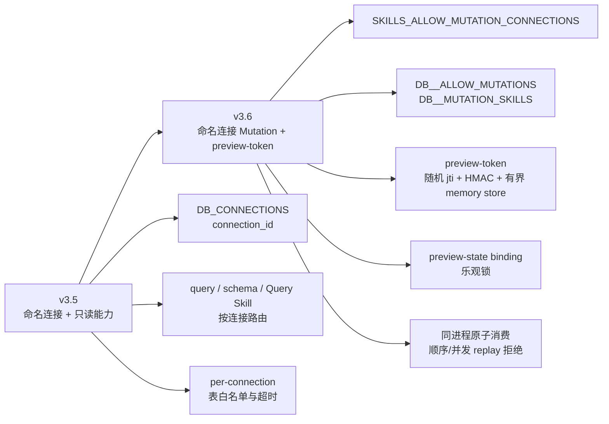
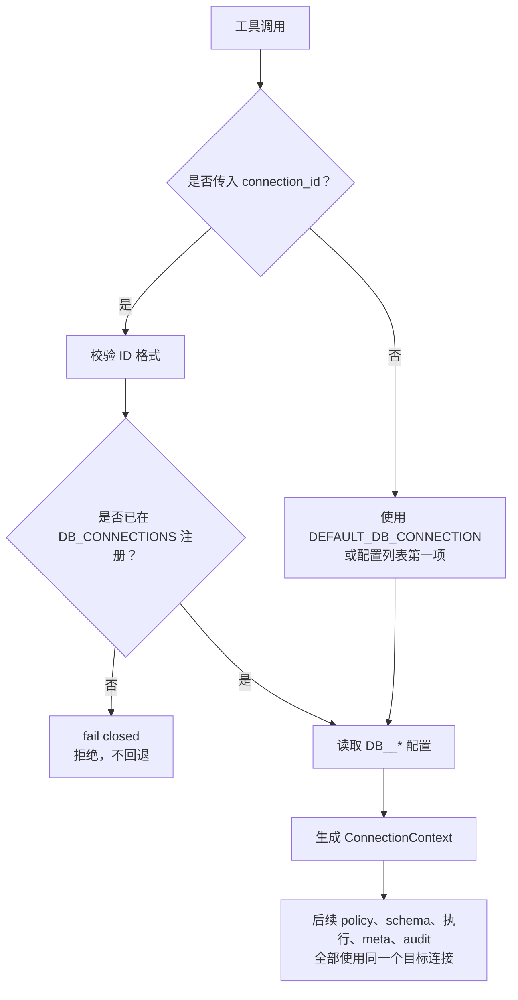
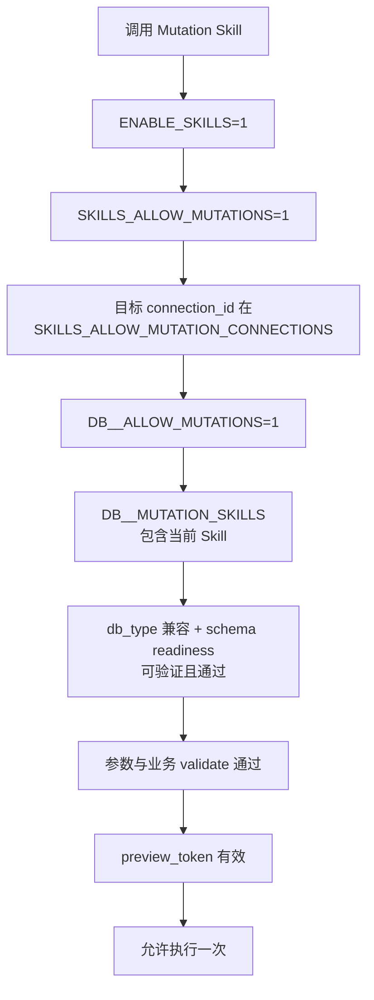
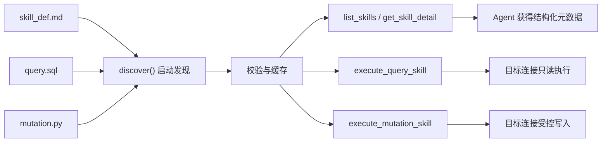
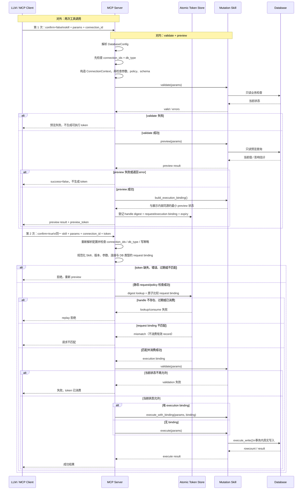

# v3.5-v3.7 命名连接、Skills 与批准流程易懂说明

> 本文是面向使用者、Skill 作者和代码审查者的说明，不替代
> [Skills 安全策略](../../skills/SAFETY.md)、[Skills 设计文档](../../MCP_AGENTS_SKILLS_DESIGN.md)
> 或发布说明。
>
> 版本范围：v3.5 命名连接与只读 Skills，v3.6 命名 Mutation、preview-token
> 和严格写策略，v3.6.1 的 preview/binding 修复与同进程部署契约定稿，
> v3.7.0 的可选 Skill 连接范围、人工批准 host 和跨数据库 demo reset，以及
> v3.7.1 的 opaque preview handle、精简响应与 Agent 渐进披露优化，
> 以及 v3.7.2 的提交前影响行数约束、结构化事务结果和未知结果不重做。

> **v3.7.1 迁移说明：** 本文的 v3.6/v3.6.1 比较保留 HMAC token 历史事实。
> v3.7.1 仍使用 `preview_token` 字段，但其值是 256-bit opaque handle；请求与
> 执行绑定状态全部位于进程内 Store。签名 secret 配置及
> `preview_token_expires_in_seconds` 响应字段已废弃；当前规范以
> [Skills 安全策略](../../skills/SAFETY.md) 为准。

## 1. 先看总图

这个项目有三条容易混淆的线：

```text
连接线：本次访问哪个数据库？
    DB_CONNECTIONS -> connection_id -> adapter -> 数据库

权限线：这个连接允许做什么？
    per-connection policy -> 表白名单 / Skill allowlist / 写开关

操作线：这一次写操作是否经过预览并且还是同一项操作？
    confirm=false -> preview -> preview_token
    confirm=true  -> token 校验 -> execute
```

### 1.1 v3.5 和 v3.6 的区别



### 1.2 v3.6 和 v3.6.1 的区别

| 项目 | v3.6 基线 | v3.6.1 维护更新 |
|------|------------|-----------------|
| Preview token | 随机 `jti`、HMAC、参数/连接/版本绑定、有界进程内 store、原子一次性消费 | 保持格式和默认值不变 |
| Preview 状态 | 引入 execution binding 与乐观锁 | binding 改为使用实际展示给调用方的 preview 状态 |
| Preview 失败 | 已有两阶段协议 | `error` 字段或 `success=false` 一律不签发 token |
| 写入路径 | MCP 路径使用 binding | 公开的无 binding `execute()` 也明确 fail closed |
| 测试与部署 | 覆盖基本 token/binding 行为 | 加固 secret rotation、脱敏、数据库异常和工具层并发 replay；正式明确同进程边界 |
| 配置与审计 | TTL、容量和 best-effort audit 基线 | 容量增加 `100000` 硬上限；启动时安全报告 key/policy 模式；token 消费后的动态 validation 拒绝尝试 execute audit |

v3.6.1 没有改变 Mutation Skill API、token 格式、默认 TTL、默认容量或数据库
写入语义，也没有新增共享 token backend。它修复正确性和测试证据，并把推荐
部署定为客户端自有的 stdio 进程。受信任私有环境中的条件性 HTTP mutation
只能运行一个启用 mutation 的进程；多用户认证 HTTP mutation 不属于本版本。

### 1.3 v3.6.1 和 v3.7.0 的区别

| 项目 | v3.6.1 | v3.7.0 |
|------|---------|--------|
| Skill 连接范围 | `databases` 只表达数据库类型；工具调用选择连接 | 新增可选 `connection_ids`，把 Skill 收窄到一个或多个合法别名标识符；仅当前部署已配置成员可执行 |
| 兼容性 | 未声明 Skill 级别名范围 | 使用已文档字段并省略 `connection_ids` 时路由行为不变；未知/重复字段改为 fail closed；运行时参数仍是单个 `connection_id` |
| 路由 | 省略 `connection_id` 使用全局默认连接 | 仍使用全局默认连接，不会自动选择 `connection_ids` 第一项 |
| 冲突处理 | DB 类型、policy、schema 分别检查 | `connection_ids ∩ databases ∩ 既有 policy`；冲突目标 fail closed，其它有效成员不受影响 |
| 人工批准 | 文档明确 token 不等于人类批准 | 新增 stdio 一次性 host 示例，只在精确输入 `APPROVE` 后执行 |
| Demo reset mutation | 只有跨 MySQL/SQLite 的通用业务状态 Skill | 新增跨 MySQL/SQLite 的 `reset-demo-order-to-pending`，显式检查测试产生的来源状态并固定恢复为 `pending` |
| SQL 方言加固 | DRR-013 尚未作为 v3.6.1 功能关闭 | 拒绝执行型 ANALYZE explain、嵌套写 DML、MySQL 可执行注释与非空白 `--` 形式 |

v3.7.0 没有改变 preview-token 格式、store、TTL、容量或既有写授权协议，但有意
收紧了 raw SQL grammar 与畸形 Skill metadata。它没有增加 HTTP 认证、服务端
批准人身份或 token 撤销 API。新增 reset mutation 只使用既有 MySQL/SQLite demo
`orders` schema，不代表完整生产订单生命周期或事务性回滚能力。

### 1.4 v3.7.0 和 v3.7.1 的区别

| 项目 | v3.7.0 | v3.7.1 |
|------|--------|--------|
| 客户端看到的值 | 包含请求元数据的 signed JSON payload + HMAC 签名 | 32 字节随机值的 URL-safe 编码；当前实现为 43 字符的 opaque bearer handle |
| 状态位置 | Token 携带部分签名状态；一次性消费和 preview-time execution state 仍依赖进程内 Store | Request binding、execution binding、过期时间和消费状态均以 Store record 为准 |
| 请求匹配 | 解析并校验 HMAC payload，再查询 Store | 计算 handle digest 查找 record，在同一把锁内精确比较 request binding 并消费；不匹配保留有效 record |
| 一次性消费 | 有 | 保留 |
| Skill/参数/连接绑定 | 有 | 保留；execute 时重新计算并与 Store record 比较 |
| Replay/并发防护 | 有 | 保留 |
| 多 worker/重启连续性 | 不支持；权威 Store 原本就是进程内状态 | 仍不支持；record 不存在时 fail closed，调用方必须重新 preview |
| Secret | `MUTATION_PREVIEW_TOKEN_SECRET` 参与 envelope 签名 | 配置已废弃并忽略；存在时只输出不含值的 warning |
| Preview 响应 | 同时返回绝对/相对过期时间、执行 hint 和嵌套确认字段 | 保留 `preview_token_expires_at`；移除三个重复 convenience 字段并明确兼容影响 |
| Skill detail | `get_skill_detail()` 固定 full | 新增可选 `execution` 投影；省略仍为 full，并以非空 enum/default 明确暴露机器契约 |
| Agent 流程 | 容易形成固定 list → detail → execute | 参数已知或 list full 已提供参数时直接执行；未知参数才取 execution detail |
| 连接/UNION 提示 | 全局 prompt 可能把默认连接 policy 当成全局建议 | 模糊用途不猜 alias；UNION 提示保持 target-neutral，运行时仍按目标连接权威校验 |

没有改变的边界包括：mutation 仍是 preview/execute 两次调用、execute 仍重传
Skill/params/connection、TTL 与默认容量不变、写授权层不变、preview/execute 必须到达
同一进程。Handle 仍是 bearer secret；缩短它不会使泄漏无害。

#### 为什么采用“随机 handle + 服务端 Store”

它不是把旧 token 截短，而是把客户端凭证改成不可猜测的随机引用：客户端不需要
理解其内容；服务端通过 handle 的 SHA-256 digest 查找 record，并以 Store 中的
请求绑定、执行绑定、过期和消费状态为准。`secrets.token_urlsafe(32)` 使用适合安全
用途的随机源生成 32 字节（256-bit）随机值；Store 不持久保存完整 bearer handle。

这与常见 opaque identifier 的设计方向一致。OWASP 的 session 指南建议客户端
标识符应随机、不可预测、没有可解码的业务含义，并把关联状态放在服务端；其日志
指南建议不要直接记录 session id 或 access token。RFC 7662 也说明 unstructured
token 可以通过服务端 data-store lookup 取得上下文。这里仅采用这些原则作为设计
类比：本项目没有因此实现 OAuth introspection，preview handle 也不是 Web session、
人类批准证明或完整授权边界。

更准确地说，Store 是本次 preview record 有效性和绑定/消费状态的权威来源；连接
写开关、Mutation Skill allowlist、profile/schema/table policy 等授权仍在独立的
运行时层检查。随机 handle 不携带内部 payload，减少了 Agent 上下文、复制错误和
客户端可见状态，但它仍是 bearer secret：泄漏者若同时掌握匹配请求，可能在消费
或过期前执行这一次 mutation。

状态化设计的代价也没有消失：进程重启或请求进入其他 worker 时 handle 失效；没有
Store 就不能离线判断有效性；大量只 preview 不 execute 的调用仍会占用有界容量；
handle 消费后若数据库提交或响应阶段断连，结果仍可能不确定。因此必须继续保留短
TTL、容量上限、容量满时 fail closed、同进程部署约束，以及“先核对业务状态、不得
盲目重试”的规则。

- [OWASP Session Management Cheat Sheet](https://cheatsheetseries.owasp.org/cheatsheets/Session_Management_Cheat_Sheet.html)
- [OWASP Logging Cheat Sheet](https://cheatsheetseries.owasp.org/cheatsheets/Logging_Cheat_Sheet.html)
- [Python `secrets` 文档](https://docs.python.org/3/library/secrets.html)
- [RFC 7662: OAuth 2.0 Token Introspection](https://datatracker.ietf.org/doc/html/rfc7662)

## 2. `DB_CONNECTIONS` 和 `connection_id`

### 2.1 `DB_CONNECTIONS` 做什么？

```dotenv
DB_CONNECTIONS=trade_analysis_mysql,analytics_demo_sqlite
DEFAULT_DB_CONNECTION=trade_analysis_mysql
```

`DB_CONNECTIONS` 是命名连接模式的开关，同时注册两个连接 ID：

```text
trade_analysis_mysql
analytics_demo_sqlite
```

这两个名字都是 `connection_id`。它们可以叫别的名字：

```dotenv
DB_CONNECTIONS=production,reporting
DEFAULT_DB_CONNECTION=production
```

连接 ID 是服务端配置的安全别名，不是：

- DSN 或数据库 URL；
- host、端口、用户名或密码；
- SQLite 文件路径；
- 模型可以临时创建的数据库连接。

### 2.2 每个 ID 对应一组服务端配置

```dotenv
DB_TRADE_ANALYSIS_MYSQL_TYPE=mysql
DB_TRADE_ANALYSIS_MYSQL_HOST=your_mysql_host
DB_TRADE_ANALYSIS_MYSQL_NAME=trade_data_analysis
DB_TRADE_ANALYSIS_MYSQL_ALLOWED_TABLES=orders,customers

DB_ANALYTICS_DEMO_SQLITE_TYPE=sqlite
DB_ANALYTICS_DEMO_SQLITE_SQLITE_DATABASE_PATH=./sample_data/demo.db
DB_ANALYTICS_DEMO_SQLITE_ALLOWED_TABLES=orders
```

关系是：

```text
DB_TRADE_ANALYSIS_MYSQL_*       -> connection_id=trade_analysis_mysql
DB_ANALYTICS_DEMO_SQLITE_*      -> connection_id=analytics_demo_sqlite
```

连接 ID 与数据库类型是两个独立概念：

```text
connection_id=trade_analysis_mysql -> 某一个已配置的 MySQL 目标
 db_type=mysql      -> 该目标使用 MySQL 方言
```

同一种数据库类型可以有多个不同目标：

```text
orders_prod -> MySQL 生产订单库
orders_test -> MySQL 测试订单库
hr           -> MySQL 人事库
```

### 2.3 `DEFAULT_DB_CONNECTION`

```dotenv
DEFAULT_DB_CONNECTION=trade_analysis_mysql
```

表示工具调用省略 `connection_id` 时使用 `trade_analysis_mysql`。

```text
query(sql="SELECT ...")
    等价于
query(sql="SELECT ...", connection_id="trade_analysis_mysql")
```

命名模式下，默认 ID 必须出现在 `DB_CONNECTIONS` 中。未知 ID 不会悄悄回退到默认连接，而是直接失败。

如果没有设置 `DB_CONNECTIONS`，系统处于 legacy 单连接模式：

```text
DB_TYPE / DB_USER / DB_HOST / DB_NAME / SQLITE_DATABASE_PATH
```

继续生效，而 `DB_<ID>_*` 和 `DEFAULT_DB_CONNECTION` 会被忽略。

### 2.4 连接解析顺序



## 3. 连接级表白名单

表白名单没有过时，而是从“单连接全局配置”扩展为“每个连接独立配置”。

```dotenv
DB_ORDERS_PROD_ALLOWED_TABLES=orders,customers
DB_ANALYTICS_DEMO_SQLITE_ALLOWED_TABLES=orders
```

效果：

```text
connection_id=orders_prod -> 允许 orders、customers
connection_id=analytics_demo_sqlite   -> 只允许 orders
```

因此相同的表名在不同数据库中可以有不同策略。服务端会先解析连接，再使用该连接自己的：

- `ALLOWED_TABLES`；
- `ALLOW_UNION`；
- 查询/连接超时；
- schema readiness；
- adapter 和方言辅助 SQL。

表白名单控制“能访问哪些表”，不是 Mutation 写权限。Mutation 写权限另由下列配置控制：

```dotenv
SKILLS_ALLOW_MUTATION_CONNECTIONS=analytics_demo_sqlite
DB_ANALYTICS_DEMO_SQLITE_ALLOW_MUTATIONS=1
DB_ANALYTICS_DEMO_SQLITE_MUTATION_SKILLS=update-order-status,reset-demo-order-to-pending
```

当前本地 `.env` 中 MySQL 使用 `DB_TRADE_ANALYSIS_MYSQL_ALLOWED_TABLES=*`，这适合联调但扩大了读权限；生产环境应改成实际需要的明确列表。

表 allowlist 是应用层的保守 guard，不是数据库授权边界，也不能证明所有外层
`SELECT` 都没有副作用。MySQL stored function 和 `GET_LOCK()` 等函数可以产生
statement type 看不出的效果。生产只读连接应只授予实际对象的 `SELECT`，撤销
不需要的 `EXECUTE`、`FILE`、`PROCESS`、管理权限和跨 schema 权限；可行时应
使用独立读写凭据。不要用不断扩大的函数 denylist 代替数据库最小权限。

v3.7 的完整 MCP raw-query policy 进一步收窄为：每次只接受一条 `SELECT`、
`DESCRIBE` 或非 ANALYZE `EXPLAIN`。raw `SHOW` 全部拒绝，schema discovery 使用
`list_tables()`/`describe_table()`；跨 session 的 `EXPLAIN ... FOR CONNECTION`
也拒绝。限制性 `ALLOWED_TABLES` 会解析 FROM/JOIN、comma join、nested query、
CTE 和 EXPLAIN child table；`schema.table` 必须由完整 qualified allowlist entry
授权，basename 不会授权另一 schema 的同名表。无法可靠识别的 table-valued/
derived target 会 fail closed；`ALLOWED_TABLES=*` 仍是显式 allow-all。
非 ANALYZE 的 EXPLAIN/DESCRIBE/DESC 仍可检查
`UPDATE`/`INSERT`/`REPLACE`/`DELETE`；限制性 allowlist 会同时校验被解释的 DML
target、全部 read source、CTE alias 的底层表及 multi-table
`DELETE ... USING` source table，无法可靠识别目标时 fail closed。
ANALYZE 与 FOR CONNECTION 形式继续拒绝。

在普通注释规范化前，policy 会拒绝 MySQL `/*! ... */`、optimizer hint
`/*+ ... */`、MariaDB `/*M! ... */` 和不符合 MySQL 空白规则的 `--`。项目声明的
方言运行边界仍是 Oracle MySQL 与 SQLite；MariaDB 没有单独的兼容性承诺，拒绝
其 executable comment 是对 `DB_TYPE=mysql` 可能连到 MariaDB 的保守处理。

## 4. `skill_def.md` 中各字段是什么？

以 `update-order-status` 为例：

```yaml
name: update-order-status
version: "1.0"
type: mutation
source: mutation.py
risk: medium
requires_confirmation: true
idempotent: false
profiles: [demo]
tables: [orders]
params:
  order_id: {type: int, required: true}
  new_status: {type: str, required: true, enum: [pending, confirmed, shipped, delivered, cancelled, returned]}
```

v3.7 对已知 metadata 的“值”也 fail closed：`enabled`、`idempotent`、
`requires_confirmation` 必须是真正的 YAML boolean；`triggers` 与
`related_skills` 必须是字符串列表；声明 `category` 时必须是非空字符串。参数
定义只允许 `type`、`required`、`min`、`max`、`enum`、`description`，约束值
必须匹配参数类型，`enum` 必须是非空列表，数值边界必须有序。这仍是有意保持
轻量的自定义 DSL，不是完整 JSON Schema。

### 4.1 `databases`：数据库类型兼容性

```yaml
databases: [mysql, sqlite]
```

表示 Skill 支持 MySQL 和 SQLite 两种数据库类型，不表示连接 ID。

这里是可选字段的通用示例；当前仓库的 `update-order-status/skill_def.md` 和
`reset-demo-order-to-pending/skill_def.md` 都显式声明
`databases: [mysql, sqlite]`。二者仍必须通过目标连接的表、policy、业务校验和
Mutation 写策略；数据库类型兼容本身不授予执行权限。

v3.7 新增一个可选、限制性的别名列表：

```yaml
databases: [mysql]
connection_ids: [orders_primary, orders_reporting]
```

二者含义不能混淆，但可以同时配置并取交集：`databases` 是数据库类型兼容性，
`connection_ids` 是连接别名标识符的 Skill 级范围。只有当前部署已配置的成员可
执行，portable Skill 中未配置的成员会保留并显示 unavailable。单个元素可表达
直接绑定，多个元素支持同一 Skill 复用。
省略 `connection_ids` 时完全保持 v3.6.1 行为。

该字段必须是非空 YAML list；空值、字符串标量、重复别名、DSN、URL、路径、通配符
和单数形式 `connection_id` 都会让 Skill 在 discovery 时失败。未知顶层字段和任何
重复 YAML mapping key 也会被拒绝，避免 `connections_ids` 之类 typo 静默变成
unrestricted Skill。列表会规范化并排序，
但顺序没有路由含义。工具调用仍然只接收一个 `connection_id`；省略时仍先解析全局
默认连接，再检查它是否属于该 Skill 范围，绝不会自动挑选唯一项或第一项。

有效目标是交集，而不是授权捷径：

```text
connection_ids（如声明）
∩ databases（如声明）
∩ profile / schema / table / query policy
∩ mutation 全局目标、连接写开关和 Skill 写 allowlist
```

未在当前部署配置的别名会显示为 unavailable，并产生启动 warning，但不会动态创建
连接。已配置别名若与 `databases` 类型冲突，该目标 fail closed 并记录启动 error；
同一列表中的其它有效目标仍可用，这样才能保留多连接复用语义。执行期会在创建
adapter 前重做 `connection_ids` 与 `databases` 检查；profile、schema、table、
query 与 mutation policy 仍会在实际查询或写入前独立校验。`available_only`
过滤不是授权边界。

建议别名使用 `orders_primary`、`trade_analysis_mysql`、
`analytics_demo_sqlite` 等业务语义。`mysql`、`sqlite`
虽然合法，但容易与 `databases` 的类型值混淆。直接在 Python 中调用 loader 或
Mutation class 会绕过 MCP 路由层，嵌入方必须自行实施等价策略。

如果两个 MySQL 库的 `orders` 表业务含义不同，不能只靠 `databases: [mysql]` 证明它们都适用。应通过独立 Skill、连接 allowlist、schema 检查和 Skill 自己的业务校验来区分；当前版本的 schema readiness 主要检查表是否存在，不会完整证明每一列的语义相同。

### 4.2 `profiles: [demo]`：部署/运营标签

```yaml
profiles: [demo]
```

`demo` 是一个 profile 标签，说明这是仓库内置的演示 Skill。它不是：

- `connection_id`；
- 数据库类型；
- 自动选择规则；
- 写权限。

生产环境可以配置：

```dotenv
SKILLS_EXCLUDE_PROFILES=demo
```

匹配的 Skill 会从默认发现面隐藏，并在直接执行时拒绝。这样可以保留示例文件，同时避免误用于生产 schema。

### 4.3 `tables: [orders]`：所需表声明

```yaml
tables: [orders]
```

表示这个 Skill 需要目标连接中存在 `orders` 表，用于：

- `schema_ready` 检查；
- `list_skills(available_only=true)` 的可用性过滤；
- Skill 详情和发现信息；
- Query Skill 的目标连接表白名单检查。

启用 `SKILLS_CHECK_SCHEMA_ON_LIST=1` 后，如果目标数据库 metadata 暂时不可用，
服务端不会把“无法核验”误报为“已经 ready”，也不会伪造 `missing_tables`。依赖表的
Skill 会显示 `schema_check_available=false`、`schema_ready=false`、
`executable=false`，从默认发现面隐藏，并在直接执行时 fail closed。传
`available_only=false` 仍可查看完整开发者目录和拒绝原因。

它不等于：

```text
允许写 orders
```

也不能证明不同数据库中的 `orders` 表业务含义完全一致。真正的写授权仍在连接 policy 中。

### 4.4 v3.7 的跨数据库 Demo Reset Mutation

`reset-demo-order-to-pending` 是刻意收窄的 demo/test 补偿操作：输入包含
`order_id` 和前一项测试应产生的非 `pending` `expected_status`，目标状态固定为
`pending`。只有 preview 实际读到相同来源状态时才会签发 token。其 frontmatter
明确写 `databases: [mysql, sqlite]`，可选的
`connection_ids: [orders_demo_mysql, orders_demo_sqlite]` 保持注释状态；
部署者取消注释后才会增加 alias 限制。该字段不授予权限，仍需通过下节全部写策略。

受支持 schema 必须把 `orders.id` 声明为 `PRIMARY KEY` 或 `UNIQUE`。Skill 的
read-side cardinality 检查能诊断已经损坏的 fixture，但不是原子 constraint，不能
替代数据库唯一约束。该调用是第二次提交的 mutation，不是前一项写入的事务回滚；
清理仍可能失败。它会刻意形成 `pending -> X -> pending`，因此应使用专用测试记录、
避免重叠 preview，并优先为每个 live-test 场景使用新的 stdio 进程。

仓库四个示例 `skill_def.md` 都在各顶层属性前加入说明注释。注释解释 discovery、
兼容性、profile、readiness 和授权的区别，但 parser 不依赖注释，真实约束仍来自
frontmatter 值与运行时 policy。

## 5. Mutation 写权限配置

### 5.1 全局与连接级开关

```dotenv
ENABLE_SKILLS=1
SKILLS_ALLOW_MUTATIONS=1
SKILLS_ALLOW_MUTATION_CONNECTIONS=trade_analysis_mysql,analytics_demo_sqlite

DB_TRADE_ANALYSIS_MYSQL_ALLOW_MUTATIONS=1
DB_TRADE_ANALYSIS_MYSQL_MUTATION_SKILLS=update-order-status

DB_ANALYTICS_DEMO_SQLITE_ALLOW_MUTATIONS=1
DB_ANALYTICS_DEMO_SQLITE_MUTATION_SKILLS=update-order-status,reset-demo-order-to-pending
```

各配置解决不同问题：

```text
ENABLE_SKILLS
    是否启用整个 Skills 层

SKILLS_ALLOW_MUTATIONS
    是否注册/允许 Mutation 工具

SKILLS_ALLOW_MUTATION_CONNECTIONS
    哪些 connection_id 有资格成为 Mutation 目标

DB_<ID>_ALLOW_MUTATIONS
    该连接是否打开写开关

DB_<ID>_MUTATION_SKILLS
    该连接允许哪些 Mutation Skill
```

完整授权链：



如果不设置 `SKILLS_ALLOW_MUTATION_CONNECTIONS`，为保持兼容性，Mutation 目标仍限制为默认连接。

上图表示必须同时满足的授权依赖，不是严格的代码执行顺序。实际 execute 会先做
基础参数/policy 检查，再验证并原子消费 `preview_token`，之后才重新执行动态的
`mutation.validate()`，最后进入写入。

## 6. Skill 的启动和运行

Skill 不是让 Agent 自己读取源码并自由写 SQL。服务端启动时会：

1. 解析 `skill_def.md` 的 YAML frontmatter；
2. 校验 Skill 名称、参数 schema、`source` 文件名；
3. Query Skill 在启动期校验 SQL 并缓存模板；
4. Mutation Skill 导入并缓存 `MutationBase` 的具体子类；
5. 运行时使用缓存，不从磁盘临时读取执行文件。



## 7. Mutation 是“两次调用”还是“三个阶段”？

两种说法都对，但指的是不同层面。

### 对外：两次 MCP 工具调用

```text
第一次：confirm=false
    预览，不写数据库，返回 preview_token

第二次：confirm=true + preview_token
    验证并执行真正写入
```

### 对内：三种业务职责

```text
validate()
    判断业务上现在能不能做

preview()
    展示如果执行准备做什么，不执行写入

execute() / execute_with_binding()
    通过 execute_write() 在事务中真正修改数据库
```

完整排列是：

```text
第一次调用：validate() -> preview() -> 生成 token
第二次调用：验证并消费 token -> validate() -> execute()
```

`validate()` 在两个调用中都会出现，是因为 preview 和 execute 之间数据库状态可能变化。

### 7.1 `validate()` 和 `preview()` 的区别

```text
validate()：现在允许做吗？
preview() ：如果允许做，具体会做什么？
```

`validate()` 负责业务前置条件，例如：

- 订单是否存在；
- 新状态是否属于允许枚举；
- 当前状态是否允许转换；
- 库存、余额或审批状态是否满足条件。

`preview()` 可以执行只读查询来展示：

- 当前值和目标值；
- 预览 SQL；
- 参数绑定；
- 预计影响行数；
- warnings；
- 是否需要确认。

`preview()` 不应执行 `INSERT`、`UPDATE`、`DELETE`。

## 8. `confirm`、人类确认与 token

### 8.1 `confirm` 是什么？

`confirm` 是流程分支参数：

```text
confirm=false -> preview 分支
confirm=true  -> execute 分支
```

它不是：

- 人类身份认证；
- 权限授予；
- 数据库锁；
- token 本身。

如果 MCP 客户端弹出确认 UI 并由人点击允许，客户端可能随后发送 `confirm=true`；但服务端从这个布尔值本身无法证明一定有人类点击。自动化 Agent 也可以在分析 preview 后发送 `confirm=true`。

### 8.2 `preview_token` 对应的 Store record 绑定什么？

Handle 本身是随机值，不携带客户端可读的请求或执行绑定状态。其服务端 Store record 绑定的是
“一次具体的预览操作”，不是泛化的“允许这个 Skill”标记：

```text
skill_name
skill_version
规范化 params 的 hash
connection_id
db_type
过期时间
preview-time execution binding
```

为什么绑定多个属性？

```text
绑定 connection_id
    防止在 analytics_demo_sqlite preview、在 trade_analysis_mysql execute

绑定 params
    防止 preview order_id=42、execute order_id=99

绑定 Skill version
    防止用户看到 v1 的预览，却执行后来变成 v2 的逻辑

绑定 preview 状态
    防止 preview 看到 confirmed，却覆盖后来已经变成 cancelled 的订单
```

服务端只用 handle 的 SHA-256 digest 索引 record，不持久保存完整 bearer 值。
Store 在同一把锁内完成 request binding 比较和一次性消费；随机 256-bit handle
提供不可猜测性，Store record 是本次 preview 的绑定、过期和消费状态的权威来源；
连接写权限与 Skill allowlist 等授权仍由独立 policy 层决定。

### 8.3 为什么 execute 不再次调用 `preview()`？

`preview()` 是第一次调用返回给客户端的计划；只有 host 实际展示时，它才成为用户
看到的计划。如果 execute 前重新 preview，数据库可能已经变了，重新生成的结果可能
不是第一次返回/展示的那份计划。

因此当前做法是：

```text
preview 阶段保存最小必要的 request/execution binding
execute 阶段用 handle 查找并原子匹配/消费 record，再使用 execution binding
```

但 execute 仍会再次 `validate()`，因为它需要检查当前业务状态是否还允许执行。

### 8.4 v3.7 人工批准 host 示例能证明什么？

`examples/manual_mutation_approval.py` 在同一个 stdio Client context 中完成
preview 与 execute，并保持同一个 server 子进程。它显式继承操作者当前进程的完整环境，避免
导出的 `DB_*`/Skill policy 被另一个项目 `.env` 静默替换；server script 固定为
本仓库的可信 `start_server.py`，不接受 CLI 覆盖。它展示 Skill、有限 JSON 参数
快照、实际
解析的连接、DB 类型、业务
preview、过期时间和幂等标志，并且只接受精确文本 `APPROVE`。审批截止时间由
workflow 自身强制，而不是只信任 UI provider；自定义 provider 仍须配合 async
取消；若 provider 修改已展示的 params/preview，workflow 会 fail closed，恶意
provider 的硬终止仍需要进程隔离。token 不进入批准视图或该示例的输出；
异常返回若在其它字符串回显精确 bearer 值也会被替换。execute 超时/异常不会自动
重试，因为 token 可能已经消费，写结果也可能未知。

它证明的是“这个 host 按流程要求了一次显式输入”，不是服务端可验证的人类身份：

- 其它客户端仍可绕过示例直接调用 MCP 工具；
- deny、timeout、EOF 或取消不会调用 execute，也不会通知服务端撤销 token；未用
  record 会保留到 TTL 过期，服务端只有普通 preview audit；
- token 必然经过 FastMCP/client 内存，Python 无法承诺安全擦除，payload debug
  日志仍可能泄露它；
- 完整环境继承会把所有导出 secret/Python 控制变量纳入子进程/Skill 信任边界；
  这是可信本地示例避免换用另一 `.env` 的妥协，产品化 host 应维护专用 allowlist；
- 参数、preview 与打印的 execute result 都可能是敏感业务数据；
- 多用户、批准人认证、职责分离和合规审计需要产品自己的批准服务，本版本没有提供。

### 8.5 v3.7.2 宿主如何判定 execute 结果？

宿主必须先严格匹配 `mode=execute`、请求的 `skill_name`、preview 返回的
`connection_id` 和 `db_type`，再读取 `execution_outcome`。身份缺失或不匹配时，
即使响应声称 `committed` 也只能得到 `execute_unknown`，因为它可能不是本流程的
回执。

| MCP 结果 | 参考宿主状态 | 当前流程动作 |
|---|---|---|
| `success=true, execution_outcome=committed` | `executed` | 结束，不重做 |
| `success=true, execution_outcome=unknown` | `execute_unknown` | 自定义 Skill handler 已完成但没有整个操作的 COMMIT 证据；结束并核查 |
| `success=false, execution_outcome=committed` | `execute_committed` | 结束，不重做；数据库已确认提交 |
| `success=false, execution_outcome=rolled_back` | `execute_rolled_back` | 结束，不自动重新 preview/execute |
| `success=false, execution_outcome=not_executed` | `execute_not_executed` | 结束，不自动重新 preview/execute |
| `success=false, execution_outcome=unknown` | `execute_unknown` | 结束并人工核查业务状态 |

COMMIT 前失败中，`rollback_failed` 表示 rollback 调用确实抛出异常；
`rollback_unconfirmed` 表示调用在本地返回，但事务活跃状态或连接有效性不足以证明
数据库已回滚。两者都保持 `execution_outcome=unknown`，只用于诊断，不能授权重试。

本版没有持久 operation ID 或回执查询。人工看到当前业务状态符合预期，只能辅助
恢复，不能证明该状态由本次请求造成；未来若提供查询，在协议尚未明确权威一致性、
处理中状态、保留期和 terminal-not-found 语义前，“查不到”也不能解释为已回滚或
允许重试。出现重启后查询、无人值守恢复或可量化的人工核查成本时，再按
DRR-2026-061 启动独立版本设计。

超时、客户端异常、响应缺失、未知枚举、非布尔 `success`、矛盾字段、缺少稳定
`error_code`/脱敏 `error` 的失败，以及任何身份不匹配，均为 terminal
`execute_unknown`。参考 host 每个流程最多调用一次 execute；结果出来后不会自动
重新 preview、重新提交、切换 connection 或切换 server instance。

`committed` 不是 MCP 成功分支自行生成的默认值。两个内置单语句 Skill 必须保留
adapter 的类型化成功结果，`MutationBase` 同时验证 exact 声明和 COMMIT 证据后才会
返回该值。普通自定义 Skill 的 dict 成功只能证明 Python handler 正常返回，因此是
`success=true, execution_outcome=unknown`。缺失/非布尔/false 的 Skill `success`
结果会变成 `success=false, invalid_skill_result, unknown`；声明 exact 但丢失 adapter
证据会变成 `missing_commit_evidence, unknown`。

COMMIT 阶段的 `asyncio.CancelledError` 与连接异常具有相同确认歧义；MySQL/SQLite
adapter 在清理后将其转换成 `commit_outcome_unknown`，只要 MCP 调用仍有机会返回
结果。COMMIT 前取消和其它进程控制异常在清理后仍传播，以免阻止 shutdown/timeout；
如果 transport 已无法投递响应，宿主仍按缺失响应得到 `execute_unknown`。

兼容 v3.7.1 及更早服务端时，只把身份严格匹配、`success=true`、
`mode=execute` 且 `result` 为对象的旧响应识别为 `executed`。没有
`execution_outcome` 的旧失败响应缺少数据库状态证据，按 `execute_unknown` 处理。
这意味着客户端不能再以“工具没有抛异常”作为成功标准；必须同时检查
`success` 与 `execution_outcome`。

旧成功识别是本版明确保留的兼容行为，不是补造的 COMMIT 证据；旧服务端无法区分
自定义 handler 正常返回和数据库确认提交。依赖严格事务结论前必须升级服务端，
不能把 legacy `executed` 外推成 v3.7.2 的 `committed` 保证。

## 9. 数据库状态变化与乐观锁

preview 和 execute 之间数据库当然可能变化：

```text
10:00 preview：订单 42 = confirmed，准备改为 shipped
10:01 其他系统：订单 42 = cancelled
10:02 execute
```

当前订单 Skill 在 preview 时绑定：

```text
expected_status=confirmed
```

执行时使用类似条件：

```sql
UPDATE orders
SET status = :new_status
WHERE id = :order_id
  AND status = :expected_status
```

如果状态已经变成 `cancelled`，影响行数为 0。v3.7.2 会在 COMMIT 前发现不匹配并
回滚，再返回 `success=false, execution_outcome=rolled_back,
error_code=expected_rowcount_mismatch`，不会覆盖后来发生的修改。若异常发生在
COMMIT 阶段，则无论后续 rollback cleanup 是否报错，都只能返回 `unknown`。

注意：token 不会冻结数据库，也不会锁住 preview 到 execute 的整个时间间隔。每个状态敏感 Skill 都应实现自己的 `build_execution_binding()` 和 `execute_with_binding()`。

## 10. Token 错误、过期和一次性消费

### 10.1 错误 token 会怎样？

```text
缺少 token
    -> 要求先 confirm=false

未知、被改动或不属于本进程的 handle
    -> preview_token was not issued by this server process ...

参数、连接、Skill 或版本不匹配
    -> preview_token does not match this mutation request

过期
    -> Expired preview_token; run preview again.

已消费、重启后丢失或 store 中不存在
    -> preview_token has already been used ...
```

这些错误不会执行写入。静态拒绝通常不会消费一个本来有效的 token；只有把请求
恢复为该 token 原先绑定的参数、连接、Skill 和版本后，原 token 才可能继续使用，
并且仍须满足有效期和进程内 store 状态。

### 10.2 “一次性”是什么意思？

每次成功的 preview 都生成一个新 token；每个 token 最多成功消费一次。

它不是“每个 Skill 永远只有一个 token”：

```text
第一次 preview -> token A
第二次 preview -> token B
```

当前 execute 在静态 request/policy 检查后，对 Store record 原子执行“匹配并消费”，
随后才进入动态 validation 和数据库写入。消费后即使发生 validation、数据库、超时、
audit 或响应失败，也不会恢复。若结果不确定，必须先查询当前业务状态，再决定是否
进行新的 preview/mutation，不能盲目重试。

这样做是保守策略：如果一次写请求结果不确定，系统不能凭旧 token 自动重试，以免重复写入。

v3.7.1 不再保留独立的签名 payload 层。随机 handle 负责不可猜测性，Store 证明
它由当前进程签发、保存 canonical request/execution binding，并实施条件式一次性
消费。未知 handle 查不到 record；请求不匹配不会消费仍有效的 record。

Handle 对调用方是 API-opaque，调用方不得解析或依赖其内部格式。Handle 必然经过
授权客户端，并可能进入模型上下文，因此应尽量减少持久保存和日志
记录、限制上下文与日志访问。Bearer confidentiality 在 token 消费或过期前仍然
重要；短 TTL、精确绑定和原子一次性消费只能限制、不能消除泄露影响。适用工具
metadata 中的短 `preview_token_id` 只是客户端关联提示；audit 和 telemetry 不会
持久化完整 token 或这个短标识。

### 10.3 MCP 的无状态性取舍

只读请求可以接近无状态；Mutation token store 是当前进程内的有界 memory store：

```text
stdio -> preview/execute 必须在同一客户端启动的 MCP 子进程中完成
HTTP  -> 仅限受信任私有边界，且只运行一个启用 mutation 的进程
```

stdio 是推荐基线。v3.6.1 不定义多用户认证 HTTP mutation 服务，程序也不会自动
检测 worker 或 replica 数；部署配置必须保证 mutation 进程数为 1。不得把多个
启用 mutation 的 memory worker 放在普通负载均衡器后。进程重启、
滚动发布或请求进入其他进程时，旧 handle 都会 fail closed，调用方必须重新
preview；v3.7.1 已不使用签名 secret，任何进程外配置都不能恢复 Store 状态。
只读容量只能通过独立的 read-only endpoint、profile 或 pool 横向扩展。
当前版本不提供共享 token backend，也不会退回 stateless token acceptance。

## 11. `mutation.py` 固定接口契约

`mutation.py` 应遵守固定的结构契约，但业务规则可以各不相同：

```python
from mutation_base import MutationBase


class Mutation(MutationBase):
    def validate(self, params: dict) -> dict:
        ...

    def preview(self, params: dict) -> dict:
        ...

    def execute(self, params: dict) -> dict:
        ...
```

### 必须实现的方法

```text
validate(params) -> {"valid": True}
                       或 {"valid": False, "errors": [...]}

preview(params) -> 可 JSON 序列化的预览字典

execute(params) -> 实际执行结果字典，或抛出 ToolError
```

### 状态敏感 Skill 的可选扩展

```python
def build_execution_binding(self, params, validation, preview) -> dict:
    ...


def execute_with_binding(self, params, execution_binding) -> dict:
    ...
```

如果返回非空 binding 却没有正确实现 `execute_with_binding()`，基类会拒绝执行，而不是静默忽略 binding。

### 代码边界

`mutation.py` 使用服务端注入的 `self.adapter`，不应：

- 自行读取 DSN 或凭据；
- 自行创建任意数据库连接；
- 拼接未经参数绑定的 SQL；
- 接受 Agent 传入的自由 SQL；
- 访问外部 HTTP；
- 读写任意文件；
- 启动 subprocess。

loader 会在启动时要求 `Mutation` 是具体的 `MutationBase` 子类并缓存它，但这不是不可信插件 sandbox；`skills/` 与源代码属于同一个信任边界，仍需要代码审查。

## 12. 一张完整流程图



## 13. 当前配置示例（不含真实凭据）

```dotenv
DB_CONNECTIONS=trade_analysis_mysql,analytics_demo_sqlite
DEFAULT_DB_CONNECTION=trade_analysis_mysql

DB_TRADE_ANALYSIS_MYSQL_TYPE=mysql
DB_TRADE_ANALYSIS_MYSQL_USER=your_user
DB_TRADE_ANALYSIS_MYSQL_PASSWORD=your_password
DB_TRADE_ANALYSIS_MYSQL_HOST=your_host
DB_TRADE_ANALYSIS_MYSQL_NAME=your_database
DB_TRADE_ANALYSIS_MYSQL_ALLOWED_TABLES=orders,customers
DB_TRADE_ANALYSIS_MYSQL_ALLOW_MUTATIONS=0

DB_ANALYTICS_DEMO_SQLITE_TYPE=sqlite
DB_ANALYTICS_DEMO_SQLITE_SQLITE_DATABASE_PATH=./sample_data/demo.db
DB_ANALYTICS_DEMO_SQLITE_ALLOWED_TABLES=orders
DB_ANALYTICS_DEMO_SQLITE_ALLOW_MUTATIONS=1
DB_ANALYTICS_DEMO_SQLITE_MUTATION_SKILLS=update-order-status,reset-demo-order-to-pending

ENABLE_SKILLS=1
SKILLS_ALLOW_MUTATIONS=1
SKILLS_ALLOW_MUTATION_CONNECTIONS=analytics_demo_sqlite

MUTATION_PREVIEW_TOKEN_TTL_SECONDS=300  # 有效范围 1-86400 秒
MUTATION_PREVIEW_TOKEN_STORE_MAX_ENTRIES=10000  # 有效范围 1-100000
# v3.7.1 使用随机 opaque handle；MUTATION_PREVIEW_TOKEN_SECRET 已废弃且会被忽略
```

Skill 作者可选地在 `skill_def.md` 中再收窄目标（这不是环境变量，也不授予权限）：

```yaml
databases: [sqlite]
connection_ids: [analytics_demo_sqlite]
```

结果大小限制仍然是进程级配置，而不是连接级：

```dotenv
MAX_RESULT_ROWS=100
MAX_RESULT_CHARS=16000
MAX_SCHEMA_TABLES=50
MAX_OVERVIEW_TABLES=100
```

## 14. 本 session 的联调结论

本 session 有两类联调记录，下面需要区分：本节前半描述的是聊天中直接使用当前
本地/业务配置的保守验证批次；链接的完整 live fixture 记录则是另一批使用临时
订单并清理数据的协议测试。两批结果相互印证，但写入范围不同。

历史真实 MCP 配置联调使用当时的 `mysql`/`analytics` 别名，验证了：

- `mysql`、`analytics` 均可连接；
- `connection_id` 正确影响表可见性、Skill 方言和执行目标；
- SQLite 的 `orders` 白名单会拒绝 `widgets`；
- 跨连接 token、错误参数和篡改 token 会在写入前拒绝；
- 正确 token 可以完成一次 SQLite Mutation；
- 同一 token 的 replay 会被拒绝；
- 远程 MySQL 写入在该批次中未执行。

补充的完整 live fixture 批次见
[真实 MCP 联调记录](../LIVE_MCP_TSET/LIVE_MCP_TEST_V36-V37_ZH.md)：该批次在
MySQL 和 SQLite 两端都使用临时订单完成 preview/execute/replay 测试，并在结束后
清理临时数据。因此，“本节批次未执行远程 MySQL 写入”和“完整 fixture 批次验证了
MySQL 写入”并不矛盾，不能把两批写入范围合并描述。

真实联调不是穷尽式生产证明。尤其需要持续注意：MySQL 当前若配置 `ALLOWED_TABLES=*` 和 Mutation 写权限，会扩大真实数据库的 blast radius；v3.6.1-v3.7.2 的 mutation endpoint 只支持单个启用 mutation 的进程，不能将多个 memory worker 放在普通负载均衡器后。v3.7.0 的 in-memory FastMCP contract 和 2026-08-21 的 subprocess stdio 复验均已通过；2026-08-26 又在重启后的已配置 MCP 服务上完成 v3.7.1 opaque-handle direct live mutation 与恢复，但它本身不是 fresh-subprocess approval-host 复验。2026-08-28 又在 fresh subprocess 完成人工批准 Host 的 `APPROVE` 成功写入与 `NO` 拒绝且未调用 execute；另在临时只为 `analytics_demo_sqlite` 开启 UNION 的 subprocess 中，raw query 和 Query Skill allow 分支均返回真实两行，而默认 MySQL 仍按目标 policy 拒绝 UNION。MySQL 早先超时后，后续只读连接复验恢复成功；早先超时作为负面环境观察保留在 live 文档中。2026-08-13、2026-08-19/20 的 initialize 阻塞保留为历史环境观察，不能与最新通过结果混淆。v3.7.2 的真实 MySQL 并发测试仍须通过显式 opt-in 单独运行；默认 SQLite/mock 结果不能替代该结论。

## 15. 相关文档

- [v3.5 发布说明](../RELEASE_NOTES_v3_5.md)
- [v3.6/v3.6.1 发布说明](../RELEASE_NOTES_v3_6.md)
- [v3.7/v3.7.1 发布说明](../RELEASE_NOTES_v3_7.md)
- [Skills 设计文档](../../MCP_AGENTS_SKILLS_DESIGN.md)
- [Skills 安全策略](../../skills/SAFETY.md)
- [设计风险登记表](../../DESIGN_RISK_REGISTER_ZH.md)
- [真实 MCP 联调记录](../LIVE_MCP_TSET/LIVE_MCP_TEST_V36-V37_ZH.md)
