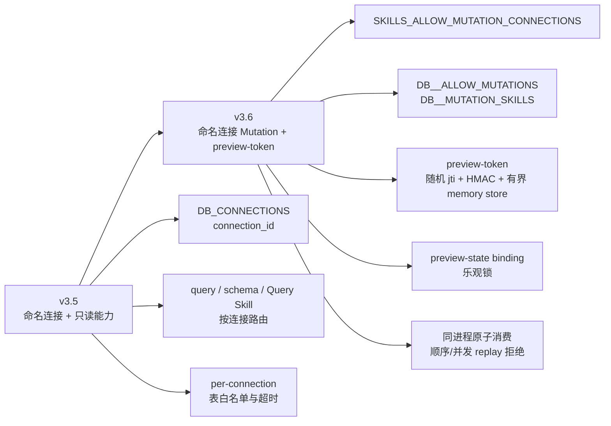
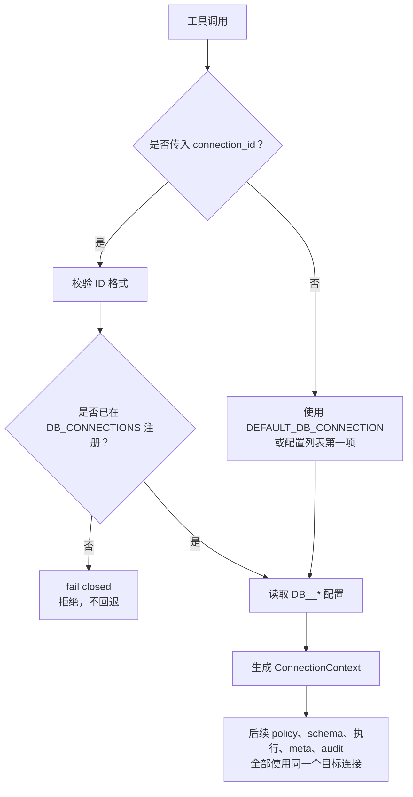
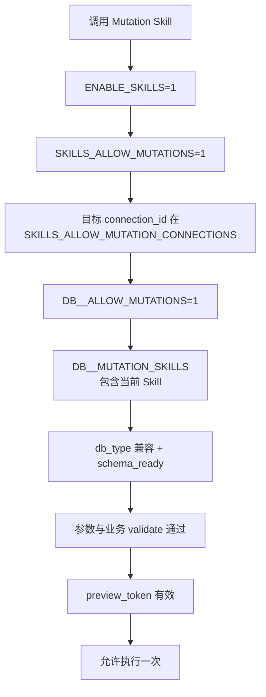
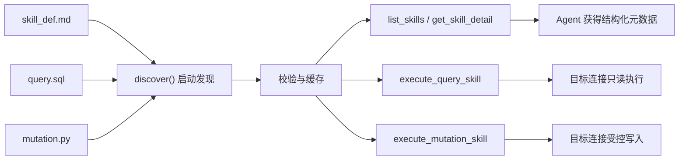
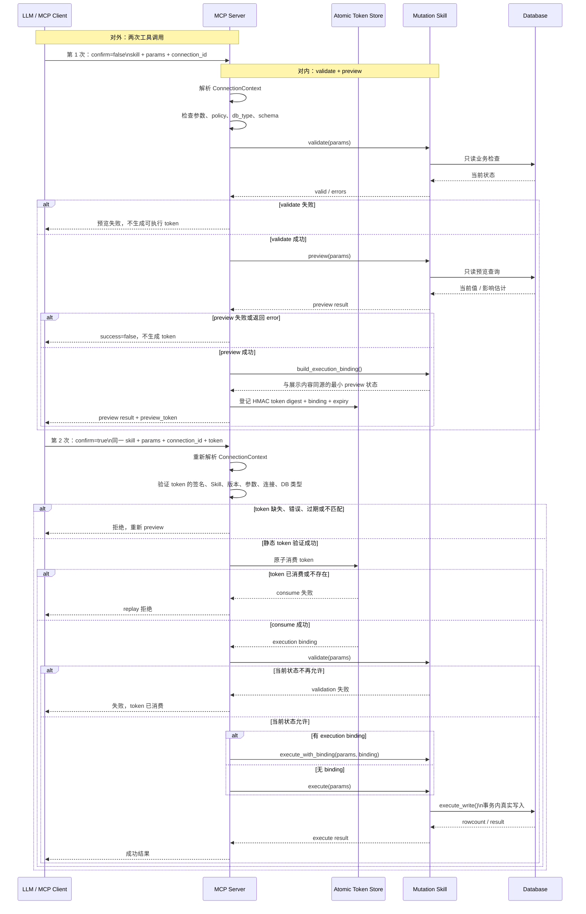

# v3.5-v3.6.1 命名连接与 Skills 易懂说明

> 本文是面向使用者、Skill 作者和代码审查者的说明，不替代
> [Skills 安全策略](../../skills/SAFETY.md)、[Skills 设计文档](../../MCP_AGENTS_SKILLS_DESIGN.md)
> 或发布说明。
>
> 版本范围：v3.5 命名连接与只读 Skills，v3.6 命名 Mutation、preview-token
> 和严格写策略，以及 v3.6.1 的 preview/binding 修复与同进程部署契约定稿。
> v3.6.1 仍沿用 `RELEASE_NOTES_v3_6.md`。

## 1. 先看总图

这个项目有三条容易混淆的线：

```text
连接线：本次访问哪个数据库？
    DB_CONNECTIONS -> connection_id -> adapter -> 数据库

权限线：这个连接允许做什么？
    per-connection policy -> 表白名单 / Skill allowlist / 写开关

操作线：这一次写操作是否经过预览并且还是同一项操作？
    confirm=false -> preview -> preview_token
    confirm=true  -> token 校验 -> execute
```

### 1.1 v3.5 和 v3.6 的区别



### 1.2 v3.6 和 v3.6.1 的区别

| 项目 | v3.6 基线 | v3.6.1 维护更新 |
|------|------------|-----------------|
| Preview token | 随机 `jti`、HMAC、参数/连接/版本绑定、有界进程内 store、原子一次性消费 | 保持格式和默认值不变 |
| Preview 状态 | 引入 execution binding 与乐观锁 | binding 改为使用实际展示给调用方的 preview 状态 |
| Preview 失败 | 已有两阶段协议 | `error` 字段或 `success=false` 一律不签发 token |
| 写入路径 | MCP 路径使用 binding | 公开的无 binding `execute()` 也明确 fail closed |
| 测试与部署 | 覆盖基本 token/binding 行为 | 加固 secret rotation、脱敏、数据库异常和工具层并发 replay；正式明确同进程边界 |
| 配置与审计 | TTL、容量和 best-effort audit 基线 | 容量增加 `100000` 硬上限；启动时安全报告 key/policy 模式；token 消费后的动态 validation 拒绝尝试 execute audit |

v3.6.1 没有改变 Mutation Skill API、token 格式、默认 TTL、默认容量或数据库
写入语义，也没有新增共享 token backend。它修复正确性和测试证据，并把推荐
部署定为客户端自有的 stdio 进程。受信任私有环境中的条件性 HTTP mutation
只能运行一个启用 mutation 的进程；多用户认证 HTTP mutation 不属于本版本。

## 2. `DB_CONNECTIONS` 和 `connection_id`

### 2.1 `DB_CONNECTIONS` 做什么？

```dotenv
DB_CONNECTIONS=mysql,analytics
DEFAULT_DB_CONNECTION=mysql
```

`DB_CONNECTIONS` 是命名连接模式的开关，同时注册两个连接 ID：

```text
mysql
analytics
```

这两个名字都是 `connection_id`。它们可以叫别的名字：

```dotenv
DB_CONNECTIONS=production,reporting
DEFAULT_DB_CONNECTION=production
```

连接 ID 是服务端配置的安全别名，不是：

- DSN 或数据库 URL；
- host、端口、用户名或密码；
- SQLite 文件路径；
- 模型可以临时创建的数据库连接。

### 2.2 每个 ID 对应一组服务端配置

```dotenv
DB_MYSQL_TYPE=mysql
DB_MYSQL_HOST=your_mysql_host
DB_MYSQL_NAME=trade_data_analysis
DB_MYSQL_ALLOWED_TABLES=orders,customers

DB_ANALYTICS_TYPE=sqlite
DB_ANALYTICS_SQLITE_DATABASE_PATH=./sample_data/demo.db
DB_ANALYTICS_ALLOWED_TABLES=orders
```

关系是：

```text
DB_MYSQL_*     -> connection_id=mysql
DB_ANALYTICS_* -> connection_id=analytics
```

`mysql` 这个连接 ID 恰好和数据库类型 `mysql` 同名，但二者概念不同：

```text
connection_id=mysql -> 某一个已配置的 MySQL 目标
 db_type=mysql      -> 该目标使用 MySQL 方言
```

同一种数据库类型可以有多个不同目标：

```text
orders_prod -> MySQL 生产订单库
orders_test -> MySQL 测试订单库
hr           -> MySQL 人事库
```

### 2.3 `DEFAULT_DB_CONNECTION`

```dotenv
DEFAULT_DB_CONNECTION=mysql
```

表示工具调用省略 `connection_id` 时使用 `mysql`。

```text
query(sql="SELECT ...")
    等价于
query(sql="SELECT ...", connection_id="mysql")
```

命名模式下，默认 ID 必须出现在 `DB_CONNECTIONS` 中。未知 ID 不会悄悄回退到默认连接，而是直接失败。

如果没有设置 `DB_CONNECTIONS`，系统处于 legacy 单连接模式：

```text
DB_TYPE / DB_USER / DB_HOST / DB_NAME / SQLITE_DATABASE_PATH
```

继续生效，而 `DB_<ID>_*` 和 `DEFAULT_DB_CONNECTION` 会被忽略。

### 2.4 连接解析顺序



## 3. 连接级表白名单

表白名单没有过时，而是从“单连接全局配置”扩展为“每个连接独立配置”。

```dotenv
DB_ORDERS_PROD_ALLOWED_TABLES=orders,customers
DB_ANALYTICS_ALLOWED_TABLES=orders
```

效果：

```text
connection_id=orders_prod -> 允许 orders、customers
connection_id=analytics   -> 只允许 orders
```

因此相同的表名在不同数据库中可以有不同策略。服务端会先解析连接，再使用该连接自己的：

- `ALLOWED_TABLES`；
- `ALLOW_UNION`；
- 查询/连接超时；
- schema readiness；
- adapter 和方言辅助 SQL。

表白名单控制“能访问哪些表”，不是 Mutation 写权限。Mutation 写权限另由下列配置控制：

```dotenv
SKILLS_ALLOW_MUTATION_CONNECTIONS=analytics
DB_ANALYTICS_ALLOW_MUTATIONS=1
DB_ANALYTICS_MUTATION_SKILLS=update-order-status
```

当前本地 `.env` 中 MySQL 使用 `DB_MYSQL_ALLOWED_TABLES=*`，这适合联调但扩大了读权限；生产环境应改成实际需要的明确列表。

## 4. `skill_def.md` 中各字段是什么？

以 `update-order-status` 为例：

```yaml
name: update-order-status
version: "1.0"
type: mutation
source: mutation.py
risk: medium
requires_confirmation: true
idempotent: false
profiles: [demo]
tables: [orders]
params:
  order_id: {type: int, required: true}
  new_status: {type: str, required: true, enum: [pending, confirmed, shipped, delivered, cancelled, returned]}
```

### 4.1 `databases`：数据库类型兼容性

```yaml
databases: [mysql, sqlite]
```

表示 Skill 支持 MySQL 和 SQLite 两种数据库类型，不表示连接 ID。

这里是可选字段的通用示例；当前仓库的 `update-order-status/skill_def.md`
实际没有声明 `databases`，因此其 `SkillMetadata.databases` 为 `None`，不会仅因
`db_type` 不同而被运行时拒绝。它仍然必须通过目标连接的表、policy、业务校验和
Mutation 写策略；是否真的适用于某个库不能只由省略该字段推出。

当前没有把 `connection_id` 写进 Skill 元数据的强制字段：

```yaml
# 当前版本不要依赖这个字段做连接授权
connections: [mysql, analytics]
```

连接目标由工具调用的 `connection_id` 选择，连接级写授权由服务端环境策略控制。

如果两个 MySQL 库的 `orders` 表业务含义不同，不能只靠 `databases: [mysql]` 证明它们都适用。应通过独立 Skill、连接 allowlist、schema 检查和 Skill 自己的业务校验来区分；当前版本的 schema readiness 主要检查表是否存在，不会完整证明每一列的语义相同。

### 4.2 `profiles: [demo]`：部署/运营标签

```yaml
profiles: [demo]
```

`demo` 是一个 profile 标签，说明这是仓库内置的演示 Skill。它不是：

- `connection_id`；
- 数据库类型；
- 自动选择规则；
- 写权限。

生产环境可以配置：

```dotenv
SKILLS_EXCLUDE_PROFILES=demo
```

匹配的 Skill 会从默认发现面隐藏，并在直接执行时拒绝。这样可以保留示例文件，同时避免误用于生产 schema。

### 4.3 `tables: [orders]`：所需表声明

```yaml
tables: [orders]
```

表示这个 Skill 需要目标连接中存在 `orders` 表，用于：

- `schema_ready` 检查；
- `list_skills(available_only=true)` 的可用性过滤；
- Skill 详情和发现信息；
- Query Skill 的目标连接表白名单检查。

它不等于：

```text
允许写 orders
```

也不能证明不同数据库中的 `orders` 表业务含义完全一致。真正的写授权仍在连接 policy 中。

## 5. Mutation 写权限配置

### 5.1 全局与连接级开关

```dotenv
ENABLE_SKILLS=1
SKILLS_ALLOW_MUTATIONS=1
SKILLS_ALLOW_MUTATION_CONNECTIONS=mysql,analytics

DB_MYSQL_ALLOW_MUTATIONS=1
DB_MYSQL_MUTATION_SKILLS=update-order-status

DB_ANALYTICS_ALLOW_MUTATIONS=1
DB_ANALYTICS_MUTATION_SKILLS=update-order-status
```

各配置解决不同问题：

```text
ENABLE_SKILLS
    是否启用整个 Skills 层

SKILLS_ALLOW_MUTATIONS
    是否注册/允许 Mutation 工具

SKILLS_ALLOW_MUTATION_CONNECTIONS
    哪些 connection_id 有资格成为 Mutation 目标

DB_<ID>_ALLOW_MUTATIONS
    该连接是否打开写开关

DB_<ID>_MUTATION_SKILLS
    该连接允许哪些 Mutation Skill
```

完整授权链：



如果不设置 `SKILLS_ALLOW_MUTATION_CONNECTIONS`，为保持兼容性，Mutation 目标仍限制为默认连接。

上图表示必须同时满足的授权依赖，不是严格的代码执行顺序。实际 execute 会先做
基础参数/policy 检查，再验证并原子消费 `preview_token`，之后才重新执行动态的
`mutation.validate()`，最后进入写入。

## 6. Skill 的启动和运行

Skill 不是让 Agent 自己读取源码并自由写 SQL。服务端启动时会：

1. 解析 `skill_def.md` 的 YAML frontmatter；
2. 校验 Skill 名称、参数 schema、`source` 文件名；
3. Query Skill 在启动期校验 SQL 并缓存模板；
4. Mutation Skill 导入并缓存 `MutationBase` 的具体子类；
5. 运行时使用缓存，不从磁盘临时读取执行文件。



## 7. Mutation 是“两次调用”还是“三个阶段”？

两种说法都对，但指的是不同层面。

### 对外：两次 MCP 工具调用

```text
第一次：confirm=false
    预览，不写数据库，返回 preview_token

第二次：confirm=true + preview_token
    验证并执行真正写入
```

### 对内：三种业务职责

```text
validate()
    判断业务上现在能不能做

preview()
    展示如果执行准备做什么，不执行写入

execute() / execute_with_binding()
    通过 execute_write() 在事务中真正修改数据库
```

完整排列是：

```text
第一次调用：validate() -> preview() -> 生成 token
第二次调用：验证并消费 token -> validate() -> execute()
```

`validate()` 在两个调用中都会出现，是因为 preview 和 execute 之间数据库状态可能变化。

### 7.1 `validate()` 和 `preview()` 的区别

```text
validate()：现在允许做吗？
preview() ：如果允许做，具体会做什么？
```

`validate()` 负责业务前置条件，例如：

- 订单是否存在；
- 新状态是否属于允许枚举；
- 当前状态是否允许转换；
- 库存、余额或审批状态是否满足条件。

`preview()` 可以执行只读查询来展示：

- 当前值和目标值；
- 预览 SQL；
- 参数绑定；
- 预计影响行数；
- warnings；
- 是否需要确认。

`preview()` 不应执行 `INSERT`、`UPDATE`、`DELETE`。

## 8. `confirm`、人类确认与 token

### 8.1 `confirm` 是什么？

`confirm` 是流程分支参数：

```text
confirm=false -> preview 分支
confirm=true  -> execute 分支
```

它不是：

- 人类身份认证；
- 权限授予；
- 数据库锁；
- token 本身。

如果 MCP 客户端弹出确认 UI 并由人点击允许，客户端可能随后发送 `confirm=true`；但服务端从这个布尔值本身无法证明一定有人类点击。自动化 Agent 也可以在分析 preview 后发送 `confirm=true`。

### 8.2 `preview_token` 绑定什么？

Token 绑定的是“一次具体的预览操作”，不是一个泛化的“允许这个 Skill”标记：

```text
skill_name
skill_version
规范化 params 的 hash
connection_id
db_type
签发时间与过期时间
preview-time execution binding 的 hash
随机 jti
```

为什么绑定多个属性？

```text
绑定 connection_id
    防止在 analytics preview、在 mysql execute

绑定 params
    防止 preview order_id=42、execute order_id=99

绑定 Skill version
    防止用户看到 v1 的预览，却执行后来变成 v2 的逻辑

绑定 preview 状态
    防止 preview 看到 confirmed，却覆盖后来已经变成 cancelled 的订单
```

Token 由 HMAC 防篡改，并登记在当前进程的有界原子 memory store 中防止重复消费。

### 8.3 为什么 execute 不再次调用 `preview()`？

`preview()` 是第一次预览时对用户展示的计划。如果 execute 前重新 preview，数据库可能已经变了，重新生成的结果可能不是用户看到的那份计划。

因此当前做法是：

```text
preview 阶段保存最小必要的 execution binding
execute 阶段验证 token，并使用这份 binding
```

但 execute 仍会再次 `validate()`，因为它需要检查当前业务状态是否还允许执行。

## 9. 数据库状态变化与乐观锁

preview 和 execute 之间数据库当然可能变化：

```text
10:00 preview：订单 42 = confirmed，准备改为 shipped
10:01 其他系统：订单 42 = cancelled
10:02 execute
```

当前订单 Skill 在 preview 时绑定：

```text
expected_status=confirmed
```

执行时使用类似条件：

```sql
UPDATE orders
SET status = :new_status
WHERE id = :order_id
  AND status = :expected_status
```

如果状态已经变成 `cancelled`，影响行数为 0，系统报告乐观锁失败，不会覆盖后来发生的修改。

注意：token 不会冻结数据库，也不会锁住 preview 到 execute 的整个时间间隔。每个状态敏感 Skill 都应实现自己的 `build_execution_binding()` 和 `execute_with_binding()`。

## 10. Token 错误、过期和一次性消费

### 10.1 错误 token 会怎样？

```text
缺少 token
    -> 要求先 confirm=false

HMAC 错误、格式错误
    -> Invalid preview_token; run preview again.

参数、连接、Skill 或版本不匹配
    -> preview_token does not match this mutation request

过期
    -> Expired preview_token; run preview again.

已消费、重启后丢失或 store 中不存在
    -> preview_token has already been used ...
```

这些错误不会执行写入。静态拒绝通常不会消费一个本来有效的 token；只有把请求
恢复为该 token 原先绑定的参数、连接、Skill 和版本后，原 token 才可能继续使用，
并且仍须满足有效期和进程内 store 状态。

### 10.2 “一次性”是什么意思？

每次成功的 preview 都生成一个新 token；每个 token 最多成功消费一次。

它不是“每个 Skill 永远只有一个 token”：

```text
第一次 preview -> token A
第二次 preview -> token B
```

当前 execute 在通过静态 token 检查后，会在动态 validation 和数据库写入前原子消费 token。消费后即使发生 validation、数据库、超时、audit 或响应失败，也不会恢复；需要重新 preview。

这样做是保守策略：如果一次写请求结果不确定，系统不能凭旧 token 自动重试，以免重复写入。

HMAC 与 memory store 不是同一层防护：HMAC 检测 token 篡改，并让参数、连接、
Skill 或版本不匹配在消费前被拒绝；store 证明 token 确实由当前进程签发，保存
canonical execution binding，并原子实施一次性消费。v3.6.1 不允许任意一层替代
另一层。消费后的 binding compare 是内部一致性检查，不是第三个独立授权边界。

Token 对调用方是 API-opaque，但内容并未加密；调用方不得解析或依赖其内部格式。
Token 必然经过授权客户端，并可能进入模型上下文，因此应尽量减少持久保存和日志
记录、限制上下文与日志访问。Bearer confidentiality 在 token 消费或过期前仍然
重要；短 TTL、精确绑定和原子一次性消费只能限制、不能消除泄露影响。适用工具
metadata 中的短 `preview_token_id` 只是客户端关联提示；audit 和 telemetry 不会
持久化完整 token 或这个短标识。

### 10.3 MCP 的无状态性取舍

只读请求可以接近无状态；Mutation token store 是当前进程内的有界 memory store：

```text
stdio -> preview/execute 必须在同一客户端启动的 MCP 子进程中完成
HTTP  -> 仅限受信任私有边界，且只运行一个启用 mutation 的进程
```

stdio 是推荐基线。v3.6.1 不定义多用户认证 HTTP mutation 服务，程序也不会自动
检测 worker 或 replica 数；部署配置必须保证 mutation 进程数为 1。不得把多个
启用 mutation 的 memory worker 放在普通负载均衡器后。进程重启、
滚动发布或请求进入其他进程时，旧 token 都会 fail closed，调用方必须重新
preview；即使固定 `MUTATION_PREVIEW_TOKEN_SECRET` 也不能恢复 store 状态。
只读容量只能通过独立的 read-only endpoint、profile 或 pool 横向扩展。
v3.6.1 不提供共享 token backend，也不会退回可重放的 stateless HMAC-only 校验。

## 11. `mutation.py` 固定接口契约

`mutation.py` 应遵守固定的结构契约，但业务规则可以各不相同：

```python
from mutation_base import MutationBase


class Mutation(MutationBase):
    def validate(self, params: dict) -> dict:
        ...

    def preview(self, params: dict) -> dict:
        ...

    def execute(self, params: dict) -> dict:
        ...
```

### 必须实现的方法

```text
validate(params) -> {"valid": True}
                       或 {"valid": False, "errors": [...]}

preview(params) -> 可 JSON 序列化的预览字典

execute(params) -> 实际执行结果字典，或抛出 ToolError
```

### 状态敏感 Skill 的可选扩展

```python
def build_execution_binding(self, params, validation, preview) -> dict:
    ...


def execute_with_binding(self, params, execution_binding) -> dict:
    ...
```

如果返回非空 binding 却没有正确实现 `execute_with_binding()`，基类会拒绝执行，而不是静默忽略 binding。

### 代码边界

`mutation.py` 使用服务端注入的 `self.adapter`，不应：

- 自行读取 DSN 或凭据；
- 自行创建任意数据库连接；
- 拼接未经参数绑定的 SQL；
- 接受 Agent 传入的自由 SQL；
- 访问外部 HTTP；
- 读写任意文件；
- 启动 subprocess。

loader 会在启动时要求 `Mutation` 是具体的 `MutationBase` 子类并缓存它，但这不是不可信插件 sandbox；`skills/` 与源代码属于同一个信任边界，仍需要代码审查。

## 12. 一张完整流程图



## 13. 当前配置示例（不含真实凭据）

```dotenv
DB_CONNECTIONS=mysql,analytics
DEFAULT_DB_CONNECTION=mysql

DB_MYSQL_TYPE=mysql
DB_MYSQL_USER=your_user
DB_MYSQL_PASSWORD=your_password
DB_MYSQL_HOST=your_host
DB_MYSQL_NAME=your_database
DB_MYSQL_ALLOWED_TABLES=orders,customers
DB_MYSQL_ALLOW_MUTATIONS=0

DB_ANALYTICS_TYPE=sqlite
DB_ANALYTICS_SQLITE_DATABASE_PATH=./sample_data/demo.db
DB_ANALYTICS_ALLOWED_TABLES=orders
DB_ANALYTICS_ALLOW_MUTATIONS=1
DB_ANALYTICS_MUTATION_SKILLS=update-order-status

ENABLE_SKILLS=1
SKILLS_ALLOW_MUTATIONS=1
SKILLS_ALLOW_MUTATION_CONNECTIONS=analytics

MUTATION_PREVIEW_TOKEN_TTL_SECONDS=300  # 有效范围 1-86400 秒
MUTATION_PREVIEW_TOKEN_STORE_MAX_ENTRIES=10000  # 有效范围 1-100000
# 可选：只在服务端环境设置，不要交给 Agent
# 固定 secret 不会让 token 在进程重启或跨进程后恢复
# 建议至少 32 个随机字节；启动日志只报告来源模式，不记录 secret
# MUTATION_PREVIEW_TOKEN_SECRET=replace_with_at_least_32_random_bytes
```

结果大小限制仍然是进程级配置，而不是连接级：

```dotenv
MAX_RESULT_ROWS=100
MAX_RESULT_CHARS=16000
MAX_SCHEMA_TABLES=50
MAX_OVERVIEW_TABLES=100
```

## 14. 本 session 的联调结论

本 session 有两类联调记录，下面需要区分：本节前半描述的是聊天中直接使用当前
本地/业务配置的保守验证批次；链接的完整 live fixture 记录则是另一批使用临时
订单并清理数据的协议测试。两批结果相互印证，但写入范围不同。

真实 MCP 配置联调验证了：

- `mysql`、`analytics` 均可连接；
- `connection_id` 正确影响表可见性、Skill 方言和执行目标；
- SQLite 的 `orders` 白名单会拒绝 `widgets`；
- 跨连接 token、错误参数和篡改 token 会在写入前拒绝；
- 正确 token 可以完成一次 SQLite Mutation；
- 同一 token 的 replay 会被拒绝；
- 远程 MySQL 写入在该批次中未执行。

补充的完整 live fixture 批次见
[真实 MCP 联调记录](../LIVE_MCP_TSET/LIVE_MCP_TEST_V36_ZH.md)：该批次在
MySQL 和 SQLite 两端都使用临时订单完成 preview/execute/replay 测试，并在结束后
清理临时数据。因此，“本节批次未执行远程 MySQL 写入”和“完整 fixture 批次验证了
MySQL 写入”并不矛盾，不能把两批写入范围合并描述。

真实联调不是穷尽式生产证明。尤其需要持续注意：MySQL 当前若配置 `ALLOWED_TABLES=*` 和 Mutation 写权限，会扩大真实数据库的 blast radius；v3.6.1 的 mutation endpoint 只支持单个启用 mutation 的进程，不能将多个 memory worker 放在普通负载均衡器后。

## 15. 相关文档

- [v3.5 发布说明](../RELEASE_NOTES_v3_5.md)
- [v3.6/v3.6.1 发布说明](../RELEASE_NOTES_v3_6.md)
- [Skills 设计文档](../../MCP_AGENTS_SKILLS_DESIGN.md)
- [Skills 安全策略](../../skills/SAFETY.md)
- [设计风险登记表](../../DESIGN_RISK_REGISTER_ZH.md)
- [真实 MCP 联调记录](../LIVE_MCP_TSET/LIVE_MCP_TEST_V36_ZH.md)
