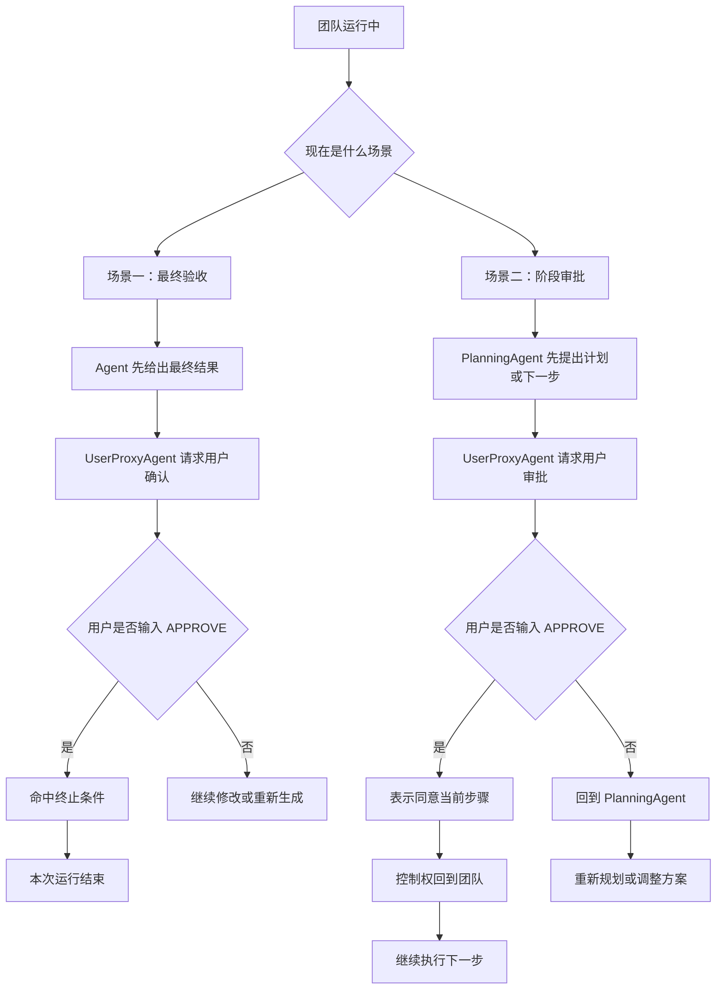
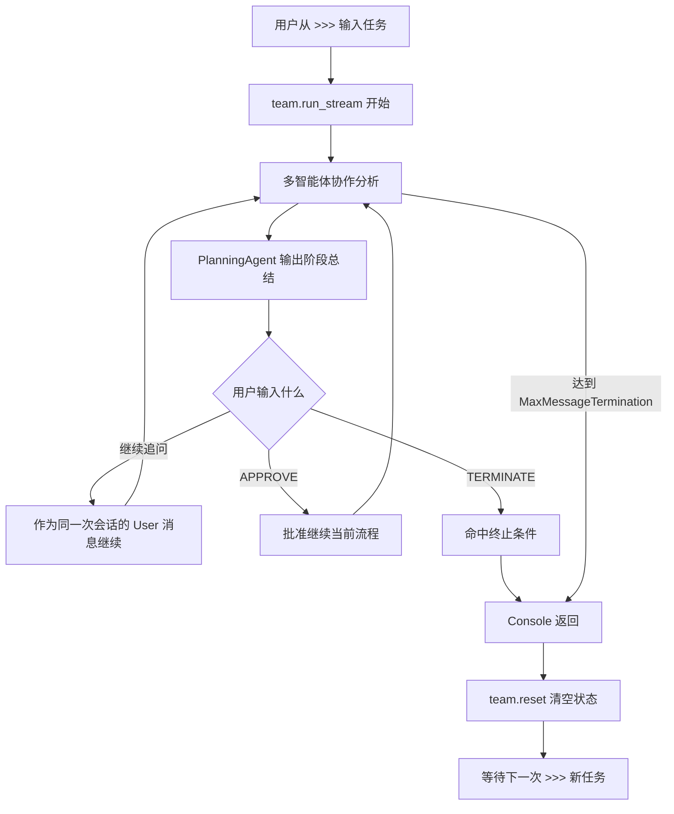

# AutoGen 多智能体 SQL 查询系统 — 技术文档

**位置：** `agent_examples/autogen_sql_agent_new.py`（~1250 行）  
**框架：** Microsoft AutoGen v3.0  
**传输方式：** stdio（通过子进程启动 MCP 服务器）

## 概述

本目录包含 AutoGen 框架实现的多智能体 SQL 查询系统，通过 stdio 传输方式与 MCP SQL Safety Checker 服务器交互。

| 文件 | 框架 | 版本 | 关键特性 |
|------|------|------|----------|
| `autogen_sql_agent_new.py` | Microsoft AutoGen | v3.0 | `McpWorkbench`、`SelectorGroupChat`、Gemini thinking 补丁 |

> **注意**：旧版 `autogen_sql_agent.py`（v2.x，不支持 Skills/SQLite）保留在项目根目录作为历史参考。

---

## 1. 架构概览

### 1.1 多智能体协作架构

三个 AI 智能体 + 一个人类用户，通过 `SelectorGroupChat` 协作完成数据库查询任务：

```
用户输入 → PlanningAgent → SQLExecutorAgent (MCP 工具) → AnalystAgent → 用户
                 ↑                                              |
                 └──────── SelectorGroupChat 路由 ─────────────┘
```

| 智能体 | 职责 | 工具访问 |
|--------|------|----------|
| **PlanningAgent** | 分解任务、协调团队、跟踪进度、汇总结果 | 无 |
| **SQLExecutorAgent** | 执行 SQL 查询和 Skills 操作 | MCP 工具（5–10 个） |
| **AnalystAgent** | 解读查询结果、发现模式、提供洞察 | 无 |
| **User**（UserProxyAgent） | 提供反馈、审批变更、终止对话 | 键盘输入 |

### 1.2 核心设计原则

- **启动时动态工具发现** — 通过 `McpWorkbench.list_tools()` 检测服务器已注册的工具，Agent 只了解实际存在的工具
- **能力感知提示词** — 根据 `ServerCapabilities` 布尔标志，条件性生成/省略提示词段落
- **服务器提示词融合** — 从 MCP 服务器获取 `sql_assistant` 提示词，作为补充上下文注入 SQLExecutorAgent
- **MCP Server 兼容性** — 核心工具 + 可选 `sample`/`get_table_summary` + Skills 工具，同一份代码适配任意服务器配置

### 1.3 MCP 工具兼容性

| 类别 | 工具 | 服务器配置条件 |
|------|------|----------------|
| 核心（始终可用） | `query`, `list_tables`, `describe_table`, `get_full_schema`, `check_connection` | — |
| 可选 | `sample` | `ENABLE_SCHEMA_TOOLS=1` |
| 可选 | `get_table_summary` | `ENABLE_TABLE_SUMMARY=1` |
| Skills | `list_skills`, `execute_query_skill` | `ENABLE_SKILLS=1` |
| Skills（变更） | `execute_mutation_skill` | `SKILLS_ALLOW_MUTATIONS=1` |

### 1.4 LLM 后端支持

`get_model_client()` 按优先级依次检测：

| 优先级 | 后端 | 环境变量 | 默认模型 |
|--------|------|----------|----------|
| 1 | Google Gemini | `GEMINI_API_KEY` | `gemini-2.5-flash-lite-preview-09-2025` |
| 2 | OpenAI | `OPENAI_API_KEY` | `gpt-4o-mini` |
| 3 | 本地 Ollama | `USE_OLLAMA=true` | `qwen2.5:7b` |

所有后端统一使用 `OpenAIChatCompletionClient`（兼容 OpenAI API 格式）。

---

## 2. 代码结构

```
autogen_sql_agent_new.py (~1250 行)
│
├─ 模块文档 & 导入
│   ├─ 标准库: asyncio, logging, os, sys, dataclasses, typing, dotenv
│   ├─ autogen_agentchat: AssistantAgent, UserProxyAgent, SelectorGroupChat,
│   │   TextMentionTermination, MaxMessageTermination, Console
│   ├─ autogen_ext: OpenAIChatCompletionClient, McpWorkbench, StdioServerParams
│   └─ autogen_core: ModelInfo, BufferedChatCompletionContext,
│       TokenLimitedChatCompletionContext, CancellationToken
│
├─ Gemini 思维模型兼容性补丁
│   ├─ _GEMINI_THINKING_PATCH_ENABLED          全局开关（默认 False）
│   └─ _apply_gemini_thinking_patch()          导入时应用的猴子补丁
│
├─ LLM 配置
│   └─ get_model_client()                      → (OpenAIChatCompletionClient, str)
│       优先级: GEMINI_API_KEY → OPENAI_API_KEY → USE_OLLAMA
│
├─ 服务器能力检测
│   ├─ ServerCapabilities @dataclass
│   │   字段: tool_names, has_skills, has_mutation_skills,
│   │         has_sample, has_table_summary, server_prompt
│   └─ detect_server_capabilities()            async，调用 list_tools() + get_prompt()
│
├─ 动态提示词构建器
│   ├─ build_planning_prompt(caps)             PlanningAgent 系统提示词
│   ├─ build_sql_executor_prompt(caps)         SQLExecutorAgent 系统提示词
│   ├─ build_analyst_prompt(caps)              AnalystAgent 系统提示词
│   └─ build_selector_prompt(caps)             SelectorGroupChat 选择器提示词
│
├─ 智能体工厂
│   ├─ _build_sql_executor_description(caps)   动态智能体描述
│   └─ _create_agents()                        main() 和 run_single_task() 共用
│       返回: {planning, sql_executor, analyst, [user_proxy]}
│
├─ 选择器函数
│   └─ create_selector_func()                  返回包含 5 条硬规则的闭包
│       规则 1: 历史为空 → PlanningAgent
│       规则 2: 非规划智能体发言后 → PlanningAgent（进度检查）
│       规则 3: User 输入 APPROVE → PlanningAgent（批准后继续）
│       规则 4: PlanningAgent 连续 2+ 次发言 → User（循环中断）
│       规则 5: None → LLM 通过 selector_prompt 决定
│
├─ 主程序
│   ├─ _print_capabilities(caps)               控制台能力输出
│   ├─ _build_example_tasks(caps)              动态任务菜单
│   ├─ main()                                  交互模式（含 UserProxy）
│   │   └─ stdin flush (termios/select)        防止幽灵命令
│   └─ run_single_task(task)                   非交互模式（无 UserProxy）
│
└─ 程序入口
    └─ __main__ 块                              CLI 参数分发
```

---

## 3. 启动与初始化流程

```
┌─────────────────────────────────────────────────────┐
│                     程序启动                          │
└───────────────────┬─────────────────────────────────┘
                    │
                    ▼
┌─────────────────────────────────────────────────────┐
│  导入时: _apply_gemini_thinking_patch()              │
│  （对 func_call_to_oai 打猴子补丁，启用前不生效）     │
└───────────────────┬─────────────────────────────────┘
                    │
                    ▼
┌─────────────────────────────────────────────────────┐
│  get_model_client()                                  │
│  ┌─ GEMINI_API_KEY? ──► Gemini 客户端                │
│  │  （启用 _GEMINI_THINKING_PATCH_ENABLED = True）    │
│  ├─ OPENAI_API_KEY? ──► OpenAI 客户端                │
│  └─ USE_OLLAMA=true? ──► Ollama 客户端               │
└───────────────────┬─────────────────────────────────┘
                    │
                    ▼
┌─────────────────────────────────────────────────────┐
│  McpWorkbench(StdioServerParams) — 启动 MCP 服务器   │
│  （以子进程方式通过 stdio 启动 start_server.py）      │
└───────────────────┬─────────────────────────────────┘
                    │
                    ▼
┌─────────────────────────────────────────────────────┐
│  detect_server_capabilities(workbench)               │
│                                                      │
│  1. workbench.list_tools()                           │
│     → {query, list_tables, describe_table, ...}      │
│     → 推导: has_skills, has_mutation_skills, ...      │
│                                                      │
│  2. workbench.get_prompt("sql_assistant")            │
│     → 服务器动态生成的规则（UNION 策略、Skills 状态） │
│     → 存储为 caps.server_prompt                       │
└───────────────────┬─────────────────────────────────┘
                    │
                    ▼
┌─────────────────────────────────────────────────────┐
│  _create_agents(model_client, workbench, caps)       │
│  （使用能力感知的提示词构建智能体团队）               │
└───────────────────┬─────────────────────────────────┘
                    │
                    ▼
              ┌─────┴─────┐
              │  main()   │ 或  run_single_task()
              │（交互模式）     （非交互模式）
              └───────────┘
```

---

## 4. 核心机制详解

### 4.1 动态提示词系统

**核心挑战**：同一份代码需要适配任意 MCP 服务器配置（Skills 开/关、可选工具开/关）。静态提示词要么引用不存在的工具（导致 LLM 幻觉调用），要么遗漏可用工具。

**解决方案**：`ServerCapabilities` 数据类作为"功能标志包"，流经所有提示词构建器：

```
                      .env 配置文件
                   ┌──────────────────────┐
                   │ ENABLE_SKILLS=1      │
                   │ SKILLS_ALLOW_MUT...=1│
                   │ ENABLE_SCHEMA_TOOLS=0│
                   └──────────┬───────────┘
                              │
                   MCP 服务器注册工具
                              │
                              ▼
             detect_server_capabilities()
               ┌──────────────────────────┐
               │ ServerCapabilities       │
               │  has_skills: True        │
               │  has_mutation_skills: True│
               │  has_sample: False       │
               │  has_table_summary: False│
               │  server_prompt: "..."     │
               └────────────┬─────────────┘
                            │
        ┌───────────┬───────┴──────┬──────────────┐
        ▼           ▼              ▼              ▼
┌──────────────┐ ┌──────────┐ ┌──────────┐ ┌──────────────┐
│ Planning     │ │ SQL Exec │ │ Analyst  │ │ Selector     │
│ 提示词       │ │ 提示词   │ │ 提示词   │ │ 提示词       │
│              │ │          │ │          │ │              │
│ + SKILLS     │ │ + skills │ │ + skill  │ │ + mutation   │
│   WORKFLOW   │ │   tools  │ │   结果   │ │   审批       │
│ + MUTATION   │ │ + 服务器 │ │   格式   │ │   路由       │
│   SAFETY     │ │   提示词 │ │          │ │              │
│ - sample     │ │ - sample │ │          │ │              │
│  （不存在）   │ │ （不存在）│ │          │ │              │
└──────────────┘ └──────────┘ └──────────┘ └──────────────┘
       │               │            │             │
       ▼               ▼            ▼             ▼
 PlanningAgent   SQLExecutorAgent  AnalystAgent  SelectorGroupChat
(system_message) (system_message)  (system_msg)  (selector_prompt)
```

每个 `build_*_prompt(caps)` 函数根据布尔标志条件性地包含/排除提示词段落，使同一份代码针对不同服务器配置产生不同提示词——无需修改代码。

#### 各 Agent 提示词的条件性片段

| 构建函数 | 基础内容 | `has_skills` 时追加 | `has_mutation_skills` 时追加 | `has_sample` 时追加 | `has_table_summary` 时追加 |
|----------|----------|---------------------|------------------------------|---------------------|---------------------------|
| `build_planning_prompt` | 任务分解规则、效率规则、查询策略 | SKILLS WORKFLOW 段落 | MUTATION SAFETY 两阶段流程 | sample 工具提示 | — |
| `build_sql_executor_prompt` | 核心工具列表（5 个）、兼容性规则、token 优化 | Skills 工具列表 + 使用指南 | 变更 Skills 两阶段说明 | `sample()` 工具编号 | `get_table_summary()` 工具编号 |
| `build_analyst_prompt` | 分析职责、证据导向分析 | Skill 结果格式说明 | — | — | — |
| `build_selector_prompt` | 选择规则（6 条） | skills 路由提及 | mutation 预览 → 用户审批路由 | — | — |

#### 服务器提示词融合策略

`sql_assistant` 提示词从 MCP 服务器获取后，作为**补充**（而非替换）注入 SQLExecutorAgent：

- **手写提示词**包含：AutoGen 多智能体专用规则（results 摘要、token 优化、截断处理）
- **服务器提示词**包含：服务器配置相关规则（UNION 策略、安全策略、Skills 状态）
- 两者互补，确保智能体同时遵守框架规则和服务器规则

### 4.2 两层智能体路由

AutoGen 的 `SelectorGroupChat` 决定哪个智能体下一个发言。本方案采用两层设计：

```
          新一轮开始
                │
                ▼
   ┌─────────────────────────┐
   │ 第一层: selector_func   │  （硬规则——确定性）
   │ （Python 函数）          │
   └────────────┬────────────┘
                │
      ┌─────────┴──────────┐
      │ 返回了智能体名称？  │
      └─────────┬──────────┘
            是  │         否（返回 None）
                │              │
                ▼              ▼
       该智能体发言    ┌──────────────────────┐
                       │ 第二层: LLM 选择     │  （软规则——自适应）
                       │（selector_prompt +   │
                       │  对话历史）           │
                       └──────────┬───────────┘
                                  │
                                  ▼
                            智能体发言
```

#### `selector_func` 硬规则（`create_selector_func`）

| 优先级 | 条件 | 路由到 | 目的 |
|--------|------|--------|------|
| 规则 1 | `messages == []` | PlanningAgent | 始终由规划智能体开始 |
| 规则 2 | 上一个发言者既不是 Planning 也不是 User | PlanningAgent | 工作完成后审查进度 |
| 规则 3 | 上一个 User 消息恰好为 `APPROVE` | PlanningAgent | 将“批准”解释为继续推进，而不是结束 |
| 规则 4 | PlanningAgent 连续发言 2+ 次 | User | 打破空消息循环（安全阀） |
| 规则 5 | 以上都不满足 | `None`（LLM 决定） | 细粒度决策交给 LLM |

**为什么要两层？**
- 硬规则强制执行结构性约束（规划智能体始终审查每步进度）
- 软规则处理细粒度决策（下一步该用哪个工具智能体？）
- 规则 3 是安全阀：防止 PlanningAgent 独自无限循环、用空输出消耗消息预算

### 4.3 智能体工厂

`_create_agents()` 是 `main()` 和 `run_single_task()` 共享的工厂函数，避免代码重复。

#### 智能体创建配置

| 智能体 | 类型 | 关键参数 |
|--------|------|----------|
| PlanningAgent | `AssistantAgent` | `system_message=build_planning_prompt(caps)` |
| SQLExecutorAgent | `AssistantAgent` | `workbench=mcp_workbench`，`reflect_on_tool_use=False`，`max_tool_iterations=5`，`model_context=TokenLimitedChatCompletionContext(token_limit=16000)` |
| AnalystAgent | `AssistantAgent` | `system_message=build_analyst_prompt(caps)` |
| User | `UserProxyAgent` | 仅交互模式创建 |

**SQLExecutorAgent 特殊配置说明**：
- `reflect_on_tool_use=False`：禁用工具使用反思，因为 Gemini 思维模型会间歇性违反 `tool_choice="none"` 约束
- `TokenLimitedChatCompletionContext(token_limit=16000)`：限制上下文 token 数，防止大量查询结果导致 token 爆炸
- `max_tool_iterations=5`：允许多步工具调用（例如先 `list_tables` 再 `query`）

### 4.4 Gemini 思维模型补丁

Gemini 2.5+/3.x 思维模型在函数调用响应中返回 `thought_signature`，后续请求中必须原样回传，否则返回 400 错误。AutoGen 的 `FunctionCall` 数据类只有 `(id, arguments, name)` 三个字段，无法携带此签名。

```
  问题：
  ┌────────────┐    tool_call 响应      ┌──────────────────┐
  │ Gemini API │ ──────────────────────► │ AutoGen          │
  │            │    包含:                │ FunctionCall     │
  │            │    thought_signature    │ 数据类:          │
  │            │    = "abc123..."        │  .id             │
  └────────────┘                         │  .name           │
                                         │  .arguments      │
                                         │ （无 extra 字段） │
                                         └───────┬──────────┘
                                                  │
                                         签名被静默丢弃
                                                  │
                                                  ▼
  ┌────────────┐    下一个请求           ┌──────────────────┐
  │ Gemini API │ ◄────────────────────── │ AutoGen 发送     │
  │            │    缺少:                │ 不含签名的        │
  │ 400 错误!  │    thought_signature    │ tool_call        │
  └────────────┘                         └──────────────────┘
```

**解决方案**：猴子补丁 `_apply_gemini_thinking_patch()`，包装 `func_call_to_oai()` 函数，在每个 tool_call 中注入 Google 官方的虚拟签名值 `"skip_thought_signature_validator"`。

```
  ┌──────────────────────────────────────────────────────────┐
  │  _apply_gemini_thinking_patch()                          │
  │                                                          │
  │  包装 func_call_to_oai() 注入:                            │
  │    extra_content = {                                     │
  │      "google": {                                         │
  │        "thought_signature":                              │
  │          "skip_thought_signature_validator"   ← 虚拟值   │
  │      }                                                   │
  │    }                                                     │
  │                                                          │
  │  仅当 _GEMINI_THINKING_PATCH_ENABLED = True 时激活       │
  │  （由 get_model_client() 检测到 Gemini 时设置）           │
  └──────────────────────────────────────────────────────────┘
```

- 程序启动时立即应用补丁（导入时）
- 仅当 `_GEMINI_THINKING_PATCH_ENABLED = True` 时生效（由 `get_model_client()` 检测到 Gemini 时自动设置）
- 参考：https://ai.google.dev/gemini-api/docs/thought-signatures

### 4.5 stdin 缓冲区刷新

在交互模式的输入循环前，使用 `termios.tcflush(sys.stdin, TCIFLUSH)` 清除操作系统终端驱动的输入缓冲区。这可以防止"幽灵命令"——MCP 服务器启动期间残留的按键被误读为用户输入。

在非 Unix 系统上（`termios` 不可用）回退为 `select()` 轮询。

### 4.6 官方依据

本项目关于“会话是否保留上下文”“何时清空状态”“用户批准意味着什么”的设计，直接参考了 AutoGen 官方文档和仓库实现，可归纳为三条：

- **Team 默认有状态**：AutoGen 官方在 `SelectorGroupChat` 文档中说明，任务结束后，对话上下文会保留在 team 和所有参与者内部；如果要清空上下文，需要显式调用 `reset()`。
- **`reset()` 会清空 Team 和 Agent 状态**：官方 `Teams` 教程说明，`reset()` 会清空 team 的状态，并调用每个 agent 的 `on_reset()`；GitHub 源码中的 `BaseGroupChat.reset()`、`SelectorGroupChatManager.reset()`、`ChatAgentContainer.handle_reset()` 也与此一致。
- **`APPROVE` 更适合作为“批准继续执行”的信号，而不是“立即结束会话”**：官方 `SelectorGroupChat` 的 User Feedback 示例和 Human-in-the-Loop 教程里，`UserProxyAgent` 负责在运行中收集用户反馈，`APPROVE` 用来批准当前步骤继续推进；会话结束通常由显式终止条件控制，例如 `TERMINATE`、`max_turns` 或其他 termination condition。

因此，本项目采用的解释是：**同一次 `run_stream()` 内部保留上下文；只有显式结束并在返回后调用 `team.reset()`，下一次新任务才会清空会话状态；`APPROVE` 表示批准继续流程，`TERMINATE` 表示结束当前会话。**

### 4.7 `APPROVE` 用户批准/继续执行 的说明

官方示例里，`APPROVE` 并不只有一种固定含义。更准确地说，**`APPROVE` 只是用户确认信号，它到底表示“结束”还是“继续”，取决于团队把它接到了终止条件，还是接到了下一步路由逻辑。**

下面这张图可以把两种常见语境分开看：



其中，和本项目更相关的是右侧的“阶段审批”语境。AutoGen 官方在 SelectorGroupChat 的 User Feedback 示例中直接写到：

> “If the user responds with `"APPROVE"`, the conversation continues, otherwise, the planning agent tries again, until the user approves.”

官方文档网址：

- SelectorGroupChat: https://microsoft.github.io/autogen/stable/user-guide/agentchat-user-guide/selector-group-chat.html
- 对应 GitHub 文档源文件: https://github.com/microsoft/autogen/blob/main/python/docs/src/user-guide/agentchat-user-guide/selector-group-chat.ipynb

这句话的含义非常直接：**如果用户回复 `APPROVE`，会话继续；如果用户不批准，就回到 PlanningAgent 调整方案，直到用户批准为止。** 换句话说，这里的 `APPROVE` 不是“收工”，而是“这一阶段我同意了，你们继续往下做”。

Human-in-the-Loop 教程也给了一个更通用的官方描述：

> “once the feedback is provided, the control is transferred back to the team and the team continues its execution.”

官方文档网址：

- Human-in-the-Loop: https://microsoft.github.io/autogen/stable/user-guide/agentchat-user-guide/tutorial/human-in-the-loop.html

这段话说明：当 `UserProxyAgent` 在运行中向用户请求反馈时，控制权会暂时转交给用户；一旦反馈返回，控制权再交还给团队，团队继续执行。因此，`APPROVE` 更像是一个**放行信号**，而不是一个必须等价于“终止”的固定关键字。

从工程角度看，可以把这两种官方语境理解成两个不同按钮：

- **验收通过并结束**：`APPROVE` 被接到 termination condition 上。
- **审批通过并继续**：`APPROVE` 被接到 selector / workflow 路由逻辑上。

本项目选择第二种语义：把 `APPROVE` 解释为“批准继续执行当前流程”，而把会话结束交给 `TERMINATE` 和 `MaxMessageTermination`。这更适合 SQL 查询、mutation preview、分阶段审批这类需要人在关键节点放行的工作流。

---

## 5. 任务执行流程

### 5.1 典型任务时序图

```
 User          PlanningAgent     SQLExecutorAgent    AnalystAgent
  │                 │                   │                 │
  │ "查找最大客户"  │                   │                 │
  │────────────────►│                   │                 │
  │                 │                   │                 │
  │         [规则 1: 开始]              │                 │
  │                 │                   │                 │
  │                 │ "步骤1: 列出表    │                 │
  │                 │  步骤2: 查询      │                 │
  │                 │  步骤3: 分析"     │                 │
  │                 │──────────────────►│                 │
  │                 │                   │                 │
  │         [规则 2: 回到规划]          │                 │
  │                 │                   │                 │
  │                 │   list_tables()   │                 │
  │                 │   ← MCP 结果      │                 │
  │                 │◄──────────────────│                 │
  │                 │                   │                 │
  │                 │──────────────────►│                 │
  │                 │                   │ query(sql)      │
  │                 │                   │ ← MCP 结果      │
  │                 │◄──────────────────│                 │
  │                 │                   │                 │
  │         [规则 2: 回到规划]          │                 │
  │                 │                   │                 │
  │                 │───────────────────────────────────►│
  │                 │                   │   "根据数据..."  │
  │                 │◄───────────────────────────────────│
  │                 │                   │                 │
  │         [规则 2: 回到规划]          │                 │
  │                 │                   │                 │
  │                 │ "当前分析已完成，  │                 │
  │                 │  可继续或终止"      │                 │
  │  ◄──────────────│                   │                 │
  │                 │                   │                 │
  │  "继续追问"、     │                   │                 │
  │  "APPROVE" 或     │                   │                 │
  │  "TERMINATE"    │                   │                 │
  │────────────────►│                   │                 │
  │                 │                   │                 │
  │ 若继续追问：仍在同一次会话中          │                 │
  │ 若输入 APPROVE：批准继续流程         │                 │
  │ 若输入 TERMINATE：触发终止条件       │                 │
  │                 │                   │                 │
  ▼                 ▼                   ▼                 ▼
            继续当前会话 / 会话结束
```

### 5.2 “Task complete” 后会发生什么

`PlanningAgent` 输出“当前分析已完成。若要继续，请直接提出新请求；若要结束，请输入 TERMINATE”时，表示**当前阶段性分析已经完成**，但当前 `run_stream()` 还没有结束。

- 如果用户此时继续输入新的要求，这条消息会作为同一次 `SelectorGroupChat` 会话里的下一条 `User` 消息继续处理，因此团队仍然保留当前对话上下文。
- 如果用户输入 `APPROVE`，它表示“批准继续执行当前流程”，例如批准 mutation preview 后进入下一步，而**不会**直接结束会话。
- 如果用户输入 `TERMINATE`，交互模式下的 `TextMentionTermination` 会命中，当前这次会话结束。
- 只有当 `await Console(stream, output_stats=True)` 返回之后，主循环才会执行 `await team.reset()`，为下一次从 `>>>` 输入的新任务清空会话状态。

下面这张 Mermaid 图对应实际的会话循环：



### 5.3 两种执行模式对比

| 方面 | `main()`（交互模式） | `run_single_task()`（非交互模式） |
|------|---------------------|-------------------------------------|
| UserProxy | 包含 | 不包含 |
| 终止条件 | TERMINATE \| MaxMessage(30) | 仅 MaxMessage(30) |
| 循环 | 持续运行（每个任务后 `team.reset()`） | 单个任务，然后退出 |
| 适用场景 | 手动探索、多轮交互 | 脚本化、CI 测试 |
| CLI | `python autogen_sql_agent_new.py` | `python autogen_sql_agent_new.py "查询"` |

### 5.4 SelectorGroupChat 配置

`main()` 和 `run_single_task()` 共享的 `SelectorGroupChat` 关键参数：

| 参数 | 值 | 说明 |
|------|-----|------|
| `max_turns` | 30 | 额外安全限制，最多 30 轮 |
| `selector_prompt` | `build_selector_prompt(caps)` | 动态选择器提示词 |
| `selector_func` | `create_selector_func(...)` | 硬规则选择器（4 条规则） |
| `allow_repeated_speaker` | `True` | 允许同一智能体连续发言 |
| `model_context` | `BufferedChatCompletionContext(buffer_size=20)` | 限制选择器上下文大小 |

---

## 6. 设计决策

| 决策 | 选择 | 备选方案 | 理由 |
|------|------|----------|------|
| 工具发现 | 启动时 `McpWorkbench.list_tools()` | 静态提示词列出所有工具 | 防止 LLM 调用不存在的工具；适配任何服务器配置 |
| 服务器提示词 | 获取 `sql_assistant` 作为**补充** | 替换手写提示词 | 手写提示词包含 AutoGen 多 Agent 规则（摘要、截断），服务器提示词中没有 |
| 提示词构建 | 动态构建函数 + `ServerCapabilities` | 静态字符串常量 | 同一代码库兼容 ENABLE_SKILLS=0/1、ENABLE_SCHEMA_TOOLS=0/1 |
| Agent 工厂 | `_create_agents()` 共享函数 | main/run_single_task 中重复代码 | DRY 原则；单一位置更新 Agent 配置 |
| 数据库兼容性 | 移除 `SHOW`/`DESCRIBE` SQL 建议 | 保留仅 MySQL 提示 | 数据库可能是 MySQL 或 SQLite；MCP 工具抽象了差异 |
| Mutation 工作流 | 两阶段：`confirm=false` 预览 → 用户批准 → `confirm=true` 执行 | 自动确认 | 人在回路中（Anthropic：可验证的中间输出） |
| `APPROVE` 语义 | 批准继续执行当前流程 | 批准即终止会话 | 更贴近 AutoGen 官方 User Feedback / Human-in-the-Loop 示例 |
| `run_single_task` 终止 | 仅 `MaxMessageTermination` | 包含 UserProxy | 非交互模式没有人可以输入 APPROVE |
| `reflect_on_tool_use` | `False` | `True`（默认） | Gemini 思维模型间歇性违反 `tool_choice="none"` 约束 |

---

## 7. 参考资料

- **McpWorkbench API**：`list_tools()` → `List[ToolSchema]`、`get_prompt(name)` → `GetPromptResult`
- **Microsoft AutoGen**：[SelectorGroupChat 教程](https://microsoft.github.io/autogen/stable/user-guide/agentchat-user-guide/selector-group-chat.html)、[MCP 集成](https://learn.microsoft.com/en-us/azure/aks/ai-toolchain-operator-mcp)
- **Google Gemini**：["Keep the number of functions small for higher accuracy"](https://ai.google.dev/gemini-api/docs/function-calling) — 只描述可用工具
- **Anthropic**：["Give models less freedom for higher-stakes operations"](https://docs.anthropic.com/en/docs/build-with-claude/tool-use) — mutation 两阶段工作流
- **OpenAI**：["Best practices for defining functions"](https://platform.openai.com/docs/guides/function-calling) — 清晰的参数描述
- **Gemini Thought Signatures**：https://ai.google.dev/gemini-api/docs/thought-signatures

---

## 8. 附录

**新增基础设施（相比v2.x Agent（旧））**

| 组件 | 描述 |
|------|------|
| `ServerCapabilities` 数据类 | 保存检测到的能力：`has_skills`、`has_mutation_skills`、`has_sample`、`has_table_summary`、`server_prompt` |
| `detect_server_capabilities()` | 启动时调用 `McpWorkbench.list_tools()` + `get_prompt("sql_assistant")` 的异步函数 |
| `build_planning_prompt(caps)` | 动态 PlanningAgent 提示词 — 条件性包含 Skills 工作流和 mutation 安全规则 |
| `build_sql_executor_prompt(caps)` | 动态 SQLExecutorAgent 提示词 — 只列出服务器上实际存在的工具 |
| `build_analyst_prompt(caps)` | 动态 AnalystAgent 提示词 — Skills 启用时添加结果格式说明 |
| `build_selector_prompt(caps)` | 动态 selector 提示词 — mutations 启用时添加审批路由规则 |
| `_create_agents()` | `main()` 和 `run_single_task()` 共享的 Agent 工厂，消除代码重复 |
| `_build_example_tasks(caps)` | 动态示例任务列表 — Skills 可用时包含 Skills 示例 |

**提示词变更摘要（相比v2.x Agent（旧））**

| Agent | v2.x（旧） | v3.0（新） |
|-------|-----------|-----------|
| PlanningAgent | 静态；无 Skills 感知 | 动态；检测到时包含 SKILLS WORKFLOW + MUTATION SAFETY 段落 |
| SQLExecutorAgent | 静态；列出 5 个工具；提及 `SHOW, DESCRIBE` SQL | 动态；仅列出可用工具（5-11 个）；DATABASE COMPATIBILITY 说明；skills 使用指南 |
| AnalystAgent | 静态；通用 | 动态；添加 skill 结果格式说明 |
| Selector | 静态 | 动态；添加 mutation 预览 → 用户批准路由 |
